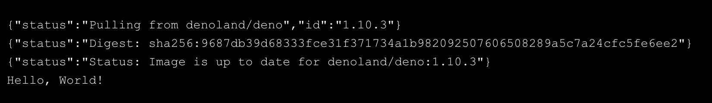

<p align="center">
  
  
</p>

<p align="center">
  <a href="https://goreportcard.com/report/github.com/yohamta/dagu">
    
  </a>
  <a href="https://codecov.io/gh/yohamta/dagu">
    
  </a>
  <a href="https://github.com/yohamta/dagu/releases">
    
  </a>
  <a href="https://godoc.org/github.com/yohamta/dagu">
    
  </a>
  
</p>

<p align="center">
<b>Just another Cron alternative with a Web UI, but with much more capabilities</b><br />
It runs <a href="https://en.wikipedia.org/wiki/Directed_acyclic_graph">DAGs (Directed acyclic graph)</a> defined in a simple YAML format.
</p>

Dagu is a tool for scheduling and running tasks based on a directed acyclic graph (DAG). It allows you to define dependencies between commands and represent them as a single DAG, schedule the execution of DAGs with Cron expressions, and natively support running Docker containers, making HTTP requests, and executing commands over SSH.

## Highlights
- Single binary file installation
- Declarative YAML format for defining DAGs
- Web UI for visualizing, managing, and rerunning pipelines
- No programming required, making it easy to use and ideal for small projects
- Self-contained, with no need for a DBMS or cloud service

---

## Contents

- [Highlights](#highlights)
- [Contents](#contents)
- [Getting started](#getting-started)
- [How it Works](#how-it-works)
- [Installation](#installation)
  - [Via Homebrew](#via-homebrew)
  - [Via Bash script](#via-bash-script)
  - [Via Docker](#via-docker)
  - [Via GitHub Release Page](#via-github-release-page)
- [️Quick Start Guide](#️quick-start-guide)
  - [1. Launch the Web UI](#1-launch-the-web-ui)
  - [2. Create a New DAG](#2-create-a-new-dag)
  - [3. Edit the DAG](#3-edit-the-dag)
  - [4. Execute the DAG](#4-execute-the-dag)
- [Command Line Interface](#command-line-interface)
- [Web Interface](#web-interface)
- [YAML Format](#yaml-format)
  - [Minimal DAG Definition](#minimal-dag-definition)
  - [Running Arbitrary Code Snippets](#running-arbitrary-code-snippets)
  - [Defining Environment Variables](#defining-environment-variables)
  - [Defining and Using Parameters](#defining-and-using-parameters)
  - [Using Command Substitution](#using-command-substitution)
  - [Adding Conditional Logic](#adding-conditional-logic)
  - [Setting Environment Variables with Standard Output](#setting-environment-variables-with-standard-output)
  - [Redirecting Stdout and Stderr](#redirecting-stdout-and-stderr)
  - [Adding Lifecycle Hooks](#adding-lifecycle-hooks)
  - [Repeating a Task at Regular Intervals](#repeating-a-task-at-regular-intervals)
  - [Other Available Fields](#other-available-fields)
- [Executors](#executors)
  - [Running Docker Containers](#running-docker-containers)
  - [Making HTTP Requests](#making-http-requests)
  - [Sending Email](#sending-email)
  - [Executing jq Command](#executing-jq-command)
  - [Command Execution over SSH](#command-execution-over-ssh)
- [Configuration Options](#configuration-options)
- [Sending Email Notifications](#sending-email-notifications)
- [Base Configuration for all DAGs](#base-configuration-for-all-dags)
- [Scheduler](#scheduler)
  - [Execution Schedule](#execution-schedule)
  - [Stop Schedule](#stop-schedule)
  - [Restart Schedule](#restart-schedule)
  - [Run Scheduler as a Daemon](#run-scheduler-as-a-daemon)
  - [Scheduler Configuration](#scheduler-configuration)
- [Running with Docker Compose](#running-with-docker-compose)
- [Building Docker Image](#building-docker-image)
- [REST API Interface](#rest-api-interface)
- [Building Binary From Source Code](#building-binary-from-source-code)
  - [Prerequisite](#prerequisite)
  - [Build Binary](#build-binary)
- [FAQ](#faq)
  - [How to Contribute?](#how-to-contribute)
  - [How Long Will the History Data be Stored?](#how-long-will-the-history-data-be-stored)
  - [How to Use Specific Host and Port eor `dagu server`?](#how-to-use-specific-host-and-port-eor-dagu-server)
  - [How to Specify the DAGs Directory for `dagu server` and `dagu scheduler`?](#how-to-specify-the-dags-directory-for-dagu-server-and-dagu-scheduler)
  - [How Can I Retry a DAG from a Specific Task?](#how-can-i-retry-a-dag-from-a-specific-task)
  - [How Does It Track Running Processes Without DBMS?](#how-does-it-track-running-processes-without-dbms)
- [Contributions](#contributions)
- [License](#license)

## Getting started

To get started with Dagu, see the [installation instructions](#installation) below and then check out the [️Quick start](#️quick-start-guide) guide.

## How it Works

Dagu is a single command line tool that uses the local file system to store data, so no database management system or cloud service is required. DAGs are defined in a declarative YAML format, and existing programs can be used without modification.

## Installation

You can install Dagu quickly using Homebrew or by downloading the latest binary from the Releases page on GitHub.

### Via Homebrew
```sh
brew install yohamta/tap/dagu
```

Upgrade to the latest version:
```sh
brew upgrade yohamta/tap/dagu
```

### Via Bash script

```sh
curl -L https://raw.githubusercontent.com/yohamta/dagu/main/scripts/downloader.sh | bash
```

### Via Docker

```sh
docker run \
--rm \
-p 8080:8080 \
-v $HOME/.dagu/dags:/home/dagu/.dagu/dags \
-v $HOME/.dagu/data:/home/dagu/.dagu/data \
-v $HOME/.dagu/logs:/home/dagu/.dagu/logs \
yohamta/dagu:latest
```

### Via GitHub Release Page 

Download the latest binary from the [Releases page](https://github.com/yohamta/dagu/releases) and place it in your `$PATH` (e.g. `/usr/local/bin`).

## ️Quick Start Guide

### 1. Launch the Web UI

Start the server with `dagu server` and browse to `http://127.0.0.1:8080` to explore the Web UI.

### 2. Create a New DAG

Create a DAG by clicking the `New DAG` button on the top page of the web UI. Input `example` in the dialog.

*Note: DAG (YAML) files will be placed in `~/.dagu/dags` by default. See [Configuration Options](#configuration-options) for more details.*

### 3. Edit the DAG

Go to the `SPEC` Tab and hit the `Edit` button. Copy & Paste this [example YAML](https://github.com/yohamta/dagu/blob/main/examples/example_workflow.yaml) and click the `Save` button.

### 4. Execute the DAG

You can execute the example by pressing the `Start` button.

*Note: Leave the parameter field in the dialog blank and press OK.*


## Command Line Interface

- `dagu start [--params=<params>] <file>` - Runs the DAG
- `dagu status <file>` - Displays the current status of the DAG
- `dagu retry --req=<request-id> <file>` - Re-runs the specified DAG run
- `dagu stop <file>` - Stops the DAG execution by sending TERM signals
- `dagu restart <file>` - Restarts the current running DAG
- `dagu dry [--params=<params>] <file>` - Dry-runs the DAG
- `dagu server [--host=<host>] [--port=<port>] [--dags=<path/to/the DAGs directory>]` - Launches the Dagu web UI server
- `dagu scheduler [--dags=<path/to/the DAGs directory>]` - Starts the scheduler process
- `dagu version` - Shows the current binary version

The `--config=<config>` option is available to all commands. It allows to specify different dagu configuration for the commands. Which enables you to manage multiple dagu process in a single instance. See [Configuration Options](#configuration-options) for more details.

For example:

```bash
dagu server --config=~/.dagu/dev.yaml
dagu scheduler --config=~/.dagu/dev.yaml
```

## Web Interface

- **DAGs**: It shows all DAGs and the real-time status.

  

- **DAG Details**: It shows the real-time status, logs, and DAG configurations. You can edit DAG configurations on a browser.

  

  You can switch to the vertical graph with the button on the top right corner.

  

- **Search DAGs**: It greps given text across all DAGs.

  

- **Execution History**: It shows past execution results and logs.

  

- **DAG Execution Log**: It shows the detail log and standard output of each execution and step.

  

## YAML Format

To view all examples, visit [this](https://github.com/yohamta/dagu/tree/main/examples) page.

### Minimal DAG Definition

The minimal DAG definition is as simple as follows.

```yaml
steps:
  - name: step 1
    command: echo hello
  - name: step 2
    command: echo world
    depends:
      - step 1
```

### Running Arbitrary Code Snippets

`script` field provides a way to run arbitrary snippets of code in any language.

```yaml
steps:
  - name: step 1
    command: "bash"
    script: |
      cd /tmp
      echo "hello world" > hello
      cat hello
    output: RESULT
  - name: step 2
    command: echo ${RESULT} # hello world
    depends:
      - step 1
```

### Defining Environment Variables

You can define environment variables and refer to them using the `env` field.

```yaml
env:
  - SOME_DIR: ${HOME}/batch
  - SOME_FILE: ${SOME_DIR}/some_file 
steps:
  - name: some task in some dir
    dir: ${SOME_DIR}
    command: python main.py ${SOME_FILE}
```

### Defining and Using Parameters

You can define parameters using the `params` field and refer to each parameter as $1, $2, etc. Parameters can also be command substitutions or environment variables. It can be overridden by the `--params=` parameter of the `start` command.

```yaml
params: param1 param2
steps:
  - name: some task with parameters
    command: python main.py $1 $2
```

Named parameters are also available as follows.

```yaml
params: ONE=1 TWO=`echo 2`
steps:
  - name: some task with parameters
    command: python main.py $ONE $TWO
```

### Using Command Substitution

You can use command substitution in field values. I.e., a string enclosed in backquotes (`` ` ``) is evaluated as a command and replaced with the result of standard output.

```yaml
env:
  TODAY: "`date '+%Y%m%d'`"
steps:
  - name: hello
    command: "echo hello, today is ${TODAY}"
```

### Adding Conditional Logic

Sometimes you have parts of a DAG that you only want to run under certain conditions. You can use the `preconditions` field to add conditional branches to your DAG.

For example, the task below only runs on the first date of each month.

```yaml
steps:
  - name: A monthly task
    command: monthly.sh
    preconditions:
      - condition: "`date '+%d'`"
        expected: "01"
```

If you want the DAG to continue to the next step regardless of the step's conditional check result, you can use the `continueOn` field:

```yaml
steps:
  - name: A monthly task
    command: monthly.sh
    preconditions:
      - condition: "`date '+%d'`"
        expected: "01"
    continueOn:
      skipped: true
```

### Setting Environment Variables with Standard Output

The `output` field can be used to set an environment variable with standard output. Leading and trailing space will be trimmed automatically. The environment variables can be used in subsequent steps.

```yaml
steps:
  - name: step 1
    command: "echo foo"
    output: FOO # will contain "foo"
```

### Redirecting Stdout and Stderr

The `stdout` field can be used to write standard output to a file.

```yaml
steps:
  - name: create a file
    command: "echo hello"
    stdout: "/tmp/hello" # the content will be "hello\n"
```

The `stderr` field allows to redirect stderr to other file without writing to the normal log file.

```yaml
steps:
  - name: output error file
    command: "echo error message >&2"
    stderr: "/tmp/error.txt"
```

### Adding Lifecycle Hooks

It is often desirable to take action when a specific event happens, for example, when a DAG fails. To achieve this, you can use `handlerOn` fields.

```yaml
handlerOn:
  failure:
    command: notify_error.sh
  exit:
    command: cleanup.sh
steps:
  - name: A task
    command: main.sh
```

### Repeating a Task at Regular Intervals

If you want a task to repeat execution at regular intervals, you can use the `repeatPolicy` field. If you want to stop the repeating task, you can use the `stop` command to gracefully stop the task.

```yaml
steps:
  - name: A task
    command: main.sh
    repeatPolicy:
      repeat: true
      intervalSec: 60
```

### Other Available Fields

This section provides a comprehensive list of available fields that can be used to configure DAGs and their steps in detail. Each field serves a specific purpose, enabling granular control over how the DAG runs. The fields include:

- `name`: The name of the DAG, which is optional. The default name is the name of the file.
- `description`: A brief description of the DAG.
- `schedule`: The execution schedule of the DAG in Cron expression format.
- `group`: The group name to organize DAGs, which is optional.
- `tags`: Free tags that can be used to categorize DAGs, separated by commas.
- `env`: Environment variables that can be accessed by the DAG and its steps.
- `logDir`: The directory where the standard output is written. The default value is `${DAGU_HOME}/logs/dags`.
- `restartWaitSec`: The number of seconds to wait after the DAG process stops before restarting it.
- `histRetentionDays`: The number of days to retain execution history (not for log files).
- `delaySec`: The interval time in seconds between steps.
- `maxActiveRuns`: The maximum number of parallel running steps.
- `params`: The default parameters that can be referred to by `$1`, `$2`, and so on.
- `preconditions`: The conditions that must be met before a DAG or step can run.
- `mailOn`: Whether to send an email notification when a DAG or step fails or succeeds.
- `MaxCleanUpTimeSec`: The maximum time to wait after sending a TERM signal to running steps before killing them.
- `handlerOn`: The command to execute when a DAG or step succeeds, fails, cancels, or exits.
- `steps`: A list of steps to execute in the DAG.

Each step can have its own set of configurations, including:

- `name`: The name of the step.
- `description`: A brief description of the step.
- `dir`: The working directory for the step.
- `command`: The command and parameters to execute.
- `stdout`: The file to which the standard output is written.
- `output`: The variable to which the result is written.
- `script`: The script to execute.
- `signalOnStop`: The signal name (e.g., `SIGINT`) to be sent when the process is stopped.
- `mailOn`: Whether to send an email notification when the step fails or succeeds.
- `continueOn`: Whether to continue to the next step, regardless of whether the step failed or not or the preconditions are met or not.
- `retryPolicy`: The retry policy for the step.
- `repeatPolicy`: The repeat policy for the step.
- `preconditions`: The conditions that must be met before a step can run.

In addition, a global configuration file, `$DAGU_HOME/config.yaml`, can be used to gather common settings, such as logDir or env.

Note: If `DAGU_HOME` environment variable is not set, the default path is `$HOME/.dagu/config.yaml`.

Example:

```yaml
name: DAG name
description: run a DAG               
schedule: "0 * * * *"                
group: DailyJobs                     
tags: example                        
env:                                 
  - LOG_DIR: ${HOME}/logs
  - PATH: /usr/local/bin:${PATH}
logDir: ${LOG_DIR}                   
restartWaitSec: 60                   
histRetentionDays: 3                 
delaySec: 1                          
maxActiveRuns: 1                     
params: param1 param2                
preconditions:                       
  - condition: "`echo $2`"           
    expected: "param2"               
mailOn:
  failure: true                      
  success: true                      
MaxCleanUpTimeSec: 300               
handlerOn:                           
  success:
    command: "echo succeed"          
  failure:
    command: "echo failed"           
  cancel:
    command: "echo canceled"         
  exit:
    command: "echo finished"         
steps:
  - name: some task                  
    description: some task           
    dir: ${HOME}/logs                
    command: bash                    
    stdout: /tmp/outfile
    ouptut: RESULT_VARIABLE
    script: |
      echo "any script"
    signalOnStop: "SIGINT"           
    mailOn:
      failure: true                  
      success: true                  
    continueOn:
      failure: true                  
      skipped: true                  
    retryPolicy:                     
      limit: 2                       
      intervalSec: 5                 
    repeatPolicy:                    
      repeat: true                   
      intervalSec: 60                
    preconditions:                   
      - condition: "`echo $1`"       
        expected: "param1"           
```

## Executors

The `executor` field provides different execution methods for each step. These executors are responsible for executing the commands or scripts specified in the command or script field of the step. Below are the available executors and their use cases.

In the [examples](./examples/) directory, you can find a collection of sample DAGs that demonstrate how to use executors. 

### Running Docker Containers

*Note: It requires Docker daemon running on the host.*

The `docker` executor allows us to run Docker containers instead of bare commands. This can be useful for running commands in isolated environments or for reproducibility purposes.

In the example below, it pulls and runs [Deno's docker image](https://hub.docker.com/r/denoland/deno) and prints 'Hello World'.

```yaml
steps:
  - name: deno_hello_world
    executor: 
      type: docker
      config:
        image: "denoland/deno:1.10.3"
        autoRemove: true
    command: run https://examples.deno.land/hello-world.ts
```

Example Log output:



To see more configurations, visit [this](https://github.com/yohamta/dagu/tree/main/examples#running-docker-containers) page.

### Making HTTP Requests

The `http` executor allows us to make an arbitrary HTTP request. This can be useful for interacting with web services or APIs.

```yaml
steps:
  - name: send POST request
    command: POST https://foo.bar.com
    executor: 
      type: http
      config:
        timeout: 10,
        headers:
          Authorization: "Bearer $TOKEN"
        silent: true # If silent is true, it outputs response body only.
        query:
          key: "value"
        body: "post body"
```

### Sending Email

The `mail` executor can be used to send email. This can be useful for sending notifications or alerts.

Example:

```yaml
smtp:
  host: "smtp.foo.bar"
  port: "587"
  username: "<username>"
  password: "<password>"

steps:
  - name: step1
    executor:
      type: mail
      config:
        to: <to address>
        from: <from address>
        subject: "Urgent Request: Help Me Find My Sanity"
        message: |
          I'm in a bit of a pickle.
          I seem to have lost my sanity somewhere between my third cup of coffee
          and my fourth Zoom meeting of the day.
          
          If you see it lying around, please let me know.
          Thanks for your help!

          Best,
```

### Executing jq Command

The `jq` executor can be used to transform, query, and format JSON. This can be useful for working with JSON data in pipelines or for data processing.

Query Example:

```yaml
steps:
  - name: run query
    executor: jq
    command: '{(.id): .["10"].b}'
    script: |
      {"id": "sample", "10": {"b": 42}}
```

output:
```json
{
    "sample": 42
}
```

Formatting JSON:

```yaml
steps:
  - name: format json
    executor: jq
    script: |
      {"id": "sample", "10": {"b": 42}}
```

output:
```json
{
    "10": {
        "b": 42
    },
    "id": "sample"
}
```

The `jq` result can be used in following steps via [Output](#setting-environment-variables-with-standard-output) or [Stdout Redirection](#redirecting-stdout-and-stderr).

### Command Execution over SSH

The `ssh` executor allows us to execute commands on remote hosts over SSH.

```yaml
steps:
  - name: step1
    executor: 
      type: ssh
      config:
        user: dagu
        ip: XXX.XXX.XXX.XXX
        port: 22
        key: /Users/dagu/.ssh/private.pem
    command: /usr/sbin/ifconfig
```

## Configuration Options

The following environment variables can be used to configure the Dagu. Default values are provided in the parentheses:

- `DAGU_HOST` (`127.0.0.1`): The host to bind the server to.
- `DAGU_PORT` (`8080`): The port to bind the server to.
- `DAGU_DAGS` (`$DAGU_HOME/dags`): The directory containing the DAGs.
- `DAGU_IS_BASIC_AUTH` (`0`): Set to 1 to enable basic authentication.
- `DAGU_BASIC_AUTH_USERNAME` (`""`): The username to use for basic authentication.
- `DAGU_BASIC_AUTH_PASSWORD` (`""`): The password to use for basic authentication.
- `DAGU_LOG_DIR` (`$DAGU_HOME/logs`): The directory where logs will be stored.
- `DAGU_DATA_DIR` (`$DAGU_HOME/data`): The directory where application data will be stored.
- `DAGU_SUSPEND_FLAGS_DIR` (`$DAGU_HOME/suspend`): The directory containing DAG suspend flags.
- `DAGU_ADMIN_LOG_DIR` (`$DAGU_HOME/logs/admin`): The directory where admin logs will be stored.
- `DAGU_BASE_CONFIG` (`$DAGU_HOME/config.yaml`): The path to the base configuration file.
- `DAGU_NAVBAR_COLOR` (`""`): The color to use for the navigation bar. E.g., `red` or `#ff0000`.
- `DAGU_NAVBAR_TITLE` (`Dagu`): The title to display in the navigation bar. E.g., `Dagu - PROD` or `Dagu - DEV`

Note: All of the above environment variables are optional. If not set, the default values shown above will be used. If `DAGU_HOME` environment variable is not set, the default value is `$HOME/.dagu`.

## Sending Email Notifications

Email notifications can be sent when a DAG finished with an error or successfully. To do so, you can set the `smtp` field and related fields in the DAG specs. You can use any email delivery services (e.g. Sendgrid, Mailgun, etc).

```yaml
# Eamil notification settings
mailOn:
  failure: true
  success: true

# SMTP server settings
smtp:
  host: "smtp.foo.bar"
  port: "587"
  username: "<username>"
  password: "<password>"

# Error mail configuration
errorMail:
  from: "foo@bar.com"
  to: "foo@bar.com"
  prefix: "[Error]"

# Info mail configuration
infoMail:
  from: "foo@bar.com"
  to: "foo@bar.com"
  prefix: "[Info]"
```

If you want to use the same settings for all DAGs, set them to the [base configuration](#base-configuration-for-all-dags).


## Base Configuration for all DAGs

Creating a base configuration (default path: `~/.dagu/config.yaml`) is a convenient way to organize shared settings among all DAGs. The path to the base configuration file can be configured. See [Configuration Options](#configuration-options) for more details.

```yaml
# directory path to save logs from standard output
logDir: /path/to/stdout-logs/

# history retention days (default: 30)
histRetentionDays: 3

# Eamil notification settings
mailOn:
  failure: true
  success: true

# SMTP server settings
smtp:
  host: "smtp.foo.bar"
  port: "587"
  username: "<username>"
  password: "<password>"

# Error mail configuration
errorMail:
  from: "foo@bar.com"
  to: "foo@bar.com"
  prefix: "[Error]"

# Info mail configuration
infoMail:
  from: "foo@bar.com"
  to: "foo@bar.com"
  prefix: "[Info]"
```

## Scheduler

To run DAGs automatically, you need to run the `dagu scheduler` process on your system.

### Execution Schedule

You can specify the schedule with cron expression in the `schedule` field in the config file as follows.

```yaml
schedule: "5 4 * * *" # Run at 04:05.
steps:
  - name: scheduled job
    command: job.sh
```

Or you can set multiple schedules.

```yaml
schedule:
  - "30 7 * * *" # Run at 7:30
  - "0 20 * * *" # Also run at 20:00
steps:
  - name: scheduled job
    command: job.sh
```

### Stop Schedule

If you want to start and stop a long-running process on a fixed schedule, you can define `start` and `stop` times as follows. At the stop time, each step's process receives a stop signal.

```yaml
schedule:
  start: "0 8 * * *" # starts at 8:00
  stop: "0 13 * * *" # stops at 13:00
steps:
  - name: scheduled job
    command: job.sh
```

You can also set multiple start/stop schedules. In the following example, the process will run from 0:00-5:00 and 12:00-17:00.

```yaml
schedule:
  start:
    - "0 0 * * *"
    - "12 0 * * *"
  stop:
    - "5 0 * * *"
    - "17 0 * * *"
steps:
  - name: some long-process
    command: main.sh
```

### Restart Schedule

If you want to restart a DAG process on a fixed schedule, the `restart` field is also available. At the restart time, the DAG execution will be stopped and restarted again.

```yaml
schedule:
  start: "0 8 * * *"    # starts at 8:00
  restart: "0 12 * * *" # restarts at 12:00
  stop: "0 13 * * *"    # stops at 13:00
steps:
  - name: scheduled job
    command: job.sh
```

The wait time after the job is stopped before restart can be configured in the DAG definition as follows. The default value is `0` (zero).

```yaml
restartWaitSec: 60 # Wait 60s after the process is stopped, then restart the DAG.

steps:
  - name: step1
    command: python some_app.py
```

### Run Scheduler as a Daemon

The easiest way to make sure the process is always running on your system is to create the script below and execute it every minute using cron (you don't need `root` account in this way).

```bash
#!/bin/bash
process="dagu scheduler"
command="/usr/bin/dagu scheduler"

if ps ax | grep -v grep | grep "$process" > /dev/null
then
    exit
else
    $command &
fi

exit
```

### Scheduler Configuration

Set the `dags` field to specify the directory of the DAGs.

```yaml
dags: <the location of DAG configuration files> # default: (~/.dagu/dags)
```

## Running with Docker Compose

To automate workflows based on cron expressions, it is necessary to run both the admin server and scheduler process. Here is an example `docker-compose.yml` setup for running Dagu using Docker Compose.

[Example setup](./examples/docker-compose/)

```yaml
version: "3.9"
services:

  # init container updates permission
  init:
    image: "yohamta/dagu:latest"
    user: root
    volumes:
      - dagu:/home/dagu/.dagu
    command: chown -R dagu /home/dagu/.dagu/

  # admin web server process
  server:
    image: "yohamta/dagu:latest"
    environment:
      - DAGU_PORT=8080
      - DAGU_DAGS=/home/dagu/.dagu/dags
    restart: unless-stopped
    ports:
      - "8080:8080"
    volumes:
      - dagu:/home/dagu/.dagu
      - ./dags/:/home/dagu/.dagu/dags
    depends_on:
      - init

  # scheduler process
  scheduler:
    image: "yohamta/dagu:latest"
    environment:
      - DAGU_DAGS=/home/dagu/.dagu/dags
    restart: unless-stopped
    volumes:
      - dagu:/home/dagu/.dagu
      - ./dags/:/home/dagu/.dagu/dags
    command: dagu scheduler
    depends_on:
      - init

volumes:
  dagu: {}
```

## Building Docker Image

Download the [Dockerfile](https://github.com/yohamta/dagu/blob/main/Dockerfile) to your local PC and you can build an image.

For example:

```sh
DAGU_VERSION=1.9.0
docker build -t dagu:${DAGU_VERSION} \
--build-arg VERSION=${DAGU_VERSION} \
--no-cache .
```

## REST API Interface

Please refer to [REST API Docs](./docs/restapi.md)

## Building Binary From Source Code

### Prerequisite

Before building the binary from the source code, make sure that you have the following software installed on your system:

1. [Go version 1.18 or later.](https://go.dev/doc/install)
2. Latest version of [Node.js](https://nodejs.org/en/download/).
3. [yarn](https://yarnpkg.com/) package manager.

### Build Binary

To build the binary from the source code, follow these steps:

1. Clone the repository to your local machine.
2. Navigate to the root directory of the cloned repository and build the frontend project by running the following command:
  ```sh
  make build-admin
  ```
4. Build the `dagu` binary by running the following command:
  ```sh
  make build
  ```

You can now use the `dagu` binary that is created in the `./bin` directory.

## FAQ

### How to Contribute?

Feel free to contribute in any way you want. Share ideas, questions, submit issues, and create pull requests. Thanks!

### How Long Will the History Data be Stored?

By default, the execution history data is retained for 30 days. However, you can customize this setting by modifying the `histRetentionDays` field in a YAML file.

### How to Use Specific Host and Port eor `dagu server`?

To configure the host and port for `dagu server`, you can set the environment variables `DAGU_HOST` and `DAGU_PORT`. Refer to the [Configuration Options](#configuration-options) for more details.

### How to Specify the DAGs Directory for `dagu server` and `dagu scheduler`?

You can customize the directory used to store DAG files by setting the environment variable `DAGU_DAGS`. See [Configuration Options](#configuration-options) for more information.

### How Can I Retry a DAG from a Specific Task?

If you want to retry a DAG from a specific task, you can set the status of that task to `failed` by clicking the step in the Web UI. When you rerun the DAG, it will execute the failed task and any subsequent tasks.

### How Does It Track Running Processes Without DBMS?
`dagu` uses Unix sockets to communicate with running processes.

## Contributions
 
<a href="https://github.com/yohamta/dagu/graphs/contributors">
  
</a>

We welcome contributions to Dagu! If you have an idea for a new feature or have found a bug, please open an issue on the GitHub repository. If you would like to contribute code, please follow these steps:

1. Fork the repository
2. Create a new branch for your changes
3. Make your changes and commit them to your branch
4. Push your branch to your fork and open a pull request

## License

This project is licensed under the GNU GPLv3. Refer to the [LICENSE.md](LICENSE.md) file for more details.
