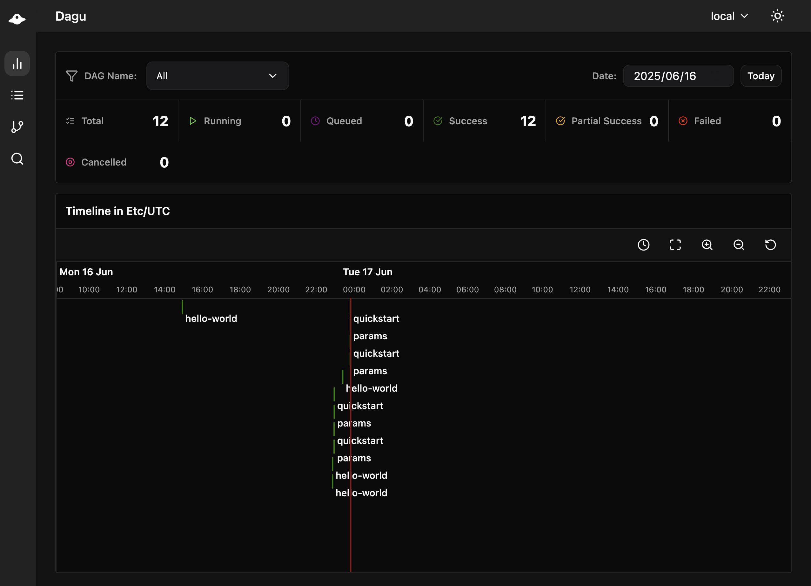
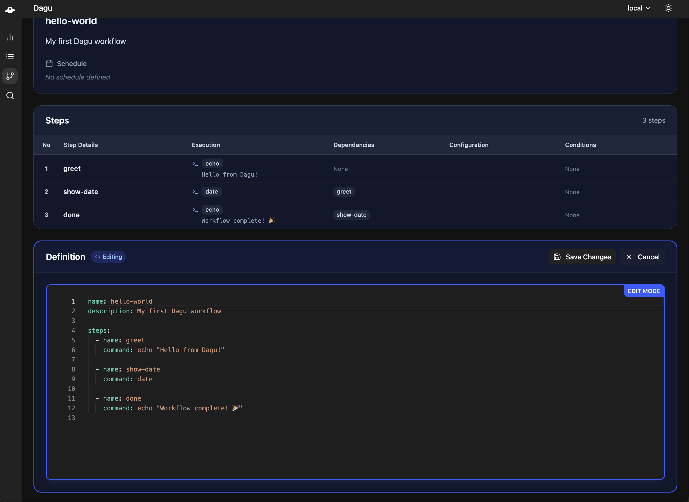
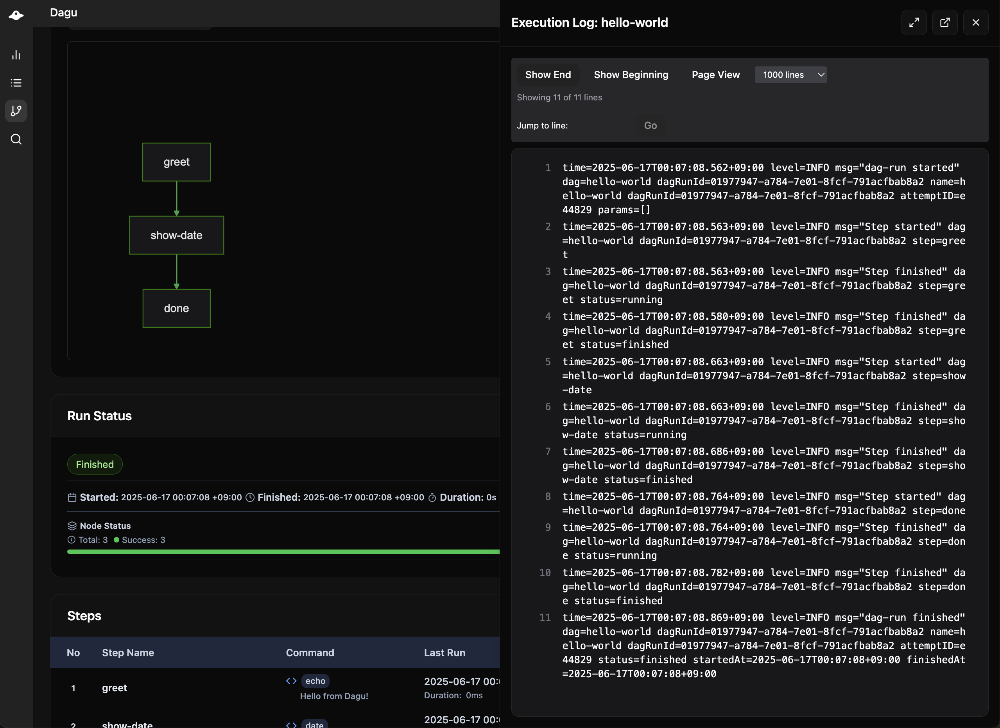

<div align="center">
  
  
  <h3>Local-First Workflow Engine, Built for Self-Hosting</h3>
  <p>Zero dependencies. Language agnostic. Self-contained.</p>
  
  <p>
    <a href="https://docs.dagu.cloud/reference/changelog"></a>
    <a href="https://github.com/dagu-org/dagu/actions/workflows/ci.yaml"></a>
    <a href="https://codecov.io/gh/dagu-org/dagu"></a>
    <a href="https://discord.gg/gpahPUjGRk"></a>
    <a href="https://bsky.app/profile/dagu-org.bsky.social"></a>
  </p>
  
  <p>
    <a href="https://docs.dagu.cloud">Docs</a> |
    <a href="#quick-start">Quick Start</a> |
    <a href="#features">Features</a> |
    <a href="#installation">Installation</a> |
    <a href="https://discord.gg/gpahPUjGRk">Community</a>
  </p>
</div>

## What is Dagu?

Dagu solves the problem of complex workflow orchestration without requiring a dedicated infrastructure team. Unlike traditional workflow engines that demand databases, message queues, and careful operational overhead, Dagu runs as a single binary with zero external dependencies. 

After managing hundreds of cron jobs across multiple servers, I built Dagu to bring sanity to workflow automation. It handles scheduling, dependencies, error recovery, and monitoring - everything you need for production workflows, without the complexity.

[→ Learn the core concepts](https://docs.dagu.cloud/getting-started/concepts)

### Design Philosophy

1. **Local‑first.** Workflows should run offline on laptops, air‑gapped servers, or the cloud—your choice.  
2. **Zero foot‑print.** One static binary; no databases, brokers, or sidecars.  
3. **Bring‑your‑own language.** Bash, Python, Go, or anything just works.

## Recent Updates

### v1.17.4
- **Interactive DAG Selection**: Run `dagu start` without arguments to select DAGs interactively
- **OpenTelemetry Support**: Distributed tracing with W3C trace context propagation (requested by [@jeremydelattre59](https://github.com/jeremydelattre59))
- **Windows Support (Beta)**: Initial PowerShell and cmd.exe compatibility - basic functionality works but may have limitations ([@pdoronila](https://github.com/pdoronila))
- **Scheduler Refactoring**: Improved maintainability ([@thefishhat](https://github.com/thefishhat))

### v1.17.0
- **Hierarchical DAG Execution**: Nest workflows with parameter passing and output bubbling
- **Multiple DAGs in Single File**: Define workflows together using `---` separator
- **Parallel Execution**: Run steps or sub-DAGs in parallel with different parameters
- **Enhanced Web UI**: Performance improvements and better user interface
- **One-click Step Re-run**: Retry individual steps without re-running entire workflow ([@thefishhat](https://github.com/thefishhat))
- **Enhanced Repeat Policy**: Explicit 'while'/'until' modes for clear repeat logic ([@thefishhat](https://github.com/thefishhat))
- **Queue Management**: Enqueue DAGs with custom run IDs ([@kriyanshii](https://github.com/kriyanshii))
- **Docker Improvements**: Optimized images and better container support ([@jerry-yuan](https://github.com/jerry-yuan), [@vnghia](https://github.com/vnghia))

[Full changelog →](https://docs.dagu.cloud/reference/changelog)

## Features

- [DAG definition](https://docs.dagu.cloud/writing-workflows/examples/) - Express complex dependencies in readable YAML
- [Scheduling](https://docs.dagu.cloud/features/scheduling) - Cron expressions with timezone support
- [Queueing](https://docs.dagu.cloud/features/queues) - Control concurrency with named queues
- [Error handling](https://docs.dagu.cloud/writing-workflows/error-handling) - Retries, failure handlers, cleanup hooks
- [Conditional execution](https://docs.dagu.cloud/writing-workflows/control-flow) - Run steps based on conditions
- [Parallel execution](https://docs.dagu.cloud/features/parallel-execution) - Control concurrent step execution
- [Variables & Parameters](https://docs.dagu.cloud/writing-workflows/data-variables) - Pass data between steps, parameterize workflows
- [Docker support](https://docs.dagu.cloud/features/executors/docker) - Run steps in containers
- [SSH executor](https://docs.dagu.cloud/features/executors/ssh) - Execute commands on remote hosts
- [HTTP requests](https://docs.dagu.cloud/features/executors/http) - Integrate with APIs
- [Email notifications](https://docs.dagu.cloud/features/email-notifications) - SMTP integration
- [Hierarchical workflows](https://docs.dagu.cloud/writing-workflows/advanced#hierarchical-workflows) - Nest DAGs to any depth
- [Distributed execution](https://docs.dagu.cloud/features/distributed-execution) - Scale across multiple machines
- [Authentication](https://docs.dagu.cloud/features/authentication) - Basic auth, API tokens, TLS
- [Web UI](https://docs.dagu.cloud/overview/web-ui) - Real-time monitoring and control
- [REST API](https://docs.dagu.cloud/overview/api) - Full programmatic access

## Quick Start

```bash
# Install
curl -L https://raw.githubusercontent.com/dagu-org/dagu/main/scripts/installer.sh | bash

# Create dagu configuration directory
mkdir -p ~/.config/dagu/dags

# Create your first workflow
mkdir -p ~/.config/dagu/dags
cat > ~/.config/dagu/dags/hello.yaml << 'EOF'
steps:
  - name: hello
    command: echo "Hello from Dagu!"
    
  - name: world  
    command: echo "Running step 2"
EOF

# Execute it
dagu start hello

# Check the status
dagu status hello

# Start the web UI
dagu start-all
# Visit http://localhost:8080
```

## Installation

### macOS / Linux

```bash
# Latest
curl -L https://raw.githubusercontent.com/dagu-org/dagu/main/scripts/installer.sh | bash

# Specific version
curl -L https://raw.githubusercontent.com/dagu-org/dagu/main/scripts/installer.sh | bash -s -- --version v1.17.0

# Install to a specific directory
curl -L https://raw.githubusercontent.com/dagu-org/dagu/main/scripts/installer.sh | bash -s -- --prefix /path/to/install

# Homebrew
brew install dagu-org/brew/dagu
```

### Docker
```bash
docker run -d \
  --name dagu \
  -p 8080:8080 \
  -v ~/.dagu:/var/lib/dagu \
  ghcr.io/dagu-org/dagu:latest dagu start-all
```

### Manual Download
Download from [releases](https://github.com/dagu-org/dagu/releases) and add to PATH.

## Documentation

- [Getting Started](https://docs.dagu.cloud/getting-started/quickstart) - Tutorial and first steps
- [Core Concepts](https://docs.dagu.cloud/getting-started/concepts) - Architecture and design
- [Writing Workflows](https://docs.dagu.cloud/writing-workflows/) - Complete authoring guide
- [CLI Reference](https://docs.dagu.cloud/reference/cli) - Command-line usage
- [API Reference](https://docs.dagu.cloud/reference/api) - REST API documentation
- [Configuration](https://docs.dagu.cloud/configurations/server) - Configuration options
- [Changelog](https://docs.dagu.cloud/reference/changelog) - Release notes and version history

## Examples

Find more in our [examples documentation](https://docs.dagu.cloud/writing-workflows/examples/).

### ETL Pipeline
```yaml
name: daily-etl
schedule: "0 2 * * *"
steps:
  - name: extract
    command: python extract.py
    output: DATA_FILE
    
  - name: validate
    command: python validate.py ${DATA_FILE}
    
  - name: transform
    command: python transform.py ${DATA_FILE}
    retryPolicy:
      limit: 3
      
  - name: load
    command: python load.py ${DATA_FILE}
```

### Hierarchical Workflows
```yaml
steps:
  - name: data-pipeline
    run: etl
    params: "ENV=prod REGION=us-west-2"
    
  - name: parallel-jobs
    run: batch
    parallel:
      items: ["job1", "job2", "job3"]
      maxConcurrency: 2
    params: "JOB=${ITEM}"
---
name: etl
params:
  - ENV
  - REGION
steps:
  - name: process
    command: python etl.py --env ${ENV} --region ${REGION}
---
name: batch
params:
  - JOB
steps:
  - name: process
    command: python process.py --job ${JOB}
```

### Container-based Pipeline
```yaml
name: ml-pipeline
steps:
  - name: prepare-data
    executor:
      type: docker
      config:
        image: python:3.11
        autoRemove: true
        volumes:
          - /data:/data
    command: python prepare.py
    
  - name: train-model
    executor:
      type: docker
      config:
        image: tensorflow/tensorflow:latest-gpu
    command: python train.py
    
  - name: deploy
    command: kubectl apply -f model-deployment.yaml
    preconditions:
      - condition: "`date +%u`"
        expected: "re:[1-5]"  # Weekdays only
```

### Distributed Execution
```yaml
name: distributed-workflow
steps:
  - name: gpu-training
    command: python train_model.py
    workerSelector:
      gpu: "true"
      memory: "64G"
    
  - name: data-processing-us
    command: python process.py --region us
    workerSelector:
      region: "us-east-1"
    
  - name: data-processing-eu
    command: python process.py --region eu
    workerSelector:
      region: "eu-west-1"
      compliance: "gdpr"
```

## Web Interface

[Learn more about the Web UI →](https://docs.dagu.cloud/overview/web-ui)

<div align="center">
  
  <p><i>Real-time monitoring of all workflows</i></p>
</div>

<div align="center">
  
  <p><i>Visual workflow editor with validation</i></p>
</div>

<div align="center">
  
  <p><i>Detailed execution logs with stdout/stderr separation</i></p>
</div>

## Use Cases

- **Data Engineering** - ETL pipelines, data validation, warehouse loading
- **Machine Learning** - Training pipelines, model deployment, experiment tracking
- **DevOps** - CI/CD workflows, infrastructure automation, deployment orchestration
- **Media Processing** - Video transcoding, image manipulation, content pipelines
- **Business Automation** - Report generation, data synchronization, scheduled tasks

## Roadmap

- [x] Run steps in a DAG across multiple machines (distributed execution) - **Available in v1.18.0**
- [ ] Track artifacts by dropping files in `$DAGU_ARTIFACTS`
- [ ] Pause executions for webhooks, approvals, or any event (human-in-the-loop, event-driven workflows)
- [ ] Integrate with AI agents via MCP (Model Context Protocol)

## Building from Source

Prerequisites: Go 1.24+, Node.js, pnpm

```bash
git clone https://github.com/dagu-org/dagu.git && cd dagu
make build
make run
```

## Contributing

Contributions are welcome. See our [documentation](https://docs.dagu.cloud) for development setup.

- [Discord Community](https://discord.gg/gpahPUjGRk)
- [GitHub Issues](https://github.com/dagu-org/dagu/issues)

## Contributors

<a href="https://github.com/dagu-org/dagu/graphs/contributors">
  
</a>

## License

GNU GPLv3 - See [LICENSE](./LICENSE)

---

<div align="center">
  <p>If you find Dagu useful, please ⭐ star this repository</p>
</div>
