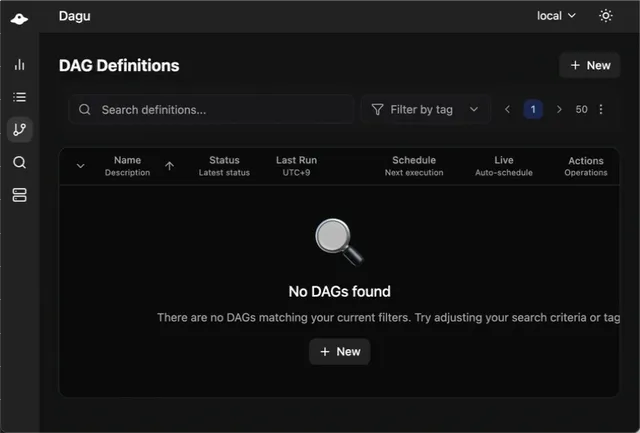

<div align="center">
  
  <br/>

  <p>
    <a href="https://docs.dagu.cloud/reference/changelog"></a>
    <a href="https://github.com/dagu-org/dagu/actions/workflows/ci.yaml"></a>
    <a href="https://discord.gg/gpahPUjGRk"></a>
    <a href="https://bsky.app/profile/dagu-org.bsky.social"></a>
  </p>
  
  <p>
    <a href="https://dagu.cloud/">Website</a> |
    <a href="https://docs.dagu.cloud/writing-workflows/examples">Examples</a> |
    <a href="https://discord.gg/gpahPUjGRk">Discord</a>
  </p>
</div>

## What is Dagu?

Dagu is a lightweight workflow engine with a modern Web UI. Workflows are defined in a simple, declarative YAML format and can be executed on schedule. It supports shell commands, remote execution via SSH, and Docker images. Built-in error notifications and logging out of the box.

For a quick feel of how it works, take a look at the [examples](https://docs.dagu.cloud/writing-workflows/examples).

### Motivation

Legacy systems often have complex and implicit dependencies between jobs. When there are hundreds of cron jobs on a server, it can be difficult to keep track of these dependencies and to determine which job to rerun if one fails. It can also be a hassle to SSH into a server to view logs and manually rerun shell scripts one by one. Dagu aims to solve these problems by allowing you to explicitly visualize and manage pipeline dependencies as a DAG, and by providing a web UI for checking dependencies, execution status, and logs and for rerunning or stopping jobs with a simple mouse click.

### Why Not Use an Existing Workflow Scheduler Like Airflow?

There are many existing tools such as Airflow, but many of these require you to write code in a programming language like Python to define your DAG. For systems that have been in operation for a long time, there may already be complex jobs with hundreds of thousands of lines of code written in languages like Perl or Shell Script. Adding another layer of complexity on top of these codes can reduce maintainability. Dagu was designed to be easy to use, self-contained, and require no coding, making it ideal for small projects.

### How it Works
Dagu executes your workflows defined in a simple, declarative YAML format.

For example, a simple sequential DAG:
```yaml
schedule: "0 0 * * *" # Runs at 00:00 everyday

steps:
  - echo "Hello, dagu!"
  - echo "This is a second step"
```

## Highlights
- Install by placing a single binary with zero dependency
- Run without DBMS or any cloud service
- Define workflows (DAG) in a declarative YAML format
- Use existing programs, scripts, and container images without any modification
- Schedule workflows with cron expressions
- Run in HA mode and distribute tasks to workers through built-in queue system.
- Modularize workflows by nesting them.

### CLI Preview


### Web UI Preview


## Table of Contents

- Quick Start
  - [Quick Start](#quick-start)
  - [Docker-Compose](#docker-compose)
- Documentation
  - [Documentation](#documentation)
  - [Environment Variables](#environment-variables)
  - [Architecture](#architecture)
  - [Roadmap](#roadmap)
- Development & Contributing
  - [Development](#development)
  - [Discussion](#discussion)
  - [Contributing](#contributing)
  - [Acknowledgements](#acknowledgements)
- [License](#license)

## Quick Start

### 1. Install dagu

**macOS/Linux**:

```bash
# Install to ~/.local/bin (default, no sudo required)
curl -L https://raw.githubusercontent.com/dagu-org/dagu/main/scripts/installer.sh | bash

# Install specific version
curl -L https://raw.githubusercontent.com/dagu-org/dagu/main/scripts/installer.sh | bash -s -- --version v1.17.0

# Install to custom directory
curl -L https://raw.githubusercontent.com/dagu-org/dagu/main/scripts/installer.sh | bash -s -- --install-dir /usr/local/bin
```

**Docker**:

```bash
docker run --rm \
  -v ~/.dagu:/var/lib/dagu \
  -p 8080:8080 \
  ghcr.io/dagu-org/dagu:latest \
  dagu start-all
```

Note: see [documentation](https://docs.dagu.cloud/getting-started/installation) for other methods.

**Homebrew**:

```bash
brew update && brew install dagu

# Upgrade to latest version
brew update && brew upgrade dagu
```

**npm**:
```bash
# Install via npm
npm install -g --ignore-scripts=false @dagu-org/dagu
```

### 2. Create your first workflow

> **Note**: When you first start Dagu with an empty DAGs directory, it automatically creates example workflows to help you get started. To skip this, set `DAGU_SKIP_EXAMPLES=true`.

```bash
cat > ./hello.yaml << 'EOF'
steps:
  - echo "Hello from Dagu!"
  - echo "Running step 2"
EOF
```

### 3. Run the workflow

```bash
dagu start hello.yaml
```

### 4. Check the status and view logs

```bash
dagu status hello
```

### 5. Explore the Web UI

```bash
dagu start-all
```

Visit http://localhost:8080

## Docker-Compose

Clone the repository and run with Docker Compose:

```bash
git clone https://github.com/dagu-org/dagu.git
cd dagu
```

Run with minimal setup:

```bash
docker compose -f compose.minimal.yaml up -d
# Visit http://localhost:8080
```

Stop containers:

```bash
docker compose -f compose.minimal.yaml down
```

You can also use the production-like configuration `compose.prod.yaml` with OpenTelemetry, Prometheus, and Grafana:

```bash
docker compose -f compose.prod.yaml up -d
# Visit UI at http://localhost:8080
# Jaeger at http://localhost:16686, Prometheus at http://localhost:9090, Grafana at http://localhost:3000
```

Note: It's just for demonstration purposes. For production, please customize the configuration as needed.

## Documentation

Full documentation is available at [docs.dagu.cloud](https://docs.dagu.cloud/).

**Helpful Links**:

- [Feature by Examples](https://docs.dagu.cloud/writing-workflows/examples) - Explore useful features with examples
- [Remote Execution via SSH](https://docs.dagu.cloud/features/executors/ssh#ssh-executor) - Run commands on remote machines using SSH
- [Distributed Execution](https://docs.dagu.cloud/features/distributed-execution) - How to run workflows across multiple machines
- [Scheduling](https://docs.dagu.cloud/features/scheduling) - Learn about flexible scheduling options (start, stop, restart) with cron syntax
- [Authentication](https://docs.dagu.cloud/configurations/authentication) - Configure authentication for the Web UI
- [Configuration](https://docs.dagu.cloud/configurations/reference) - Detailed configuration options for customizing Dagu

## Changelog

For a detailed list of changes, bug fixes, and new features, please refer to the [Changelog](https://docs.dagu.cloud/reference/changelog).

## Environment Variables

**Note:** Configuration precedence: Command-line flags > Environment variables > Configuration file

### Frontend Server Configuration

| Environment Variable | Default | Description |
|---------------------|---------|-------------|
| `DAGU_HOST` | `127.0.0.1` | Web UI server host |
| `DAGU_PORT` | `8080` | Web UI server port |
| `DAGU_BASE_PATH` | - | Base path for reverse proxy setup |
| `DAGU_API_BASE_URL` | `/api/v2` | API endpoint base path |
| `DAGU_TZ` | - | Server timezone (e.g., `Asia/Tokyo`) |
| `DAGU_DEBUG` | `false` | Enable debug mode |
| `DAGU_LOG_FORMAT` | `text` | Log format (`text` or `json`) |
| `DAGU_HEADLESS` | `false` | Run without Web UI |
| `DAGU_LATEST_STATUS_TODAY` | `false` | Show only today's latest status |
| `DAGU_WORK_DIR` | - | Default working directory for DAGs |
| `DAGU_DEFAULT_SHELL` | - | Default shell for command execution |
| `DAGU_CERT_FILE` | - | TLS certificate file path |
| `DAGU_KEY_FILE` | - | TLS key file path |

### Path Configuration

| Environment Variable | Default | Description |
|---------------------|---------|-------------|
| `DAGU_HOME` | - | Base directory that overrides all path configurations |
| `DAGU_DAGS_DIR` | `~/.config/dagu/dags` | Directory for DAG definitions |
| `DAGU_LOG_DIR` | `~/.local/share/dagu/logs` | Directory for log files |
| `DAGU_DATA_DIR` | `~/.local/share/dagu/data` | Directory for application data |
| `DAGU_SUSPEND_FLAGS_DIR` | `~/.local/share/dagu/suspend` | Directory for suspend flags |
| `DAGU_ADMIN_LOG_DIR` | `~/.local/share/dagu/logs/admin` | Directory for admin logs |
| `DAGU_BASE_CONFIG` | `~/.config/dagu/base.yaml` | Path to base configuration file |
| `DAGU_EXECUTABLE` | - | Path to dagu executable |
| `DAGU_DAG_RUNS_DIR` | `{dataDir}/dag-runs` | Directory for DAG run data |
| `DAGU_PROC_DIR` | `{dataDir}/proc` | Directory for process data |
| `DAGU_QUEUE_DIR` | `{dataDir}/queue` | Directory for queue data |
| `DAGU_SERVICE_REGISTRY_DIR` | `{dataDir}/service-registry` | Directory for service registry |

### Authentication

| Environment Variable | Default | Description |
|---------------------|---------|-------------|
| `DAGU_AUTH_BASIC_USERNAME` | - | Basic auth username |
| `DAGU_AUTH_BASIC_PASSWORD` | - | Basic auth password |
| `DAGU_AUTH_OIDC_CLIENT_ID` | - | OIDC client ID |
| `DAGU_AUTH_OIDC_CLIENT_SECRET` | - | OIDC client secret |
| `DAGU_AUTH_OIDC_CLIENT_URL` | - | OIDC client URL |
| `DAGU_AUTH_OIDC_ISSUER` | - | OIDC issuer URL |
| `DAGU_AUTH_OIDC_SCOPES` | - | OIDC scopes (comma-separated) |
| `DAGU_AUTH_OIDC_WHITELIST` | - | OIDC email whitelist (comma-separated) |

### UI Configuration

| Environment Variable | Default | Description |
|---------------------|---------|-------------|
| `DAGU_UI_NAVBAR_COLOR` | `#1976d2` | UI header color (hex or name) |
| `DAGU_UI_NAVBAR_TITLE` | `Dagu` | UI header title |
| `DAGU_UI_LOG_ENCODING_CHARSET` | `utf-8` | Log file encoding |
| `DAGU_UI_MAX_DASHBOARD_PAGE_LIMIT` | `100` | Maximum items on dashboard |
| `DAGU_UI_DAGS_SORT_FIELD` | `name` | Default DAGs sort field |
| `DAGU_UI_DAGS_SORT_ORDER` | `asc` | Default DAGs sort order |

### Scheduler Configuration

| Environment Variable | Default | Description |
|---------------------|---------|-------------|
| `DAGU_SCHEDULER_PORT` | `8090` | Health check server port |
| `DAGU_SCHEDULER_LOCK_STALE_THRESHOLD` | `30s` | Scheduler lock stale threshold |
| `DAGU_SCHEDULER_LOCK_RETRY_INTERVAL` | `5s` | Lock retry interval |
| `DAGU_SCHEDULER_ZOMBIE_DETECTION_INTERVAL` | `45s` | Zombie DAG detection interval (0 to disable) |
| `DAGU_QUEUE_ENABLED` | `true` | Enable queue system |

### Worker Configuration

This configuration is used for worker instances that execute DAGs. See the [Distributed Execution](https://docs.dagu.cloud/features/distributed-execution) documentation for more details.

| Environment Variable | Default | Description |
|---------------------|---------|-------------|
| `DAGU_COORDINATOR_HOST` | `127.0.0.1` | Coordinator gRPC server host |
| `DAGU_COORDINATOR_PORT` | `50055` | Coordinator gRPC server port |
| `DAGU_WORKER_ID` | - | Worker instance ID |
| `DAGU_WORKER_MAX_ACTIVE_RUNS` | `100` | Maximum concurrent runs per worker |
| `DAGU_WORKER_LABELS` | - | Worker labels (format: `key1=value1,key2=value2`, e.g., `gpu=true,memory=64G`) |
| `DAGU_SCHEDULER_PORT` | `8090` | Scheduler health check server port |
| `DAGU_SCHEDULER_LOCK_STALE_THRESHOLD` | `30s` | Time after which scheduler lock is considered stale |
| `DAGU_SCHEDULER_LOCK_RETRY_INTERVAL` | `5s` | Interval between lock acquisition attempts |

### Peer Configuration

This configuration is used for communication between coordinator services and other services (e.g., scheduler, worker, web UI). See the [Distributed Execution](https://docs.dagu.cloud/features/distributed-execution) documentation for more details.

| Environment Variable | Default | Description |
|---------------------|---------|-------------|
| `DAGU_PEER_CERT_FILE` | - | Peer TLS certificate file |
| `DAGU_PEER_KEY_FILE` | - | Peer TLS key file |
| `DAGU_PEER_CLIENT_CA_FILE` | - | Peer CA certificate file for client verification |
| `DAGU_PEER_SKIP_TLS_VERIFY` | `false` | Skip TLS certificate verification for peer connections |
| `DAGU_PEER_INSECURE` | `true` | Use insecure connection (h2c) instead of TLS |

## Development

### Building from Source

#### Prerequisites
- [Go 1.25+](https://go.dev/doc/install)
- [Node.js](https://nodejs.org/en/download/)
- [pnpm](https://pnpm.io/installation)

#### 1. Clone the repository and build server

```bash
git clone https://github.com/dagu-org/dagu.git && cd dagu
make
```

This will start the dagu server at http://localhost:8080.

#### 2. Run the frontend development server

```bash
cd ui
pnpm install
pnpm dev
```

Navigate to http://localhost:8081 to view the frontend.

### Running Tests

To ensure the integrity of the go code, you can run all Go unit and integration tests.

Run all tests from the project root directory:

```bash
make test
```

To run tests with code coverage analysis:

```bash
make make-coverage
```


## Roadmap

**Legend:** 
- Status: ✅ Done / 🏗️ In Progress / 📋 Planned / 💭 Designing / ⛔ Blocked / 🏢 Enterprise
- Priority: P0 = Must have / P1 = Should have / P2 = Could have

| Category                    | Capability                      | Description                                                              | Status | Priority | Link |
| --------------------------- | ------------------------------- | ------------------------------------------------------------------------ | ------ | -------- | ---- |
| Core Execution & Lifecycle  | Local execution                 | Run workflows locally with CLI / Web UI / API                           | ✅     |          | <a href="https://docs.dagu.cloud/overview/cli">CLI</a>, <a href="https://docs.dagu.cloud/overview/web-ui">Web UI</a>, <a href="https://docs.dagu.cloud/overview/api">API</a> |
|                             | Queue based execution           | Dispatch DAG execution to workers with labels and priorities            | ✅     |          | <a href="https://docs.dagu.cloud/features/queues">Queues</a> |
|                             | Immediate execution             | Disable queue for immediate execution                                    | ✅     |          | <a href="https://docs.dagu.cloud/overview/cli">CLI</a> |
|                             | Idempotency                     | Prevent duplicate DAG execution with same DAG-run ID                | ✅     |          |  <a href="https://docs.dagu.cloud/reference/cli#status">`start` command</a> |
|                             | Status management               | queued → running → succeeded/partially_succeeded/failed/canceled              | ✅     |          | <a href="http://localhost:5173/getting-started/concepts#status-management">Status Management</a> |
|                             | Cancel propagation              | Cancel signals to sub-DAG                      | ✅     |          | |
|                             | Cleanup hooks                   | Define cleanup processing with onExit handlers                           | ✅     |          | <a href="https://docs.dagu.cloud/getting-started/concepts#lifecycle-handlers">Lifecycle Handlers</a> |
|                             | Status hooks                    | Define hooks on success / failure / cancel                         | ✅     |          |  <a href="https://docs.dagu.cloud/getting-started/concepts#lifecycle-handlers">Lifecycle Handlers</a> |
| Definition & Templates      | Declarative YAML DSL            | Validation with JSON Schema, display error locations                     | ✅     |          | <a href="https://docs.dagu.cloud/reference/yaml">YAML Specification</a> |
|                             | Environment variables           | Environment variables at DAG and step level, support dotenv      | ✅     |          | <a href="https://docs.dagu.cloud/writing-workflows/data-variables#environment-variables">Environment Variables</a> |
|                             | Command substitution            | Use command output as value for variables or parameters                  | ✅     |          | <a href="https://docs.dagu.cloud/reference/variables#command-substitution">Command Substitution</a> |
|                             | Shell support                   | Use shell features like pipes, redirects, globbing, etc. | ✅     |          | <a href="https://docs.dagu.cloud/features/executors/shell">Shell Executor</a> |
|                             | Script support                  | Use scripts in Python, Bash, etc. as steps                                 | ✅     |          | <a href="https://docs.dagu.cloud/writing-workflows/examples#scripts-code">Script Execution</a> |
|                             | Modular DAGs                   | Reusable DAGs with params                                            | ✅     |          | <a href="https://docs.dagu.cloud/writing-workflows/#base-configuration">Base Configuration</a>, <a href="https://docs.dagu.cloud/features/execution-control#parallel-execution">Parallel Execution</a> |
|                             | Secrets management              | Reference-only secrets via KMS/Vault/OIDC                                | 💭    | P0       | <a href="https://github.com/dagu-org/dagu/issues/798">#798</a> |
|                             | Variables store                 | Env-scoped variables                                                    | 💭    | P1       | |
|                             | Code-based SDK                  | Python / Go / TS SDK to build DAG programmatically                     | 💭    | P2       | <a href="https://github.com/dagu-org/dagu/issues/583">#583</a> |
|                             | Go template support            | Use Go templates in DAG definitions                                     | 💭    | P2       | <a href="https://github.com/dagu-org/dagu/issues/738">#738</a> |
| Control Structures          | Fan-out/Fan-in                  | Native parallel branches + join                                          | ✅     |          | <a href="https://docs.dagu.cloud/writing-workflows/control-flow#parallel-execution">Parallel Execution</a> |
|                             | Iteration (loop)                | Iteration over list values                                               | ✅     |          | <a href="https://docs.dagu.cloud/writing-workflows/control-flow#parallel-execution">Parallel Execution</a> |
|                             | Matrix runs                     | Create all parameter combinations                                        | 💭    | P1       | <a href="https://github.com/dagu-org/dagu/issues/879">#879</a>, <a href="https://github.com/dagu-org/dagu/issues/990">#990</a> |
|                             | Conditional routes              | Data/expression based routing                                            | ✅     |          | <a href="https://docs.dagu.cloud/writing-workflows/control-flow#conditional-execution">Conditional Execution</a> |
|                             | Sub-DAG call                    | Reusable sub-DAG                                                        | ✅     |          | <a href="https://docs.dagu.cloud/features/execution-control#parallel-execution">Parallel Execution</a> |
|                             | Worker & Dispatch               | Runs DAG on different nodes with selector conditions                     | ✅     |          | <a href="https://docs.dagu.cloud/features/distributed-execution">Distributed Execution</a> |
|                             | Human-in-the-loop               | Wait for human approval / input                                         | 💭    | P0       | <a href="https://github.com/dagu-org/dagu/issues/978">#978</a> |
|                             | Retry policies                  | Retry with backoff/interval                                              | ✅     |          | <a href="https://docs.dagu.cloud/writing-workflows/error-handling#retry-policies">Retry Policies</a> |
|                             | Repeat Policies                 | Repeat step until condition is met                                       | ✅     |          | <a href="https://docs.dagu.cloud/writing-workflows/control-flow#repetition">Repeat Policies</a> |
|                             | Timeout management              | DAG Execution Timeouts                                                   | ✅     |          | <a href="https://docs.dagu.cloud/features/execution-control#workflow-timeout">Workflow Timeout</a> |
| Triggers & Scheduling       | Cron expression                 | Schedule to start / stop / restart                                       | ✅     |          | <a href="https://docs.dagu.cloud/features/scheduling">Scheduling</a> |
|                             | Multiple schedules              | Multiple schedules per DAG                                              | ✅     |          | <a href="https://docs.dagu.cloud/features/scheduling#multiple-schedules">Multiple Schedules</a> |
|                             | Timezone support                | Per-DAG timezone for cron schedules                                 | ✅     |       | <a href="https://docs.dagu.cloud/features/scheduling#timezone-support">Timezone Support</a> |
|                             | Skip                            | Skip an execution when a previous manual run was successful                 | ✅     |          | <a href="https://docs.dagu.cloud/features/scheduling#skip-redundant-runs">Skip Redundant Runs</a> |
|                             | Second-precision cron           | Per-DAG TZ, holiday calendar, exclusion windows                     | 💭    | P2       | <a href="https://github.com/dagu-org/dagu/issues/676">#676</a> |
|                             | Sunset/Sunrise triggers         | Trigger DAG on sunrise/sunset events                                     | 💭    | P2       |<a href="https://github.com/dagu-org/dagu/issues/1004">#1004</a> |
|                             | Catch up                        | Catch up on missed executions with safety caps                            | 💭    | P0       | <a href="https://github.com/dagu-org/dagu/issues/695">#695</a> |
|                             | Overlap                         | Overlap policy (skip/queue/cancel)                                       | 📋    | P1       | |
|                             | Queue Override                  | Override queue for specific runs                                 | 📋    | P0       | <a href="https://github.com/dagu-org/dagu/issues/1111">#1111</a> |
|                             | Backfill                        | Historical range runs with safety caps                                   | 💭    | P2       | <a href="https://github.com/dagu-org/dagu/issues/695">#695</a> |
|                             | Zombie detection                | Automatic detection for processes terminated unexpectedly                | ✅     |          | <a href="https://docs.dagu.cloud/features/scheduling">Scheduling</a> |
|                             | Trigger via Web API             | Web API to start DAG executions                                               | ✅     |          | <a href="https://docs.dagu.cloud/overview/api">Web API</a> |
|                             | File watcher trigger            | Trigger DAG on file changes in a directory                                | 💭    | P0       | <a href="https://github.com/dagu-org/dagu/issues/372">#372</a> |
|                             | Holiday calendars               | Import & reference holiday calendars                                     | 💭    | P2       | <a href="https://github.com/dagu-org/dagu/issues/676">#676</a> |
| Container Native Execution  | Step-level container config     | Run steps in Docker containers with granular control                     | ✅     |          | <a href="https://docs.dagu.cloud/features/executors/docker">Docker Executor</a> |
|                             | DAG level container config      | Run all steps in a container with shared volumes and env vars            | ✅     |          | <a href="https://docs.dagu.cloud/features/executors/docker#container-field">Container Field</a> |
|                             | On-the-fly image build          | Builds image on-the-fly during DAG execution                             | 📋    | P0       | |
|                             | Authorized registry access      | Access private registries with credentials                                | ✅     |          | <a href="https://docs.dagu.cloud/features/executors/docker#registry-authentication">Registry Auth</a> |   
|                             | Kubernetes native execution    | Run steps as Kubernetes jobs/pods                                   | 💭    | P0       | <a href="https://github.com/dagu-org/dagu/issues/837">#837</a> |
| Resource Management         | Resource limits                 | CPU/Memory/IO requests & limits per-step                                 | 💭    | P0       | |
|                             | Rate limiting                   | Token bucket per key/endpoint for external APIs                          | 💭    | P1       | |
|                             | Distributed locks               | Keyed semaphore for exclusivity                                          | 💭    | P0       |  |
| Data & Artifacts            | Passing data between steps      | Passing ephemeral data between steps in a DAG                           | ✅     |          | <a href="https://docs.dagu.cloud/features/data-flow">Data Flow</a> |
|                             | JSON Schema validation          | Parameter validation with JSON Schema                                    |  💭    | P0       | <a href="https://github.com/dagu-org/dagu/issues/325">#325</a> |
|                             | External storage                | Stream large logs/artifacts to S3/GCS/Azure                              | 💭    | P2       | <a href="https://github.com/dagu-org/dagu/issues/640">#640</a>, <a href="https://github.com/dagu-org/dagu/issues/548">#548</a>, <a href="https://github.com/dagu-org/dagu/issues/267">#267</a> |
|                             | Secret redaction                | Auto-mask secrets in logs/events                                         | 📋    | P0       | |
|                             | Inter DAG-run state management  | Manage state and data sharing between DAG-runs                          | 💭    | P0       | |
|                             | Automatic log cleanup           | Automatic log cleanup based on retention policies                        |  ✅     |          | <a href="https://docs.dagu.cloud/configurations/operations#log-cleanup">Log Retention</a> |
|                             | Database backend support       | Support for external databases (PostgreSQL, MySQL) instead of filesystem | 💭    | P1       | <a href="https://github.com/dagu-org/dagu/issues/539">#539</a>, <a href="https://github.com/dagu-org/dagu/issues/267">#267</a> |
| Observability               | Logging with live streaming     | Structured JSON logs with live tail streaming                            | ✅     |          | <a href="https://docs.dagu.cloud/overview/web-ui#log-viewer">Log Viewer</a> |
|                             | Metrics                         | Prometheus metrics                                                       | ✅     |          | <a href="https://docs.dagu.cloud/configurations/reference#metrics">Metrics</a> |
|                             | OpenTelemetry                   | Distributed tracing with OpenTelemetry                                    |✅     |          | <a href="https://docs.dagu.cloud/features/opentelemetry">OpenTelemetry</a> |
|                             | DAG Visualization               | DAG / Gantt charts for critical path analysis                            | ✅     |          | <a href="https://docs.dagu.cloud/overview/web-ui#dag-visualization">DAG Visualization</a> |
|                             | Email notification              | Email notification on success / failure with the log file attachment      | ✅     |          | <a href="https://docs.dagu.cloud/features/email-notifications">Email Notifications</a> |
|                             | Health monitoring               | Health check for scheduler & failover                                   | ✅     |          | <a href="https://docs.dagu.cloud/configurations/reference#health-check">Health Check</a> |
|                             | Nested-DAG visualization        | Nested DAG visualization with drill down functionality                  | ✅     |          | <a href="https://docs.dagu.cloud/overview/web-ui#nested-dag-visualization">Nested DAG Visualization</a> |
|                             | Resource usage monitoring      | CPU/Memory/IO usage per DAG/step with live graphs                        | 💭    | P0       | <a href="https://github.com/dagu-org/dagu/issues/546">#546</a> |
| Security & Governance       | Secret injection                | Vault/KMS/OIDC ref-only; short-lived tokens                              | 💭    | P0       | <a href="https://github.com/dagu-org/dagu/issues/798">#798</a> |
|                             | Authentication                  | Basic auth / OIDC support for Web UI and API                             | ✅     |        | <a href="https://docs.dagu.cloud/configurations/authentication">Authentication</a> |
|                             | Authorization                    | User management & RBAC with fine-grained permissions                    | 🏢    |          | |
|                             | Resource quotas                 | CPU time and memory limit                                                | 📋    | P0       | |
|                             | Audit trail                     | Immutable events for all manual actions                                  | 🏢    |          | |
|                             | Audit logging                   | Immutable who/what/when records (WORM)                                   | 🏢    |          | |
|                             | HA (High availability) mode     | Control-plane with failover for scheduler / Web UI / Coordinator         | ✅   |       | <a href="https://docs.dagu.cloud/features/scheduling#high-availability">High Availability</a> |
| Executor types              | `jq`                            | JSON processing with jq queries                                          | ✅     |        | <a href="https://docs.dagu.cloud/features/executors/jq">JQ Executor</a> |
|                             | `ssh`                           | Remote command execution via SSH                                         | ✅     || <a href="https://docs.dagu.cloud/features/executors/ssh">SSH Executor</a> |
|                             | `docker`                        | Container-based task execution                                           | ✅     |        | <a href="https://docs.dagu.cloud/features/executors/docker">Docker Executor</a> |
|                             | `http`                          | HTTP/REST API calls with retry                                           | ✅     |        | <a href="https://docs.dagu.cloud/features/executors/http">HTTP Executor</a> |
|                             | `mail`                          | Send emails with template                                                | ✅     |        | <a href="https://docs.dagu.cloud/features/executors/mail">Mail Executor</a> |
|                             | `archive`                       | Archive/unarchive operations (zip, tar, etc.)                            | 📋    | P1       | <a href="https://github.com/dagu-org/dagu/issues/1079">#1079</a> |
|                             | `database`                      | Direct database read/write operations                                   | 💭    | P2       | <a href="https://github.com/dagu-org/dagu/issues/789">#789</a> |
|                             | `ftp`                           | File transfer protocol support                                          | 💭    | P2       | <a href="https://github.com/dagu-org/dagu/issues/1079">#1079</a> |
|                             | Custom plugin system            | Custom executor types                                                    | 💭    | P1       | <a href="https://github.com/dagu-org/dagu/issues/583">#583</a> |
| DevX & Testing              | Local development               | offline runs                                                       | ✅     |          | <a href="https://docs.dagu.cloud/overview/cli">CLI Usage</a> |
|                             | Dry-run                         | DAG level Dry-run                                                        | ✅     |          | <a href="https://docs.dagu.cloud/reference/cli#dry">`dry` command</a> |
|                             | Debug mode                      | debug mode for step-by-step DAG execution                                | 💭    | P1       | <a href="https://github.com/dagu-org/dagu/issues/1119">#1119</a> |
|                             | Static analysis                 | DAG Validation tool                                                      | 💭    | P0       | <a href="https://github.com/dagu-org/dagu/issues/325">#325</a> |
|                             | Migration helpers               | Provide migration helpers from cron-only DAGs to full scheduler          | 💭    | P1       | <a href="https://github.com/dagu-org/dagu/issues/448">#448</a> |
| UI & Operations             | Run / retry / cancel operations | Start / enqueue / retry / stop                                                         | ✅     |          | <a href="https://docs.dagu.cloud/overview/web-ui#dag-operations">DAG Operations</a> |
|                             | Pause / resume operations       | Pause / resume DAG executions                                       | 💭    | P0       | |
|                             | Automatic parameter forms       | Auto-generate parameter forms for DAGs                             | ✅     |          | <a href="https://docs.dagu.cloud/overview/web-ui">Web UI</a> |
|                             | DAG definition search           | Filter by tag / name                                                     | ✅     |          | <a href="https://docs.dagu.cloud/overview/web-ui#search">DAG Search</a> |
|                             | Execution history search        | Filter by status / date-range / name                                     | ✅     |          | <a href="https://docs.dagu.cloud/overview/web-ui#history">History Search</a> |
|                             | Step-level operations           | Rerun, resume from step                                             | ✅    |          | <a href="https://docs.dagu.cloud/overview/web-ui">Web UI</a> |
|                             | Run single step                 | Run a single step in a DAG                                          |   💭      | P0         | <a href="https://github.com/dagu-org/dagu/issues/1047">#1047</a> |
|                             | Parameter override              | Override parameters for a DAG run                                 |  ✅   |            ||
|                             | Edit & retry                    | Edit DAG definition before retrying a run                            | 💭      | P0         |<a href="https://github.com/dagu-org/dagu/issues/326">#326</a>, <a href="https://github.com/dagu-org/dagu/issues/1058">#1058</a> |
|                             | Scheduled DAG management        | Enable/disable schedule for a DAG                                   | ✅     |          | <a href="https://docs.dagu.cloud/overview/web-ui">Web UI</a> |
|                             | Version control                 | Diff/compare/rollback DAG definitions                               | 💭    | P2       | <a href="https://github.com/dagu-org/dagu/issues/320">#320</a>, <a href="https://github.com/dagu-org/dagu/issues/374">#374</a> |
|                             | UI organization                 | Logical DAG grouping                                               | ✅     |          | <a href="https://docs.dagu.cloud/overview/web-ui#dag-organization">DAG Organization</a> |
| Others                      | Windows support                 | Windows support                                                     | 📋    | P1       | <a href="https://github.com/dagu-org/dagu/issues/749">#749</a>, <a href="https://github.com/dagu-org/dagu/issues/1061">#1061</a>, <a href="https://github.com/dagu-org/dagu/issues/859">#859</a> |
|                             | Snap packaging                  | Snap packaging                                                      | 📋    | P1       | <a href="https://github.com/dagu-org/dagu/issues/821">#821</a>, <a href="https://github.com/dagu-org/dagu/issues/871">#871</a> |

## Discussion

For discussions, support, and sharing ideas, join our community on [Discord](https://discord.gg/gpahPUjGRk).

## Recent Updates

Changelog of recent updates can be found in the [Changelog](https://docs.dagu.cloud/reference/changelog) section of the documentation.

## Contributing

We welcome contributions of all kinds! Whether you're a developer, a designer, or a user, your help is valued. Here are a few ways to get involved:

- Star the project on GitHub.
- Suggest new features by opening an issue.
- Join the discussion on our Discord server.
- Contribute code: Check out our issues you can help with.

For more details, see our [Contribution Guide](./CONTRIBUTING.md) and our [Roadmap](#roadmap) to see what's planned.

## Acknowledgements

### Contributors

<a href="https://github.com/dagu-org/dagu/graphs/contributors">
  
</a>

Thanks to all the contributors who have helped make Dagu better! Your contributions, whether through code, documentation, or feedback, are invaluable to the project.

### Sponsors & Supporters

<a href="https://github.com/Arvintian"></a>
<a href="https://github.com/yurivish"></a>
<a href="https://github.com/jayjoshi64"></a>

Thanks for supporting Dagu’s development! Join our supporters: [GitHub Sponsors](https://github.com/sponsors/dagu-org)

## License

GNU GPLv3 - See [LICENSE](./LICENSE)
