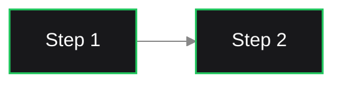
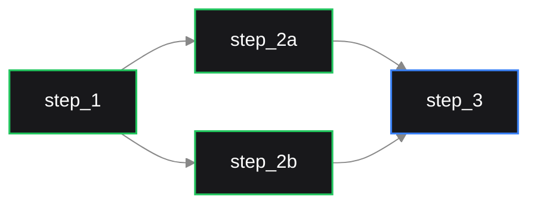

<div align="center">
  
  <p>
    <a href="https://docs.dagu.sh/reference/changelog"></a>
    <a href="https://github.com/dagu-org/dagu/actions/workflows/ci.yaml"></a>
    <a href="https://discord.gg/gpahPUjGRk"></a>
    <a href="https://bsky.app/profile/dagu-org.bsky.social"></a>
  </p>

  <p>
    <a href="https://docs.dagu.sh">Docs</a> |
    <a href="https://docs.dagu.sh/writing-workflows/examples">Examples</a> |
    <a href="https://discord.gg/gpahPUjGRk">Discord</a> |
    <a href="https://github.com/dagu-org/dagu">GitHub</a>
  </p>
</div>

## What is Dagu Workflow Engine?

**Dagu is a self-contained, lightweight workflow engine for small teams.** Define workflows in simple YAML, execute them anywhere with a single binary, compose complex pipelines from reusable sub-workflows, and distribute tasks across workers. All without requiring databases, message brokers, or code changes to your existing scripts.

Built for developers who want powerful workflow orchestration without the operational overhead. For a quick feel of how it works, take a look at the [examples](https://docs.dagu.sh/writing-workflows/examples).

- Zero-Ops: Single binary, file-based storage, under 128MB, air-gapped ready
- Full-Power: Docker steps, SSH execution, DAG composition, distributed mode, Git-based version management for DAGs & docs, [19+ executors](https://docs.dagu.sh/reference/executors)
- AI-Native: Built-in LLM agent creates, edits, and debugs workflows from natural language
- Legacy Script Friendly: Orchestrate existing shell commands, Python scripts, Docker containers, or HTTP calls without modification.
- Air-gapped Ready: Runs in isolated environments without external dependencies or network access


**Try it live:** [Live Demo](http://23.251.149.55:8525/) (credentials: `demouser` / `demouser`)

## Why Dagu?

```
  Traditional Orchestrator           Dagu
  ┌────────────────────────┐        ┌──────────────────┐
  │  Web Server            │        │                  │
  │  Scheduler             │        │   dagu server    │
  │  Worker(s)             │        │                  │
  │  PostgreSQL            │        └──────────────────┘
  │  Redis / RabbitMQ      │         Single binary.
  │  Python runtime        │         Zero dependencies.
  └────────────────────────┘         Just run it.
    6+ services to manage
```

One binary. No Postgres. No Redis. No Python. Just `dagu server`.

## Quick Start

### 1. Install

**macOS/Linux:**

```bash
curl -L https://raw.githubusercontent.com/dagu-org/dagu/main/scripts/installer.sh | bash
```

**Homebrew:**

```bash
brew install dagu
```

**Windows (PowerShell):**

```powershell
irm https://raw.githubusercontent.com/dagu-org/dagu/main/scripts/installer.ps1 | iex
```

**Docker:**

```bash
docker run --rm -v ~/.dagu:/var/lib/dagu -p 8080:8080 ghcr.io/dagu-org/dagu:latest dagu start-all
```

> More options (npm, custom paths, specific versions): [Installation docs](https://docs.dagu.sh/getting-started/installation)

### 2. Create your first workflow

> When you first start Dagu with an empty DAGs directory, it automatically creates example workflows. Set `DAGU_SKIP_EXAMPLES=true` to skip this.

```bash
cat > ./hello.yaml << 'EOF'
steps:
  - echo "Hello from Dagu!"
  - echo "Running step 2"
EOF
```

### 3. Run the workflow

```bash
dagu start hello.yaml
```

### 4. Check the status

```bash
dagu status hello
```

### 5. Explore the Web UI

```bash
dagu start-all
```

Visit http://localhost:8080

**Docker Compose:** Clone the repo and run `docker compose -f deploy/docker/compose.minimal.yaml up -d`. See [deployment docs](https://docs.dagu.sh/getting-started/installation) for production setups.

## Workflow Examples

### Sequential Steps

Steps execute one after another:

```yaml
type: chain
steps:
  - command: echo "Hello, dagu!"
  - command: echo "This is a second step"
```



### Parallel Steps

Steps with dependencies run in parallel:

```yaml
type: graph
steps:
  - id: step_1
    command: echo "Step 1"
  - id: step_2a
    command: echo "Step 2a - runs in parallel"
    depends: [step_1]
  - id: step_2b
    command: echo "Step 2b - runs in parallel"
    depends: [step_1]
  - id: step_3
    command: echo "Step 3 - waits for parallel steps"
    depends: [step_2a, step_2b]
```



### Docker Step

Run containers as workflow steps:

```yaml
steps:
  - name: build-app
    container:
      image: node:20-alpine
    command: npm run build
```

### SSH Execution

Run commands on remote machines:

```yaml
steps:
  - name: deploy
    type: ssh
    config:
      host: prod-server.example.com
      user: deploy
      key: ~/.ssh/id_rsa
    command: cd /var/www && git pull && npm run build
```

### Sub-DAG Composition

Invoke other DAGs as steps for hierarchical workflows:

```yaml
steps:
  - name: extract
    call: etl/extract
    params: "SOURCE=s3://bucket/data.csv"
  - name: transform
    call: etl/transform
    params: "INPUT=${extract.outputs.result}"
    depends: [extract]
  - name: load
    call: etl/load
    params: "DATA=${transform.outputs.result}"
    depends: [transform]
```

For more examples, see the [Examples](https://docs.dagu.sh/writing-workflows/examples) documentation.

## Features

### Zero-Ops

- Single binary installation, under 128MB memory
- File-based storage — no PostgreSQL, no Redis, no message brokers
- Air-gapped / offline capable
- [Cron scheduling](https://docs.dagu.sh/features/scheduling) with timezone support and zombie detection
- [High availability](https://docs.dagu.sh/features/scheduling#high-availability) with scheduler failover

### Full-Power

- [Docker executor](https://docs.dagu.sh/features/executors/docker) — run containers as workflow steps
- [SSH executor](https://docs.dagu.sh/features/executors/ssh) — execute commands on remote machines
- [Git sync](https://docs.dagu.sh/features/git-sync) — version management for DAG definitions and documents
- [Hierarchical DAG composition](https://docs.dagu.sh/features/execution-control#parallel-execution) — nest workflows inside workflows
- [Distributed execution](https://docs.dagu.sh/features/distributed-execution) — coordinator/worker mode across machines
- [19+ built-in executors](https://docs.dagu.sh/reference/executors) — HTTP, SQL, Redis, S3, jq, mail, archive, and more
- [RBAC](https://docs.dagu.sh/configurations/authentication) with 5 roles, OIDC, API keys, and audit logging
- [Human-in-the-loop](https://docs.dagu.sh/writing-workflows/examples) approval gates

### AI-Native

- Built-in [AI agent](https://docs.dagu.sh/features/agent/) — creates, edits, runs, and debugs workflows from natural language
- [Agent and chat step types](https://docs.dagu.sh/reference/executors) in DAGs with tool calling
- Multi-provider LLM support (Anthropic, OpenAI, Google Gemini, OpenRouter)
- Persistent memory, sub-agent delegation, and domain-specific skills
- Built-in [document management](https://docs.dagu.sh/features/documents) with AI agent integration

> See the [full feature list](https://docs.dagu.sh) for all capabilities.

## Environment Variables

**Note:** Configuration precedence: Command-line flags > Environment variables > Configuration file

### Frontend Server Configuration

| Environment Variable | Default | Description |
|---------------------|---------|-------------|
| `DAGU_HOST` | `127.0.0.1` | Web UI server host |
| `DAGU_PORT` | `8080` | Web UI server port |
| `DAGU_BASE_PATH` | - | Base path for reverse proxy setup |
| `DAGU_API_BASE_URL` | `/api/v1` | API endpoint base path |
| `DAGU_TZ` | - | Server timezone (e.g., `Asia/Tokyo`) |
| `DAGU_DEBUG` | `false` | Enable debug mode |
| `DAGU_LOG_FORMAT` | `text` | Log format (`text` or `json`) |
| `DAGU_HEADLESS` | `false` | Run without Web UI |
| `DAGU_LATEST_STATUS_TODAY` | `false` | Show only today's latest status |
| `DAGU_DEFAULT_SHELL` | - | Default shell for command execution |
| `DAGU_CERT_FILE` | - | TLS certificate file path |
| `DAGU_KEY_FILE` | - | TLS key file path |

### Path Configuration

| Environment Variable | Default | Description |
|---------------------|---------|-------------|
| `DAGU_HOME` | - | Base directory that overrides all path configurations |
| `DAGU_DAGS_DIR` | `~/.config/dagu/dags` | Directory for DAG definitions |
| `DAGU_ALT_DAGS_DIR` | - | Additional directory to search for DAG definitions |
| `DAGU_LOG_DIR` | `~/.local/share/dagu/logs` | Directory for log files |
| `DAGU_DATA_DIR` | `~/.local/share/dagu/data` | Directory for application data |
| `DAGU_SUSPEND_FLAGS_DIR` | `~/.local/share/dagu/suspend` | Directory for suspend flags |
| `DAGU_ADMIN_LOG_DIR` | `~/.local/share/dagu/logs/admin` | Directory for admin logs |
| `DAGU_BASE_CONFIG` | `~/.config/dagu/base.yaml` | Path to base configuration file |
| `DAGU_EXECUTABLE` | - | Path to dagu executable |
| `DAGU_DAG_RUNS_DIR` | `{dataDir}/dag-runs` | Directory for DAG run data |
| `DAGU_PROC_DIR` | `{dataDir}/proc` | Directory for process data |
| `DAGU_QUEUE_DIR` | `{dataDir}/queue` | Directory for queue data |
| `DAGU_SERVICE_REGISTRY_DIR` | `{dataDir}/service-registry` | Directory for service registry |

### Authentication

| Environment Variable | Default | Description |
|---------------------|---------|-------------|
| `DAGU_AUTH_MODE` | `builtin` | Authentication mode: `none`, `basic`, or `builtin` |
| `DAGU_AUTH_BASIC_USERNAME` | - | Basic auth username |
| `DAGU_AUTH_BASIC_PASSWORD` | - | Basic auth password |
| `DAGU_AUTH_OIDC_CLIENT_ID` | - | OIDC client ID |
| `DAGU_AUTH_OIDC_CLIENT_SECRET` | - | OIDC client secret |
| `DAGU_AUTH_OIDC_CLIENT_URL` | - | OIDC client URL |
| `DAGU_AUTH_OIDC_ISSUER` | - | OIDC issuer URL |
| `DAGU_AUTH_OIDC_SCOPES` | - | OIDC scopes (comma-separated) |
| `DAGU_AUTH_OIDC_WHITELIST` | - | OIDC email whitelist (comma-separated) |
| `DAGU_AUTH_OIDC_AUTO_SIGNUP` | `false` | Auto-create users on first OIDC login |
| `DAGU_AUTH_OIDC_DEFAULT_ROLE` | `viewer` | Role for auto-created users |
| `DAGU_AUTH_OIDC_ALLOWED_DOMAINS` | - | Allowed email domains (comma-separated) |
| `DAGU_AUTH_OIDC_BUTTON_LABEL` | `Login with SSO` | SSO login button text |

### Builtin Authentication (RBAC)

When `DAGU_AUTH_MODE=builtin`, a file-based user management system with role-based access control is enabled. Roles: `admin`, `manager`, `developer`, `operator`, `viewer`. On first startup, visit the web UI to create your admin account via the setup page.

| Environment Variable | Default | Description |
|---------------------|---------|-------------|
| `DAGU_AUTH_TOKEN_SECRET` | (auto-generated) | JWT token secret for signing (auto-generated if not set) |
| `DAGU_AUTH_TOKEN_TTL` | `24h` | JWT token time-to-live |
| `DAGU_USERS_DIR` | `{dataDir}/users` | Directory for user data files |

### UI Configuration

| Environment Variable | Default | Description |
|---------------------|---------|-------------|
| `DAGU_UI_NAVBAR_COLOR` | `#1976d2` | UI header color (hex or name) |
| `DAGU_UI_NAVBAR_TITLE` | `Dagu` | UI header title |
| `DAGU_UI_LOG_ENCODING_CHARSET` | `utf-8` | Log file encoding |
| `DAGU_UI_MAX_DASHBOARD_PAGE_LIMIT` | `100` | Maximum items on dashboard |
| `DAGU_UI_DAGS_SORT_FIELD` | `name` | Default DAGs sort field |
| `DAGU_UI_DAGS_SORT_ORDER` | `asc` | Default DAGs sort order |

### Features Configuration

| Environment Variable | Default | Description |
|---------------------|---------|-------------|
| `DAGU_TERMINAL_ENABLED` | `false` | Enable web-based terminal |
| `DAGU_AUDIT_ENABLED` | `true` | Enable audit logging for security events |

### Git Sync Configuration

Synchronize DAG definitions with a Git repository. See [Git Sync](https://docs.dagu.sh/features/git-sync) for details.

| Environment Variable | Default | Description |
|---------------------|---------|-------------|
| `DAGU_GITSYNC_ENABLED` | `false` | Enable Git sync |
| `DAGU_GITSYNC_REPOSITORY` | - | Repository URL (e.g., `github.com/org/repo`) |
| `DAGU_GITSYNC_BRANCH` | `main` | Branch to sync |
| `DAGU_GITSYNC_PATH` | `""` | Subdirectory in repo for DAGs |
| `DAGU_GITSYNC_PUSH_ENABLED` | `true` | Enable push/publish operations |
| `DAGU_GITSYNC_AUTH_TYPE` | `token` | Auth type: `token` or `ssh` |
| `DAGU_GITSYNC_AUTH_TOKEN` | - | GitHub PAT for HTTPS auth |
| `DAGU_GITSYNC_AUTH_SSH_KEY_PATH` | - | SSH private key path |
| `DAGU_GITSYNC_AUTOSYNC_ENABLED` | `false` | Enable automatic periodic pull |
| `DAGU_GITSYNC_AUTOSYNC_INTERVAL` | `300` | Auto-sync interval in seconds |

### Scheduler Configuration

| Environment Variable | Default | Description |
|---------------------|---------|-------------|
| `DAGU_SCHEDULER_PORT` | `8090` | Health check server port |
| `DAGU_SCHEDULER_LOCK_STALE_THRESHOLD` | `30s` | Scheduler lock stale threshold |
| `DAGU_SCHEDULER_LOCK_RETRY_INTERVAL` | `5s` | Lock retry interval |
| `DAGU_SCHEDULER_ZOMBIE_DETECTION_INTERVAL` | `45s` | Zombie DAG detection interval (0 to disable) |
| `DAGU_QUEUE_ENABLED` | `true` | Enable queue system |

### Worker Configuration

This configuration is used for worker instances that execute DAGs. See the [Distributed Execution](https://docs.dagu.sh/features/distributed-execution) documentation for more details.

| Environment Variable | Default | Description |
|---------------------|---------|-------------|
| `DAGU_COORDINATOR_ENABLED` | `true` | Enable coordinator service |
| `DAGU_COORDINATOR_HOST` | `127.0.0.1` | Coordinator gRPC server bind address |
| `DAGU_COORDINATOR_ADVERTISE` | (auto) | Address to advertise in service registry (default: hostname) |
| `DAGU_COORDINATOR_PORT` | `50055` | Coordinator gRPC server port |
| `DAGU_WORKER_ID` | - | Worker instance ID |
| `DAGU_WORKER_MAX_ACTIVE_RUNS` | `100` | Maximum concurrent runs per worker |
| `DAGU_WORKER_LABELS` | - | Worker labels (format: `key1=value1,key2=value2`, e.g., `gpu=true,memory=64G`) |
| `DAGU_SCHEDULER_PORT` | `8090` | Scheduler health check server port |
| `DAGU_SCHEDULER_LOCK_STALE_THRESHOLD` | `30s` | Time after which scheduler lock is considered stale |
| `DAGU_SCHEDULER_LOCK_RETRY_INTERVAL` | `5s` | Interval between lock acquisition attempts |

### Peer Configuration

This configuration is used for communication between coordinator services and other services (e.g., scheduler, worker, web UI). See the [Distributed Execution](https://docs.dagu.sh/features/distributed-execution) documentation for more details.

| Environment Variable | Default | Description |
|---------------------|---------|-------------|
| `DAGU_PEER_CERT_FILE` | - | Peer TLS certificate file |
| `DAGU_PEER_KEY_FILE` | - | Peer TLS key file |
| `DAGU_PEER_CLIENT_CA_FILE` | - | Peer CA certificate file for client verification |
| `DAGU_PEER_SKIP_TLS_VERIFY` | `false` | Skip TLS certificate verification for peer connections |
| `DAGU_PEER_INSECURE` | `true` | Use insecure connection (h2c) instead of TLS |

## Documentation

Full documentation at [docs.dagu.sh](https://docs.dagu.sh/).

- [Getting Started](https://docs.dagu.sh/getting-started/installation) — Installation and first workflow
- [Examples](https://docs.dagu.sh/writing-workflows/examples) — Feature walkthroughs with YAML samples
- [AI Agent](https://docs.dagu.sh/features/agent/) — Built-in AI assistant for workflow management
- [Distributed Execution](https://docs.dagu.sh/features/distributed-execution) — Coordinator/worker setup
- [Configuration](https://docs.dagu.sh/configurations/reference) — Environment variables and settings
- [Changelog](https://docs.dagu.sh/reference/changelog) — Recent updates and releases

## Community

- Chat with us on [Discord](https://discord.gg/gpahPUjGRk)
- File bugs and feature requests on [GitHub Issues](https://github.com/dagu-org/dagu/issues)
- Follow us on [Bluesky](https://bsky.app/profile/dagu-org.bsky.social)

## Development

**Prerequisites:** [Go 1.26+](https://go.dev/doc/install), [Node.js](https://nodejs.org/en/download/), [pnpm](https://pnpm.io/installation)

```bash
git clone https://github.com/dagu-org/dagu.git && cd dagu
make build
```

See [CONTRIBUTING.md](./CONTRIBUTING.md) for development workflow, testing, and code standards.

## Acknowledgements

<div align="center">
  <h3>Premium Sponsors</h3>
  <a href="https://github.com/slashbinlabs">
    
  </a>

  <h3>Supporters</h3>
  <a href="https://github.com/disizmj">
    
  </a>
  <a href="https://github.com/Arvintian">
    
  </a>
  <a href="https://github.com/yurivish">
    
  </a>
  <a href="https://github.com/jayjoshi64">
    
  </a>
  <a href="https://github.com/alangrafu">
    
  </a>

  <br/><br/>

  <a href="https://github.com/sponsors/dagu-org">
    
  </a>
</div>

## Contributing

We welcome contributions of all kinds. See our [Contribution Guide](./CONTRIBUTING.md) for details.

<a href="https://github.com/dagu-org/dagu/graphs/contributors">
  
</a>

## License

GNU GPLv3 - See [LICENSE](./LICENSE)
