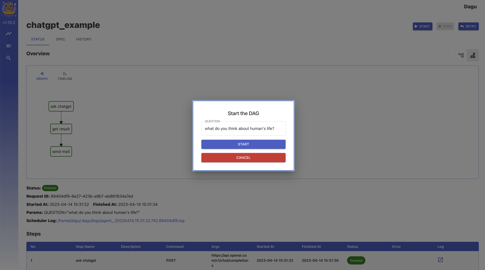

<p align="center">
  
  
</p>

<p align="center">
  <a href="https://goreportcard.com/report/github.com/yohamta/dagu">
    
  </a>
  <a href="https://codecov.io/gh/yohamta/dagu">
    
  </a>
  <a href="https://github.com/yohamta/dagu/releases">
    
  </a>
  <a href="https://godoc.org/github.com/yohamta/dagu">
    
  </a>
  
</p>

<div align="center">

[Installation](#installation) | [Community](https://discord.gg/gpahPUjGRk) | [Quick Start](#️quick-start-guide) 

</div>

<h1><b>Dagu</b></h1>

Dagu is a powerful Cron alternative that comes with a Web UI. It allows you to define dependencies between commands as a [Directed Acyclic Graph (DAG)](https://en.wikipedia.org/wiki/Directed_acyclic_graph) in a declarative [YAML format](https://dagu.readthedocs.io/en/latest/yaml_format.html). Additionally, Dagu natively supports running Docker containers, making HTTP requests, and executing commands over SSH.

- [Documentation](https://dagu.readthedocs.io) 
- [Discord Community](https://discord.gg/gpahPUjGRk)

## **Highlights**
- Single binary file installation
- Declarative YAML format for defining DAGs
- Web UI for visually managing, rerunning, and monitoring pipelines
- Use existing programs without any modification
- Self-contained, with no need for a DBMS

## **Contents**

- [**Highlights**](#highlights)
- [**Contents**](#contents)
- [**Features**](#features)
- [**Usecase**](#usecase)
- [**Web User Interface**](#web-user-interface)
- [**Installation**](#installation)
  - [Via Homebrew](#via-homebrew)
  - [Via Bash script](#via-bash-script)
  - [Via Docker](#via-docker)
  - [Via GitHub Release Page](#via-github-release-page)
- [️**Quick Start Guide**](#️quick-start-guide)
  - [1. Launch the Web UI](#1-launch-the-web-ui)
  - [2. Create a New DAG](#2-create-a-new-dag)
  - [3. Edit the DAG](#3-edit-the-dag)
  - [4. Execute the DAG](#4-execute-the-dag)
- [**Documentation**](#documentation)
- [**Example Workflow**](#example-workflow)
- [**Motivation**](#motivation)
- [**Why Not Use an Existing Workflow Scheduler Like Airflow?**](#why-not-use-an-existing-workflow-scheduler-like-airflow)
- [**How It Works**](#how-it-works)
- [**Roadmap**](#roadmap)
- [**Contributors**](#contributors)
- [**License**](#license)
- [**Support and Community**](#support-and-community)

## **Features**

- Web User Interface
- Command Line Interface (CLI) with several commands for running and managing DAGs
- YAML format for defining DAGs, with support for various features including:
  - Execution of custom code snippetts
  - Parameters
  - Command substitution
  - Conditional logic
  - Redirection of stdout and stderr
  - Lifecycle hooks
  - Repeating task
  - Automatic retry
- Executors for running different types of tasks:
  - Running arbitrary Docker containers
  - Making HTTP requests
  - Sending emails
  - Running jq command
  - Executing remote commands via SSH
- Email notification
- Scheduling with Cron expressions
- REST API Interface
- Basic Authentication

## **Usecase**

- **Data Pipeline Automation:** Schedule ETL tasks for data processing and centralization.
- **Infrastructure Monitoring:** Periodically check infrastructure components with HTTP requests or SSH commands.
- **Automated Reporting:** Generate and send periodic reports via email.
- **Batch Processing:** Schedule batch jobs for tasks like data cleansing or model training.
- **Task Dependency Management:** Manage complex workflows with interdependent tasks.
- **Microservices Orchestration:** Define and manage dependencies between microservices.
- **CI/CD Integration:** Automate code deployment, testing, and environment updates.
- **Alerting System:** Create notifications based on specific triggers or conditions.
- **Custom Task Automation:** Define and schedule custom tasks using code snippets.

## **Web User Interface**

- **DAG Details**: It shows the real-time status, logs, and DAG configurations. You can edit DAG configurations on a browser.

  

  You can switch to the vertical graph with the button on the top right corner.

  

- **DAGs**: It shows all DAGs and the real-time status.

  

- **Search DAGs**: It greps given text across all DAGs.
  

- **Execution History**: It shows past execution results and logs.

  

- **DAG Execution Log**: It shows the detail log and standard output of each execution and step.

  

## **Installation**

You can install Dagu quickly using Homebrew or by downloading the latest binary from the Releases page on GitHub.

### Via Homebrew
```sh
brew install yohamta/tap/dagu
```

Upgrade to the latest version:
```sh
brew upgrade yohamta/tap/dagu
```

### Via Bash script

```sh
curl -L https://raw.githubusercontent.com/yohamta/dagu/main/scripts/downloader.sh | bash
```

### Via Docker

```sh
docker run \
--rm \
-p 8080:8080 \
-v $HOME/.dagu/dags:/home/dagu/.dagu/dags \
-v $HOME/.dagu/data:/home/dagu/.dagu/data \
-v $HOME/.dagu/logs:/home/dagu/.dagu/logs \
yohamta/dagu:latest
```

### Via GitHub Release Page 

Download the latest binary from the [Releases page](https://github.com/yohamta/dagu/releases) and place it in your `$PATH` (e.g. `/usr/local/bin`).

## ️**Quick Start Guide**

### 1. Launch the Web UI

Start the server with the command `dagu server` and browse to `http://127.0.0.1:8080` to explore the Web UI.

### 2. Create a New DAG

Navigate to the DAG List page by clicking the menu in the left panel of the Web UI. Then create a DAG by clicking the `New DAG` button at the top of the page. Enter `example` in the dialog.

*Note: DAG (YAML) files will be placed in `~/.dagu/dags` by default. See [Configuration Options](https://dagu.readthedocs.io/en/latest/config.html) for more details.*

### 3. Edit the DAG

Go to the `SPEC` Tab and hit the `Edit` button. Copy & Paste the following example and click the `Save` button.

Example:
```yaml
steps:
  - name: s1
    command: echo Hello Dagu
  - name: s2
    command: echo done!
    depends:
      - s1
```

### 4. Execute the DAG

You can execute the example by pressing the `Start` button. You can see "Hello Dagu" in the log page in the Web UI.

## **Documentation**

- [Installation Instructions](https://dagu.readthedocs.io/en/latest/installation.html)
- ️[Quick Start Guide](https://dagu.readthedocs.io/en/latest/quickstart.html)
- [Command Line Interface](https://dagu.readthedocs.io/en/latest/cli.html)
- [Web User Interface](https://dagu.readthedocs.io/en/latest/web_interface.html)
- YAML Format
  - [Minimal DAG Definition](https://dagu.readthedocs.io/en/latest/yaml_format.html#minimal-dag-definition)
  - [Running Arbitrary Code Snippets](https://dagu.readthedocs.io/en/latest/yaml_format.html#running-arbitrary-code-snippets)
  - [Defining Environment Variables](https://dagu.readthedocs.io/en/latest/yaml_format.html#defining-environment-variables)
  - [Defining and Using Parameters](https://dagu.readthedocs.io/en/latest/yaml_format.html#defining-and-using-parameters)
  - [Using Command Substitution](https://dagu.readthedocs.io/en/latest/yaml_format.html#using-command-substitution)
  - [Adding Conditional Logic](https://dagu.readthedocs.io/en/latest/yaml_format.html#adding-conditional-logic)
  - [Setting Environment Variables with Standard Output](https://dagu.readthedocs.io/en/latest/yaml_format.html#setting-environment-variables-with-standard-output)
  - [Redirecting Stdout and Stderr](https://dagu.readthedocs.io/en/latest/yaml_format.html#redirecting-stdout-and-stderr)
  - [Adding Lifecycle Hooks](https://dagu.readthedocs.io/en/latest/yaml_format.html#adding-lifecycle-hooks)
  - [Repeating a Task at Regular Intervals](https://dagu.readthedocs.io/en/latest/yaml_format.html#repeating-a-task-at-regular-intervals)
  - [All Available Fields for DAGs](https://dagu.readthedocs.io/en/latest/yaml_format.html#all-available-fields-for-dags)
  - [All Available Fields for Steps](https://dagu.readthedocs.io/en/latest/yaml_format.html#all-available-fields-for-steps)
- Example DAGs
  - [Hello World](https://dagu.readthedocs.io/en/latest/examples.html#hello-world)
  - [Conditional Steps](https://dagu.readthedocs.io/en/latest/examples.html#conditional-steps)
  - [File Output](https://dagu.readthedocs.io/en/latest/examples.html#file-output)
  - [Passing Output to Next Step](https://dagu.readthedocs.io/en/latest/examples.html#passing-output-to-next-step)
  - [Running a Docker Container](https://dagu.readthedocs.io/en/latest/examples.html#running-a-docker-container)
  - [Sending HTTP Requests](https://dagu.readthedocs.io/en/latest/examples.html#sending-http-requests)
  - [Querying JSON Data with jq](https://dagu.readthedocs.io/en/latest/examples.html#querying-json-data-with-jq)
  - [Sending Email](https://dagu.readthedocs.io/en/latest/examples.html#sending-email)
- [Configurations](https://dagu.readthedocs.io/en/latest/config.html)
- [Scheduler](https://dagu.readthedocs.io/en/latest/scheduler.html)
- [Docker Compose](https://dagu.readthedocs.io/en/latest/docker-compose.html)

## **Example Workflow**

This example workflow calls the ChatGPT API and sends the result to your email address.

Create a new DAG in the Web UI and copy-paste the following YAML in the editor.
Replace `OPEN_API_KEY`, `YOUR_EMAIL_ADDRESS`, `MAILGUN_USERNAME`, and `MAILGUN_PASSWORD` in the `env` and `smtp` section with your own information. [Mailgun](https://www.mailgun.com/) offers a free tier for testing.
You can then run the DAG.

```yaml
env:
  - OPENAI_API_KEY: "$OPEN_API_KEY"
  - MY_EMAIL: "$YOUR_EMAIL_ADDRESS"

smtp:
  host: "smtp.mailgun.org"
  port: "587"
  username: "$MAILGUN_USERNAME"
  password: "$MAILGUN_PASSWORD"

params: QUESTION="Can you explain your philosophy of Stoicism?"

steps:
  - name: ask chatgpt
    executor:
      type: http
      config:
        timeout: 180
        headers:
          Authorization: "Bearer $OPENAI_API_KEY"
          Content-Type: "application/json"
        silent: true
        body: |
          { "model": "gpt-3.5-turbo", "messages": [
              {"role": "system", "content": "Respond as a philosopher of the Roman Imperial Period"},
              {"role": "user", "content": "$QUESTION"}
            ] 
          }
    command: POST https://api.openai.com/v1/chat/completions
    output: API_RESPONSE

  - name: get result
    executor:
      type: jq
      config:
        raw: true
    command: ".choices[0].message.content"
    script: "$API_RESPONSE"
    output: MESSAGE_CONTENT
    depends:
      - ask chatgpt
  
  - name: send mail
    executor:
      type: mail
      config:
        to: "$MY_EMAIL"
        from: "$MY_EMAIL"
        subject: "[dagu-auto] philosopher's reply"
        message: |
          <html>
            <body>
              <h1>$QUESTION</h1>
              <p>$MESSAGE_CONTENT</p>
            </body>
          </html>
    depends:
      - get result
```

You can input the ChatGPT prompt in the Web UI.



## **Motivation**

Legacy systems often have complex and implicit dependencies between jobs. When there are hundreds of cron jobs on a server, it can be difficult to keep track of these dependencies and to determine which job to rerun if one fails. It can also be a hassle to SSH into a server to view logs and manually rerun shell scripts one by one. Dagu aims to solve these problems by allowing you to explicitly visualize and manage pipeline dependencies as a DAG, and by providing a web UI for checking dependencies, execution status, and logs and for rerunning or stopping jobs with a simple mouse click.

## **Why Not Use an Existing Workflow Scheduler Like Airflow?**

There are many existing tools such as Airflow, but many of these require you to write code in a programming language like Python to define your DAG. For systems that have been in operation for a long time, there may already be complex jobs with hundreds of thousands of lines of code written in languages like Perl or Shell Script. Adding another layer of complexity on top of these codes can reduce maintainability. Dagu was designed to be easy to use, self-contained, and require no coding, making it ideal for small projects.

## **How It Works**

Dagu is a single command line tool that uses the local file system to store data, so no database management system or cloud service is required. DAGs are defined in a declarative YAML format, and existing programs can be used without modification.

## **Roadmap**

- Writing dags in the Starlark Language
- Writing dags in Cue
- AWS Lambda Execution
- Slack Integration
- User Defined Function
- Observability
- Project concept for grouping dags
- Simple User management and RBAC
- Keycloak Integration Option
- HA Cluster Mode
- Database Option
- DAG Versioning
- Built-in TLS

## **Contributors**
<a href="https://github.com/yohamta/dagu/graphs/contributors">
  
</a>

----

Feel free to contribute in any way you want! Share ideas, questions, submit issues, and create pull requests. Check out our [Contribution Guide](https://dagu.readthedocs.io/en/latest/contrib.html) for help getting started.

We welcome any and all contributions!

## **License**

This project is licensed under the GNU GPLv3.

## **Support and Community**

Join our [Discord community](https://discord.gg/gpahPUjGRk) to ask questions, request features, and share your ideas.
