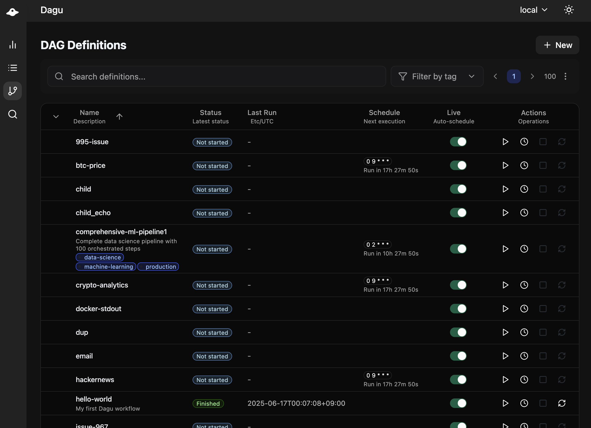
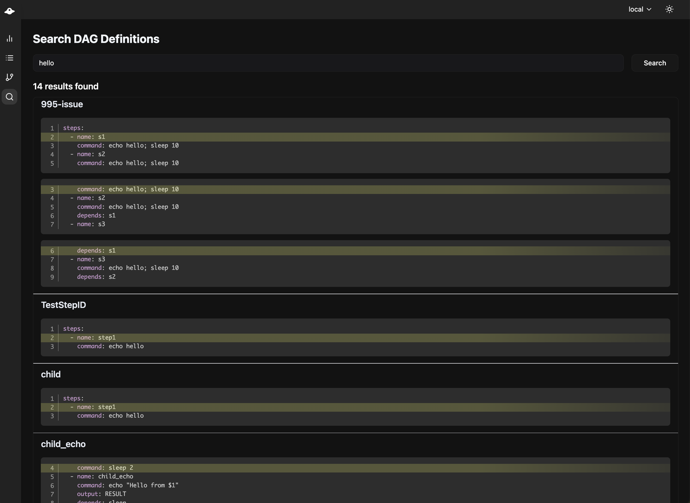
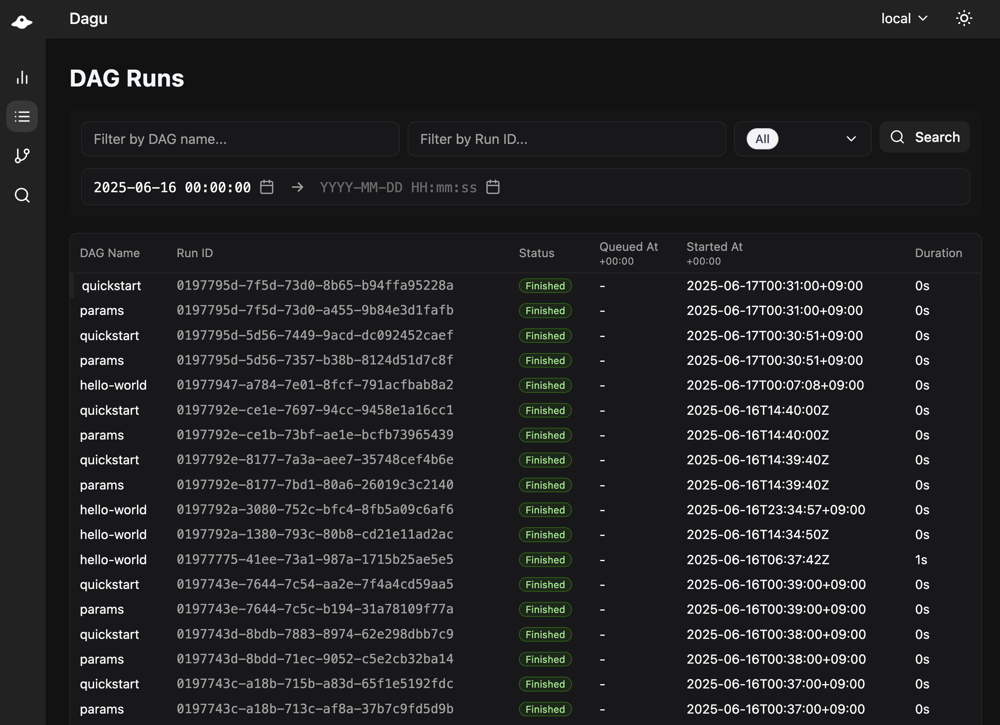

<p align="center">
  
</p>

<p align="center">
  <a href="https://goreportcard.com/report/github.com/dagu-org/dagu">
    
  </a>
  <a href="https://codecov.io/gh/dagu-org/dagu">
    
  </a>
  <a href="https://github.com/dagu-org/dagu/releases">
    
  </a>
  <a href="https://godoc.org/github.com/dagu-org/dagu">
    
  </a>
  
  <a href="https://deepwiki.com/dagu-org/dagu"></a>
</p>

<div align="center">

[Installation](https://docs.dagu.cloud/getting-started/installation) | [Community](https://discord.gg/gpahPUjGRk) | [Quick Start](https://docs.dagu.cloud/getting-started/quickstart) | [Documentation](https://docs.dagu.cloud)

</div>

<h1><b>Dagu</b></h1>

## Overview

Dagu is a compact, portable workflow engine implemented in Go. It provides a declarative model for orchestrating command execution across diverse environments, including shell scripts, Python commands, containerized operations, or remote commands.

Dagu’s design emphasizes minimal external dependencies: it operates solely as a single binary without requiring an external database. A browser-based graphical interface (UI) is provided for real-time monitoring, rendering the status and logs of workflows. This zero-dependency structure makes the system easy to install and well-suited to various infrastructures, including local or air-gapped systems. This local-first architecture also ensures that sensitive data or proprietary workflows remain secure.

<h2><b>Table of Contents</b></h2>

- [Overview](#overview)
- [📢 Updates](#-updates)
- [Announcements](#announcements)
- [Key Attributes](#key-attributes)
- [Use Cases](#use-cases)
- [Installation](#installation)
  - [Via Bash script](#via-bash-script)
  - [Via GitHub Releases Page](#via-github-releases-page)
  - [Via Homebrew (macOS)](#via-homebrew-macos)
  - [Via Docker](#via-docker)
  - [Quick Start](#quick-start)
- [Building from Source](#building-from-source)
  - [Prerequisites](#prerequisites)
  - [Steps to Build Locally](#steps-to-build-locally)
    - [1. Clone the repository](#1-clone-the-repository)
    - [2. Build the UI](#2-build-the-ui)
    - [3. Build the Binary](#3-build-the-binary)
  - [Run Locally from Source](#run-locally-from-source)
- [Web UI](#web-ui)
  - [Dashboard](#dashboard)
  - [DAG Details](#dag-details)
  - [DAGs](#dags)
  - [Search](#search)
  - [Execution History](#execution-history)
  - [Log Viewer](#log-viewer)
- [Contributing](#contributing)
- [Contributors](#contributors)
- [License](#license)

## 📢 Updates

- **2025-06-17**: [v1.17.0](https://docs.dagu.cloud/reference/changelog#v1-17-0-2025-06-17) - Major UI improvements, hierarchical execution, performance enhancements, and partial success status
- **2025-01-09**: [v1.16.0](https://docs.dagu.cloud/reference/changelog#v1-16-0-2025-01-09) - Dotenv support, JSON reference expansion, enhanced preconditions, and improved parameter handling

## Announcements

**🚀 Version 1.17.0 Released - Significant Improvements & New Features**

We're excited to announce the release of Dagu 1.17.0! After a successful 2-week beta period, this release brings many improvements and new features while maintaining the core stability you rely on.

**Key Features in 1.17.0:**
- 🎯 **Improved Performance**: Refactored execution history data for more performant history lookup
- 🔄 **Hierarchical Execution**: Added capability for nested DAG execution
- 📄 **Multiple DAGs in Single File**: Define multiple DAGs in one YAML file using `---` separator for better organization and reusability
- 🚀 **Parallel Execution**: Execute commands or sub-DAGs in parallel with different parameters for batch processing ([#989](https://github.com/dagu-org/dagu/issues/989))
- 🎨 **Enhanced Web UI**: Overall UI improvements with better user experience
- 📊 **Advanced History Search**: New execution history page with date-range and status filters ([#933](https://github.com/dagu-org/dagu/issues/933))
- 🐛 **Better Debugging**: 
  - Display actual results of precondition evaluations ([#918](https://github.com/dagu-org/dagu/issues/918))
  - Show output variable values in the UI ([#916](https://github.com/dagu-org/dagu/issues/916))
  - Separate logs for stdout and stderr by default ([#687](https://github.com/dagu-org/dagu/issues/687))
- 📋 **Queue Management**: Added enqueue functionality for API and UI ([#938](https://github.com/dagu-org/dagu/issues/938))
- 🗿 **Partial failed**: Added partial success status ([#1011](https://github.com/dagu-org/dagu/issues/1011))
- 🏗️ **API v2**: New `/api/v2` endpoints with refactored schema and better abstractions ([OpenAPI spec](./api/v2/api.yaml))
- 🔧 **Various Enhancements**: Including [#925](https://github.com/dagu-org/dagu/issues/925), [#898](https://github.com/dagu-org/dagu/issues/898), [#895](https://github.com/dagu-org/dagu/issues/895), [#868](https://github.com/dagu-org/dagu/issues/868), [#903](https://github.com/dagu-org/dagu/issues/903), [#911](https://github.com/dagu-org/dagu/issues/911), [#913](https://github.com/dagu-org/dagu/issues/913), [#921](https://github.com/dagu-org/dagu/issues/921), [#923](https://github.com/dagu-org/dagu/issues/923), [#887](https://github.com/dagu-org/dagu/issues/887), [#922](https://github.com/dagu-org/dagu/issues/922), [#932](https://github.com/dagu-org/dagu/issues/932), [#962](https://github.com/dagu-org/dagu/issues/962)

Please see the [full changelog](https://docs.dagu.cloud/reference/changelog) for all details and migration notes.

<h3> ❤️ Huge Thanks to Our Contributors</h3>

This release wouldn’t exist without the community’s time, sweat, and ideas. In particular:

| Contribution | Author |
|--------------|--------|
| Optimized Docker image size **and** split into three baseline images | @jerry-yuan |
| Allow specifying container name & image platform ([#898]) | @vnghia |
| Enhanced repeat-policy – conditions, expected output, and exit codes | @thefishhat |
| Implemented queue functionality | @kriyanshii |
| Implemented partial success status ([#1011]) | @thefishhat |
| Countless insightful reviews & feedback | @ghansham |

*Thank you all for pushing Dagu forward! 💙*

## Key Attributes

- **Small Footprint**
Dagu is distributed as a single binary with minimal resource overhead. It does not require additional components such as external databases, message brokers, or other services.

- **Language Agnostic**: Workflows in Dagu are defined by specifying tasks (called “steps”) and their dependencies in YAML. A step can execute any command whether Python, Bash, Node.js, or other executables. This flexibility allows easy integration with existing scripts or tools.

- **Local-First Architecture**: Dagu was designed to run on a single developer workstation or server. By default, all tasks, logs, and scheduling run locally, allowing run offline or in air-gapped environments. This architecture ensures that sensitive data or proprietary workflows remain secure.

- **Declarative Configuration**: The workflow definition is contained in a YAML file. Dependencies, schedules, and execution details are declaratively expressed, making the workflow easy to comprehend and maintain.

- **No Complex Setup**: Unlike other orchestration platforms (e.g., `Airflow`) that often require substantial infrastructure, Dagu can be installed in minutes. Just `dagu start-all` command spins up both the scheduler and web UI, ready to run tasks immediately.

## Use Cases

- Data ingestion pipelines
- Data processing on small-scale/embedded systems
- Media file conversion tasks
- Automated workflows for employee onboarding and offboarding
- CI/CD automation

## Installation

Dagu can be installed in multiple ways, such as using Homebrew or downloading a single binary from GitHub releases.

### Via Bash script

**Install the latest version:**

```sh
curl -L https://raw.githubusercontent.com/dagu-org/dagu/main/scripts/installer.sh | bash
```

**Install a specific version:**

```sh
curl -L https://raw.githubusercontent.com/dagu-org/dagu/main/scripts/installer.sh | bash -s -- --version <version>
```

The `<version>` can be a specific version (e.g. `v1.16.10`)

**Install to a custom directory:**

```sh
curl -L https://raw.githubusercontent.com/dagu-org/dagu/main/scripts/installer.sh | bash -s -- --install-dir <path>
```

### Via GitHub Releases Page

Download the latest binary from the [Releases page](https://github.com/dagu-org/dagu/releases) and place it in your `$PATH` (e.g. `/usr/local/bin`).

### Via Homebrew (macOS)

```sh
brew install dagu-org/brew/dagu
```

Upgrade to the latest version:

```sh
brew upgrade dagu-org/brew/dagu
```

### Via Docker

```sh
mkdir -p ~/.dagu
docker run \
--rm \
-p 8080:8080 \
-v ~/.dagu:/dagu \
-e DAGU_TZ=`ls -l /etc/localtime | awk -F'/zoneinfo/' '{print $2}'` \
ghcr.io/dagu-org/dagu:latest dagu start-all
```

Note: The environment variable `DAGU_TZ` is the timezone for the scheduler and server. You can set it to your local timezone (e.g. `America/New_York`).

See [Environment variables](https://docs.dagu.cloud/getting-started/quickstart) to configure those default directories.

### Quick Start

See the [Quick Start Guide](#quick-start-guide) to create and execute your first DAG!

## Building from Source

Dagu can be built and run locally from source.

### Prerequisites

Make sure you have the following installed on your system:

- [Go 1.24 or later](https://go.dev/doc/install)
- [Node.js (Latest LTS or Current)](https://nodejs.org/en/download/)
- [pnpm](https://pnpm.io/installation)

### Steps to Build Locally

#### 1. Clone the repository

- Clone the repository to your local machine using Git.
  ```sh
  git clone https://github.com/dagu-org/dagu.git
  cd dagu
  ```

#### 2. Build the UI

- Build the UI assets. This step is necessary to generate frontend files and copy them to the `internal/frontend/assets` directory.
  ```sh
  make ui
  ```

#### 3. Build the Binary
- Build the binary
  ```sh
  make bin
  ```
  This produces the `dagu` binary in the `.local/bin` directory.

### Run Locally from Source

For a quick test of both server, scheduler, and UI:
```sh
# Runs "dagu start-all" with the `go run` command
make run
```
Once the server is running, visit `http://127.0.0.1:8080` to see the Web UI.

Continue with the [Quick Start Guide](#quick-start-guide) to create and execute your first DAG!

## Web UI

### Dashboard

The Dagu dashboard provides an overview of all workflows (DAGs) and their current status.


### DAG Details

Create and edit workflows (DAGs) with auto completion and validation. The DAG editor allows you to define steps, dependencies, and parameters in a user-friendly interface.


### DAGs

View all DAGs in one place with live status updates.



### Search

Search across all DAG definitions.



### Execution History

Review past workflows and logs at a glance.



### Log Viewer

Examine detailed step-level logs and outputs.


## Contributing

Contributions to Dagu are welcome.

## Contributors

<a href="https://github.com/dagu-org/dagu/graphs/contributors">
  
</a>

## License

Dagu is distributed under the [GNU GPLv3](./LICENSE.md).

[#898]: https://github.com/dagu-org/dagu/issues/898
[#1011]: https://github.com/dagu-org/dagu/issues/1011
