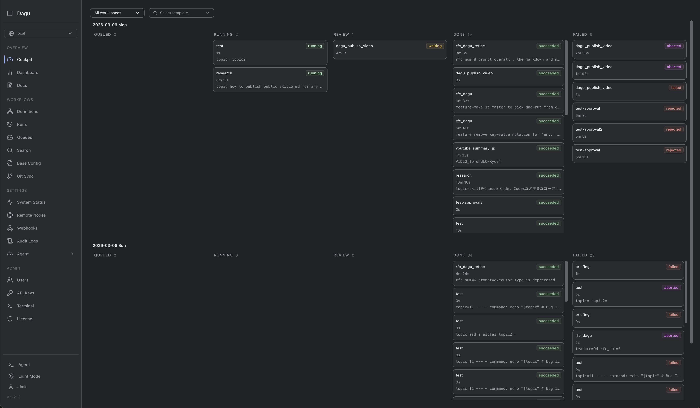
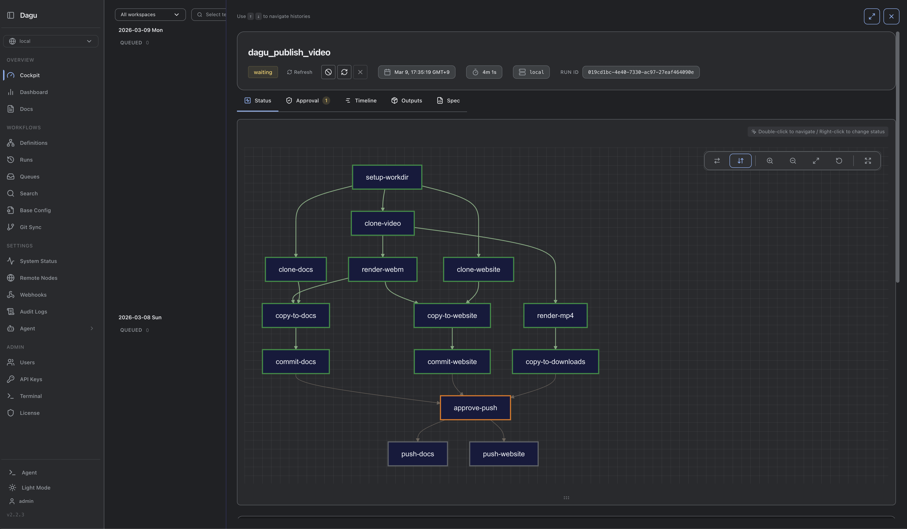
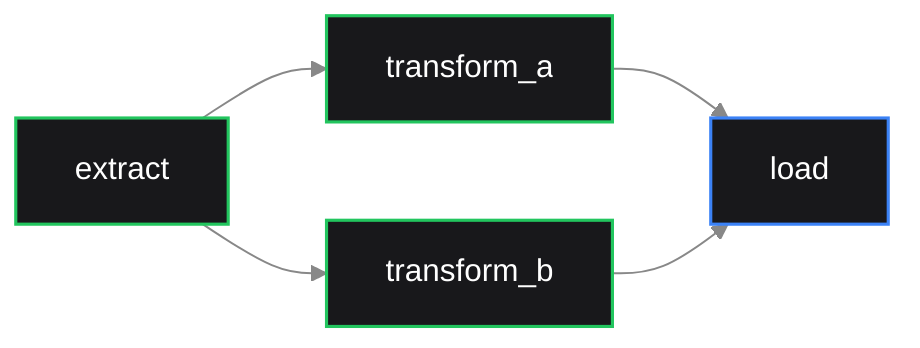

<div align="center">
  
  <p>
    <a href="https://docs.dagu.sh/overview/changelog"></a>
    <a href="https://github.com/dagucloud/dagu/actions/workflows/ci.yaml"></a>
    <a href="https://discord.gg/gpahPUjGRk"></a>
    <a href="https://bsky.app/profile/dagu-org.bsky.social"></a>
  </p>

  <p>
    <a href="https://docs.dagu.sh">Docs</a> |
    <a href="https://docs.dagu.sh/writing-workflows/examples">Examples</a> |
    <a href="https://discord.gg/gpahPUjGRk">Support & Community</a>
  </p>
</div>

## Zero-invasive Lightweight Workflow Orchestration Engine

Dagu is a workflow orchestration engine that runs as a single binary with no external dependencies. Workflows are defined as DAGs (Directed Acyclic Graphs) in YAML. It supports local execution, cron scheduling, queue-based concurrency control, and distributed coordinator/worker execution across multiple machines over gRPC.

It requires no external databases, no message brokers, and no language-specific runtimes. All state is stored in local files by default.

For a quick look at how workflows are defined, see the [examples](https://docs.dagu.sh/writing-workflows/examples).

<div align="center">
  
</div>

| Cockpit (Kanban) | DAG Run Details |
|---|---|
|  |  |

**Try it live:** [Live Demo](https://demo-instance.dagu.sh/) (credentials: `demouser` / `demouser`)

## Real-World Use Cases

Dagu is useful when scripts, containers, server jobs, or data tasks need visible dependencies, schedules, logs, retries, and a simple way to operate them.

**Cron and legacy script management.** Run existing shell scripts, Python scripts, HTTP calls, and scheduled jobs without rewriting them. Dependencies, run status, logs, retries, and history become visible in the Web UI instead of being hidden across crontabs and server log files.

**ETL and data operations.** Run PostgreSQL or SQLite queries, S3 transfers, `jq` transforms, validation steps, and reusable sub-workflows. Daily data workflows stay declarative, observable, and easy to retry when one step fails.

**Media conversion.** Run `ffmpeg`, thumbnail extraction, audio normalization, image processing, and other compute-heavy jobs. Conversion work can run across distributed workers while status, history, logs, and artifacts stay in one persistence layer for monitoring, debugging, and retries.

**Infrastructure and server automation.** Coordinate SSH backups, cleanup jobs, deploy scripts, patch windows, precondition checks, and lifecycle hooks. Remote operations get schedules, retries, notifications, and per-step logs without requiring operators to SSH into servers for every recovery.

**Container and Kubernetes workflows.** Compose workflows where each step can run a Docker image, Kubernetes Job, shell command, or validation step. Image-based tasks can be routed to the right workers without building a custom control plane around containers.

**Customer support automation.** Run diagnostics, account repair jobs, data checks, and approval-gated support actions from a simple Web UI. Non-engineers can run reviewed workflows while engineers keep commands, logs, and results traceable.

**IoT and edge workflows.** Run sensor polling, local cleanup, offline sync, health checks, and device maintenance jobs on small devices. The single binary and file-backed state work well on edge devices while still providing visibility through the Web UI.

**AI agent automation.** Use AI agents to write, update, debug, and repair workflows because the operational contract is plain YAML. Agent-generated changes stay reviewable and observable in the same workflow system humans already operate.

## Why Dagu?

```sh
  Traditional Orchestrator           Dagu
  ┌────────────────────────┐        ┌──────────────────┐
  │  Web Server            │        │                  │
  │  Scheduler             │        │  dagu start-all  │
  │  Worker(s)             │        │                  │
  │  PostgreSQL            │        └──────────────────┘
  │  Redis / RabbitMQ      │         Single binary.
  │  Python runtime        │         Zero dependencies.
  └────────────────────────┘         Just run it.
    6+ services to manage
```


## Architecture

Dagu can run in three configurations:

**Standalone** — A single `dagu start-all` process runs the HTTP server, scheduler, and executor. Suitable for single-machine deployments.

**Coordinator/Worker** — The scheduler enqueues jobs to a local file-based queue, then dispatches them to a coordinator over gRPC. Workers long-poll the coordinator for tasks, execute DAGs locally, and report status back. Workers can run on separate machines and are routed tasks based on labels.

**Headless** — Run without the web UI (`DAGU_HEADLESS=true`). Useful for CI/CD environments or when Dagu is managed through the CLI or API only.

```sh
Standalone:

  ┌─────────────────────────────────────────┐
  │  dagu start-all                         │
  │  ┌───────────┐ ┌───────────┐ ┌────────┐ │
  │  │ HTTP / UI │ │ Scheduler │ │Executor│ │
  │  └───────────┘ └───────────┘ └────────┘ │
  │  File-based storage (logs, state, queue)│
  └─────────────────────────────────────────┘

Distributed:

  ┌────────────┐                   ┌────────────┐
  │ Scheduler  │                   │ HTTP / UI  │
  │            │                   │            │
  │ ┌────────┐ │                   └─────┬──────┘
  │ │ Queue  │ │  Dispatch (gRPC)        │ Dispatch / GetWorkers
  │ │(file)  │ │─────────┐               │ (gRPC)
  │ └────────┘ │         │               │
  └────────────┘         ▼               ▼
                    ┌─────────────────────────┐
                    │      Coordinator        │
                    │  ┌───────────────────┐  │
                    │  │ Dispatch Task     │  │
                    │  │ Store (pending/   │  │
                    │  │ claimed)          │  │
                    │  └───────────────────┘  │
                    └────────┬────────────────┘
                             │
                   Poll (gRPC long-polling)
                             │
               ┌─────────────┼─────────────┐
               │             │             │
          ┌────▼───┐    ┌────▼───┐    ┌────▼───┐
          │Worker 1│    │Worker 2│    │Worker N│ Sandbox execution of DAGs
          │        │    │        │    │        │
          └────┬───┘    └────┬───┘    └────┬───┘
               │             │             │
               └─────────────┴─────────────┘
                 Heartbeat / ReportStatus /
                 StreamLogs (gRPC)
```

## Quick Start

### Install

**macOS/Linux:**

```sh
curl -fsSL https://raw.githubusercontent.com/dagucloud/dagu/main/scripts/installer.sh | bash
```

**Homebrew:**

```sh
brew install dagu
```

**Windows (PowerShell):**

```powershell
irm https://raw.githubusercontent.com/dagucloud/dagu/main/scripts/installer.ps1 | iex
```

**Docker:**

```sh
docker run --rm -v ~/.dagu:/var/lib/dagu -p 8080:8080 ghcr.io/dagucloud/dagu:latest dagu start-all
```

**Kubernetes (Helm):**

```sh
helm repo add dagu https://dagucloud.github.io/dagu
helm repo update
helm install dagu dagu/dagu --set persistence.storageClass=<your-rwx-storage-class>
```

> Replace `<your-rwx-storage-class>` with a StorageClass that supports `ReadWriteMany`. See [charts/dagu/README.md](./charts/dagu/README.md) for chart configuration.

The script installers run a guided wizard that can add Dagu to your PATH, set it up as a background service, and create the initial admin account. Homebrew, npm, Docker, and Helm install without the wizard. See [Installation docs](https://docs.dagu.sh/getting-started/installation) for all options.

### Create and run a workflow

```sh
cat > ./hello.yaml << 'EOF'
steps:
  - echo "Hello from Dagu!"
  - echo "Running step 2"
EOF

dagu start hello.yaml
```

### Start the server

```sh
dagu start-all
```

Visit http://localhost:8080

## Workflow Examples

### Sequential execution

```yaml
type: chain
steps:
  - command: echo "Step 1"
  - command: echo "Step 2"
```

### Parallel execution with dependencies

```yaml
type: graph
steps:
  - id: extract
    command: ./extract.sh
  - id: transform_a
    command: ./transform_a.sh
    depends: [extract]
  - id: transform_b
    command: ./transform_b.sh
    depends: [extract]
  - id: load
    command: ./load.sh
    depends: [transform_a, transform_b]
```


```mermaid
%%{init: {'theme': 'base', 'themeVariables': {'background': '#18181B', 'primaryTextColor': '#fff', 'lineColor': '#888'}}}%%
graph LR
    A[extract] --> B[transform_a]
    A --> C[transform_b]
    B --> D[load]
    C --> D
    style A fill:#18181B,stroke:#22C55E,stroke-width:1.6px,color:#fff
    style B fill:#18181B,stroke:#22C55E,stroke-width:1.6px,color:#fff
    style C fill:#18181B,stroke:#22C55E,stroke-width:1.6px,color:#fff
    style D fill:#18181B,stroke:#3B82F6,stroke-width:1.6px,color:#fff
```

### Docker step

```yaml
steps:
  - name: build
    container:
      image: node:20-alpine
    command: npm run build
```

### Kubernetes Pod execution

```yaml
steps:
  - name: batch-job
    type: kubernetes
    config:
      namespace: production
      image: my-registry/batch-processor:latest
      resources:
        requests:
          cpu: "2"
          memory: "4Gi"
    command: ./process.sh
```

### SSH remote execution

```yaml
steps:
  - name: deploy
    type: ssh
    config:
      host: prod-server.example.com
      user: deploy
      key: ~/.ssh/id_rsa
    command: cd /var/www && git pull && systemctl restart app
```

### Sub-DAG composition

```yaml
steps:
  - name: extract
    call: etl/extract
    params: "SOURCE=s3://bucket/data.csv"
  - name: transform
    call: etl/transform
    params: "INPUT=${extract.outputs.result}"
    depends: [extract]
  - name: load
    call: etl/load
    params: "DATA=${transform.outputs.result}"
    depends: [transform]
```

### Retry and error handling

```yaml
steps:
  - name: flaky-api-call
    command: curl -f https://api.example.com/data
    retryPolicy:
      limit: 3
      intervalSec: 10
    continueOn:
      failure: true
```

### Scheduling with overlap control

```yaml
schedule:
  - "0 */6 * * *"              # Every 6 hours
overlapPolicy: skip             # Skip if previous run is still active
timeoutSec: 3600
handlerOn:
  failure:
    command: notify-team.sh
  exit:
    command: cleanup.sh
```

For more examples, see the [Examples documentation](https://docs.dagu.sh/writing-workflows/examples).

## Built-in Executors

Dagu includes built-in step executors. Each runs within the Dagu process (or worker) — no plugins or external runtimes required.

| Executor | Purpose |
|----------|---------|
| `command` | Shell commands and scripts (bash, sh, PowerShell, custom shells) |
| `docker` | Run containers with registry auth, volume mounts, resource limits |
| `kubernetes` | Execute Kubernetes Pods with resource requests, service accounts, namespaces |
| `ssh` | Remote command execution with key-based auth and SFTP file transfer |
| `harness` | Run coding agent CLIs (Claude Code, Codex, Copilot, OpenCode, Pi) as workflow steps |
| `agent` | Multi-step LLM agent execution with tool calling |
| `mail` | Send email via SMTP |
| `template` | Text generation with template rendering |
| `http` | HTTP requests (GET, POST, PUT, DELETE) with headers and authentication |
| `sql` | Query PostgreSQL and SQLite with parameterized queries and result capture |
| `redis` | Redis commands, pipelines, and Lua scripts |
| `s3` | Upload, download, list, and delete S3 objects |
| `jq` | JSON transformation using jq expressions |
| `archive` | Create zip/tar archives with glob patterns |
| `dag` | Invoke another DAG as a sub-workflow with parameter passing |
| `router` | Conditional step routing based on expressions |

See [step type documentation](https://docs.dagu.sh/step-types/shell) for configuration details of each executor.

## Security and Access Control

### Authentication

Dagu supports four authentication modes, configured via `DAGU_AUTH_MODE`:

- **`none`** — No authentication
- **`basic`** — HTTP Basic authentication
- **`builtin`** — JWT-based authentication with user management, API keys, and per-DAG webhook tokens
- **OIDC** — OpenID Connect integration with any compliant identity provider

### Role-Based Access Control

When using `builtin` auth, five roles control access:

| Role | Capabilities |
|------|-------------|
| `admin` | Full access including user management |
| `manager` | Create, edit, delete, run, stop DAGs; view audit logs |
| `developer` | Create, edit, delete, run, stop DAGs |
| `operator` | Run and stop DAGs only (no editing) |
| `viewer` | Read-only access |

API keys can be created with independent role assignments. Audit logging tracks all actions.

### TLS and Secrets

- TLS for the HTTP server (`DAGU_CERT_FILE`, `DAGU_KEY_FILE`)
- Mutual TLS for gRPC coordinator/worker communication (`DAGU_PEER_CERT_FILE`, `DAGU_PEER_KEY_FILE`, `DAGU_PEER_CLIENT_CA_FILE`)
- Secret management with three providers: environment variables, files, and [HashiCorp Vault](https://www.vaultproject.io/)

## Observability

### Prometheus Metrics

Dagu exposes Prometheus-compatible metrics:

- `dagu_info` — Build information (version, Go version)
- `dagu_uptime_seconds` — Server uptime
- `dagu_dag_runs_total` — Total DAG runs by status
- `dagu_dag_runs_total_by_dag` — Per-DAG run counts
- `dagu_dag_run_duration_seconds` — Histogram of run durations
- `dagu_dag_runs_currently_running` — Active DAG runs
- `dagu_dag_runs_queued_total` — Queued runs

### Structured Logging

JSON or text format logging (`DAGU_LOG_FORMAT`). Logs are stored per-run with separate stdout/stderr capture per step.

### Notifications

- Slack and Telegram bot integration for run monitoring and status updates
- Email notifications on DAG success, failure, or wait status via SMTP
- Per-DAG webhook endpoints with token authentication

## Scheduling and Reliability

- **Cron scheduling** with timezone support and multiple schedule entries per DAG
- **Overlap policies**: `skip` (default — skip if previous run is still active), `all` (queue all), `latest` (keep only the most recent)
- **Catch-up scheduling**: Automatically runs missed intervals when the scheduler was down
- **Zombie detection**: Identifies and handles stalled DAG runs (configurable interval, default 45s)
- **Retry policies**: Per-step retry with configurable limits, intervals, and exit code filtering
- **Lifecycle hooks**: `onInit`, `onSuccess`, `onFailure`, `onAbort`, `onExit`, `onWait`
- **Preconditions**: Gate DAG or step execution on shell command results
- **High availability**: Scheduler lock with stale detection for failover

## Distributed Execution

The coordinator/worker architecture distributes DAG execution across multiple machines:

- **Coordinator**: gRPC server that manages task distribution, worker registry, and health monitoring
- **Workers**: Connect to the coordinator, pull tasks from the queue, execute DAGs locally, report results
- **Worker labels**: Route DAGs to specific workers based on labels (e.g., `gpu=true`, `region=us-east-1`)
- **Health checks**: HTTP health endpoints on coordinator and workers for load balancer integration
- **Queue system**: File-based persistent queue with configurable concurrency limits

```sh
# Start coordinator
dagu coord

# Start workers (on separate machines)
DAGU_WORKER_LABELS=gpu=true,memory=64G dagu worker
```

See the [distributed execution documentation](https://docs.dagu.sh/server-admin/distributed/) for setup details.

## CLI Reference

| Command | Description |
|---------|-------------|
| `dagu start <dag>` | Execute a DAG |
| `dagu start-all` | Start HTTP server + scheduler |
| `dagu server` | Start HTTP server only |
| `dagu scheduler` | Start scheduler only |
| `dagu coord` | Start coordinator (distributed mode) |
| `dagu worker` | Start worker (distributed mode) |
| `dagu stop <dag>` | Stop a running DAG |
| `dagu restart <dag>` | Restart a DAG |
| `dagu retry <dag> <run-id>` | Retry a failed run |
| `dagu dry <dag>` | Dry run — show what would execute |
| `dagu status <dag>` | Show DAG run status |
| `dagu history <dag>` | Show execution history |
| `dagu validate <dag>` | Validate DAG YAML |
| `dagu enqueue <dag>` | Add DAG to the execution queue |
| `dagu dequeue <dag>` | Remove DAG from the queue |
| `dagu cleanup` | Clean up old run data |
| `dagu migrate` | Run database migrations |
| `dagu version` | Show version |

## Environment Variables

**Precedence:** Command-line flags > Environment variables > Configuration file (`~/.config/dagu/config.yaml`)

### Server

| Variable | Default | Description |
|----------|---------|-------------|
| `DAGU_HOST` | `127.0.0.1` | Bind address |
| `DAGU_PORT` | `8080` | HTTP port |
| `DAGU_BASE_PATH` | — | Base path for reverse proxy |
| `DAGU_HEADLESS` | `false` | Run without web UI |
| `DAGU_TZ` | — | Timezone (e.g., `Asia/Tokyo`) |
| `DAGU_LOG_FORMAT` | `text` | `text` or `json` |
| `DAGU_CERT_FILE` | — | TLS certificate |
| `DAGU_KEY_FILE` | — | TLS private key |

### Paths

| Variable | Default | Description |
|----------|---------|-------------|
| `DAGU_HOME` | — | Overrides all path defaults |
| `DAGU_DAGS_DIR` | `~/.config/dagu/dags` | DAG definitions directory |
| `DAGU_LOG_DIR` | `~/.local/share/dagu/logs` | Log files |
| `DAGU_DATA_DIR` | `~/.local/share/dagu/data` | Application state |

### Authentication

| Variable | Default | Description |
|----------|---------|-------------|
| `DAGU_AUTH_MODE` | `builtin` | `none`, `basic`, `builtin`, or OIDC |
| `DAGU_AUTH_BASIC_USERNAME` | — | Basic auth username |
| `DAGU_AUTH_BASIC_PASSWORD` | — | Basic auth password |
| `DAGU_AUTH_TOKEN_SECRET` | (auto) | JWT signing secret |
| `DAGU_AUTH_TOKEN_TTL` | `24h` | JWT token lifetime |

OIDC variables: `DAGU_AUTH_OIDC_CLIENT_ID`, `DAGU_AUTH_OIDC_CLIENT_SECRET`, `DAGU_AUTH_OIDC_ISSUER`, `DAGU_AUTH_OIDC_SCOPES`, `DAGU_AUTH_OIDC_WHITELIST`, `DAGU_AUTH_OIDC_AUTO_SIGNUP`, `DAGU_AUTH_OIDC_DEFAULT_ROLE`, `DAGU_AUTH_OIDC_ALLOWED_DOMAINS`.

### Scheduler

| Variable | Default | Description |
|----------|---------|-------------|
| `DAGU_SCHEDULER_PORT` | `8090` | Health check port |
| `DAGU_SCHEDULER_ZOMBIE_DETECTION_INTERVAL` | `45s` | Zombie run detection interval (`0` to disable) |
| `DAGU_SCHEDULER_LOCK_STALE_THRESHOLD` | `30s` | HA lock stale threshold |
| `DAGU_QUEUE_ENABLED` | `true` | Enable queue system |

### Coordinator / Worker

| Variable | Default | Description |
|----------|---------|-------------|
| `DAGU_COORDINATOR_HOST` | `127.0.0.1` | Coordinator bind address |
| `DAGU_COORDINATOR_PORT` | `50055` | Coordinator gRPC port |
| `DAGU_COORDINATOR_HEALTH_PORT` | `8091` | Coordinator health check port |
| `DAGU_WORKER_ID` | — | Worker instance ID |
| `DAGU_WORKER_MAX_ACTIVE_RUNS` | `100` | Max concurrent runs per worker |
| `DAGU_WORKER_HEALTH_PORT` | `8092` | Worker health check port |
| `DAGU_WORKER_LABELS` | — | Worker labels (`key=value,key=value`) |

### Peer TLS (gRPC)

| Variable | Default | Description |
|----------|---------|-------------|
| `DAGU_PEER_CERT_FILE` | — | Peer TLS certificate |
| `DAGU_PEER_KEY_FILE` | — | Peer TLS private key |
| `DAGU_PEER_CLIENT_CA_FILE` | — | CA for client verification |
| `DAGU_PEER_INSECURE` | `true` | Use h2c instead of TLS |

### Git Sync

| Variable | Default | Description |
|----------|---------|-------------|
| `DAGU_GITSYNC_ENABLED` | `false` | Enable Git sync |
| `DAGU_GITSYNC_REPOSITORY` | — | Repository URL |
| `DAGU_GITSYNC_BRANCH` | `main` | Branch to sync |
| `DAGU_GITSYNC_AUTH_TYPE` | `token` | `token` or `ssh` |
| `DAGU_GITSYNC_AUTOSYNC_ENABLED` | `false` | Enable periodic auto-pull |
| `DAGU_GITSYNC_AUTOSYNC_INTERVAL` | `300` | Sync interval in seconds |

Full configuration reference: [docs.dagu.sh/server-admin/reference](https://docs.dagu.sh/server-admin/reference)

## Documentation

- [Getting Started](https://docs.dagu.sh/getting-started/installation) — Installation and first workflow
- [Writing Workflows](https://docs.dagu.sh/writing-workflows/examples) — YAML syntax, scheduling, execution control
- [Step Types](https://docs.dagu.sh/step-types/shell) — All 17 executor types
- [Distributed Execution](https://docs.dagu.sh/server-admin/distributed/) — Coordinator/worker setup
- [Authentication](https://docs.dagu.sh/server-admin/authentication/) — RBAC, OIDC, API keys
- [Git Sync](https://docs.dagu.sh/server-admin/git-sync) — Version-controlled DAG definitions
- [AI Agent](https://docs.dagu.sh/features/agent/) — AI-assisted workflow authoring
- [Changelog](https://docs.dagu.sh/overview/changelog)

## Community

- [Discord](https://discord.gg/gpahPUjGRk) — Questions and discussion
- [GitHub Issues](https://github.com/dagucloud/dagu/issues) — Bug reports and feature requests
- [Bluesky](https://bsky.app/profile/dagu-org.bsky.social)

## Development

**Prerequisites:** [Go 1.26+](https://go.dev/doc/install), [Node.js](https://nodejs.org/en/download/), [pnpm](https://pnpm.io/installation)

```sh
git clone https://github.com/dagucloud/dagu.git && cd dagu
make build    # Build frontend + Go binary
make test     # Run tests with race detection
make lint     # Run golangci-lint
```

See [CONTRIBUTING.md](./CONTRIBUTING.md) for development workflow and code standards.

## Acknowledgements

<div align="center">
  <h3>Premium Sponsors</h3>
  <a href="https://github.com/slashbinlabs">
    
  </a>

  <h3>Supporters</h3>
  <a href="https://github.com/disizmj">
    
  </a>
  <a href="https://github.com/Arvintian">
    
  </a>
  <a href="https://github.com/yurivish">
    
  </a>
  <a href="https://github.com/jayjoshi64">
    
  </a>
  <a href="https://github.com/alangrafu">
    
  </a>

  <br/><br/>

  <a href="https://github.com/sponsors/dagu-org">
    
  </a>
</div>

## Contributing

We welcome contributions of all kinds. See our [Contribution Guide](./CONTRIBUTING.md) for details.

<a href="https://github.com/dagucloud/dagu/graphs/contributors">
  
</a>

## License

GNU GPLv3 - See [LICENSE](./LICENSE)
