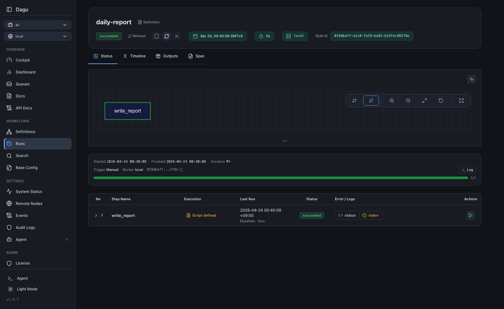
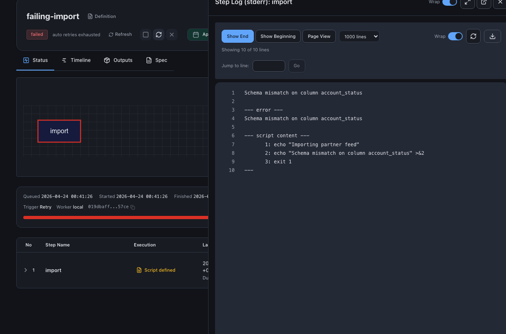
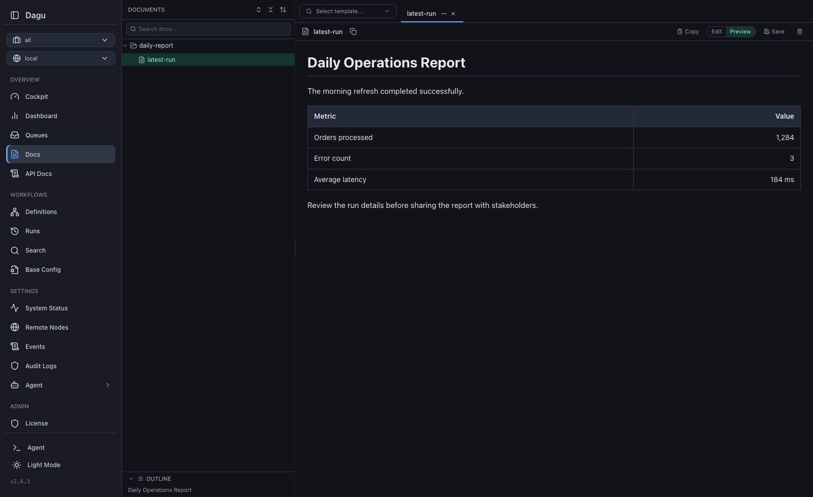
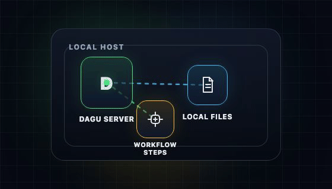
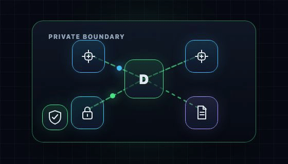
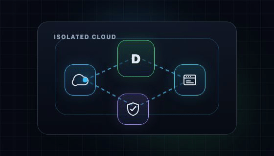
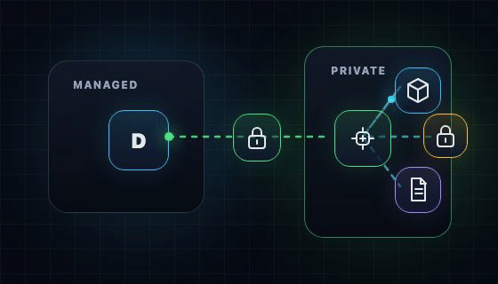
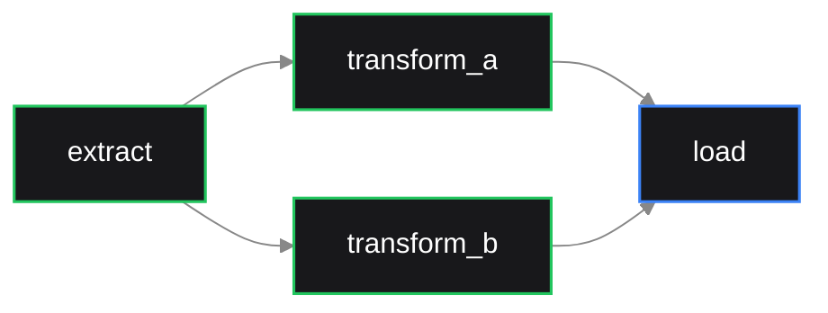
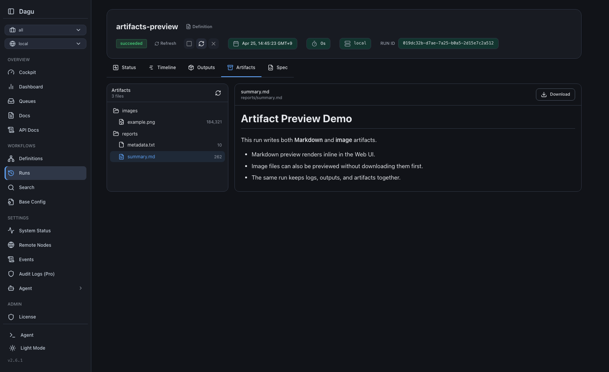

<div align="center">
  
  <p>
    <a href="https://docs.dagu.sh/overview/changelog"></a>
    <a href="https://github.com/dagucloud/dagu/actions/workflows/ci.yaml"></a>
    <a href="https://discord.gg/gpahPUjGRk"></a>
    <a href="https://bsky.app/profile/dagu-org.bsky.social"></a>
  </p>

  <p>
    <a href="https://docs.dagu.sh">Docs</a> |
    <a href="https://docs.dagu.sh/writing-workflows/examples">Examples</a> |
    <a href="https://discord.gg/gpahPUjGRk">Support & Community</a>
  </p>
</div>

## Self-Hosted Control Plane for Existing Ops Automation

Dagu gives teams one place to run, schedule, review, and debug existing ops automation without standing up a database, message broker, or language-specific SDK stack.

Dagu workflows are defined in YAML and can run shell commands, scripts, containers, HTTP requests, SQL queries, SSH commands, sub-workflows, and AI agent steps. It runs as a single binary, stores state in local files by default, and adds scheduling, dependencies, retries, queues, logs, documents, a Web UI, and optional distributed workers around existing ops automation.

For a quick look at how workflows are defined, see the [examples](https://docs.dagu.sh/writing-workflows/examples).

<div align="center">
  
</div>

| Run Details | Step Logs | Documents |
|---|---|---|
|  |  |  |

**Try it live:** [Live Demo](https://dagu-demo-f5e33d0e.dagu.sh) (credentials: `demouser` / `demouser`)

## Production Operation Notes

Dagu stores state in local files by default. How much it can run depends on the machine and the workload. CPU, disk speed, workflow duration, queue settings, and worker capacity all matter.

- **Throughput:** On one machine, Dagu can run thousands of workflow runs per day when the hardware and workflow shape fit the workload.
- **Load control:** Use [queues](https://docs.dagu.sh/server-admin/queues), concurrency limits, and optional [distributed workers](https://docs.dagu.sh/server-admin/distributed/) to decide how many runs execute at once and where they run.
- **Scheduling and recovery:** Use [cron schedules and catchup](https://docs.dagu.sh/writing-workflows/scheduling), [durable automatic retries](https://docs.dagu.sh/writing-workflows/durable-execution), reruns, timeouts, [event handler scripts](https://docs.dagu.sh/writing-workflows/lifecycle-handlers), and [email notifications](https://docs.dagu.sh/writing-workflows/email-notifications) to keep scheduled jobs recoverable.
- **Team operation:** Use [user management and RBAC](https://docs.dagu.sh/server-admin/authentication/builtin), [workspaces](https://docs.dagu.sh/web-ui/workspaces), approvals, secrets, the [REST API](https://docs.dagu.sh/web-ui/api), CLI, and webhooks when multiple people or systems operate workflows.

## Real-World Use Cases

Dagu is useful when teams need to consolidate scripts, cron jobs, server tasks, containers, data jobs, and approval-gated operational work into one visible, governed workflow system without rewriting the underlying automation.

**Cron and legacy script management.** Run existing shell scripts, Python scripts, HTTP calls, and scheduled jobs without rewriting them. Dagu turns hidden cron jobs into visible workflows with dependencies, run status, logs, retries, approvals, and history in one place.

**ETL and data operations.** Run PostgreSQL or SQLite queries, S3 transfers, `jq` transforms, validation steps, and reusable sub-workflows. Daily data workflows stay declarative, observable, and easy to retry when one step fails.

**Media conversion.** Run `ffmpeg`, thumbnail extraction, audio normalization, image processing, and other compute-heavy jobs. Conversion work can run across distributed workers while status, history, logs, and artifacts stay in one persistence layer for monitoring, debugging, and retries.

**Infrastructure and server automation.** Coordinate SSH backups, cleanup jobs, deploy scripts, patch windows, precondition checks, lifecycle hooks, and manual approvals. Remote operations get schedules, retries, notifications, and per-step logs without requiring operators to SSH into servers for every recovery.

**Container and Kubernetes workflows.** Compose workflows where each step can run a Docker image, Kubernetes Job, shell command, or validation step. Image-based tasks can be routed to the right workers without building a custom control plane around containers.

**Customer support automation.** Run diagnostics, account repair jobs, data checks, and approval-gated support actions from a simple Web UI. Non-engineers can run reviewed workflows while engineers keep commands, logs, and results traceable.

**IoT and edge workflows.** Run sensor polling, local cleanup, offline sync, health checks, and device maintenance jobs on small devices. The single binary and file-backed state work well on edge devices while still providing visibility through the Web UI.

**AI agent workflows.** Run AI coding agents and agent CLIs as workflow steps, or use the built-in agent to write, update, debug, and repair workflows. Because the contract is commands plus plain YAML, agent-generated work stays scheduled, reviewable, observable, and retryable in the same system humans operate.

## Why Dagu?

```sh
  Traditional Orchestrator           Dagu
  ┌────────────────────────┐        ┌──────────────────┐
  │  Web Server            │        │                  │
  │  Scheduler             │        │  dagu start-all  │
  │  Worker(s)             │        │                  │
  │  PostgreSQL            │        └──────────────────┘
  │  Redis / RabbitMQ      │         Single binary.
  │  Python runtime        │         Self-hosted by default.
  └────────────────────────┘         Adds scheduling, retries, and approvals around existing automation.
    6+ services to manage
```

## Deployment Models

Dagu can run on one machine, as a self-hosted production service, as a full managed Dagu Cloud server, or as a hybrid deployment with private workers inside your infrastructure.

Need the full breakdown, tradeoffs, and architecture notes? See the [Deployment Models guide](https://docs.dagu.sh/overview/deployment-models).

<table>
  <tr>
    <td width="50%" align="center" valign="top">
      <strong>Local Single-Server</strong><br>
      
    </td>
    <td width="50%" align="center" valign="top">
      <strong>Self-Hosted</strong><br>
      
    </td>
  </tr>
  <tr>
    <td width="50%" align="center" valign="top">
      <strong>Dagu Cloud</strong><br>
      
    </td>
    <td width="50%" align="center" valign="top">
      <strong>Hybrid</strong><br>
      
    </td>
  </tr>
</table>

| Model | Server | Execution | Best for |
|------|--------|-----------|----------|
| **Local single-server** | `dagu start-all` on one machine. | Same machine. | Development, small scheduled workloads, edge jobs, and simple internal automation. |
| **Self-hosted** | Dagu server on your infrastructure. | Local execution or distributed workers on your infrastructure. | Teams that need ownership of networking, secrets, storage, runtime, and upgrade timing. |
| **Dagu Cloud** | Full managed Dagu server in a dedicated, isolated gVisor instance on GKE. | Managed instance. | Teams that want Dagu operated for them without running the server themselves. |
| **Hybrid** | Full managed Dagu Cloud server. | Private workers in your infrastructure over mTLS. | Docker steps, private networks, custom runtimes, secrets-heavy jobs, and data-local work. |

### Licensing and Cloud

- **Community self-host:** GPLv3. No license key required. You operate the server, storage, upgrades, networking, and workers. Start with the [installation guide](https://docs.dagu.sh/getting-started/installation/).
- **Self-host license:** Adds SSO, RBAC, and audit logging to self-hosted Dagu. Licenses apply to Dagu servers, not workers, so execution can scale across your own infrastructure. See [self-host licensing](https://dagu.sh/pricing#self-host).
- **Dagu Cloud managed instance:** Includes its own managed license. It can run workflows directly as a full Dagu server, and private workers can also run on your infrastructure using a worker mTLS bundle. See [Dagu Cloud](https://dagu.sh/cloud).

Managed Dagu Cloud instances do not expose a Docker daemon or Docker socket. Workflows that need Docker step execution should use self-hosted Dagu or a private worker with Docker access.

## Architecture

Dagu can run in three configurations:

**Standalone:** A single `dagu start-all` process runs the HTTP server, scheduler, and executor. Suitable for single-machine deployments.

**Coordinator/Worker:** The scheduler enqueues jobs to a local file-based queue, then dispatches them to a coordinator over gRPC. Workers long-poll the coordinator for tasks, execute DAGs locally, and report status back. Workers can run on separate machines and are routed tasks based on labels.

**Headless:** Run without the web UI (`DAGU_HEADLESS=true`). Useful for CI/CD environments or when Dagu is managed through the CLI or API only.

```sh
Standalone:

  ┌─────────────────────────────────────────┐
  │  dagu start-all                         │
  │  ┌───────────┐ ┌───────────┐ ┌────────┐ │
  │  │ HTTP / UI │ │ Scheduler │ │Executor│ │
  │  └───────────┘ └───────────┘ └────────┘ │
  │  File-based storage (logs, state, queue)│
  └─────────────────────────────────────────┘

Distributed:

  ┌────────────┐                   ┌────────────┐
  │ Scheduler  │                   │ HTTP / UI  │
  │            │                   │            │
  │ ┌────────┐ │                   └─────┬──────┘
  │ │ Queue  │ │  Dispatch (gRPC)        │ Dispatch / GetWorkers
  │ │(file)  │ │─────────┐               │ (gRPC)
  │ └────────┘ │         │               │
  └────────────┘         ▼               ▼
                    ┌─────────────────────────┐
                    │      Coordinator        │
                    │  ┌───────────────────┐  │
                    │  │ Dispatch Task     │  │
                    │  │ Store (pending/   │  │
                    │  │ claimed)          │  │
                    │  └───────────────────┘  │
                    └────────▲────────────────┘
                             │
                   Worker poll / task response
                   Heartbeat / ReportStatus /
                   StreamLogs (gRPC)
                             │
               ┌─────────────┴─────────────┐
               │             │             │
          ┌────┴───┐    ┌────┴───┐    ┌────┴───┐
          │Worker 1│    │Worker 2│    │Worker N│ Sandbox execution of DAGs
          │        │    │        │    │        │
          └────────┘    └────────┘    └────────┘
```

## Quick Start

### Install

**macOS/Linux:**

```sh
curl -fsSL https://raw.githubusercontent.com/dagucloud/dagu/main/scripts/installer.sh | bash
```

**Homebrew:**

```sh
brew install dagu
```

**Windows (PowerShell):**

```powershell
irm https://raw.githubusercontent.com/dagucloud/dagu/main/scripts/installer.ps1 | iex
```

**Docker:**

```sh
docker run --rm -v ~/.dagu:/var/lib/dagu -p 8080:8080 ghcr.io/dagucloud/dagu:latest dagu start-all
```

**Kubernetes (Helm):**

```sh
helm repo add dagu https://dagucloud.github.io/dagu
helm repo update
helm install dagu dagu/dagu --set persistence.storageClass=<your-rwx-storage-class>
```

> Replace `<your-rwx-storage-class>` with a StorageClass that supports `ReadWriteMany`. See [charts/dagu/README.md](./charts/dagu/README.md) for chart configuration.

The script installers run a guided wizard that can add Dagu to your PATH, set it up as a background service, and create the initial admin account. Homebrew, npm, Docker, and Helm install without the wizard. See [Installation docs](https://docs.dagu.sh/getting-started/installation) for all options.

### Create and run a workflow

```sh
cat > ./hello.yaml << 'EOF'
steps:
  - echo "Hello from Dagu!"
  - echo "Running step 2"
EOF

dagu start hello.yaml
```

### Start the server

```sh
dagu start-all
```

Visit http://localhost:8080

## Embedded Go API (Experimental)

Go applications can import Dagu and start DAG runs from the host process:

```go
import "github.com/dagucloud/dagu"
```

```go
engine, err := dagu.New(ctx, dagu.Options{
	HomeDir: "/var/lib/myapp/dagu",
})
if err != nil {
	return err
}
defer engine.Close(context.Background())

run, err := engine.RunYAML(ctx, []byte(`
name: embedded
params:
  - MESSAGE
steps:
  - name: hello
    command: echo "${MESSAGE}"
`), dagu.WithParams(map[string]string{
	"MESSAGE": "hello from the host app",
}))
if err != nil {
	return err
}

status, err := run.Wait(ctx)
if err != nil {
	return err
}
fmt.Println(status.Status)
```

The embedded API is experimental and may change before it is declared stable. It uses Dagu's YAML loader, built-in executors, and file-backed state. `RunFile` and `RunYAML` start runs asynchronously and return a run handle for `Wait`, `Status`, and `Stop`. Distributed embedded runs require an existing Dagu coordinator; embedded workers can be started with `NewWorker`.

See the [embedded API documentation](https://docs.dagu.sh/embedding/go-api) and [examples/embedded](./examples/embedded).

## Workflow Examples

### Sequential execution

```yaml
type: chain
steps:
  - command: echo "Step 1"
  - command: echo "Step 2"
```

### Parallel execution with dependencies

```yaml
type: graph
steps:
  - id: extract
    command: ./extract.sh
  - id: transform_a
    command: ./transform_a.sh
    depends: [extract]
  - id: transform_b
    command: ./transform_b.sh
    depends: [extract]
  - id: load
    command: ./load.sh
    depends: [transform_a, transform_b]
```


```mermaid
%%{init: {'theme': 'base', 'themeVariables': {'background': '#18181B', 'primaryTextColor': '#fff', 'lineColor': '#888'}}}%%
graph LR
    A[extract] --> B[transform_a]
    A --> C[transform_b]
    B --> D[load]
    C --> D
    style A fill:#18181B,stroke:#22C55E,stroke-width:1.6px,color:#fff
    style B fill:#18181B,stroke:#22C55E,stroke-width:1.6px,color:#fff
    style C fill:#18181B,stroke:#22C55E,stroke-width:1.6px,color:#fff
    style D fill:#18181B,stroke:#3B82F6,stroke-width:1.6px,color:#fff
```

### Docker step

```yaml
steps:
  - name: build
    container:
      image: node:20-alpine
    command: npm run build
```

### Kubernetes Pod execution

```yaml
steps:
  - name: batch-job
    type: kubernetes
    with:
      namespace: production
      image: my-registry/batch-processor:latest
      resources:
        requests:
          cpu: "2"
          memory: "4Gi"
    command: ./process.sh
```

### SSH remote execution

```yaml
steps:
  - name: deploy
    type: ssh
    with:
      host: prod-server.example.com
      user: deploy
      key: ~/.ssh/id_rsa
    command: cd /var/www && git pull && systemctl restart app
```

### Sub-DAG composition

```yaml
steps:
  - name: extract
    call: etl/extract
    params: "SOURCE=s3://bucket/data.csv"
  - name: transform
    call: etl/transform
    params: "INPUT=${extract.outputs.result}"
    depends: [extract]
  - name: load
    call: etl/load
    params: "DATA=${transform.outputs.result}"
    depends: [transform]
```

### Retry and error handling

```yaml
steps:
  - name: flaky-api-call
    command: curl -f https://api.example.com/data
    retryPolicy:
      limit: 3
      intervalSec: 10
    continueOn:
      failure: true
```

### Scheduling with overlap control

```yaml
schedule:
  - "0 */6 * * *"              # Every 6 hours
overlapPolicy: skip             # Skip if previous run is still active
timeoutSec: 3600
handlerOn:
  failure:
    command: notify-team.sh
  exit:
    command: cleanup.sh
```

For more examples, see the [Examples documentation](https://docs.dagu.sh/writing-workflows/examples).

## Built-in and Custom Step Types

Dagu includes built-in step types that run within the Dagu process (or worker).

| Step type | Purpose |
|----------|---------|
| [`shell` / `command`](https://docs.dagu.sh/step-types/shell) | Shell commands and scripts (bash, sh, PowerShell, custom shells) |
| [`docker`](https://docs.dagu.sh/step-types/docker) | Run containers with registry auth, volume mounts, and resource limits |
| [`kubernetes` / `k8s`](https://docs.dagu.sh/step-types/kubernetes) | Execute Kubernetes Jobs with namespace, image, and resource settings |
| [`ssh`](https://docs.dagu.sh/step-types/ssh) | Remote command execution over SSH |
| [`sftp`](https://docs.dagu.sh/step-types/sftp) | File transfer over SFTP |
| [`http`](https://docs.dagu.sh/step-types/http) | HTTP requests with headers, auth, and request bodies |
| [`postgres`](https://docs.dagu.sh/step-types/sql/postgresql) / [`sqlite`](https://docs.dagu.sh/step-types/sql/sqlite) | SQL queries, imports, and exports for PostgreSQL and SQLite |
| [`redis`](https://docs.dagu.sh/step-types/redis) | Redis commands, pipelines, and Lua scripts |
| [`s3`](https://docs.dagu.sh/step-types/s3) | Upload, download, list, and delete S3 objects |
| [`jq`](https://docs.dagu.sh/step-types/jq) | JSON transformation using jq expressions |
| [`archive`](https://docs.dagu.sh/step-types/archive) | Create and extract zip/tar archives |
| [`mail`](https://docs.dagu.sh/step-types/mail) | Send email via SMTP |
| [`template`](https://docs.dagu.sh/step-types/template) | Text generation with template rendering |
| [`router`](https://docs.dagu.sh/step-types/router) | Conditional step routing based on values and patterns |
| [`dag` / `subworkflow` / `call:`](https://docs.dagu.sh/writing-workflows/control-flow) | Invoke another DAG as a sub-workflow with params and dependencies |
| [`harness`](https://docs.dagu.sh/step-types/harness) | Run coding agent CLIs such as Claude Code, Codex, Copilot, OpenCode, and Pi |
| [`chat`](https://docs.dagu.sh/features/chat/basics) | Single-shot LLM calls inside workflows |
| [`agent`](https://docs.dagu.sh/features/agent/step) | Multi-step LLM agent execution with tool calling |

You can also define your own reusable step types with the top-level `step_types` field. Custom step types expand to built-in step types during DAG load, so you can wrap a common shell, HTTP, SQL, or other step pattern behind a typed interface with validated input.

```yaml
step_types:
  webhook:
    type: http
    input_schema:
      type: object
      additionalProperties: false
      required: [url, text]
      properties:
        url:
          type: string
        text:
          type: string
    template:
      command: POST {{ .input.url }}
      with:
        headers:
          Content-Type: application/json
        body: |
          {"text": {{ json .input.text }}}

steps:
  - type: webhook
    with:
      url: https://hooks.example.com/ops
      text: deploy complete
```

See [Custom Step Types](https://docs.dagu.sh/writing-workflows/custom-step-types) for the feature guide and [YAML Specification](https://docs.dagu.sh/writing-workflows/yaml-specification) for the exact `step_types` and `type` field behavior.

## Security and Access Control

### Authentication

Dagu supports four authentication modes, configured via `DAGU_AUTH_MODE`:

- **`none`** — No authentication
- **`basic`** — HTTP Basic authentication
- **`builtin`** — JWT-based authentication with user management, API keys, and per-DAG webhook tokens
- **OIDC** — OpenID Connect integration with any compliant identity provider

### Role-Based Access Control

When using `builtin` auth, five roles control access:

| Role | Capabilities |
|------|-------------|
| `admin` | Full access including user management |
| `manager` | Create, edit, delete, run, stop DAGs; view audit logs |
| `developer` | Create, edit, delete, run, stop DAGs |
| `operator` | Run and stop DAGs only (no editing) |
| `viewer` | Read-only access |

API keys can be created with independent role assignments. Audit logging tracks all actions.

### TLS and Secrets

- TLS for the HTTP server (`DAGU_CERT_FILE`, `DAGU_KEY_FILE`)
- Mutual TLS for gRPC coordinator/worker communication (`DAGU_PEER_CERT_FILE`, `DAGU_PEER_KEY_FILE`, `DAGU_PEER_CLIENT_CA_FILE`)
- Secret management with three providers: environment variables, files, and [HashiCorp Vault](https://www.vaultproject.io/)

## Observability

### Prometheus Metrics

Dagu exposes Prometheus-compatible metrics:

- `dagu_info` — Build information (version, Go version)
- `dagu_uptime_seconds` — Server uptime
- `dagu_dag_runs_total` — Total DAG runs by status
- `dagu_dag_runs_total_by_dag` — Per-DAG run counts
- `dagu_dag_run_duration_seconds` — Histogram of run durations
- `dagu_dag_runs_currently_running` — Active DAG runs
- `dagu_dag_runs_queued_total` — Queued runs

### Structured Logging

JSON or text format logging (`DAGU_LOG_FORMAT`). Logs are stored per-run with separate stdout/stderr capture per step.

### Notifications

- Slack and Telegram bot integration for run monitoring and status updates
- Email notifications on DAG success, failure, or wait status via SMTP
- Per-DAG webhook endpoints with token authentication

## Artifacts



Dagu runs can write arbitrary files into `DAG_RUN_ARTIFACTS_DIR`, and Dagu stores them per run as [Artifacts](https://docs.dagu.sh/writing-workflows/artifacts). In the [Web UI](https://docs.dagu.sh/overview/web-ui), operators can browse the file tree, preview Markdown, text, and image files inline, and download any artifact when they need the raw file.

This is useful for generated reports, screenshots, charts, exported JSON or CSV files, and other outputs that do not fit simple key/value [outputs](https://docs.dagu.sh/writing-workflows/outputs).

See the [Artifacts documentation](https://docs.dagu.sh/writing-workflows/artifacts) and the [Web UI guide](https://docs.dagu.sh/overview/web-ui) for the full artifact browser workflow and screenshots.

## Scheduling and Reliability

- **Cron scheduling** with timezone support and multiple schedule entries per DAG
- **Overlap policies**: `skip` (default — skip if previous run is still active), `all` (queue all), `latest` (keep only the most recent)
- **Catch-up scheduling**: Automatically runs missed intervals when the scheduler was down
- **Zombie detection**: Identifies and handles stalled DAG runs (configurable interval, default 45s)
- **Retry policies**: Per-step retry with configurable limits, intervals, and exit code filtering
- **Lifecycle hooks**: `onInit`, `onSuccess`, `onFailure`, `onAbort`, `onExit`, `onWait`
- **Preconditions**: Gate DAG or step execution on shell command results
- **High availability**: Scheduler lock with stale detection for failover

## Distributed Execution

The coordinator/worker architecture distributes DAG execution across multiple machines:

- **Coordinator**: gRPC server that manages task distribution, worker registry, and health monitoring
- **Workers**: Connect to the coordinator, pull tasks from the queue, execute DAGs locally, report results
- **Worker labels**: Route DAGs to specific workers based on labels (e.g., `gpu=true`, `region=us-east-1`)
- **Health checks**: HTTP health endpoints on coordinator and workers for load balancer integration
- **Queue system**: File-based persistent queue with configurable concurrency limits

```sh
# Start coordinator
dagu coord

# Start workers (on separate machines)
DAGU_WORKER_LABELS=gpu=true,memory=64G dagu worker
```

See the [distributed execution documentation](https://docs.dagu.sh/server-admin/distributed/) for setup details.

## CLI Reference

| Command | Description |
|---------|-------------|
| `dagu start <dag>` | Execute a DAG |
| `dagu start-all` | Start HTTP server + scheduler |
| `dagu server` | Start HTTP server only |
| `dagu scheduler` | Start scheduler only |
| `dagu coord` | Start coordinator (distributed mode) |
| `dagu worker` | Start worker (distributed mode) |
| `dagu stop <dag>` | Stop a running DAG |
| `dagu restart <dag>` | Restart a DAG |
| `dagu retry <dag> <run-id>` | Retry a failed run |
| `dagu dry <dag>` | Dry run — show what would execute |
| `dagu status <dag>` | Show DAG run status |
| `dagu history <dag>` | Show execution history |
| `dagu validate <dag>` | Validate DAG YAML |
| `dagu enqueue <dag>` | Add DAG to the execution queue |
| `dagu dequeue <dag>` | Remove DAG from the queue |
| `dagu cleanup` | Clean up old run data |
| `dagu migrate` | Run database migrations |
| `dagu version` | Show version |

## Environment Variables

**Precedence:** Command-line flags > Environment variables > Configuration file (`~/.config/dagu/config.yaml`)

### Server

| Variable | Default | Description |
|----------|---------|-------------|
| `DAGU_HOST` | `127.0.0.1` | Bind address |
| `DAGU_PORT` | `8080` | HTTP port |
| `DAGU_BASE_PATH` | — | Base path for reverse proxy |
| `DAGU_HEADLESS` | `false` | Run without web UI |
| `DAGU_TZ` | — | Timezone (e.g., `Asia/Tokyo`) |
| `DAGU_LOG_FORMAT` | `text` | `text` or `json` |
| `DAGU_CERT_FILE` | — | TLS certificate |
| `DAGU_KEY_FILE` | — | TLS private key |

### Paths

| Variable | Default | Description |
|----------|---------|-------------|
| `DAGU_HOME` | — | Overrides all path defaults |
| `DAGU_DAGS_DIR` | `~/.config/dagu/dags` | DAG definitions directory |
| `DAGU_LOG_DIR` | `~/.local/share/dagu/logs` | Log files |
| `DAGU_DATA_DIR` | `~/.local/share/dagu/data` | Application state |

### Authentication

| Variable | Default | Description |
|----------|---------|-------------|
| `DAGU_AUTH_MODE` | `builtin` | `none`, `basic`, `builtin`, or OIDC |
| `DAGU_AUTH_BASIC_USERNAME` | — | Basic auth username |
| `DAGU_AUTH_BASIC_PASSWORD` | — | Basic auth password |
| `DAGU_AUTH_TOKEN_SECRET` | (auto) | JWT signing secret |
| `DAGU_AUTH_TOKEN_TTL` | `24h` | JWT token lifetime |

OIDC variables: `DAGU_AUTH_OIDC_CLIENT_ID`, `DAGU_AUTH_OIDC_CLIENT_SECRET`, `DAGU_AUTH_OIDC_ISSUER`, `DAGU_AUTH_OIDC_SCOPES`, `DAGU_AUTH_OIDC_WHITELIST`, `DAGU_AUTH_OIDC_AUTO_SIGNUP`, `DAGU_AUTH_OIDC_DEFAULT_ROLE`, `DAGU_AUTH_OIDC_ALLOWED_DOMAINS`.

### Scheduler

| Variable | Default | Description |
|----------|---------|-------------|
| `DAGU_SCHEDULER_PORT` | `8090` | Health check port |
| `DAGU_SCHEDULER_ZOMBIE_DETECTION_INTERVAL` | `45s` | Zombie run detection interval (`0` to disable) |
| `DAGU_SCHEDULER_LOCK_STALE_THRESHOLD` | `30s` | HA lock stale threshold |
| `DAGU_QUEUE_ENABLED` | `true` | Enable queue system |

### Coordinator / Worker

| Variable | Default | Description |
|----------|---------|-------------|
| `DAGU_COORDINATOR_HOST` | `127.0.0.1` | Coordinator bind address |
| `DAGU_COORDINATOR_PORT` | `50055` | Coordinator gRPC port |
| `DAGU_COORDINATOR_HEALTH_PORT` | `8091` | Coordinator health check port |
| `DAGU_WORKER_ID` | — | Worker instance ID |
| `DAGU_WORKER_MAX_ACTIVE_RUNS` | `100` | Max concurrent runs per worker |
| `DAGU_WORKER_HEALTH_PORT` | `8092` | Worker health check port |
| `DAGU_WORKER_LABELS` | — | Worker labels (`key=value,key=value`) |

### Peer TLS (gRPC)

| Variable | Default | Description |
|----------|---------|-------------|
| `DAGU_PEER_CERT_FILE` | — | Peer TLS certificate |
| `DAGU_PEER_KEY_FILE` | — | Peer TLS private key |
| `DAGU_PEER_CLIENT_CA_FILE` | — | CA for client verification |
| `DAGU_PEER_INSECURE` | `true` | Use h2c instead of TLS |

### Git Sync

| Variable | Default | Description |
|----------|---------|-------------|
| `DAGU_GITSYNC_ENABLED` | `false` | Enable Git sync |
| `DAGU_GITSYNC_REPOSITORY` | — | Repository URL |
| `DAGU_GITSYNC_BRANCH` | `main` | Branch to sync |
| `DAGU_GITSYNC_AUTH_TYPE` | `token` | `token` or `ssh` |
| `DAGU_GITSYNC_AUTOSYNC_ENABLED` | `false` | Enable periodic auto-pull |
| `DAGU_GITSYNC_AUTOSYNC_INTERVAL` | `300` | Sync interval in seconds |

Full configuration reference: [docs.dagu.sh/server-admin/reference](https://docs.dagu.sh/server-admin/reference)

## Documentation

- [Getting Started](https://docs.dagu.sh/getting-started/installation) — Installation and first workflow
- [Writing Workflows](https://docs.dagu.sh/writing-workflows/examples) — YAML syntax, scheduling, execution control
- [Step Types](https://docs.dagu.sh/step-types/shell) — [Shell](https://docs.dagu.sh/step-types/shell), [Docker](https://docs.dagu.sh/step-types/docker), [Kubernetes](https://docs.dagu.sh/step-types/kubernetes), [HTTP](https://docs.dagu.sh/step-types/http), [SQL](https://docs.dagu.sh/step-types/sql/), [Harness](https://docs.dagu.sh/step-types/harness), [Agent Step](https://docs.dagu.sh/features/agent/step), and [Custom Step Types](https://docs.dagu.sh/writing-workflows/custom-step-types)
- [Distributed Execution](https://docs.dagu.sh/server-admin/distributed/) — Coordinator/worker setup
- [Authentication](https://docs.dagu.sh/server-admin/authentication/) — RBAC, OIDC, API keys
- [Git Sync](https://docs.dagu.sh/server-admin/git-sync) — Version-controlled DAG definitions
- [AI Agent](https://docs.dagu.sh/features/agent/) — AI-assisted workflow authoring
- [Changelog](https://docs.dagu.sh/overview/changelog)

## Community

- [Discord](https://discord.gg/gpahPUjGRk) — Questions and discussion
- [GitHub Issues](https://github.com/dagucloud/dagu/issues) — Bug reports and feature requests
- [Bluesky](https://bsky.app/profile/dagu-org.bsky.social)

## Development

**Prerequisites:** [Go 1.26+](https://go.dev/doc/install), [Node.js](https://nodejs.org/en/download/), [pnpm](https://pnpm.io/installation)

```sh
git clone https://github.com/dagucloud/dagu.git && cd dagu
make build    # Build frontend + Go binary
make test     # Run tests with race detection
make lint     # Run golangci-lint
```

See [CONTRIBUTING.md](./CONTRIBUTING.md) for development workflow and code standards.

## Acknowledgements

<div align="center">
  <h3>Premium Sponsors</h3>
  <a href="https://github.com/slashbinlabs">
    
  </a>

  <h3>Supporters</h3>
  <p align="center">
    <a href="https://github.com/gyger">
      
    </a>
    <a href="https://github.com/disizmj">
      
    </a>
    <a href="https://github.com/Arvintian">
      
    </a>
    <a href="https://github.com/yurivish">
      
    </a>
    <a href="https://github.com/jayjoshi64">
      
    </a>
    <a href="https://github.com/alangrafu">
      
    </a>
  </p>

  <br/><br/>

  <a href="https://github.com/sponsors/dagucloud">
    
  </a>
</div>

## Contributing

We welcome contributions of all kinds. See our [Contribution Guide](./CONTRIBUTING.md) for details.

<a href="https://github.com/dagucloud/dagu/graphs/contributors">
  
</a>

## License

GNU GPLv3 - See [LICENSE](./LICENSE). See [LICENSING.md](./LICENSING.md) for embedded API and commercial embedding notes.
