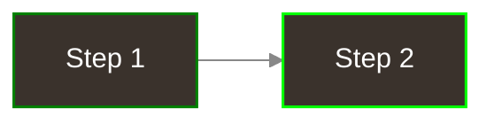
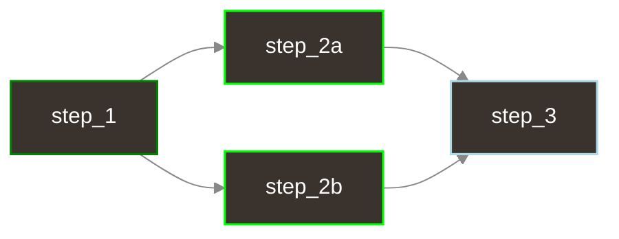

<div align="center">
  
  <br/>

  <p>
    <a href="https://docs.dagu.cloud/reference/changelog"></a>
    <a href="https://github.com/dagu-org/dagu/actions/workflows/ci.yaml"></a>
    <a href="https://discord.gg/gpahPUjGRk"></a>
    <a href="https://bsky.app/profile/dagu-org.bsky.social"></a>
  </p>
  
  <p>
    <a href="https://docs.dagu.cloud/writing-workflows/examples">Examples</a> |
    <a href="https://docs.dagu.cloud/overview/api">API Reference</a> |
    <a href="https://docs.dagu.cloud/configurations/server">Configuration</a> |
    <a href="https://discord.gg/gpahPUjGRk">Discord</a>
  </p>
</div>

## What is Dagu?

**Dagu is a self-contained, lightweight workflow engine for enterprise and small teams.** Define workflows in simple YAML, execute them anywhere with a single binary, compose complex pipelines from reusable sub-workflows, and distribute tasks across workers. All without requiring databases, message brokers, or code changes to your existing scripts.

Built for developers who want powerful workflow orchestration without the operational overhead. For a quick feel of how it works, take a look at the [examples](https://docs.dagu.cloud/writing-workflows/examples).

### Web UI Preview


### CLI Preview


### Try It Live
Explore Dagu without installing: [Live Demo](http://23.251.149.55:8525/) (credentials: `demouser` / `demouser`)

## Why Dagu?

Many workflow orchestrators already exist, and Apache Airflow is a well known example. In Airflow, DAGs are loaded from Python source files, so defining workflows typically means writing and maintaining Python code. In real deployments, Airflow commonly involves multiple running components (for example, scheduler, webserver, metadata database, and workers) and DAG files often need to be synchronized across them, which can increase operational complexity. 

Dagu is a self-contained workflow engine where workflows are defined in simple YAML and executed with a single binary. It is designed to run without requiring external databases or message brokers, using local files for definitions, logs, and metadata. Because it orchestrates commands rather than forcing you into a specific programming model, it is easy to integrate existing shell scripts and operational commands as they are. Our goal is to make Dagu an ideal workflow engine for small teams that want orchestration power with minimal setup and operational overhead.

## Highlights
 
- Single binary file installation
- Declarative YAML format for defining DAGs
- Web UI for visually managing, rerunning, and monitoring pipelines
- Use existing programs without any modification
- Self-contained, with no need for a DBMS

## Quick Start

### 1. Install dagu

**macOS/Linux**:

```bash
# Install to ~/.local/bin (default, no sudo required)
curl -L https://raw.githubusercontent.com/dagu-org/dagu/main/scripts/installer.sh | bash

# Install specific version
curl -L https://raw.githubusercontent.com/dagu-org/dagu/main/scripts/installer.sh | bash -s -- --version v1.17.0

# Install to custom directory
curl -L https://raw.githubusercontent.com/dagu-org/dagu/main/scripts/installer.sh | bash -s -- --install-dir /usr/local/bin

# Install to custom directory with custom working directory
curl -L https://raw.githubusercontent.com/dagu-org/dagu/main/scripts/installer.sh | bash -s -- --install-dir /usr/local/bin --working-dir /var/tmp
```

**Windows (PowerShell)**:

```powershell
# Install latest version to default location (%LOCALAPPDATA%\Programs\dagu)
irm https://raw.githubusercontent.com/dagu-org/dagu/main/scripts/installer.ps1 | iex

# Install specific version
& ([scriptblock]::Create((irm https://raw.githubusercontent.com/dagu-org/dagu/main/scripts/installer.ps1))) v1.24.0

# Install to custom directory
& ([scriptblock]::Create((irm https://raw.githubusercontent.com/dagu-org/dagu/main/scripts/installer.ps1))) latest "C:\tools\dagu"
```

**Windows (CMD/PowerShell)**:

```cmd
REM Install latest version to default location (%LOCALAPPDATA%\Programs\dagu)
curl -fsSL https://raw.githubusercontent.com/dagu-org/dagu/main/scripts/installer.cmd -o installer.cmd && .\installer.cmd && del installer.cmd

REM Install specific version
curl -fsSL https://raw.githubusercontent.com/dagu-org/dagu/main/scripts/installer.cmd -o installer.cmd && .\installer.cmd v1.24.0 && del installer.cmd

REM Install to custom directory
curl -fsSL https://raw.githubusercontent.com/dagu-org/dagu/main/scripts/installer.cmd -o installer.cmd && .\installer.cmd latest "C:\tools\dagu" && del installer.cmd
```

**Docker**:

```bash
docker run --rm \
  -v ~/.dagu:/var/lib/dagu \
  -p 8080:8080 \
  ghcr.io/dagu-org/dagu:latest \
  dagu start-all
```

Note: see [documentation](https://docs.dagu.cloud/getting-started/installation) for other methods.

**Homebrew**:

```bash
brew update && brew install dagu

# Upgrade to latest version
brew update && brew upgrade dagu
```

**npm**:
```bash
# Install via npm
npm install -g --ignore-scripts=false @dagu-org/dagu
```

### 2. Create your first workflow

> **Note**: When you first start Dagu with an empty DAGs directory, it automatically creates example workflows to help you get started. To skip this, set `DAGU_SKIP_EXAMPLES=true`.

```bash
cat > ./hello.yaml << 'EOF'
steps:
  - echo "Hello from Dagu!"
  - echo "Running step 2"
EOF
```

### 3. Run the workflow

```bash
dagu start hello.yaml
```

### 4. Check the status and view logs

```bash
dagu status hello
```

### 5. Explore the Web UI

```bash
dagu start-all
```

Visit http://localhost:8080

## Quick Look for Workflow Definitions

### Sequential Steps

Steps execute one after another:

```yaml
type: chain
steps:
  - command: echo "Hello, dagu!"
  - command: echo "This is a second step"
```



### Parallel Steps

Steps with dependencies run in parallel:

```yaml
type: graph
steps:
  - id: step_1
    command: echo "Step 1"
  - id: step_2a
    command: echo "Step 2a - runs in parallel"
    depends: [step_1]
  - id: step_2b
    command: echo "Step 2b - runs in parallel"
    depends: [step_1]
  - id: step_3
    command: echo "Step 3 - waits for parallel steps"
    depends: [step_2a, step_2b]
```



For more examples, see the [Examples](https://docs.dagu.cloud/writing-workflows/examples) documentation.

## Docker-Compose

Clone the repository and run with Docker Compose:

```bash
git clone https://github.com/dagu-org/dagu.git
cd dagu
```

Run with minimal setup:

```bash
docker compose -f deploy/docker/compose.minimal.yaml up -d
# Visit http://localhost:8080
```

Stop containers:

```bash
docker compose -f deploy/docker/compose.minimal.yaml down
```

You can also use the production-like configuration `deploy/docker/compose.prod.yaml` with OpenTelemetry, Prometheus, and Grafana:

```bash
docker compose -f deploy/docker/compose.prod.yaml up -d
# Visit UI at http://localhost:8080
# Jaeger at http://localhost:16686, Prometheus at http://localhost:9090, Grafana at http://localhost:3000
```

Note: It's just for demonstration purposes. For production, please customize the configuration as needed.

For Kubernetes deployment, see the example manifests in `deploy/k8s/README.md`.

## Join our Developer Community

- Chat with us by joining our [Discord server](https://discord.gg/gpahPUjGRk)
- File bug reports and feature requests on our [GitHub Issues](https://github.com/dagu-org/dagu/issues)
- Follow us on [Bluesky](https://bsky.app/profile/dagu-org.bsky.social) for updates

For a detailed list of changes, bug fixes, and new features, please refer to the [Changelog](https://docs.dagu.cloud/reference/changelog).

## Documentation

Full documentation is available at [docs.dagu.cloud](https://docs.dagu.cloud/).

**Helpful Links**:

- [Feature by Examples](https://docs.dagu.cloud/writing-workflows/examples) - Explore useful features with examples
- [Remote Execution via SSH](https://docs.dagu.cloud/features/executors/ssh#ssh-executor) - Run commands on remote machines using SSH
- [Distributed Execution](https://docs.dagu.cloud/features/distributed-execution) - How to run workflows across multiple machines
- [Scheduling](https://docs.dagu.cloud/features/scheduling) - Learn about flexible scheduling options (start, stop, restart) with cron syntax
- [Authentication](https://docs.dagu.cloud/configurations/authentication) - Configure authentication for the Web UI
- [Configuration](https://docs.dagu.cloud/configurations/reference) - Detailed configuration options for customizing Dagu

## Environment Variables

**Note:** Configuration precedence: Command-line flags > Environment variables > Configuration file

### Frontend Server Configuration

| Environment Variable | Default | Description |
|---------------------|---------|-------------|
| `DAGU_HOST` | `127.0.0.1` | Web UI server host |
| `DAGU_PORT` | `8080` | Web UI server port |
| `DAGU_BASE_PATH` | - | Base path for reverse proxy setup |
| `DAGU_API_BASE_URL` | `/api/v1` | API endpoint base path |
| `DAGU_TZ` | - | Server timezone (e.g., `Asia/Tokyo`) |
| `DAGU_DEBUG` | `false` | Enable debug mode |
| `DAGU_LOG_FORMAT` | `text` | Log format (`text` or `json`) |
| `DAGU_HEADLESS` | `false` | Run without Web UI |
| `DAGU_LATEST_STATUS_TODAY` | `false` | Show only today's latest status |
| `DAGU_DEFAULT_SHELL` | - | Default shell for command execution |
| `DAGU_CERT_FILE` | - | TLS certificate file path |
| `DAGU_KEY_FILE` | - | TLS key file path |

### Path Configuration

| Environment Variable | Default | Description |
|---------------------|---------|-------------|
| `DAGU_HOME` | - | Base directory that overrides all path configurations |
| `DAGU_DAGS_DIR` | `~/.config/dagu/dags` | Directory for DAG definitions |
| `DAGU_LOG_DIR` | `~/.local/share/dagu/logs` | Directory for log files |
| `DAGU_DATA_DIR` | `~/.local/share/dagu/data` | Directory for application data |
| `DAGU_SUSPEND_FLAGS_DIR` | `~/.local/share/dagu/suspend` | Directory for suspend flags |
| `DAGU_ADMIN_LOG_DIR` | `~/.local/share/dagu/logs/admin` | Directory for admin logs |
| `DAGU_BASE_CONFIG` | `~/.config/dagu/base.yaml` | Path to base configuration file |
| `DAGU_EXECUTABLE` | - | Path to dagu executable |
| `DAGU_DAG_RUNS_DIR` | `{dataDir}/dag-runs` | Directory for DAG run data |
| `DAGU_PROC_DIR` | `{dataDir}/proc` | Directory for process data |
| `DAGU_QUEUE_DIR` | `{dataDir}/queue` | Directory for queue data |
| `DAGU_SERVICE_REGISTRY_DIR` | `{dataDir}/service-registry` | Directory for service registry |

### Authentication

| Environment Variable | Default | Description |
|---------------------|---------|-------------|
| `DAGU_AUTH_MODE` | `none` | Authentication mode: `none`, `builtin`, or `oidc` |
| `DAGU_AUTH_BASIC_USERNAME` | - | Basic auth username |
| `DAGU_AUTH_BASIC_PASSWORD` | - | Basic auth password |
| `DAGU_AUTH_OIDC_CLIENT_ID` | - | OIDC client ID |
| `DAGU_AUTH_OIDC_CLIENT_SECRET` | - | OIDC client secret |
| `DAGU_AUTH_OIDC_CLIENT_URL` | - | OIDC client URL |
| `DAGU_AUTH_OIDC_ISSUER` | - | OIDC issuer URL |
| `DAGU_AUTH_OIDC_SCOPES` | - | OIDC scopes (comma-separated) |
| `DAGU_AUTH_OIDC_WHITELIST` | - | OIDC email whitelist (comma-separated) |
| `DAGU_AUTH_OIDC_ENABLED` | `false` | Enable OIDC under builtin auth |
| `DAGU_AUTH_OIDC_AUTO_SIGNUP` | `false` | Auto-create users on first OIDC login |
| `DAGU_AUTH_OIDC_DEFAULT_ROLE` | `viewer` | Role for auto-created users |
| `DAGU_AUTH_OIDC_ALLOWED_DOMAINS` | - | Allowed email domains (comma-separated) |
| `DAGU_AUTH_OIDC_BUTTON_LABEL` | `Login with SSO` | SSO login button text |

### Builtin Authentication (RBAC)

When `DAGU_AUTH_MODE=builtin`, a file-based user management system with role-based access control is enabled. Roles: `admin`, `manager`, `operator`, `viewer`.

| Environment Variable | Default | Description |
|---------------------|---------|-------------|
| `DAGU_AUTH_ADMIN_USERNAME` | `admin` | Initial admin username |
| `DAGU_AUTH_ADMIN_PASSWORD` | (auto-generated) | Initial admin password |
| `DAGU_AUTH_TOKEN_SECRET` | - | JWT token secret for signing (required) |
| `DAGU_AUTH_TOKEN_TTL` | `24h` | JWT token time-to-live |
| `DAGU_USERS_DIR` | `{dataDir}/users` | Directory for user data files |

### UI Configuration

| Environment Variable | Default | Description |
|---------------------|---------|-------------|
| `DAGU_UI_NAVBAR_COLOR` | `#1976d2` | UI header color (hex or name) |
| `DAGU_UI_NAVBAR_TITLE` | `Dagu` | UI header title |
| `DAGU_UI_LOG_ENCODING_CHARSET` | `utf-8` | Log file encoding |
| `DAGU_UI_MAX_DASHBOARD_PAGE_LIMIT` | `100` | Maximum items on dashboard |
| `DAGU_UI_DAGS_SORT_FIELD` | `name` | Default DAGs sort field |
| `DAGU_UI_DAGS_SORT_ORDER` | `asc` | Default DAGs sort order |

### Features Configuration

| Environment Variable | Default | Description |
|---------------------|---------|-------------|
| `DAGU_TERMINAL_ENABLED` | `false` | Enable web-based terminal |
| `DAGU_AUDIT_ENABLED` | `true` | Enable audit logging for security events |

### Git Sync Configuration

Synchronize DAG definitions with a Git repository. See [Git Sync](https://docs.dagu.cloud/features/git-sync) for details.

| Environment Variable | Default | Description |
|---------------------|---------|-------------|
| `DAGU_GITSYNC_ENABLED` | `false` | Enable Git sync |
| `DAGU_GITSYNC_REPOSITORY` | - | Repository URL (e.g., `github.com/org/repo`) |
| `DAGU_GITSYNC_BRANCH` | `main` | Branch to sync |
| `DAGU_GITSYNC_PATH` | `""` | Subdirectory in repo for DAGs |
| `DAGU_GITSYNC_PUSH_ENABLED` | `true` | Enable push/publish operations |
| `DAGU_GITSYNC_AUTH_TYPE` | `token` | Auth type: `token` or `ssh` |
| `DAGU_GITSYNC_AUTH_TOKEN` | - | GitHub PAT for HTTPS auth |
| `DAGU_GITSYNC_AUTH_SSH_KEY_PATH` | - | SSH private key path |
| `DAGU_GITSYNC_AUTOSYNC_ENABLED` | `false` | Enable automatic periodic pull |
| `DAGU_GITSYNC_AUTOSYNC_INTERVAL` | `300` | Auto-sync interval in seconds |

### Scheduler Configuration

| Environment Variable | Default | Description |
|---------------------|---------|-------------|
| `DAGU_SCHEDULER_PORT` | `8090` | Health check server port |
| `DAGU_SCHEDULER_LOCK_STALE_THRESHOLD` | `30s` | Scheduler lock stale threshold |
| `DAGU_SCHEDULER_LOCK_RETRY_INTERVAL` | `5s` | Lock retry interval |
| `DAGU_SCHEDULER_ZOMBIE_DETECTION_INTERVAL` | `45s` | Zombie DAG detection interval (0 to disable) |
| `DAGU_QUEUE_ENABLED` | `true` | Enable queue system |

### Worker Configuration

This configuration is used for worker instances that execute DAGs. See the [Distributed Execution](https://docs.dagu.cloud/features/distributed-execution) documentation for more details.

| Environment Variable | Default | Description |
|---------------------|---------|-------------|
| `DAGU_COORDINATOR_HOST` | `127.0.0.1` | Coordinator gRPC server bind address |
| `DAGU_COORDINATOR_ADVERTISE` | (auto) | Address to advertise in service registry (default: hostname) |
| `DAGU_COORDINATOR_PORT` | `50055` | Coordinator gRPC server port |
| `DAGU_WORKER_ID` | - | Worker instance ID |
| `DAGU_WORKER_MAX_ACTIVE_RUNS` | `100` | Maximum concurrent runs per worker |
| `DAGU_WORKER_LABELS` | - | Worker labels (format: `key1=value1,key2=value2`, e.g., `gpu=true,memory=64G`) |
| `DAGU_SCHEDULER_PORT` | `8090` | Scheduler health check server port |
| `DAGU_SCHEDULER_LOCK_STALE_THRESHOLD` | `30s` | Time after which scheduler lock is considered stale |
| `DAGU_SCHEDULER_LOCK_RETRY_INTERVAL` | `5s` | Interval between lock acquisition attempts |

### Peer Configuration

This configuration is used for communication between coordinator services and other services (e.g., scheduler, worker, web UI). See the [Distributed Execution](https://docs.dagu.cloud/features/distributed-execution) documentation for more details.

| Environment Variable | Default | Description |
|---------------------|---------|-------------|
| `DAGU_PEER_CERT_FILE` | - | Peer TLS certificate file |
| `DAGU_PEER_KEY_FILE` | - | Peer TLS key file |
| `DAGU_PEER_CLIENT_CA_FILE` | - | Peer CA certificate file for client verification |
| `DAGU_PEER_SKIP_TLS_VERIFY` | `false` | Skip TLS certificate verification for peer connections |
| `DAGU_PEER_INSECURE` | `true` | Use insecure connection (h2c) instead of TLS |

## Development

### Building from Source

#### Prerequisites
- [Go 1.25+](https://go.dev/doc/install)
- [Node.js](https://nodejs.org/en/download/)
- [pnpm](https://pnpm.io/installation)

#### 1. Clone the repository and build server

```bash
git clone https://github.com/dagu-org/dagu.git && cd dagu
make
```

This will start the dagu server at http://localhost:8080.

#### 2. Run the frontend development server

```bash
cd ui
pnpm install
pnpm dev
```

Navigate to http://localhost:8081 to view the frontend.

### Running Tests

To ensure the integrity of the go code, you can run all Go unit and integration tests.

Run all tests from the project root directory:

```bash
make test
```

To run tests with code coverage analysis:

```bash
make make-coverage
```


## Features

This section outlines the current capabilities of Dagu.

| Category                    | Capability                      | Description                                                              | Link |
| --------------------------- | ------------------------------- | ------------------------------------------------------------------------ | ---- |
| Core Execution & Lifecycle  | Local execution                 | Run workflows locally with CLI / Web UI / API                           | <a href="https://docs.dagu.cloud/overview/cli">CLI</a>, <a href="https://docs.dagu.cloud/overview/web-ui">Web UI</a>, <a href="https://docs.dagu.cloud/overview/api">API</a> |
|                             | Queue based execution           | Dispatch DAG execution to workers with labels and priorities            | <a href="https://docs.dagu.cloud/features/queues">Queues</a> |
|                             | Immediate execution             | Disable queue for immediate execution                                    | <a href="https://docs.dagu.cloud/overview/cli">CLI</a> |
|                             | Idempotency                     | Prevent duplicate DAG execution with same DAG-run ID                |  <a href="https://docs.dagu.cloud/reference/cli#status">`start` command</a> |
|                             | Status management               | queued → running → succeeded/partially_succeeded/failed/aborted              | <a href="http://localhost:5173/getting-started/concepts#status-management">Status Management</a> |
|                             | Cancel propagation              | Cancel signals to sub-DAG                      | |
|                             | Cleanup hooks                   | Define cleanup processing with onExit handlers                           | <a href="https://docs.dagu.cloud/getting-started/concepts#lifecycle-handlers">Lifecycle Handlers</a> |
|                             | Status hooks                    | Define hooks on success / failure / cancel                         |  <a href="https://docs.dagu.cloud/getting-started/concepts#lifecycle-handlers">Lifecycle Handlers</a> |
| Definition & Templates      | Declarative YAML DSL            | Validation with JSON Schema, display error locations                     | <a href="https://docs.dagu.cloud/reference/yaml">YAML Specification</a> |
|                             | Environment variables           | Environment variables at DAG and step level, support dotenv      | <a href="https://docs.dagu.cloud/writing-workflows/data-variables#environment-variables">Environment Variables</a> |
|                             | Command substitution            | Use command output as value for variables or parameters                  | <a href="https://docs.dagu.cloud/reference/variables#command-substitution">Command Substitution</a> |
|                             | Shell support                   | Use shell features like pipes, redirects, globbing, etc. | <a href="https://docs.dagu.cloud/features/executors/shell">Shell Executor</a> |
|                             | Script support                  | Use scripts in Python, Bash, etc. as steps                                 | <a href="https://docs.dagu.cloud/writing-workflows/examples#scripts-code">Script Execution</a> |
|                             | Modular DAGs                   | Reusable DAGs with params                                            | <a href="https://docs.dagu.cloud/writing-workflows/#base-configuration">Base Configuration</a>, <a href="https://docs.dagu.cloud/features/execution-control#parallel-execution">Parallel Execution</a> |
|                             | Secrets management              | Reference-only secrets via KMS/Vault/OIDC                                | <a href="https://docs.dagu.io/writing-workflows/secrets">Secrets</a> |
| Control Structures          | Fan-out/Fan-in                  | Native parallel branches + join                                          | <a href="https://docs.dagu.cloud/writing-workflows/control-flow#parallel-execution">Parallel Execution</a> |
|                             | Iteration (loop)                | Iteration over list values                                               | <a href="https://docs.dagu.cloud/writing-workflows/control-flow#parallel-execution">Parallel Execution</a> |
|                             | Conditional routes              | Data/expression based routing                                            | <a href="https://docs.dagu.cloud/writing-workflows/control-flow#conditional-execution">Conditional Execution</a> |
|                             | Sub-DAG call                    | Reusable sub-DAG                                                        | <a href="https://docs.dagu.cloud/features/execution-control#parallel-execution">Parallel Execution</a> |
|                             | Worker & Dispatch               | Runs DAG on different nodes with selector conditions                     | <a href="https://docs.dagu.cloud/features/distributed-execution">Distributed Execution</a> |
|                             | Retry policies                  | Retry with backoff/interval                                              | <a href="https://docs.dagu.cloud/writing-workflows/error-handling#retry-policies">Retry Policies</a> |
|                             | Repeat Policies                 | Repeat step until condition is met                                       | <a href="https://docs.dagu.cloud/writing-workflows/control-flow#repetition">Repeat Policies</a> |
|                             | Timeout management              | DAG Execution Timeouts                                                   | <a href="https://docs.dagu.cloud/features/execution-control#workflow-timeout">Workflow Timeout</a> |
| Triggers & Scheduling       | Cron expression                 | Schedule to start / stop / restart                                       | <a href="https://docs.dagu.cloud/features/scheduling">Scheduling</a> |
|                             | Multiple schedules              | Multiple schedules per DAG                                              | <a href="https://docs.dagu.cloud/features/scheduling#multiple-schedules">Multiple Schedules</a> |
|                             | Timezone support                | Per-DAG timezone for cron schedules                                 | <a href="https://docs.dagu.cloud/features/scheduling#timezone-support">Timezone Support</a> |
|                             | Skip                            | Skip an execution when a previous manual run was successful                 | <a href="https://docs.dagu.cloud/features/scheduling#skip-redundant-runs">Skip Redundant Runs</a> |
|                             | Zombie detection                | Automatic detection for processes terminated unexpectedly                | <a href="https://docs.dagu.cloud/features/scheduling">Scheduling</a> |
|                             | Trigger via Web API             | Web API to start DAG executions                                               | <a href="https://docs.dagu.cloud/overview/api">Web API</a> |
| Container Native Execution  | Step-level container config     | Run steps in Docker containers with granular control                     | <a href="https://docs.dagu.cloud/features/executors/docker">Docker Executor</a> |
|                             | DAG level container config      | Run all steps in a container with shared volumes and env vars            | <a href="https://docs.dagu.cloud/features/executors/docker#container-field">Container Field</a> |
|                             | Authorized registry access      | Access private registries with credentials                                | <a href="https://docs.dagu.cloud/features/executors/docker#registry-authentication">Registry Auth</a> |
| Data & Artifacts            | Passing data between steps      | Passing ephemeral data between steps in a DAG                           | <a href="https://docs.dagu.cloud/features/data-flow">Data Flow</a> |
|                             | Secret redaction                | Auto-mask secrets in logs/events                                         | |
|                             | Automatic log cleanup           | Automatic log cleanup based on retention policies                        | <a href="https://docs.dagu.cloud/configurations/operations#log-cleanup">Log Retention</a> |
| Observability               | Logging with live streaming     | Structured JSON logs with live tail streaming                            | <a href="https://docs.dagu.cloud/overview/web-ui#log-viewer">Log Viewer</a> |
|                             | Metrics                         | Prometheus metrics                                                       | <a href="https://docs.dagu.cloud/configurations/reference#metrics">Metrics</a> |
|                             | OpenTelemetry                   | Distributed tracing with OpenTelemetry                                    | <a href="https://docs.dagu.cloud/features/opentelemetry">OpenTelemetry</a> |
|                             | DAG Visualization               | DAG / Gantt charts for critical path analysis                            | <a href="https://docs.dagu.cloud/overview/web-ui#dag-visualization">DAG Visualization</a> |
|                             | Email notification              | Email notification on success / failure with the log file attachment      | <a href="https://docs.dagu.cloud/features/email-notifications">Email Notifications</a> |
|                             | Health monitoring               | Health check for scheduler & failover                                   | <a href="https://docs.dagu.cloud/configurations/reference#health-check">Health Check</a> |
|                             | Nested-DAG visualization        | Nested DAG visualization with drill down functionality                  | <a href="https://docs.dagu.cloud/overview/web-ui#nested-dag-visualization">Nested DAG Visualization</a> |
| Security & Governance       | Secret injection                | Vault/KMS/OIDC ref-only; short-lived tokens                              | <a href="https://docs.dagu.cloud/writing-workflows/secrets">Secrets</a> |
|                             | Authentication                  | Basic auth / OIDC / Builtin (JWT) support for Web UI and API             | <a href="https://docs.dagu.cloud/configurations/authentication">Authentication</a> |
|                             | Role-based access control       | Builtin RBAC with admin, manager, operator, viewer roles                 | |
|                             | User management                 | Create, update, delete users with role assignment                        | |
|                             | Audit logging                   | Security event logging for authentication, user, and API key operations  | <a href="https://docs.dagu.cloud/configurations/server#audit-logging">Audit Logging</a> |
|                             | Git Sync                        | Sync DAG definitions with Git repository (pull/publish/conflict detection) | <a href="https://docs.dagu.cloud/features/git-sync">Git Sync</a> |
|                             | Web terminal                    | Web-based terminal for shell access (disabled by default)                | <a href="https://docs.dagu.cloud/configurations/server#terminal">Terminal</a> |
|                             | HA (High availability) mode     | Control-plane with failover for scheduler / Web UI / Coordinator         | <a href="https://docs.dagu.cloud/features/scheduling#high-availability">High Availability</a> |
| Executor types              | `jq`                            | JSON processing with jq queries                                          | <a href="https://docs.dagu.cloud/features/executors/jq">JQ Executor</a> |
|                             | `ssh`                           | Remote command execution via SSH                                         | <a href="https://docs.dagu.cloud/features/executors/ssh">SSH Executor</a> |
|                             | `docker`                        | Container-based task execution                                           | <a href="https://docs.dagu.cloud/features/executors/docker">Docker Executor</a> |
|                             | `http`                          | HTTP/REST API calls with retry                                           | <a href="https://docs.dagu.cloud/features/executors/http">HTTP Executor</a> |
|                             | `mail`                          | Send emails with template                                                | <a href="https://docs.dagu.cloud/features/executors/mail">Mail Executor</a> |
|                             | `archive`                       | Archive/unarchive operations (zip, tar, etc.)                            | <a href="https://docs.dagu.cloud/features/executors/archive">Archive Executor</a> |
| DevX & Testing              | Local development               | offline runs                                                       | <a href="https://docs.dagu.cloud/overview/cli">CLI Usage</a> |
|                             | Dry-run                         | DAG level Dry-run                                                        | <a href="https://docs.dagu.cloud/reference/cli#dry">`dry` command</a> |
| UI & Operations             | Run / retry / cancel operations | Start / enqueue / retry / stop                                                         | <a href="https://docs.dagu.cloud/overview/web-ui#dag-operations">DAG Operations</a> |
|                             | Automatic parameter forms       | Auto-generate parameter forms for DAGs                             | <a href="https://docs.dagu.cloud/overview/web-ui">Web UI</a> |
|                             | DAG definition search           | Filter by tag / name                                                     | <a href="https://docs.dagu.cloud/overview/web-ui#search">DAG Search</a> |
|                             | Execution history search        | Filter by status / date-range / name                                     | <a href="https://docs.dagu.cloud/overview/web-ui#history">History Search</a> |
|                             | Step-level operations           | Rerun, resume from step                                             | <a href="https://docs.dagu.cloud/overview/web-ui">Web UI</a> |
|                             | Parameter override              | Override parameters for a DAG run                                 | |
|                             | Scheduled DAG management        | Enable/disable schedule for a DAG                                   | <a href="https://docs.dagu.cloud/overview/web-ui">Web UI</a> |
|                             | UI organization                 | Logical DAG grouping                                               | <a href="https://docs.dagu.cloud/overview/web-ui#dag-organization">DAG Organization</a> |
| Others                      | Windows support                 | Windows support                                                     | |

## Discussion

For discussions, support, and sharing ideas, join our community on [Discord](https://discord.gg/gpahPUjGRk).

## Recent Updates

Changelog of recent updates can be found in the [Changelog](https://docs.dagu.cloud/reference/changelog) section of the documentation.

## Acknowledgements

### Sponsors & Supporters

<div align="center">
  <h3>💜 Premium Sponsors</h3>
  <a href="https://github.com/slashbinlabs">
    
  </a>

  <h3>✨ Supporters</h3>
  <a href="https://github.com/disizmj">
    
  </a>
  <a href="https://github.com/Arvintian">
    
  </a>
  <a href="https://github.com/yurivish">
    
  </a>
  <a href="https://github.com/jayjoshi64">
    
  </a>
  <a href="https://github.com/alangrafu">
    
  </a>

  <br/><br/>
  
  <a href="https://github.com/sponsors/dagu-org">
    
  </a>
</div>

## Contributing

We welcome contributions of all kinds! Whether you're a developer, a designer, or a user, your help is valued. Here are a few ways to get involved:

- Star the project on GitHub.
- Suggest new features by opening an issue.
- Join the discussion on our Discord server.
- Contribute code: Check out our issues you can help with.

For more details, see our [Contribution Guide](./CONTRIBUTING.md).

### Contributors

<a href="https://github.com/dagu-org/dagu/graphs/contributors">
  
</a>

Thanks to all the contributors who have helped make Dagu better! Your contributions, whether through code, documentation, or feedback, are invaluable to the project.

## License

GNU GPLv3 - See [LICENSE](./LICENSE)
