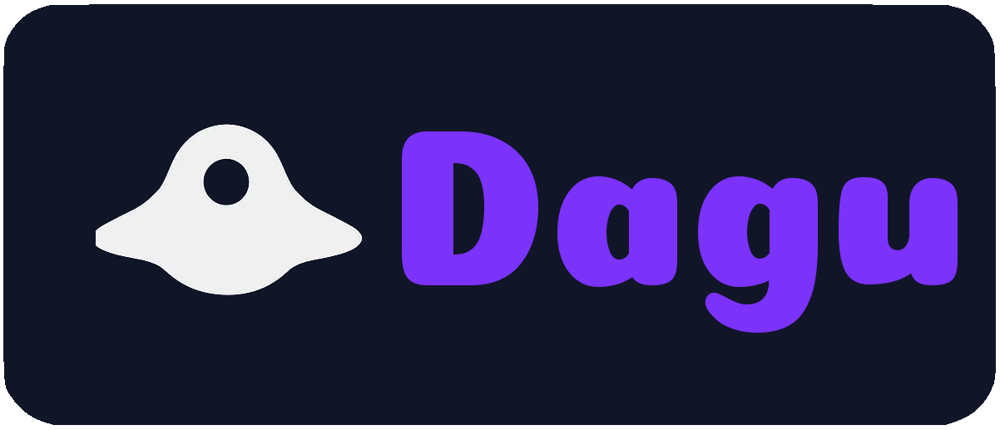

<div align="center">
  
  
  <h3>A lightweight and powerful workflow engine for enterprise & small teams</h3>
  <p>Deployable on-premise, in the cloud, or on IoT devices. Low-code declarative workflow definitions that anyone can understand.</p>
  
  <p>
    <a href="https://docs.dagu.cloud/reference/changelog"></a>
    <a href="https://github.com/dagu-org/dagu/actions/workflows/ci.yaml"></a>
    <a href="https://codecov.io/gh/dagu-org/dagu"></a>
    <a href="https://discord.gg/gpahPUjGRk"></a>
    <a href="https://bsky.app/profile/dagu-org.bsky.social"></a>
  </p>
  
  <p>
    <a href="https://docs.dagu.cloud">Docs</a> |
    <a href="#quick-start">Quick Start</a> |
    <a href="#features">Features</a> |
    <a href="#installation">Installation</a> |
    <a href="https://discord.gg/gpahPUjGRk">Community</a>
  </p>
</div>


# Overview

Dagu is a powerful workflow engine designed to be deployable in environments where Airflow cannot be installed, such as small devices, on-premise servers, and legacy systems. It allows you to declaratively define any batch job as a single DAG (Directed Acyclic Graph) in a simple YAML format.

```yaml
steps:
  - name: step1
    command: sleep 1 && echo "Hello, Dagu!"
    
  - name: step2
    command: sleep 1 && echo "This is a second step"
```

By declaratively defining the processes within a job, complex workflows become visualized, making troubleshooting and recovery easier. Viewing log and retry can be performed from the Web UI, eliminating the need to manually log into a server via SSH.

It is equipped with many features to meet the highly detailed requirements of enterprise environments. It operates even in environments without internet access and, being statically compiled, includes all dependencies, allowing it to be used in any environment, including on-premise, cloud, and IoT devices. It is a lightweight workflow engine that meets enterprise requirements.

Note: For a list of features, please refer to the [documentation](https://docs.dagu.cloud/features/).

Workflow jobs are defined as commands. Therefore, legacy scripts that have been in operation for a long time within a company or organization can be used as-is without modification. There is no need to learn a complex new language, and you can start using it right away.

Dagu is designed for small teams of 1-3 people to easily manage complex workflows. It aims to be an ideal choice for teams that find large-scale, high-cost infrastructure like Airflow to be overkill and are looking for a simpler solution.

## Demo

**CLI Demo**: Create a simple DAG workflow and execute it using the command line interface.


**Web UI Demo**: Create and manage workflows using the web interface, including real-time monitoring and control.

[Docs on CLI](https://docs.dagu.cloud/overview/cli)


[Docs on Web UI](https://docs.dagu.cloud/overview/web-ui)

## Recent Updates

### v1.17.4
- **OpenTelemetry Support (OTEL)**: Distributed tracing with W3C trace context propagation (requested by [@jeremydelattre59](https://github.com/jeremydelattre59))
- **Windows Support (Beta)**: Initial PowerShell and cmd.exe compatibility - basic functionality works but may have limitations ([@pdoronila](https://github.com/pdoronila))
- **Scheduler Refactoring**: Improved maintainability ([@thefishhat](https://github.com/thefishhat))

### v1.17.0
- **Hierarchical DAG**: Nested workflows with parameter passing
- **Fan-out**: Run steps or nested workflows in parallel with different parameters
- **Individual Step Retry**: Retry individual steps without re-running entire workflow ([@thefishhat](https://github.com/thefishhat))
- **Repeat Policy Enhancement**: The 'while'/'until' modes are added to repeat policy setting ([@thefishhat](https://github.com/thefishhat))
- **Queue Management**: Enqueue DAGs without running immediately to limit resource usage of the workflow ([@kriyanshii](https://github.com/kriyanshii))
- **Docker Improvements**: Optimized docker image ([@jerry-yuan](https://github.com/jerry-yuan), [@vnghia](https://github.com/vnghia))

[Full changelog](https://docs.dagu.cloud/reference/changelog)

## Features

- [DAG definition](https://docs.dagu.cloud/writing-workflows/examples/) - Express complex dependencies in readable YAML
- [Scheduling](https://docs.dagu.cloud/features/scheduling) - Cron expressions with timezone support
- [Queueing](https://docs.dagu.cloud/features/queues) - Control concurrency with named queues
- [Error handling](https://docs.dagu.cloud/writing-workflows/error-handling) - Retries, failure handlers, cleanup hooks
- [Conditional execution](https://docs.dagu.cloud/writing-workflows/control-flow) - Run steps based on conditions
- [Parallel execution](https://docs.dagu.cloud/features/parallel-execution) - Control concurrent step execution
- [Variables & Parameters](https://docs.dagu.cloud/writing-workflows/data-variables) - Pass data between steps, parameterize workflows
- [Docker support](https://docs.dagu.cloud/features/executors/docker) - Run steps in containers
- [SSH executor](https://docs.dagu.cloud/features/executors/ssh) - Execute commands on remote hosts
- [HTTP requests](https://docs.dagu.cloud/features/executors/http) - Integrate with APIs
- [Email notifications](https://docs.dagu.cloud/features/email-notifications) - SMTP integration
- [Hierarchical workflows](https://docs.dagu.cloud/writing-workflows/advanced#hierarchical-workflows) - Nest DAGs to any depth
- [Authentication](https://docs.dagu.cloud/features/authentication) - Basic auth, API tokens, TLS
- [Web UI](https://docs.dagu.cloud/overview/web-ui) - Real-time monitoring and control
- [REST API](https://docs.dagu.cloud/overview/api) - Full programmatic access

## Quick Start

```bash
# Install
curl -L https://raw.githubusercontent.com/dagu-org/dagu/main/scripts/installer.sh | bash

# Create dagu configuration directory
mkdir -p ~/.config/dagu/dags

# Create your first workflow
mkdir -p ~/.config/dagu/dags
cat > ~/.config/dagu/dags/hello.yaml << 'EOF'
steps:
  - name: hello
    command: echo "Hello from Dagu!"
    
  - name: world  
    command: echo "Running step 2"
EOF

# Execute it
dagu start hello

# Check the status
dagu status hello

# Start the web UI
dagu start-all
# Visit http://localhost:8080
```

## Installation

### macOS / Linux

```bash
# Latest
curl -L https://raw.githubusercontent.com/dagu-org/dagu/main/scripts/installer.sh | bash

# Specific version
curl -L https://raw.githubusercontent.com/dagu-org/dagu/main/scripts/installer.sh | bash -s -- --version v1.17.0

# Install to a specific directory
curl -L https://raw.githubusercontent.com/dagu-org/dagu/main/scripts/installer.sh | bash -s -- --prefix /path/to/install

# Homebrew
brew install dagu-org/brew/dagu

# Homebrew (upgrade)
brew upgrade dagu-org/brew/dagu
```

### Docker
```bash
docker run -d \
  --name dagu \
  -p 8080:8080 \
  -v ~/.dagu:/var/lib/dagu \
  ghcr.io/dagu-org/dagu:latest dagu start-all
```

### Manual Download
Download from [releases](https://github.com/dagu-org/dagu/releases) and add to PATH.

## Documentation

- [Getting Started](https://docs.dagu.cloud/getting-started/quickstart) - Tutorial and first steps
- [Core Concepts](https://docs.dagu.cloud/getting-started/concepts) - Architecture and design
- [Writing Workflows](https://docs.dagu.cloud/writing-workflows/) - Complete authoring guide
- [CLI Reference](https://docs.dagu.cloud/reference/cli) - Command-line usage
- [API Reference](https://docs.dagu.cloud/reference/api) - REST API documentation
- [Configuration](https://docs.dagu.cloud/configurations/server) - Configuration options
- [Changelog](https://docs.dagu.cloud/reference/changelog) - Release notes and version history

## Examples

Find more in our [examples documentation](https://docs.dagu.cloud/writing-workflows/examples/).

### ETL Pipeline
```yaml
name: daily-etl
schedule: "0 2 * * *"
steps:
  - name: extract
    command: python extract.py
    output: DATA_FILE
    
  - name: validate
    command: python validate.py ${DATA_FILE}
    
  - name: transform
    command: python transform.py ${DATA_FILE}
    retryPolicy:
      limit: 3
      
  - name: load
    command: python load.py ${DATA_FILE}
```

### Hierarchical Workflows
```yaml
steps:
  - name: data-pipeline
    run: etl
    params: "ENV=prod REGION=us-west-2"
    
  - name: parallel-jobs
    run: batch
    parallel:
      items: ["job1", "job2", "job3"]
      maxConcurrency: 2
    params: "JOB=${ITEM}"
---
name: etl
params:
  - ENV
  - REGION
steps:
  - name: process
    command: python etl.py --env ${ENV} --region ${REGION}
---
name: batch
params:
  - JOB
steps:
  - name: process
    command: python process.py --job ${JOB}
```

### Container-based Pipeline
```yaml
name: ml-pipeline
steps:
  - name: prepare-data
    executor:
      type: docker
      config:
        image: python:3.11
        autoRemove: true
        volumes:
          - /data:/data
    command: python prepare.py
    
  - name: train-model
    executor:
      type: docker
      config:
        image: tensorflow/tensorflow:latest-gpu
    command: python train.py
    
  - name: deploy
    command: kubectl apply -f model-deployment.yaml
    preconditions:
      - condition: "`date +%u`"
        expected: "re:[1-5]"  # Weekdays only
```

## Use Cases

- **Data Engineering** - ETL pipelines, data validation, warehouse loading
- **Machine Learning** - Training pipelines, model deployment, experiment tracking
- **DevOps** - CI/CD workflows, infrastructure automation, deployment orchestration
- **Media Processing** - Video transcoding, image manipulation, content pipelines
- **Business Automation** - Report generation, data synchronization, scheduled tasks

## Roadmap

- [ ] Run steps in a DAG across multiple machines (distributed execution)
- [ ] Track artifacts by dropping files in `$DAGU_ARTIFACTS`
- [ ] Pause executions for webhooks, approvals, or any event (human-in-the-loop, event-driven workflows)
- [ ] Integrate with AI agents via MCP (Model Context Protocol)

## Building from Source

Prerequisites: Go 1.24+, Node.js, pnpm

```bash
git clone https://github.com/dagu-org/dagu.git && cd dagu
make build
make run
```

## Contributing

Contributions are welcome. See our [documentation](https://docs.dagu.cloud) for development setup.

- [Discord Community](https://discord.gg/gpahPUjGRk)
- [GitHub Issues](https://github.com/dagu-org/dagu/issues)

## Contributors

<a href="https://github.com/dagu-org/dagu/graphs/contributors">
  
</a>

## Sponsors & Supporters

<a href="https://github.com/Arvintian">
  
</a>
<a href="https://github.com/yurivish">
  
</a>

Thanks for supporting Dagu’s development! Join our supporters: [GitHub Sponsors](https://github.com/sponsors/dagu-org)

## License

GNU GPLv3 - See [LICENSE](./LICENSE)

---

<div align="center">
  <p>If you find Dagu useful, please ⭐ star this repository</p>
</div>
