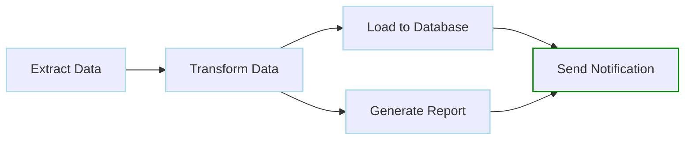
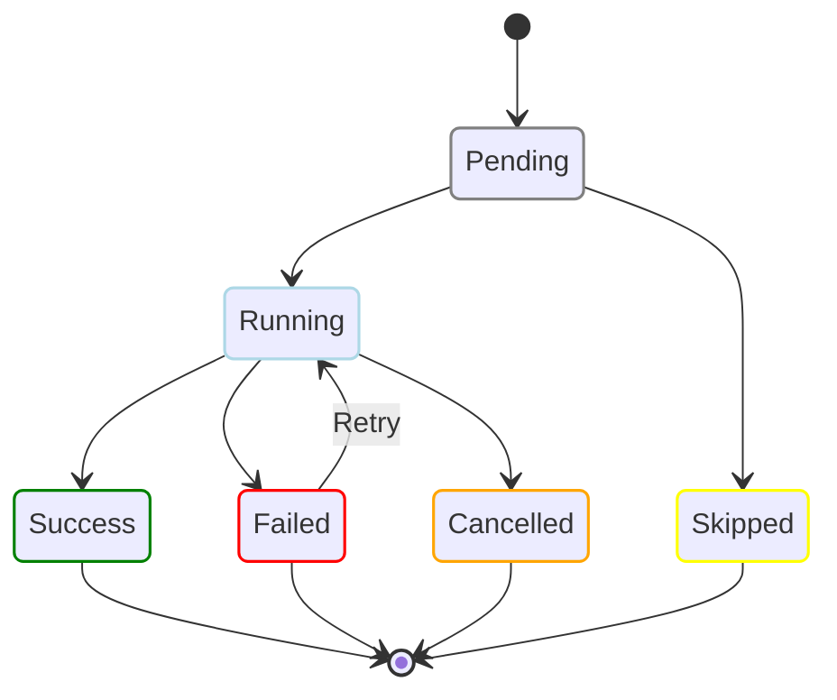

# Core Concepts

Understand the fundamental concepts of Dagu.

## What is a DAG?

DAG stands for **Directed Acyclic Graph**. In Dagu, it represents your workflow:

- **Directed**: Steps have a specific order
- **Acyclic**: No circular dependencies (can't loop back)
- **Graph**: Steps connected by dependencies



## Key Components

### 1. Workflow (DAG)

A workflow is the entire process you want to automate. It's defined in a YAML file:

```yaml
name: my-workflow
description: Process daily data
schedule: "0 2 * * *"
```

**Key attributes:**
- `name`: Unique identifier
- `description`: Human-readable explanation
- `schedule`: When to run automatically
- `steps`: The tasks to execute

### 2. Steps

Steps are individual tasks within your workflow:

```yaml
steps:
  - name: download-data
    command: wget https://example.com/data.csv
    
  - name: process-data
    command: python process.py data.csv
    depends: download-data
```

**Step attributes:**
- `name`: Unique within the workflow
- `command`: What to execute
- `depends`: Prerequisites
- `output`: Capture results

### 3. Dependencies

Dependencies define the execution order:

```yaml
steps:
  - name: A
    command: echo "First"
    
  - name: B
    command: echo "After A"
    depends: A
    
  - name: C
    command: echo "After A and B"
    depends: [A, B]
```

### 4. Executors

Executors determine how commands run:

```yaml
steps:
  - name: local-command
    command: echo "Runs on local machine"
    
  - name: docker-command
    executor:
      type: docker
      config:
        image: python:3.11
    command: python --version
    
  - name: remote-command
    executor:
      type: ssh
      config:
        host: server.example.com
    command: df -h
```

## Execution Model

### Lifecycle of a DAG Run

```
Schedule Triggered → DAG Queued → Steps Execute → Success/Failure → Cleanup
```

1. **Trigger**: Manual, scheduled, or API
2. **Queue**: Waits if resources unavailable
3. **Execute**: Steps run based on dependencies
4. **Complete**: Success, failure, or cancelled
5. **Cleanup**: Logs saved, notifications sent

### Step States

Each step progresses through states:



### Parallel Execution

Steps without dependencies run in parallel:

```yaml
steps:
  - name: setup
    command: ./prepare.sh
    
  # These three run in parallel
  - name: task-1
    command: ./task1.sh
    depends: setup
    
  - name: task-2
    command: ./task2.sh
    depends: setup
    
  - name: task-3
    command: ./task3.sh
    depends: setup
    
  - name: cleanup
    command: ./cleanup.sh
    depends: [task-1, task-2, task-3]
```

## Data Flow

### Environment Variables

Pass data through environment variables:

```yaml
env:
  - DATABASE_URL: postgres://localhost/mydb
  - API_KEY: ${SECRET_API_KEY}

steps:
  - name: use-env
    command: |
      echo "Connecting to $DATABASE_URL"
      curl -H "Authorization: $API_KEY" https://api.example.com
```

### Output Variables

Capture and reuse command output:

```yaml
steps:
  - name: get-date
    command: date +%Y-%m-%d
    output: TODAY
    
  - name: create-report
    command: ./generate-report.sh --date=${TODAY}
    depends: get-date
```

### Parameters

Accept runtime parameters:

```yaml
params:
  - ENVIRONMENT: dev
  - VERSION: latest

steps:
  - name: deploy
    command: ./deploy.sh ${ENVIRONMENT} ${VERSION}
```

Run with:
```bash
dagu start deploy.yaml -- ENVIRONMENT=prod VERSION=1.2.3
```

## Scheduling

### Cron Expressions

Dagu uses standard cron syntax:

```yaml
# Every day at 2 AM
schedule: "0 2 * * *"

# Every hour
schedule: "0 * * * *"

# Monday to Friday at 9 AM
schedule: "0 9 * * MON-FRI"

# Multiple schedules
schedule:
  - "0 9 * * MON-FRI"   # Weekday mornings
  - "0 14 * * SAT,SUN"  # Weekend afternoons
```

### Timezone Support

```yaml
# UTC
schedule: "0 2 * * *"

# Specific timezone
schedule: "CRON_TZ=America/New_York 0 2 * * *"
```

### Schedule Controls

```yaml
# Don't run if already succeeded today
skipIfSuccessful: true

# Start and stop schedules
schedule:
  start: "0 8 * * MON-FRI"   # Start at 8 AM
  stop: "0 18 * * MON-FRI"   # Stop at 6 PM
  restart: "0 12 * * MON-FRI" # Restart at noon
```

## Error Handling

### Retry Policies

Automatically retry failed steps:

```yaml
steps:
  - name: flaky-api-call
    command: curl https://unreliable-api.com
    retryPolicy:
      limit: 3              # Try 3 times
      intervalSec: 60       # Wait 1 minute between
      exitCode: [1, 255]    # Only retry these codes
```

### Continue on Failure

Don't stop the workflow on errors:

```yaml
steps:
  - name: optional-task
    command: ./nice-to-have.sh
    continueOn:
      failure: true
      
  - name: critical-task
    command: ./must-succeed.sh
    depends: optional-task
```

### Lifecycle Handlers

Run commands based on workflow outcome:

```yaml
handlerOn:
  success:
    command: ./celebrate.sh
    
  failure:
    command: ./alert-team.sh
    
  cancel:
    command: ./cleanup.sh
    
  exit:
    command: ./always-run.sh
```

## Storage and Persistence

### File Structure

Dagu follows the XDG Base Directory specification:

```
~/.config/dagu/
├── dags/              # Your workflow definitions
│   ├── etl.yaml
│   └── backup.yaml
├── config.yaml        # Dagu configuration
└── base.yaml          # Shared configuration

~/.local/share/dagu/
├── logs/              # Execution logs
│   ├── admin/         # Scheduler/admin logs
│   └── dags/
│       └── etl/
│           └── 20240115_140000_abc123/
│               ├── step1.out
│               ├── step1.err
│               └── status.yaml
├── data/              # Workflow state and history
│   └── etl/
│       ├── status.yaml
│       └── history/
│           └── 20240115.yaml
└── suspend/           # Workflow suspend flags
```

**Note**: If `~/.dagu` exists or `DAGU_HOME` is set, all files are stored under that directory instead.

### Log Management

- **Automatic rotation**: Based on retention settings
- **Structured logging**: JSON format available
- **Log streaming**: Real-time via web UI
- **Searchable**: Full-text search in UI

## Process Management

### Process Groups

Each DAG run creates a process group:
- Isolates workflow execution
- Enables clean shutdown
- Prevents orphan processes

### Signal Handling

Dagu properly handles system signals:
- `SIGTERM`: Graceful shutdown
- `SIGINT`: Immediate stop
- `SIGKILL`: Force termination

Custom signals per step:
```yaml
steps:
  - name: long-running
    command: ./server.sh
    signalOnStop: SIGTERM  # Default
```

## Configuration Hierarchy

Settings are applied in order:

1. **System defaults** (built-in)
2. **Base configuration** (`~/.config/dagu/base.yaml`)
3. **DAG-specific** (in the YAML file)
4. **Runtime parameters** (command line)

Example:
```yaml
# base.yaml - Shared settings
env:
  - COMPANY: ACME Corp
  - ENVIRONMENT: production

# my-workflow.yaml - Override
env:
  - ENVIRONMENT: staging  # Overrides base
```

## Three Ways to Interact

### 1. Command Line Interface (CLI)

Direct control:
```bash
dagu start workflow.yaml
dagu status workflow.yaml
dagu stop workflow.yaml
```

### 2. Web User Interface

Visual management:
- Real-time monitoring
- Log viewing
- DAG visualization
- History browsing

### 3. REST API

#### Start DAG

**Endpoint**: `POST /api/v2/dags/{fileName}/start`

Creates and starts a DAG run with optional parameters.

**Request Body**:
```json
{
  "params": "{\"env\": \"production\", \"version\": \"1.2.3\"}",
  "dagRunId": "custom-run-id"
}
```

**Request Fields**:
| Field | Type | Description | Required |
|-------|------|-------------|----------|
| params | string | JSON string of parameters | No |
| dagRunId | string | Custom run ID | No |

**Response (200)**:
```json
{
  "dagRunId": "20240101_120000_abc123"
}
```

See the [API Reference](/reference/api) for full details.

## Understanding Logs

### Log Types

1. **Workflow logs**: Overall execution
2. **Step stdout**: Standard output
3. **Step stderr**: Error output
4. **System logs**: Dagu internal logs

### Log Location
```bash
# Step logs (stdout and stderr)
~/.local/share/dagu/logs/dags/<workflow>/<timestamp>/<step>.out
~/.local/share/dagu/logs/dags/<workflow>/<timestamp>/<step>.err

# Step status
~/.local/share/dagu/logs/dags/<workflow>/<timestamp>/status.yaml

# Admin/scheduler logs
~/.local/share/dagu/logs/admin/
```

## See Also

Now that you understand the core concepts:

1. **[Examples](/writing-workflows/examples/)** - See these concepts in action
2. **[Writing Workflows](/writing-workflows/)** - Deep dive into workflow creation
3. **[Features](/features/)** - Explore advanced capabilities
4. **[Reference](/reference/cli)** - Complete technical documentation

### Key Takeaways

- **DAGs** define workflow structure
- **Steps** are individual tasks
- **Dependencies** control execution order
- **Executors** determine how commands run
- **Error handling** makes workflows robust
- **Three interfaces** provide flexibility

Remember: Start simple, add complexity as needed!
