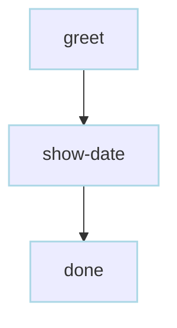
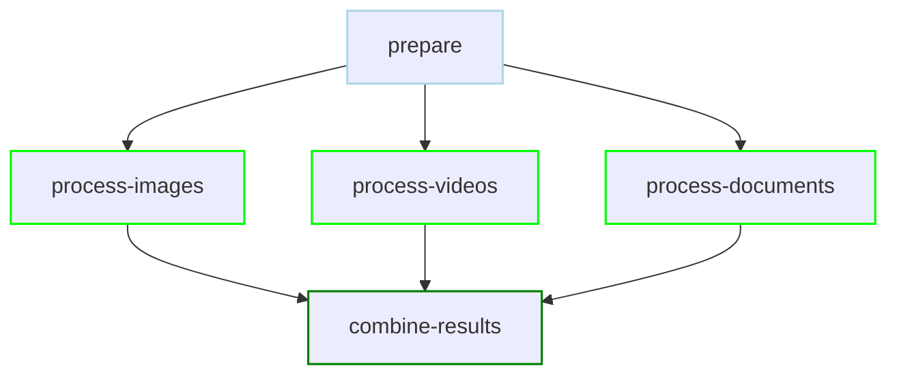
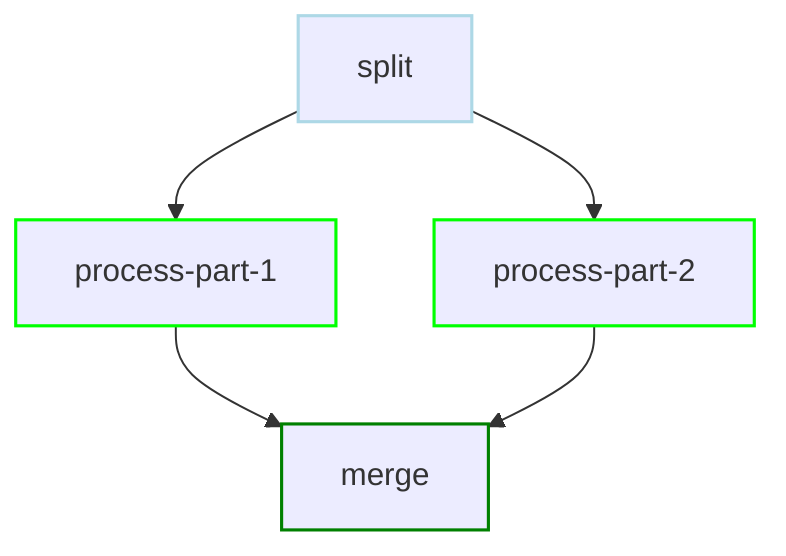
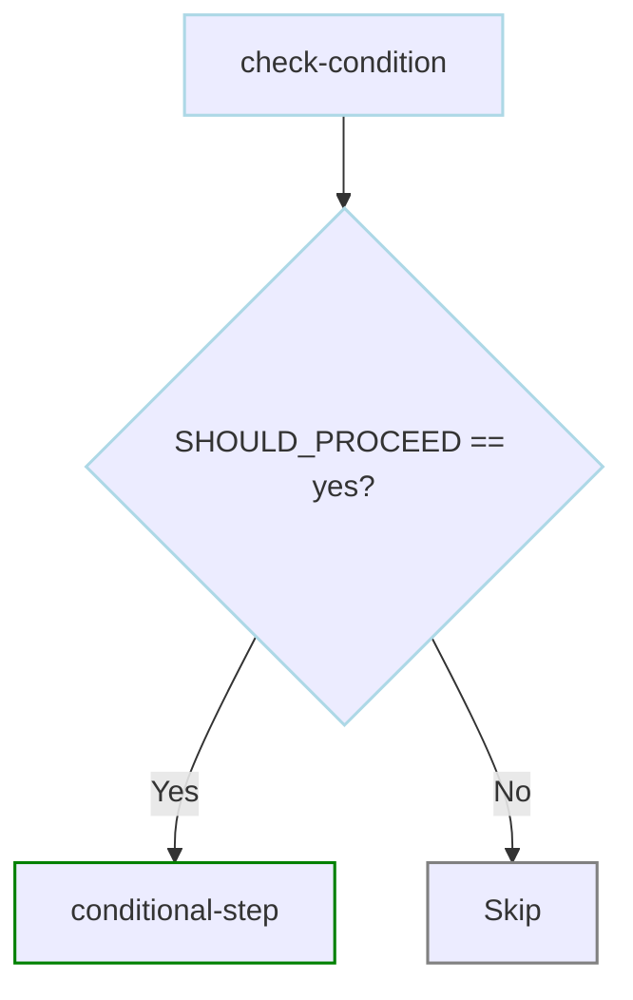

# Quickstart

Create and run your first Dagu workflow in minutes.

## Creating Your First DAG

Let's start with a simple "Hello World" workflow.

### Step 1: Create the workflow file

```bash
mkdir -p ~/.dagu/dags && cat > ~/.dagu/dags/hello.yaml << 'EOF'
name: hello-world
description: My first Dagu workflow

steps:
  - name: greet
    command: echo "Hello from Dagu!"
    
  - name: show-date
    command: date
    
  - name: done
    command: echo "Workflow complete! 🎉"
EOF
```

### Step 2: Run the workflow

::: code-group

```bash [Docker]
docker run \
--rm \
-v ~/.dagu:/app/.dagu \
-e DAGU_HOME=/app/.dagu \
ghcr.io/dagu-org/dagu:latest \
dagu start hello.yaml
```

```bash [Binary]
dagu start ~/.dagu/dags/hello.yaml
```

:::

You'll see output like (when using the binary):
```
┌─ DAG: hello-world ───────────────────────────────────────────────┐
│ Status: Success ✓           | Started: 23:34:57 | Elapsed: 471ms │
│ Run ID: 0197792a-3080-752c-bfc4-8fb                              │
└──────────────────────────────────────────────────────────────────┘

Progress: ████████████████████████████████████████ 100% (3/3 steps)

Recently Completed:
  ✓ done [0ms]
  ✓ greet [0ms]
  ✓ show-date [0ms]

Press Ctrl+C to stop
```

### Step 3: Check the status

::: code-group

```bash [Docker]
docker run \
--rm \
-v ~/.dagu:/app/.dagu \
-e DAGU_HOME=/app/.dagu \
ghcr.io/dagu-org/dagu:latest \
dagu status hello.yaml
```

```bash [Binary]
dagu status hello.yaml
```

:::

### Step 4: Check the Web UI

::: code-group

```bash [Docker]
docker run \
--rm \
-v ~/.dagu:/app/.dagu \
-e DAGU_HOME=/app/.dagu \
-p 8080:8080 \
ghcr.io/dagu-org/dagu:latest \
dagu start-all
```

```bash [Binary]
dagu start-all
```

Open your browser to [http://localhost:8080](http://localhost:8080) to see the Dagu web interface.

:::

## Understanding the Workflow

Let's break down what we just created:

```yaml
name: hello-world           # Unique identifier for your workflow
description: My first...    # Human-readable description

steps:                      # List of tasks to execute
  - name: greet            # First step
    command: echo "..."    # Command to run
    
  - name: show-date        # Second step
    command: date
    
  - name: done             # Final step
    command: echo "..."
```

### Workflow Execution Flow



Since no dependencies are specified, steps run sequentially by default.

### Key Concepts

1. **Steps**: Individual tasks in your workflow
2. **Commands**: Any shell command you can run

## A More Practical Example

Let's create a workflow that actually does something useful:

```yaml
# backup.yaml
name: daily-backup
description: Backup important files

params:
  - SOURCE_DIR: /home/user/documents
  - BACKUP_DIR: /backup

steps:
  - name: create-timestamp
    command: date +%Y%m%d_%H%M%S
    output: TIMESTAMP
    
  - name: create-backup-dir
    command: mkdir -p ${BACKUP_DIR}/${TIMESTAMP}
    
  - name: copy-files
    command: |
      cp -r ${SOURCE_DIR}/* ${BACKUP_DIR}/${TIMESTAMP}/
      echo "Backed up to ${BACKUP_DIR}/${TIMESTAMP}"
    
  - name: compress
    command: |
      cd ${BACKUP_DIR}
      tar -czf backup_${TIMESTAMP}.tar.gz ${TIMESTAMP}/
      rm -rf ${TIMESTAMP}/
    
  - name: cleanup-old
    command: |
      find ${BACKUP_DIR} -name "backup_*.tar.gz" -mtime +7 -delete
      echo "Cleaned up backups older than 7 days"
```

Run it with custom parameters:

::: code-group

```bash [Docker]
docker run \
--rm \
-v ~/.dagu:/app/.dagu \
-e DAGU_HOME=/app/.dagu \
ghcr.io/dagu-org/dagu:latest \
dagu start backup.yaml -- SOURCE_DIR=/important/data BACKUP_DIR=/mnt/backups
```

```bash [Binary]
dagu start backup.yaml -- SOURCE_DIR=/important/data BACKUP_DIR=/mnt/backups
```

:::

## Viewing in the Web UI

Dagu comes with a beautiful web interface to monitor your workflows.

### Start the web server:

::: code-group

```bash [Docker]
docker run \
--rm \
-p 8080:8080 \
-v ~/.dagu:/app/.dagu \
-e DAGU_HOME=/app/.dagu \
ghcr.io/dagu-org/dagu:latest \
dagu start-all
```

```bash [Binary]
dagu start-all
```

:::

### Open your browser:
Navigate to http://localhost:8080

You'll see:
- Dashboard with all your workflows
- Execution history
- Real-time log viewing
- Visual DAG representation

## Adding Error Handling

Let's make our workflow more robust:

```yaml
# robust-backup.yaml
name: robust-backup
description: Backup with error handling

params:
  - SOURCE_DIR: /home/user/documents
  - BACKUP_DIR: /backup

env:
  - LOG_LEVEL: info

steps:
  - name: check-source
    command: |
      if [ ! -d "${SOURCE_DIR}" ]; then
        echo "ERROR: Source directory does not exist!"
        exit 1
      fi
      echo "Source directory verified"
    
  - name: check-space
    command: |
      AVAILABLE=$(df ${BACKUP_DIR} | awk 'NR==2 {print $4}')
      NEEDED=$(du -s ${SOURCE_DIR} | awk '{print $1}')
      
      if [ $AVAILABLE -lt $NEEDED ]; then
        echo "ERROR: Not enough space!"
        exit 1
      fi
      echo "Sufficient space available"
    
  - name: backup
    command: |
      rsync -av ${SOURCE_DIR}/ ${BACKUP_DIR}/current/
    retryPolicy:
      limit: 3
      intervalSec: 30
    
  - name: notify
    command: echo "Backup completed successfully"
    mailOnError: true

handlerOn:
  failure:
    command: |
      echo "Backup failed! Check logs at ${DAG_RUN_LOG_FILE}"
      # Send alert to monitoring system
      curl -X POST https://alerts.example.com/webhook \
        -d "workflow=backup&status=failed"
  success:
    command: echo "Backup completed at $(date)"
```

## Running on a Schedule

To run your workflow automatically:

```yaml
# scheduled-backup.yaml
name: scheduled-backup
description: Daily backup at 2 AM
schedule: "0 2 * * *"  # Cron expression

steps:
  # ... same steps as before ...
```

Now it will run automatically every day at 2 AM!

## Parallel Execution

Run multiple tasks simultaneously:

```yaml
# parallel-tasks.yaml
name: parallel-processing
description: Process multiple files in parallel

steps:
  - name: prepare
    command: echo "Starting parallel processing"
    
  - name: process-images
    command: ./process-images.sh
    depends: prepare
    
  - name: process-videos
    command: ./process-videos.sh
    depends: prepare
    
  - name: process-documents
    command: ./process-documents.sh
    depends: prepare
    
  - name: combine-results
    command: ./combine-all.sh
    depends:
      - process-images
      - process-videos
      - process-documents
```

### Parallel Execution Flow



The three processing steps run in parallel after `prepare` completes!

## Common Patterns

### Sequential Processing
```yaml
steps:
  - name: step1
    command: echo "First"
  - name: step2
    command: echo "Second"
    depends: step1
  - name: step3
    command: echo "Third"
    depends: step2
```

### Fan-out/Fan-in
```yaml
steps:
  - name: split
    command: split-data.sh
    
  - name: process-part-1
    command: process.sh part1
    depends: split
    
  - name: process-part-2
    command: process.sh part2
    depends: split
    
  - name: merge
    command: merge-results.sh
    depends:
      - process-part-1
      - process-part-2
```



### Conditional Execution
```yaml
steps:
  - name: check-condition
    command: ./check.sh
    output: SHOULD_PROCEED
    
  - name: conditional-step
    command: ./process.sh
    depends: check-condition
    preconditions:
      - condition: "${SHOULD_PROCEED}"
        expected: "yes"
```



## See Also

1. **[Core Concepts](/getting-started/concepts)** - Understand Dagu's architecture
2. **[Examples](/writing-workflows/examples/)** - See more workflow patterns
3. **[Writing Workflows](/writing-workflows/)** - Deep dive into workflow creation
4. **[Features](/features/)** - Explore advanced capabilities
