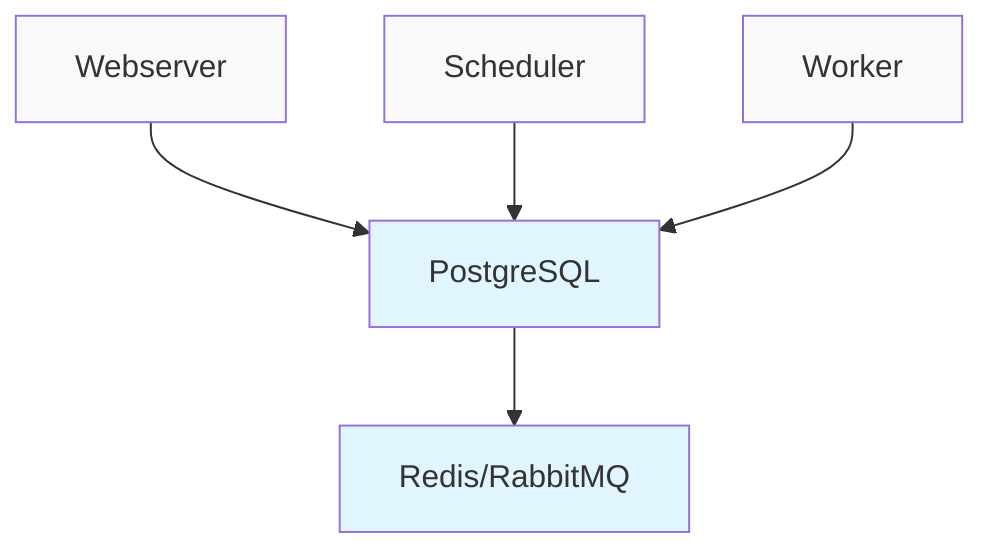
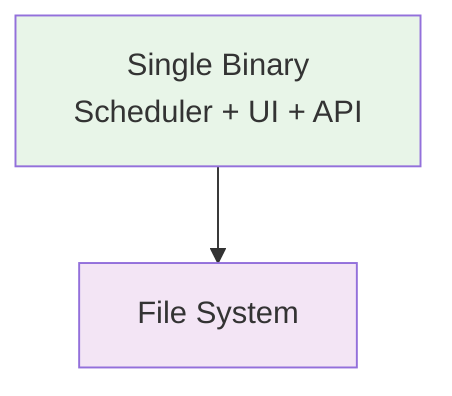

# Comparison

How Dagu compares to other workflow orchestration tools.

## Quick Comparison

| Feature | Dagu | Airflow | Cron | GitHub Actions | Temporal |
|---------|------|---------|------|----------------|----------|
| **Installation** | Single binary | Complex setup | Built-in | SaaS only | Multiple services |
| **Dependencies** | None | PostgreSQL, Redis | None | GitHub | Cassandra/PostgreSQL |
| **Language** | Any | Python | Any | Any | SDK required |
| **UI** | Built-in | Built-in | None | Built-in | Built-in |
| **Local Dev** | Native | Difficult | Native | Limited | Complex |
| **Resource Usage** | Minimal | Heavy | Minimal | N/A | Heavy |

## Detailed Comparisons

## Dagu vs Apache Airflow

### Architecture

**Airflow:**


**Dagu:**


### Key Differences

| Aspect | Dagu | Airflow |
|--------|------|---------|
| **Setup Time** | < 1 minute | Hours to days |
| **Python Required** | No | Yes (everything) |
| **DAG Definition** | YAML | Python code |
| **Executor Model** | Process-based | Task queue |
| **Scalability** | Single machine | Distributed |
| **Maintenance** | Minimal | High |

### When to Choose

**Choose Dagu when:**
- You need to orchestrate scripts in multiple languages
- You want to start quickly without infrastructure setup
- You prefer configuration over code
- You're running on a single machine or small cluster
- You need a lightweight solution

**Choose Airflow when:**
- You need massive scale (thousands of concurrent tasks)
- Your team is Python-centric
- You require complex dynamic DAG generation
- You need deep integration with cloud services
- You have dedicated DevOps resources

### Migration Example

**Airflow DAG:**
```python
from airflow import DAG
from airflow.operators.bash import BashOperator
from datetime import datetime, timedelta

default_args = {
    'owner': 'data-team',
    'retries': 3,
    'retry_delay': timedelta(minutes=5),
}

dag = DAG(
    'etl_pipeline',
    default_args=default_args,
    schedule_interval='0 2 * * *',
    start_date=datetime(2024, 1, 1),
)

extract = BashOperator(
    task_id='extract',
    bash_command='python extract.py',
    dag=dag,
)

transform = BashOperator(
    task_id='transform',
    bash_command='python transform.py',
    dag=dag,
)

load = BashOperator(
    task_id='load',
    bash_command='python load.py',
    dag=dag,
)

extract >> transform >> load
```

**Equivalent Dagu DAG:**
```yaml
name: etl_pipeline
schedule: "0 2 * * *"

steps:
  - name: extract
    command: python extract.py
    retryPolicy:
      limit: 3
      intervalSec: 300
      
  - name: transform
    command: python transform.py
    retryPolicy:
      limit: 3
      intervalSec: 300
      
  - name: load
    command: python load.py
    retryPolicy:
      limit: 3
      intervalSec: 300
```

## Dagu vs Cron

### Feature Comparison

| Feature | Dagu | Cron |
|---------|------|------|
| **Scheduling** | ✅ | ✅ |
| **Dependencies** | ✅ | ❌ |
| **Retry Logic** | ✅ | ❌ |
| **Web UI** | ✅ | ❌ |
| **Logging** | ✅ Centralized | ⚠️ Manual |
| **Monitoring** | ✅ | ❌ |
| **Parallelism** | ✅ | ⚠️ Manual |
| **Error Handling** | ✅ | ❌ |

### Migration Example

**Cron entries:**
```bash
# Crontab
0 2 * * * /scripts/extract_data.sh >> /var/log/etl.log 2>&1
30 2 * * * /scripts/transform_data.sh >> /var/log/etl.log 2>&1
0 3 * * * /scripts/load_data.sh >> /var/log/etl.log 2>&1
0 4 * * * /scripts/send_report.sh || /scripts/alert_on_failure.sh
```

**Equivalent Dagu DAG:**
```yaml
name: etl_pipeline
schedule: "0 2 * * *"

steps:
  - name: extract
    command: /scripts/extract_data.sh
    
  - name: transform
    command: /scripts/transform_data.sh
    depends: extract
    delay: 1800  # 30 minutes
    
  - name: load
    command: /scripts/load_data.sh
    depends: transform
    delay: 1800  # 30 minutes
    
  - name: report
    command: /scripts/send_report.sh
    depends: load
    delay: 3600  # 1 hour
    continueOn:
      failure: true
      
handlerOn:
  failure:
    command: /scripts/alert_on_failure.sh
```

### Benefits over Cron

1. **Dependency Management**: Cron jobs run independently
2. **Centralized Logging**: No more scattered log files
3. **Failure Handling**: Automatic retries and notifications
4. **Visibility**: See all jobs in one place
5. **Testing**: Dry-run mode for validation


## Dagu vs Temporal

### Complexity Comparison

| Aspect | Dagu | Temporal |
|--------|------|----------|
| **Setup Complexity** | Minimal | High |
| **Learning Curve** | Hours | Weeks |
| **Infrastructure** | Single process | Multiple services |
| **Use Case** | General workflows | Complex distributed systems |
| **Programming Model** | Declarative YAML | Imperative code |

### When to Use Each

**Use Temporal for:**
- Microservice orchestration
- Long-running workflows (days/months)
- Complex state machines
- When you need exactly-once semantics

**Use Dagu for:**
- Script orchestration
- Data pipelines
- DevOps automation
- When you want simplicity

## Dagu vs Kubernetes Jobs/CronJobs

### Scope Difference

| Feature | Dagu | K8s Jobs |
|---------|------|----------|
| **Purpose** | Workflow orchestration | Container orchestration |
| **Environment** | Any Unix system | Kubernetes cluster |
| **Overhead** | Minimal | Significant |
| **Complexity** | Low | High |
| **Resource Control** | Process-level | Container-level |

### Example Comparison

**Kubernetes CronJob:**
```yaml
apiVersion: batch/v1
kind: CronJob
metadata:
  name: etl-pipeline
spec:
  schedule: "0 2 * * *"
  jobTemplate:
    spec:
      template:
        spec:
          containers:
          - name: extract
            image: myapp:latest
            command: ["python", "extract.py"]
          restartPolicy: OnFailure
```

**Dagu Equivalent:**
```yaml
name: etl-pipeline
schedule: "0 2 * * *"

steps:
  - name: extract
    executor:
      type: docker
      config:
        image: myapp:latest
    command: python extract.py
    retryPolicy:
      limit: 3
```

## Decision Matrix

### Choose Dagu when you need:
- Quick setup and minimal maintenance
- Language-agnostic orchestration
- Local or on-premise execution
- Simple to moderate complexity workflows
- File-based configuration
- Single machine execution

### Consider alternatives when you need:
- Massive distributed scale (use Airflow/Temporal)
- Streaming/real-time processing (use Kafka/Flink)
- Complex distributed transactions (use Temporal)

## Migration Guides

### From Cron to Dagu
1. List all cron jobs: `crontab -l`
2. Group related jobs into workflows
3. Convert schedules to Dagu format
4. Add dependencies and error handling
5. Test with `dagu dry-run`
6. Deploy and disable old cron jobs

### From Airflow to Dagu
1. Export DAG relationships
2. Convert Python operators to shell commands
3. Map connections to environment variables
4. Recreate schedules and retries
5. Test in parallel before switching

## Summary

Dagu occupies a unique position in the workflow orchestration landscape:

- **Simpler than** Airflow, Temporal
- **More powerful than** Cron, systemd timers
- **More flexible than** CI/CD tools
- **Lighter than** Kubernetes Jobs

It's the ideal choice for teams that need reliable workflow orchestration without the operational overhead of complex distributed systems.

## Next Steps

- [Getting Started](/getting-started/) - Try Dagu yourself
- [Architecture](/overview/architecture) - Learn how Dagu works
- [Examples](/writing-workflows/examples/) - See Dagu in action
