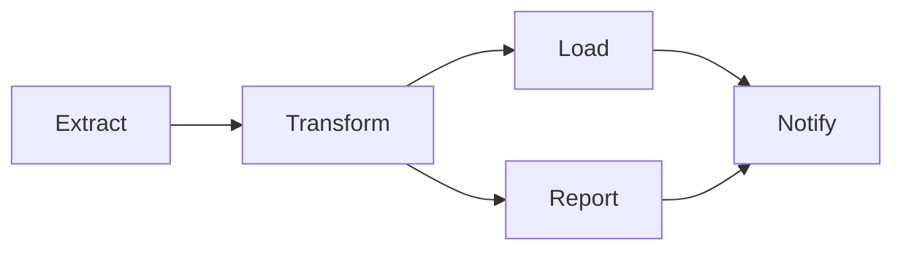
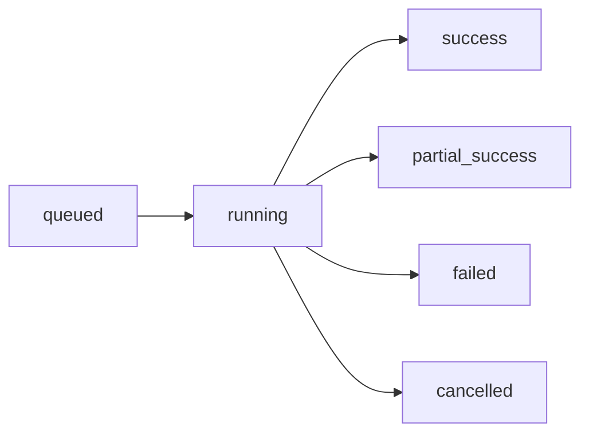

# Core Concepts

Essential concepts for working with Dagu.

## DAG (Directed Acyclic Graph)

A DAG defines your workflow as a graph of dependencies:

- **Directed**: Steps execute in a specific order
- **Acyclic**: No circular dependencies allowed
- **Graph**: Steps connected by dependency relationships



## Workflow Components

### Steps

The basic unit of execution. Each step runs a command:

```yaml
steps:
  - command: curl -O https://example.com/data.csv  # Download data
    
  - command: python analyze.py data.csv           # Process data
```

### Dependencies

By default, steps run sequentially. Use `depends` for parallel execution:

```yaml
steps:
  - name: A
    command: echo "First"
    
  - name: B
    command: echo "Second (after A)"
    
  - name: C
    command: echo "Parallel with B"
    depends: A  # Only depends on A, runs parallel to B
    
  - name: D
    command: echo "After both B and C"
    depends: [B, C]
```

### Parameters

Make workflows reusable with parameters:

```yaml
params:
  - ENV: dev
  - REGION: us-east-1

steps:
  - name: deploy
    command: echo "Deploying to ${ENV} in ${REGION}"
```

Override at runtime:
```bash
dagu start workflow.yaml -- ENV=prod REGION=eu-west-1
```

### Variables

Pass data between steps using `output`:

```yaml
steps:
  - name: get-date
    command: date +%Y%m%d
    output: TODAY
    
  - name: backup
    command: tar -czf backup_${TODAY}.tar.gz /data
```

## Execution Model

### Parallel Execution

Steps with the same dependencies run in parallel:

```yaml
steps:
  - name: start
    command: echo "Begin"
    
  - name: task1
    command: 'sh -c "echo Starting heavy task 1; sleep 2; echo Completed heavy task 1"'
    depends: start
    
  - name: task2
    command: 'sh -c "echo Starting heavy task 2; sleep 2; echo Completed heavy task 2"'
    depends: start
    
  - name: finish
    command: echo "All done"
    depends: [task1, task2]
```

Control parallelism with `maxActiveSteps`:

```yaml
maxActiveSteps: 2  # Only 2 steps run concurrently
```

### Conditional Execution

Run steps based on conditions:

```yaml
steps:
  - command: python process.py
    preconditions:
      - condition: "test -f /data/input.csv"
```

The `process` step only runs if the precondition matches.

### Error Handling

Built-in retry mechanism:

```yaml
steps:
  - command: curl -f https://flaky-api.com/data
    retryPolicy:
      limit: 3
      intervalSec: 30
```

Continue on failure:

```yaml
steps:
  - command: 'sh -c "if [ $((RANDOM % 2)) -eq 0 ]; then echo Success; else echo Failed && exit 1; fi"'
    continueOn:
      failure: true
```

The workflow continues even if `optional-task` fails. The overall status will be `partial success` if any step fails but does not block the execution of subsequent steps due to `continueOn`.

## Status Management

DAGs progress through different statuses during their lifecycle:

### Execution States

- **queued**: DAG is waiting to be executed
- **running**: DAG is currently executing
- **success**: All steps completed successfully
- **partial_success**: Some steps failed but execution continued (via `continueOn`)
- **failed**: DAG execution failed
- **cancelled**: DAG was manually cancelled

### Status Transitions



### Step Status

Individual steps have their own statuses:

- **pending**: Step is waiting for dependencies
- **running**: Step is executing
- **success**: Step completed successfully
- **failed**: Step execution failed
- **cancelled**: Step was cancelled
- **skipped**: Step was skipped (precondition not met)

### Status Hooks

React to status changes with handlers:

```yaml
handlerOn:
  success:
    command: notify-team.sh "Workflow completed"
  failure:
    command: alert-oncall.sh "Workflow failed"
  partial_success:
    command: log-partial.sh "Some steps failed"
```

## Executors

### Shell (Default)

Runs commands in the system shell:

```yaml
steps:
  - name: example
    command: echo "Hello"
    shell: bash  # or sh, zsh
```

See [Shell Executor](/features/executors/shell) for more details.

### Docker

Execute in containers:

```yaml
steps:
  - name: python-task
    executor:
      type: docker
      config:
        image: python:3.11
        volumes:
          - /data:/data
    command: python script.py
```

See [Docker Executor](/features/executors/docker) for more details.

### SSH

Run on remote machines:

```yaml
steps:
  - name: remote-task
    executor:
      type: ssh
      config:
        user: ubuntu
        host: server.example.com
        key: ~/.ssh/id_rsa
    command: echo "Running remote script"
```

See [SSH Executor](/features/executors/ssh) for more details.

### HTTP

Make API calls:

```yaml
steps:
  - name: webhook
    executor:
      type: http
      config:
        method: POST
        url: https://api.example.com/trigger
        headers:
          Authorization: Bearer ${API_TOKEN}
```

See [HTTP Executor](/features/executors/http) for more details.

## Scheduling

Cron-based scheduling:

```yaml
schedule: "0 2 * * *"  # Daily at 2 AM
```

Multiple schedules:

```yaml
schedule:
  - "0 9 * * MON-FRI"  # Weekdays at 9 AM
  - "0 14 * * SAT,SUN" # Weekends at 2 PM
```

Start/stop schedules:

```yaml
schedule:
  start: "0 8 * * *"   # Start at 8 AM
  stop: "0 18 * * *"   # Stop at 6 PM
```

See [Scheduling](/features/scheduling) for more details.

## Lifecycle Handlers

Execute commands on workflow events:

```yaml
handlerOn:
  success:
    command: echo "Workflow succeeded"
    
  failure:
    command: |
      echo "Workflow failed" | mail -s "Alert" admin@example.com
      
  cancel:
    command: echo "Cleaning up resources"
    
  exit:
    command: echo "Always runs"
```

## What's Next?

- [Writing Workflows](/writing-workflows/) - Create your own workflows
- [Examples](/writing-workflows/examples) - Ready-to-use patterns
- [CLI Reference](/reference/cli) - Command-line usage
