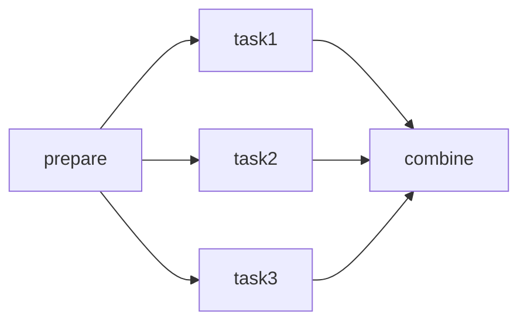

# Quick Start

Get up and running with Dagu in under 2 minutes.

## Install Dagu

::: code-group

```bash [npm]
npm install -g dagu
```

```bash [macOS/Linux]
curl -L https://raw.githubusercontent.com/dagu-org/dagu/main/scripts/installer.sh | bash
```

```bash [Docker]
docker pull ghcr.io/dagu-org/dagu:latest
```

```bash [Homebrew]
brew install dagu-org/brew/dagu
```

:::

See [Installation Guide](/getting-started/installation) for more options.

## Your First Workflow

::: info Example DAGs
When you first start Dagu with an empty DAGs directory, it automatically creates several example workflows to help you get started:
- `example-01-basic-sequential.yaml` - Basic sequential execution
- `example-02-parallel-execution.yaml` - Parallel task execution
- `example-03-complex-dependencies.yaml` - Complex dependency graphs
- `example-04-scheduling.yaml` - Scheduled workflows
- `example-05-nested-workflows.yaml` - Nested sub-workflows
- `example-06-container-workflow.yaml` - Container-based workflows

To skip creating these examples, set `DAGU_SKIP_EXAMPLES=true` or add `skipExamples: true` to your config file.
:::

### 1. Create a workflow

::: code-group

```bash [Binary]
mkdir -p ~/.config/dagu/dags && cat > ~/.config/dagu/dags/hello.yaml << 'EOF'
steps:
  - command: echo "Hello from Dagu!"
    
  - command: echo "Running step 2"
EOF
```

```bash [Docker]
mkdir -p ~/.dagu/dags && cat > ~/.dagu/dags/hello.yaml << 'EOF'
steps:
  - command: echo "Hello from Dagu!"
    
  - command: echo "Running step 2"
EOF
```

### 2. Run it

::: code-group

```bash [Binary]
dagu start hello
```

```bash [Docker]
docker run --rm \
  -v ~/.dagu:/var/lib/dagu \
  ghcr.io/dagu-org/dagu:latest \
  dagu start hello
```

:::

Output:
```
┌─ DAG: hello ─────────────────────────────────────────────────────┐
│ Status: Success ✓           | Started: 23:34:57 | Elapsed: 471ms │
└──────────────────────────────────────────────────────────────────┘

Progress: ████████████████████████████████████████ 100% (2/2 steps)
```

*Note: The output may vary if you are using Docker.*

### 3. Check the status

::: code-group

```bash [Binary]
dagu status hello
```

```bash [Docker]
docker run --rm \
  -v ~/.dagu:/var/lib/dagu \
  ghcr.io/dagu-org/dagu:latest \
  dagu status hello
```

:::

### 4. View in the UI

::: code-group

```bash [Binary]
dagu start-all
```

```bash [Docker]
docker run -d \
  -p 8080:8080 \
  -v ~/.dagu:/var/lib/dagu \
  ghcr.io/dagu-org/dagu:latest \
  dagu start-all
```

:::

Open [http://localhost:8080](http://localhost:8080)

## Understanding Workflows

A workflow is a YAML file that defines steps and their dependencies:

```yaml
steps:
  - command: echo "First step"
    
  - command: echo "Second step"  # Runs after first step automatically
```

Key concepts:
- **Steps**: Individual tasks that run commands
- **Dependencies**: Control execution order
- **Commands**: Any shell command you can run

## Parameters

You can define parameters for workflows to make them reusable:

```yaml
# backup.yaml
name: daily-backup
params:
  - SOURCE: /data
  - DEST: /backup

steps:
  - name: timestamp
    command: date +%Y%m%d_%H%M%S
    output: TS
    
  - name: backup
    command: tar -czf ${DEST}/backup_${TS}.tar.gz ${SOURCE}
    
  - name: cleanup
    command: find ${DEST} -name "backup_*.tar.gz" -mtime +7 -delete
```

Run with parameters:

```bash
dagu start backup.yaml -- SOURCE=/important/data DEST=/backups
```

## Parallel Execution

Run steps concurrently by specifying the same dependencies:

```yaml
steps:
  - name: prepare
    command: echo "Starting"
    
  - name: task1
    command: echo "Processing images"
    depends: prepare
    
  - name: task2
    command: echo "Processing videos"
    depends: prepare
    
  - name: task3
    command: echo "Processing documents"
    depends: prepare
    
  - name: combine
    command: echo "Merging all results"
    depends: [task1, task2, task3]
```



## Error Handling

Add retries and error handlers:

```yaml
steps:
  - name: download
    command: curl -f https://example.com/data.zip -o data.zip
    retryPolicy:
      limit: 3
      intervalSec: 30
      
  - name: process
    command: echo "Unzipping data and processing"
    continueOn:
      failure: true  # Continue even if this fails
      
handlerOn:
  failure:
    command: echo "Workflow failed!" | mail -s "Alert" admin@example.com
  success:
    command: echo "Success at $(date)"
```

## Using Containers

Run all steps in Docker containers:

```yaml
# Using a container for all steps
container:
  image: python:3.11
  volumes:
    - ./data:/data

steps:
  - name: python-task
    # write data to a file
    command: |
      python -c "with open('/data/output.txt', 'w') as f: f.write('Hello from Dagu!')"
    
  - name: process-data
    # read data from the file
    command: |
      python -c "with open('/data/output.txt') as f: print(f.read())"
```

## Scheduling

Run workflows automatically:

```yaml
name: nightly-job
schedule: "0 2 * * *"  # 2 AM daily

steps:
  - name: run
    command: echo "Running nightly process"
```

The workflow will execute every day at 2 AM.

## What's Next?

- [Core Concepts](/getting-started/concepts) - Understand Dagu's architecture
- [Writing Workflows](/writing-workflows/) - Learn advanced features
- [Examples](/writing-workflows/examples) - Ready-to-use workflow patterns
- [CLI Reference](/reference/cli) - All command options
