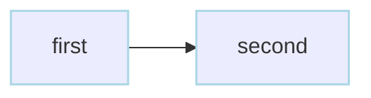
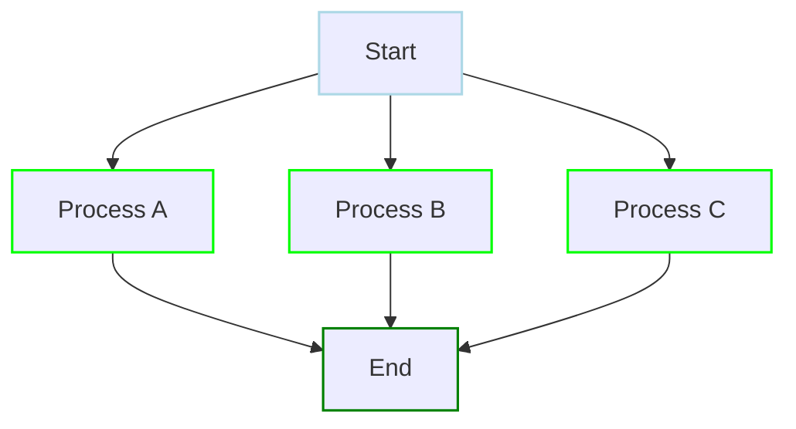
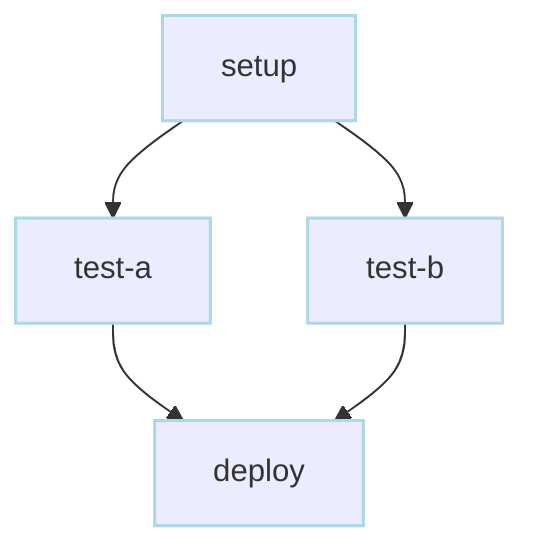
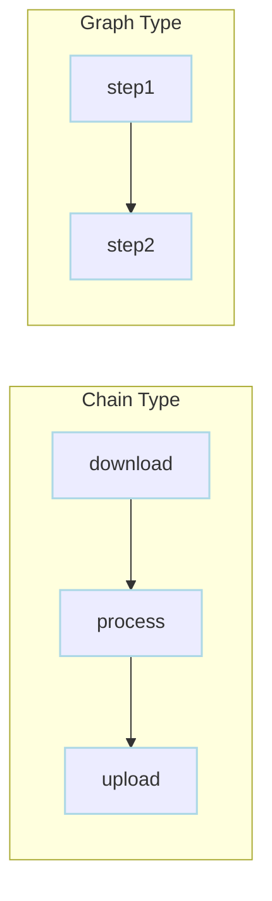
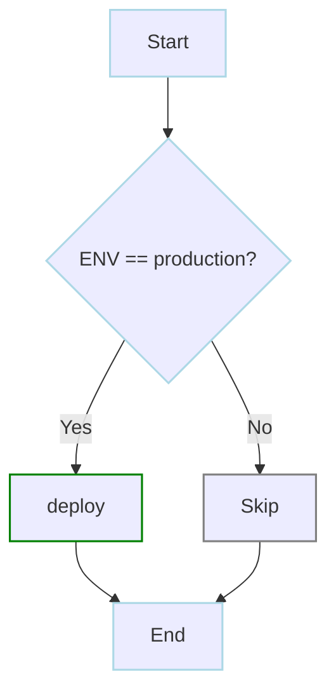
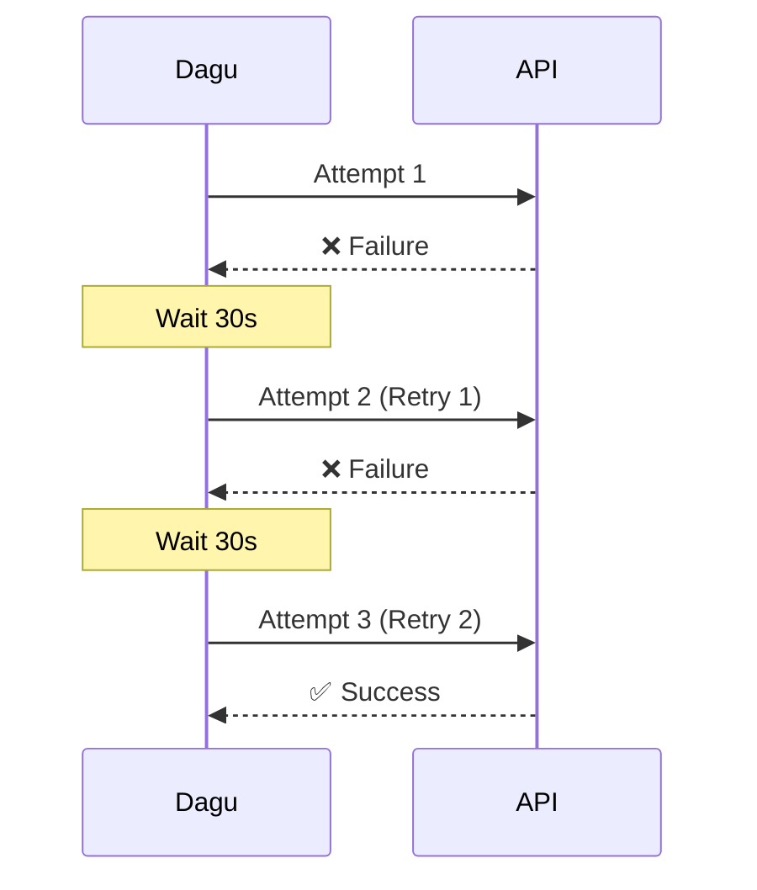
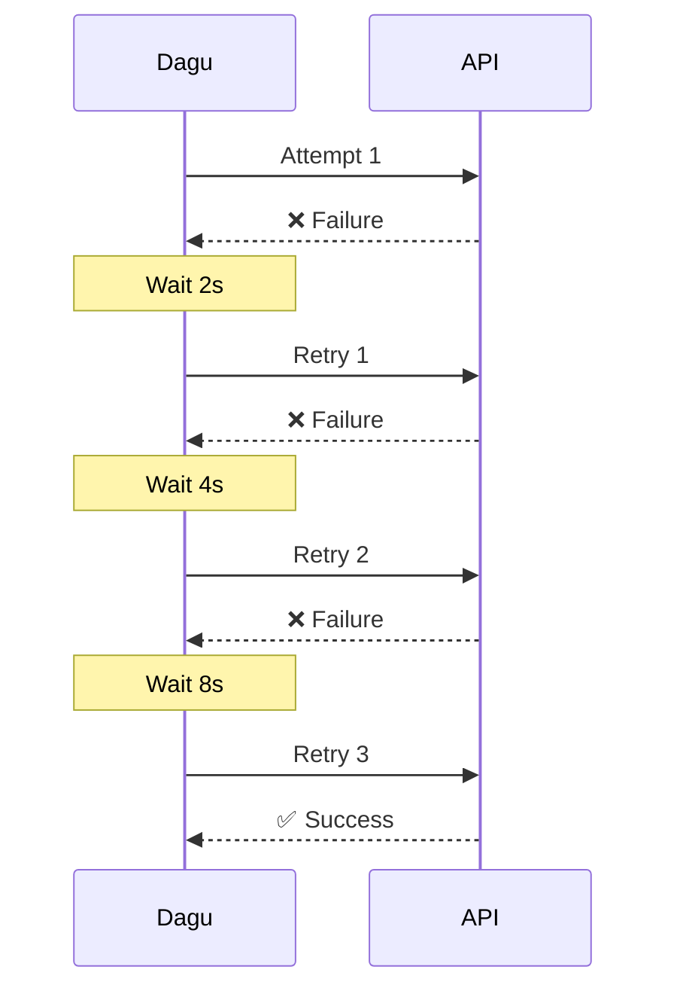
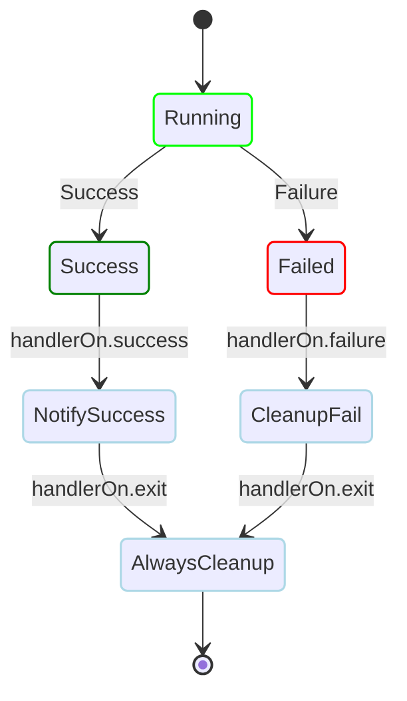
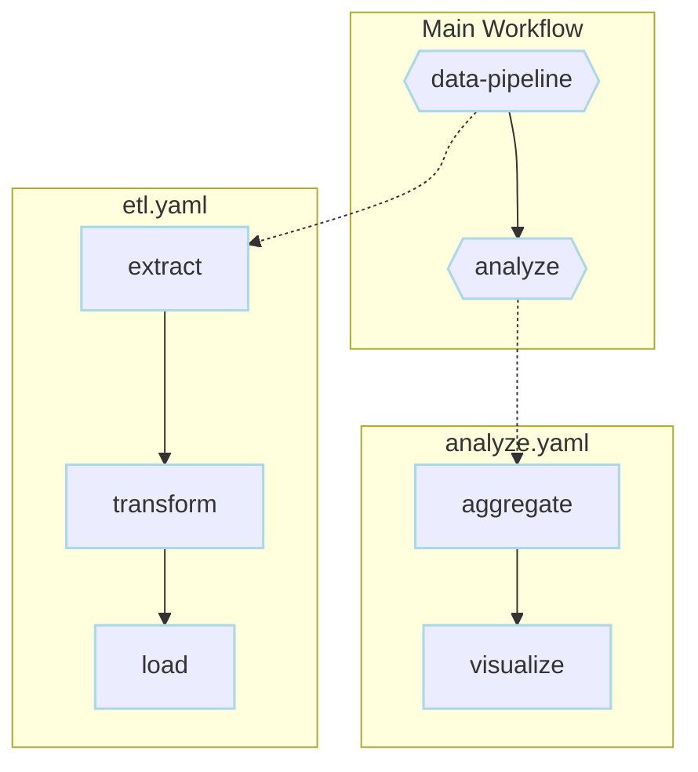

# Examples

Quick reference for all Dagu features. Each example is minimal and copy-paste ready.

## Basic Workflow Patterns

<div class="examples-grid">

<div class="example-card">

### Basic Sequential Steps

```yaml
steps:
  - name: first
    command: echo "Step 1"
  - name: second
    command: echo "Step 2"
```



Execute steps one after another.

<a href="/writing-workflows/basics#sequential-execution" class="learn-more">Learn more →</a>

</div>

<div class="example-card">

### Parallel Execution

```yaml
steps:
  - name: process-items
    run: processor
    parallel:
      items: [A, B, C]
      maxConcurrent: 2
```



Process multiple items simultaneously.

<a href="/features/execution-control#parallel" class="learn-more">Learn more →</a>

</div>

<div class="example-card">

### Complex Dependencies

```yaml
steps:
  - name: setup
    command: ./setup.sh
  - name: test-a
    command: ./test-a.sh
    depends: setup
  - name: test-b
    command: ./test-b.sh
    depends: setup
  - name: deploy
    command: ./deploy.sh
    depends:
      - test-a
      - test-b
```



Define complex dependency graphs.

<a href="/writing-workflows/control-flow#dependencies" class="learn-more">Learn more →</a>

</div>

<div class="example-card">

### Chain vs Graph Execution

```yaml
# Chain type (default) - automatic dependencies
type: chain
steps:
  - name: download
    command: wget data.csv
  - name: process
    command: python process.py  # Depends on download
  - name: upload
    command: aws s3 cp output.csv s3://bucket/

---

# Graph type - explicit dependencies
type: graph  
steps:
  - name: step1
    command: echo "First"
  - name: step2
    command: echo "Second"
    depends: step1  # Explicit dependency required
```



Control execution flow patterns.

<a href="/writing-workflows/control-flow#execution-types" class="learn-more">Learn more →</a>

</div>

</div>

## Control Flow & Conditions

<div class="examples-grid">

<div class="example-card">

### Conditional Execution

```yaml
steps:
  - name: deploy
    command: ./deploy.sh
    preconditions:
      - condition: "${ENV}"
        expected: "production"
```



Run steps only when conditions are met.

<a href="/writing-workflows/control-flow#conditions" class="learn-more">Learn more →</a>

</div>

<div class="example-card">

### Advanced Preconditions

```yaml
steps:
  - name: conditional-task
    command: ./process.sh
    preconditions:
      - test -f /data/input.csv
      - test -s /data/input.csv  # File exists and is not empty
      - condition: "${ENVIRONMENT}"
        expected: "production"
      - condition: "`date '+%d'`"
        expected: "re:0[1-9]"  # First 9 days of month
      - condition: "`df -h /data | awk 'NR==2 {print $5}' | sed 's/%//'`"
        expected: "re:^[0-7][0-9]$"  # Less than 80% disk usage
```

Multiple condition types and regex patterns.

<a href="/writing-workflows/control-flow#preconditions" class="learn-more">Learn more →</a>

</div>

<div class="example-card">

### Repeat Until Condition

```yaml
steps:
  - name: wait-for-service
    command: curl -f http://service/health
    repeatPolicy:
      repeat: true
      intervalSec: 10
      exitCode: [1]  # Repeat while exit code is 1
```

Repeat steps until success.

<a href="/writing-workflows/control-flow#repeat" class="learn-more">Learn more →</a>

</div>

<div class="example-card">

### Repeat Until Success

```yaml
steps:
  - name: wait-for-service
    command: curl -f http://service:8080/health
    repeatPolicy:
      repeat: until        # Repeat UNTIL service is healthy
      exitCode: [0]        # Exit code 0 means success
      intervalSec: 10
      limit: 30           # Maximum 5 minutes
  
  - name: monitor-job
    command: ./check_job_status.sh
    output: JOB_STATUS
    repeatPolicy:
      repeat: until        # Repeat UNTIL job completes
      condition: "${JOB_STATUS}"
      expected: "COMPLETED"
      intervalSec: 30
      limit: 120          # Maximum 1 hour
```

Wait for external dependencies and job completion with clear semantics.

<a href="/writing-workflows/control-flow#repeat" class="learn-more">Learn more →</a>

</div>

<div class="example-card">

### Repeat Steps

```yaml
steps:
  - name: keep-alive-task
    command: heartbeat.sh
    repeatPolicy:
      repeat: while        # Repeat indefinitely while successful
      intervalSec: 60
      
  - name: monitor-until-done
    command: check-status.sh
    repeatPolicy:
      repeat: until        # Repeat until exit code 0
      exitCode: [0]
      intervalSec: 30
      limit: 20           # Maximum 10 minutes
```

Execute steps with clear repeat semantics.

<a href="/writing-workflows/control-flow#repeat-basic" class="learn-more">Learn more →</a>

</div>

</div>

## Error Handling & Reliability

<div class="examples-grid">

<div class="example-card">

### Continue on Failure

```yaml
steps:
  - name: optional-task
    command: ./nice-to-have.sh
    continueOn:
      failure: true
  - name: required-task
    command: ./must-succeed.sh
```

Handle non-critical failures gracefully.

<a href="/writing-workflows/error-handling#continue" class="learn-more">Learn more →</a>

</div>

<div class="example-card">

### Continue on Skipped

```yaml
steps:
  - name: optional-feature
    command: ./enable-feature.sh
    preconditions:
      - condition: "${FEATURE_FLAG}"
        expected: "enabled"
    continueOn:
      skipped: true
  - name: main-process
    command: ./process.sh
```

Continue workflow when preconditions aren't met.

<a href="/writing-workflows/control-flow#continue-on-skipped" class="learn-more">Learn more →</a>

</div>

<div class="example-card">

### Retry on Failure

```yaml
steps:
  - name: api-call
    command: curl https://api.example.com
    retryPolicy:
      limit: 3
      intervalSec: 30
```



Automatically retry failed steps.

<a href="/writing-workflows/error-handling#retry" class="learn-more">Learn more →</a>

</div>

<div class="example-card">

### Smart Retry Policies

```yaml
steps:
  - name: api-with-smart-retry
    command: ./api_call.sh
    retryPolicy:
      limit: 5
      intervalSec: 30
      exitCodes: [429, 503, 504]  # Rate limit, service unavailable
```

Targeted retry policies for different error types.

<a href="/writing-workflows/error-handling#retry" class="learn-more">Learn more →</a>

</div>

<div class="example-card">

### Retry with Exponential Backoff

```yaml
steps:
  - name: api-with-backoff
    command: curl https://api.example.com/data
    retryPolicy:
      limit: 5
      intervalSec: 2
      backoff: true        # 2x multiplier
      maxIntervalSec: 60   # Cap at 60s
      # Intervals: 2s, 4s, 8s, 16s, 32s → 60s
```



Avoid overwhelming failed services with exponential backoff.

<a href="/writing-workflows/error-handling#exponential-backoff" class="learn-more">Learn more →</a>

</div>

<div class="example-card">

### Repeat with Backoff

```yaml
steps:
  - name: wait-for-service
    command: nc -z localhost 8080
    repeatPolicy:
      repeat: while
      exitCode: [1]        # While connection fails
      intervalSec: 1
      backoff: 2.0
      maxIntervalSec: 30
      limit: 20
      # Check intervals: 1s, 2s, 4s, 8s, 16s, 30s...
```



```mermaid
graph LR
    A[Check Service] -->|Fail| B[Wait 1s]
    B --> C[Check Again]
    C -->|Fail| D[Wait 2s]
    D --> E[Check Again]
    E -->|Fail| F[Wait 4s]
    F --> G[Check Again]
    G -->|Success| H[Continue]
    
    style A stroke:lightblue,stroke-width:1.6px,color:#333
    style C stroke:lightblue,stroke-width:1.6px,color:#333
    style E stroke:lightblue,stroke-width:1.6px,color:#333
    style G stroke:lightblue,stroke-width:1.6px,color:#333
    style H stroke:green,stroke-width:1.6px,color:#333
```

Gradually increase polling intervals to reduce load.

<a href="/writing-workflows/control-flow#exponential-backoff-for-repeats" class="learn-more">Learn more →</a>

</div>

<div class="example-card">

### Lifecycle Handlers

```yaml
handlerOn:
  success:
    command: ./notify-success.sh
  failure:
    command: ./cleanup-on-fail.sh
  exit:
    command: ./always-cleanup.sh
steps:
  - name: main
    command: ./process.sh
```



Run handlers on workflow events.

<a href="/writing-workflows/error-handling#handlers" class="learn-more">Learn more →</a>

</div>

</div>

## Data & Variables

<div class="examples-grid">

<div class="example-card">

### Environment Variables

```yaml
env:
  - SOME_DIR: ${HOME}/batch
  - SOME_FILE: ${SOME_DIR}/some_file
  - LOG_LEVEL: debug
  - API_KEY: ${SECRET_API_KEY}
steps:
  - name: task
    dir: ${SOME_DIR}
    command: python main.py ${SOME_FILE}
```

Define variables accessible throughout the DAG.

<a href="/writing-workflows/data-variables#env" class="learn-more">Learn more →</a>

</div>

<div class="example-card">

### Dotenv Files

```yaml
# Specify single dotenv file
dotenv: .env

# Or specify multiple candidate files
dotenv:
  - .env
  - .env.local
  - configs/.env.prod

steps:
  - name: use-env-vars
    command: echo "Database: ${DATABASE_URL}"
```

Load environment variables from .env files.

<a href="/writing-workflows/data-variables#dotenv" class="learn-more">Learn more →</a>

</div>

<div class="example-card">

### Positional Parameters

```yaml
params: param1 param2  # Default values for $1 and $2
steps:
  - name: parameterized task
    command: python main.py $1 $2
```

Define default positional parameters.

<a href="/writing-workflows/data-variables#params" class="learn-more">Learn more →</a>

</div>

<div class="example-card">

### Named Parameters

```yaml
params:
  - FOO: 1           # Default value for ${FOO}
  - BAR: "`echo 2`"  # Command substitution in defaults
  - ENVIRONMENT: dev
steps:
  - name: named params task
    command: python main.py ${FOO} ${BAR} --env=${ENVIRONMENT}
```

Define named parameters with defaults.

<a href="/writing-workflows/data-variables#named-params" class="learn-more">Learn more →</a>

</div>

<div class="example-card">

### Output Variables

```yaml
steps:
  - name: get-version
    command: cat VERSION
    output: VERSION
  - name: use-version
    command: echo "Version is ${VERSION}"
    depends: get-version
```

Pass data between steps.

<a href="/writing-workflows/data-variables#output" class="learn-more">Learn more →</a>

</div>

<div class="example-card">

### Output Size Limits

```yaml
# Set maximum output size to 5MB for all steps
maxOutputSize: 5242880  # 5MB in bytes

steps:
  - name: large-output
    command: "cat large-file.txt"
    output: CONTENT  # Will fail if file exceeds 5MB
```

Control output size limits to prevent memory issues.

<a href="/writing-workflows/data-variables#output-limits" class="learn-more">Learn more →</a>

</div>

<div class="example-card">

### Redirect Output to Files

```yaml
steps:
  - name: redirect stdout
    command: "echo hello"
    stdout: "/tmp/hello"
  
  - name: redirect stderr
    command: "echo error message >&2"
    stderr: "/tmp/error.txt"
```

Send output to files instead of capturing.

<a href="/writing-workflows/data-variables#redirect" class="learn-more">Learn more →</a>

</div>

<div class="example-card">

### JSON Path References

```yaml
steps:
  - name: child DAG
    run: sub_workflow
    output: SUB_RESULT
  - name: use nested output
    command: echo "Result: ${SUB_RESULT.outputs.finalValue}"
    depends: child DAG
```

Access nested JSON data with path references.

<a href="/writing-workflows/data-variables#json-paths" class="learn-more">Learn more →</a>

</div>

<div class="example-card">

### Step ID References

```yaml
steps:
  - name: extract customer data
    id: extract
    command: python extract.py
    output: DATA
  - name: process if valid
    command: |
      echo "Exit code: ${extract.exitCode}"
      echo "Stdout path: ${extract.stdout}"
    depends: extract
```

Reference step properties using short IDs.

<a href="/writing-workflows/data-variables#step-references" class="learn-more">Learn more →</a>

</div>

<div class="example-card">

### Command Substitution

```yaml
env:
  TODAY: "`date '+%Y%m%d'`"
steps:
  - name: use date
    command: "echo hello, today is ${TODAY}"
```

Use command output in configurations.

<a href="/writing-workflows/data-variables#command-substitution" class="learn-more">Learn more →</a>

</div>

</div>

## Scripts & Code

<div class="examples-grid">

<div class="example-card">

### Shell Scripts

```yaml
steps:
  - name: script step
    script: |
      cd /tmp
      echo "hello world" > hello
      cat hello
      ls -la
```

Run shell script with default shell.

<a href="/writing-workflows/basics#scripts" class="learn-more">Learn more →</a>

</div>

<div class="example-card">

### Python Scripts

```yaml
steps:
  - name: python script
    command: python
    script: |
      import os
      import datetime
      
      print(f"Current directory: {os.getcwd()}")
      print(f"Current time: {datetime.datetime.now()}")
```

Execute script with specific interpreter.

<a href="/writing-workflows/basics#scripts" class="learn-more">Learn more →</a>

</div>

<div class="example-card">

### Multi-Step Scripts

```yaml
steps:
  - name: complex-task
    script: |
      #!/bin/bash
      set -e
      
      echo "Starting process..."
      ./prepare.sh
      
      echo "Running main task..."
      ./main-process.sh
      
      echo "Cleaning up..."
      ./cleanup.sh
```

Run multi-line scripts.

<a href="/writing-workflows/basics#scripts" class="learn-more">Learn more →</a>

</div>

<div class="example-card">

### Working Directory

```yaml
steps:
  - name: step in specific directory
    dir: /path/to/working/directory
    command: pwd && ls -la
```

Control where each step executes.

<a href="/writing-workflows/basics#working-directory" class="learn-more">Learn more →</a>

</div>

<div class="example-card">

### Shell Selection

```yaml
steps:
  - name: bash specific
    command: echo hello world | xargs echo
    shell: bash
  
  - name: with pipes
    command: echo hello world | xargs echo
```

Specify shell or use pipes in commands.

<a href="/writing-workflows/basics#shell" class="learn-more">Learn more →</a>

</div>

</div>

## Executors & Integrations

<div class="examples-grid">

<div class="example-card">

### Docker Executor

```yaml
steps:
  - name: build
    executor:
      type: docker
      config:
        image: node:18
    command: npm run build
```

Run commands in Docker containers.

<a href="/features/executors/docker" class="learn-more">Learn more →</a>

</div>

<div class="example-card">

### Container Field

```yaml
# DAG-level container for all steps
container:
  image: python:3.11
  env:
    - PYTHONPATH=/app
  volumes:
    - ./src:/app

steps:
  - name: install
    command: pip install -r requirements.txt
    
  - name: test
    command: pytest tests/
    
  - name: build
    command: python setup.py build
```

Containerized workflow execution.

<a href="/reference/yaml#container-configuration" class="learn-more">Learn more →</a>

</div>

<div class="example-card">

### Container Workflow

```yaml
container:
  image: python:3.11-slim
  volumes:
    - ./data:/data
    - ./scripts:/scripts:ro
  workDir: /app

steps:
  - name: install-deps
    command: pip install -r requirements.txt
    
  - name: process-data
    command: python process.py /data/input.csv
    env:
      - DEBUG=true
    
  - name: generate-report
    executor:
      type: docker
      config:
        image: node:20
        volumes:
          - ./reports:/reports
    command: node generate-report.js
```

Complete containerized workflow.

<a href="/features/executors/docker" class="learn-more">Learn more →</a>

</div>

<div class="example-card">

### SSH Configuration

```yaml
# Configure SSH once for all steps
ssh:
  user: deploy
  host: production.example.com
  key: ~/.ssh/deploy_key

steps:
  - name: check-health
    executor:
      type: ssh
    command: curl -f localhost:8080/health
    
  - name: restart-service
    executor:
      type: ssh
    command: systemctl restart myapp
```

<a href="/features/executors/ssh" class="learn-more">Learn more →</a>

</div>

<div class="example-card">

### HTTP Requests

```yaml
steps:
  - name: webhook
    executor:
      type: http
      config:
        url: https://api.example.com/webhook
        method: POST
        headers:
          Content-Type: application/json
        body: '{"status": "started"}'
```

Make HTTP API calls.

<a href="/features/executors/http" class="learn-more">Learn more →</a>

</div>

<div class="example-card">

### JSON Processing

```yaml
steps:
  - name: get-data
    command: curl -s https://api.example.com/users
    output: API_RESPONSE
  
  - name: extract-emails
    executor: jq
    command: '.data[] | select(.active == true) | .email'
    script: ${API_RESPONSE}
    output: USER_EMAILS
```

API integration with JSON processing pipeline.

<a href="/features/executors/jq" class="learn-more">Learn more →</a>

</div>

</div>

## Scheduling & Automation

<div class="examples-grid">

<div class="example-card">

### Basic Scheduling

```yaml
schedule: "5 4 * * *"  # Run at 04:05 daily
steps:
  - name: scheduled job
    command: job.sh
```

Use cron expressions to schedule DAGs.

<a href="/features/scheduling" class="learn-more">Learn more →</a>

</div>

<div class="example-card">

### Skip Redundant Runs

```yaml
name: Daily Data Processing
schedule: "0 */4 * * *"    # Every 4 hours
skipIfSuccessful: true     # Skip if already succeeded
steps:
  - name: extract
    command: extract_data.sh
  - name: transform
    command: transform_data.sh
  - name: load
    command: load_data.sh
```

Prevent unnecessary executions when already successful.

<a href="/features/scheduling#skip-redundant" class="learn-more">Learn more →</a>

</div>

<div class="example-card">

### Queue Management

```yaml
name: batch-job
queue: "batch"        # Assign to named queue
maxActiveRuns: 2      # Max concurrent runs
steps:
  - name: process
    command: process_data.sh
```

Control concurrent DAG execution.

<a href="/features/queues" class="learn-more">Learn more →</a>

</div>

<div class="example-card">

### Global Queue Configuration

```yaml
# Global queue config in ~/.config/dagu/config.yaml
queues:
  enabled: true
  config:
    - name: "critical"
      maxActiveRuns: 5
    - name: "batch"
      maxActiveRuns: 1

# DAG file
queue: "critical"
maxActiveRuns: 3
steps:
  - name: critical-task
    command: ./process.sh
```

Configure queues globally and per-DAG.

<a href="/features/queues#advanced" class="learn-more">Learn more →</a>

</div>

<div class="example-card">

### Email Notifications

```yaml
mailOn:
  failure: true
  success: true
smtp:
  host: smtp.gmail.com
  port: "587"
  username: "${SMTP_USER}"
  password: "${SMTP_PASS}"
steps:
  - name: critical-job
    command: ./important.sh
    mailOnError: true
```

Send email alerts on events.

<a href="/features/notifications#email" class="learn-more">Learn more →</a>

</div>

</div>

## Operations & Production

<div class="examples-grid">

<div class="example-card">

### History Retention

```yaml
name: data-archiver
histRetentionDays: 30    # Keep 30 days of history
schedule: "0 0 * * *"     # Daily at midnight
steps:
  - name: archive-old-data
    command: ./archive.sh
  - name: cleanup-temp
    command: rm -rf /tmp/archive/*
```

Control how long execution history is retained.

<a href="/reference/yaml#data-fields" class="learn-more">Learn more →</a>

</div>

<div class="example-card">

### Output Size Management

```yaml
name: log-processor
maxOutputSize: 10485760   # 10MB max output per step
steps:
  - name: process-large-logs
    command: ./analyze-logs.sh
    stdout: /logs/analysis.out
  - name: summarize
    command: tail -n 1000 /logs/analysis.out
```

Prevent memory issues from large command outputs.

<a href="/reference/yaml#data-fields" class="learn-more">Learn more →</a>

</div>

<div class="example-card">

### Custom Log Directory

```yaml
name: etl-pipeline
logDir: /data/etl/logs/${DAG_NAME}
histRetentionDays: 90
steps:
  - name: extract
    command: ./extract.sh
    stdout: extract.log
    stderr: extract.err
  - name: transform
    command: ./transform.py
    stdout: transform.log
```

Organize logs in custom directories with retention.

<a href="/reference/yaml#data-fields" class="learn-more">Learn more →</a>

</div>

<div class="example-card">

### Timeout & Cleanup

```yaml
name: long-running-job
timeoutSec: 7200          # 2 hour timeout
maxCleanUpTimeSec: 600    # 10 min cleanup window
steps:
  - name: data-processing
    command: ./heavy-process.sh
    signalOnStop: SIGTERM
handlerOn:
  exit:
    command: ./cleanup-resources.sh
```

Ensure workflows don't run forever and clean up properly.

<a href="/reference/yaml#execution-control-fields" class="learn-more">Learn more →</a>

</div>

<div class="example-card">

### Production Monitoring

```yaml
name: critical-service
histRetentionDays: 365    # Keep 1 year for compliance
maxOutputSize: 5242880    # 5MB output limit
maxActiveRuns: 1          # No overlapping runs
mailOn:
  failure: true
errorMail:
  from: alerts@company.com
  to: oncall@company.com
  prefix: "[CRITICAL]"
  attachLogs: true
infoMail:
  from: notifications@company.com
  to: team@company.com
  prefix: "[SUCCESS]"
handlerOn:
  failure:
    command: |
      curl -X POST https://metrics.company.com/alerts \
        -H "Content-Type: application/json" \
        -d '{"service": "critical-service", "status": "failed"}'
steps:
  - name: health-check
    command: ./health-check.sh
    retryPolicy:
      limit: 3
      intervalSec: 30
```

Production-ready configuration with monitoring and alerts.

<a href="/reference/yaml" class="learn-more">Learn more →</a>

</div>

<div class="example-card">

### Distributed Tracing

```yaml
name: data-pipeline
otel:
  enabled: true
  endpoint: "otel-collector:4317"
  resource:
    service.name: "dagu-${DAG_NAME}"
    deployment.environment: "${ENV}"
steps:
  - name: fetch-data
    command: ./fetch.sh
  - name: process-data
    command: python process.py
    depends: fetch-data
  - name: run-sub-pipeline
    run: pipelines/transform
    depends: process-data
```

Enable OpenTelemetry tracing for observability.

<a href="/features/opentelemetry" class="learn-more">Learn more →</a>

</div>

<div class="example-card">

### Execution Control

```yaml
name: batch-processor
maxActiveSteps: 5         # Max 5 parallel steps
maxActiveRuns: 2          # Max 2 concurrent DAG runs
delaySec: 10              # 10 second initial delay
skipIfSuccessful: true    # Skip if already succeeded
steps:
  - name: validate
    command: ./validate.sh
  - name: process-batch-1
    command: ./process.sh batch1
    depends: validate
  - name: process-batch-2
    command: ./process.sh batch2
    depends: validate
  - name: process-batch-3
    command: ./process.sh batch3
    depends: validate
```

Control concurrency and execution behavior.

<a href="/reference/yaml#execution-control-fields" class="learn-more">Learn more →</a>

</div>

<div class="example-card">

### Queue Assignment

```yaml
name: heavy-computation
queue: compute-queue      # Assign to specific queue
histRetentionDays: 60     # Keep 60 days history
maxOutputSize: 20971520   # 20MB output limit
steps:
  - name: prepare-data
    command: ./prepare.sh
  - name: run-computation
    command: ./compute.sh --intensive
  - name: store-results
    command: ./store.sh
```

Use queues to manage workflow execution priority and concurrency.

<a href="/features/queues" class="learn-more">Learn more →</a>

</div>

</div>

## Container Patterns

<div class="examples-grid">

<div class="example-card">

### Data Science Workflow

```yaml
container:
  image: jupyter/scipy-notebook
  volumes:
    - ./notebooks:/home/jovyan/work
    - ./data:/data

steps:
  - name: prepare-data
    command: python -m nbconvert --execute prepare.ipynb
    
  - name: train-model
    executor:
      type: docker
      config:
        image: tensorflow/tensorflow:latest-gpu
    command: python train.py --epochs=100
    
  - name: evaluate
    command: python evaluate.py
```

ML pipeline with specialized containers.

<a href="/features/executors/docker" class="learn-more">Learn more →</a>

</div>

<div class="example-card">

### Keep Container Running

```yaml
# Use keepContainer at DAG level
container:
  image: postgres:16
  keepContainer: true
  env:
    - POSTGRES_PASSWORD=secret
  ports:
    - "5432:5432"

steps:
  - name: start-db
    command: postgres -D /var/lib/postgresql/data
    
  - name: wait-for-db
    command: pg_isready -U postgres -h localhost
    retryPolicy:
      limit: 10
      intervalSec: 2
```

Keep container running for entire workflow.

<a href="/reference/yaml#container-configuration" class="learn-more">Learn more →</a>

</div>

</div>

## Advanced Patterns

<div class="examples-grid">

<div class="example-card">

### Nested Workflows

```yaml
steps:
  - name: data-pipeline
    run: etl.yaml
    params: "ENV=prod DATE=today"
  - name: analyze
    run: analyze.yaml
    depends: data-pipeline
```



Compose workflows from reusable parts.

<a href="/features/executors/dag" class="learn-more">Learn more →</a>

</div>

<div class="example-card">

### Multiple DAGs in One File

```yaml
name: main-workflow
steps:
  - name: process-data
    run: data-processor
    params: "TYPE=daily"

---

name: data-processor
params:
  - TYPE: "batch"
steps:
  - name: extract
    command: ./extract.sh ${TYPE}
  - name: transform
    command: ./transform.sh
```

Define multiple workflows in a single file.

<a href="/writing-workflows/advanced#multiple-dags" class="learn-more">Learn more →</a>

</div>

<div class="example-card">

### Complete DAG Configuration

```yaml
name: production-etl
description: Daily ETL pipeline for analytics
schedule: "0 2 * * *"
skipIfSuccessful: true
group: DataPipelines
tags: daily,critical
queue: etl-queue
maxActiveRuns: 1
maxOutputSize: 5242880  # 5MB
histRetentionDays: 90   # Keep history for 90 days
env:
  - LOG_LEVEL: info
  - DATA_DIR: /data/analytics
params:
  - DATE: "`date '+%Y-%m-%d'`"
  - ENVIRONMENT: production
mailOn:
  failure: true
smtp:
  host: smtp.company.com
  port: "587"
handlerOn:
  success:
    command: echo "ETL completed successfully"
  failure:
    command: ./cleanup_on_failure.sh
  exit:
    command: ./final_cleanup.sh
steps:
  - name: validate-environment
    command: ./validate_env.sh ${ENVIRONMENT}
```

Complete DAG with all configuration options.

<a href="/reference/yaml" class="learn-more">Learn more →</a>

</div>

<div class="example-card">

### Steps as Map vs Array

```yaml
# Steps as array (recommended)
steps:
  - name: step1
    command: echo "hello"
  - name: step2
    command: echo "world"
    depends: step1

---

# Steps as map (alternative)
steps:
  step1:
    command: echo "hello"
  step2:
    command: echo "world"
    depends: step1
```

Two ways to define steps.

<a href="/writing-workflows/basics#step-definition" class="learn-more">Learn more →</a>

</div>

</div>


## Distributed Execution

<div class="examples-grid">

<div class="example-card">

### GPU Task Routing

```yaml
name: ml-training-pipeline
steps:
  - name: prepare-data
    command: python prepare_dataset.py
    
  - name: train-model
    run: train-model
    
  - name: evaluate-model
    run: evaluate-model

---
name: train-model
workerSelector:
  gpu: "true"
  cuda: "11.8"
  memory: "64G"
steps:
  - name: train-model
    command: python train.py --gpu

---
name: evaluate-model
workerSelector:
  gpu: "true"
steps:
  - name: evaluate-model
    command: python evaluate.py
```

Route GPU tasks to GPU-enabled workers.

<a href="/features/distributed-execution" class="learn-more">Learn more →</a>

</div>

<div class="example-card">

### Mixed Local and Distributed

```yaml
name: hybrid-workflow
steps:
  # Runs on any available worker (local or remote)
  - name: fetch-data
    command: wget https://data.example.com/dataset.tar.gz
    
  # Must run on specific worker type
  - name: process-on-gpu
    run: process-on-gpu
    
  # Runs locally (no selector)
  - name: notify-completion
    command: ./notify.sh "Processing complete"
    depends: process-on-gpu

---
name: process-on-gpu
workerSelector:
  gpu: "true"
  gpu-model: "nvidia-a100"
steps:
  - name: process-on-gpu
    command: python gpu_process.py
```

Combine local and distributed execution.

<a href="/features/distributed-execution#task-routing" class="learn-more">Learn more →</a>

</div>

<div class="example-card">

### Parallel Distributed Tasks

```yaml
name: distributed-batch-processing
steps:
  - name: split-data
    command: python split_data.py --chunks=10
    output: CHUNKS
    
  - name: process-chunks
    run: chunk-processor
    parallel:
      items: ${CHUNKS}
      maxConcurrent: 5
    params: "CHUNK=${ITEM}"
    
  - name: merge-results
    command: python merge_results.py

---
name: chunk-processor
workerSelector:
  memory: "16G"
  cpu-cores: "8"
params:
  - CHUNK: ""
steps:
  - name: process
    command: python process_chunk.py ${CHUNK}
```

Distribute parallel tasks across workers.

<a href="/features/execution-control#parallel" class="learn-more">Learn more →</a>

</div>

</div>

## Learn More

- [Writing Workflows Guide](/writing-workflows/) - Complete guide to building workflows
- [Feature Documentation](/features/) - Deep dive into all features
- [Configuration Reference](/reference/yaml) - Complete YAML specification
- [Distributed Execution](/features/distributed-execution) - Scale across multiple machines
- [Worker Labels](/features/worker-labels) - Task routing with labels
