# Examples

Quick reference for all Dagu features. Each example is minimal and copy-paste ready.

## Basic Workflows

<div class="examples-grid">

<div class="example-card">

### Basic Sequential Steps

```yaml
steps:
  - echo "Step 1"
  - echo "Step 2"
```

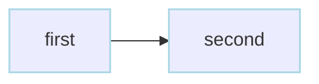

<a href="/writing-workflows/basics#sequential-execution" class="learn-more">Learn more →</a>

</div>

<div class="example-card">

### Parallel Execution (Array Syntax)

```yaml
steps:
  - echo "Setup"
  - 
    - echo "Task A"
    - echo "Task B"
    - echo "Task C"
  - echo "Cleanup"
```

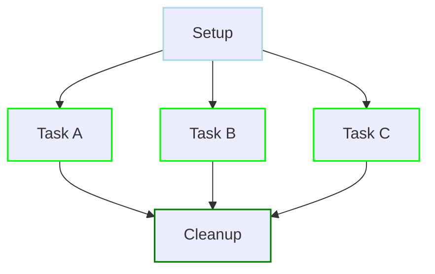

<a href="/writing-workflows/basics#shorthand-parallel-syntax" class="learn-more">Learn more →</a>

</div>

<div class="example-card">

### Parallel Execution (Iterator)

```yaml
steps:
  - call: processor
    parallel:
      items: [A, B, C]
      maxConcurrent: 2
    params: "ITEM=${ITEM}"

---
name: processor
steps:
  - echo "Processing ${ITEM}"
```

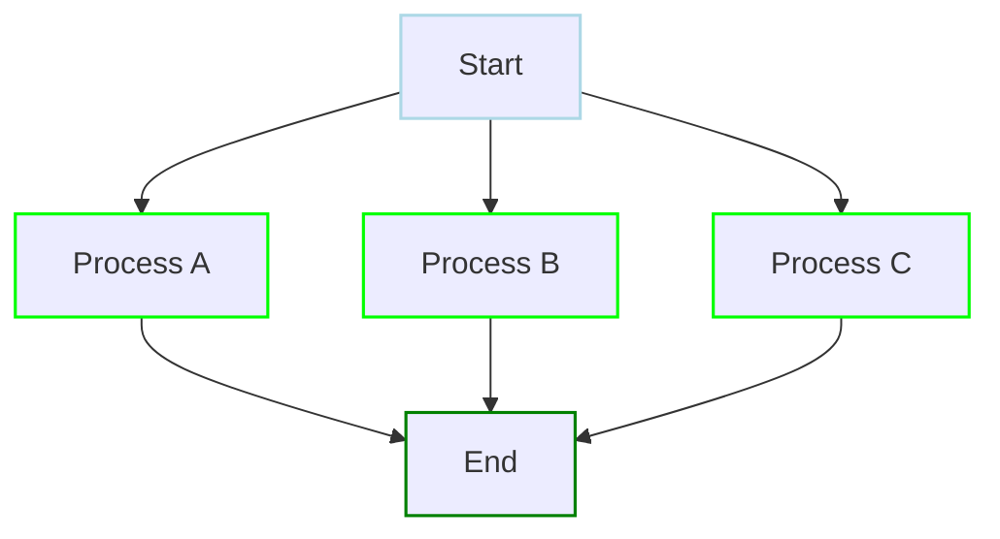

<a href="/features/execution-control#parallel" class="learn-more">Learn more →</a>

</div>

<div class="example-card">

### Execution Mode: Chain vs Graph

```yaml
# Default (chain): steps run in order
type: chain
steps:
  - echo "step 1"
  - echo "step 2"  # Automatically depends on previous

# Graph mode: only explicit dependencies
---
type: graph
steps:
  - name: a
    command: echo A
    depends: []   # Explicitly independent
  - name: b
    command: echo B
    depends: []
```

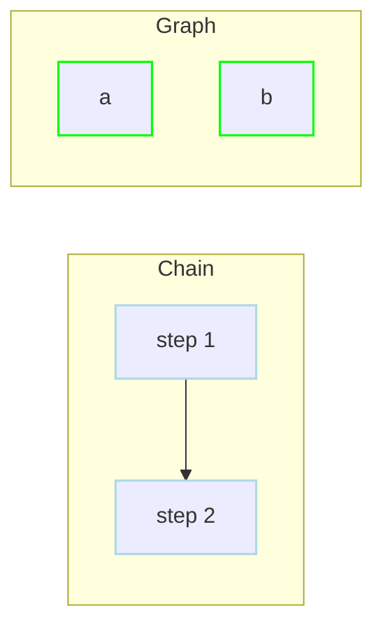

<a href="/writing-workflows/basics#parallel-execution" class="learn-more">Learn more →</a>

</div>

</div>

## Control Flow & Conditions

<div class="examples-grid">

<div class="example-card">

### Conditional Execution

```yaml
steps:
  - command: echo "Deploying application"
    preconditions:
      - condition: "${ENV}"
        expected: "production"
```

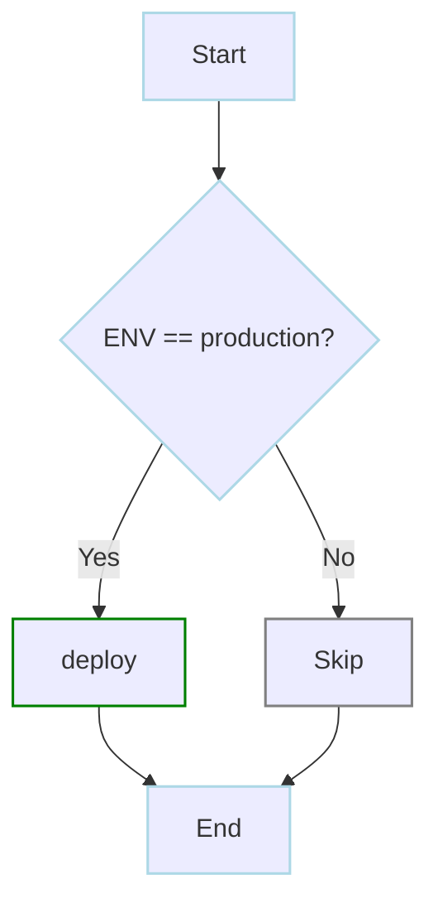

<a href="/writing-workflows/control-flow#conditions" class="learn-more">Learn more →</a>

</div>

<div class="example-card">

### Complex Preconditions

```yaml
steps:
  - name: conditional-task
    command: echo "Processing task"
    preconditions:
      - test -f /data/input.csv
      - test -s /data/input.csv  # File exists and is not empty
      - condition: "${ENVIRONMENT}"
        expected: "production"
      - condition: "`date '+%d'`"
        expected: "re:0[1-9]"  # First 9 days of month
      - condition: "`df -h /data | awk 'NR==2 {print $5}' | sed 's/%//'`"
        expected: "re:^[0-7][0-9]$"  # Less than 80% disk usage
```

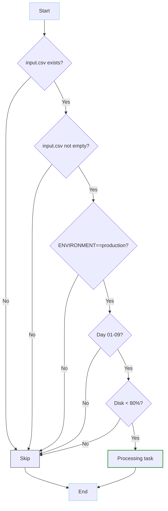

<a href="/writing-workflows/control-flow#preconditions" class="learn-more">Learn more →</a>

</div>

<div class="example-card">

### Repeat Until Condition

```yaml
steps:
  - command: curl -f http://service/health
    repeatPolicy:
      repeat: true
      intervalSec: 10
      exitCode: [1]  # Repeat while exit code is 1
```

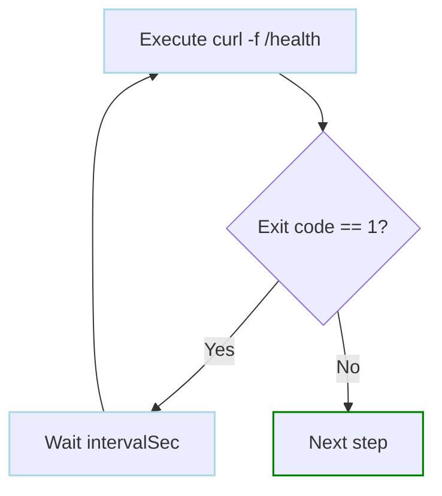

<a href="/writing-workflows/control-flow#repeat" class="learn-more">Learn more →</a>

</div>

<div class="example-card">

### Repeat Until Command Succeeds

```yaml
steps:
  - command: curl -f http://service:8080/health
    repeatPolicy:
      repeat: until        # Repeat UNTIL service is healthy
      exitCode: [0]        # Exit code 0 means success
      intervalSec: 10      # Wait 10 seconds between attempts
      limit: 30            # Maximum 5 minutes
```

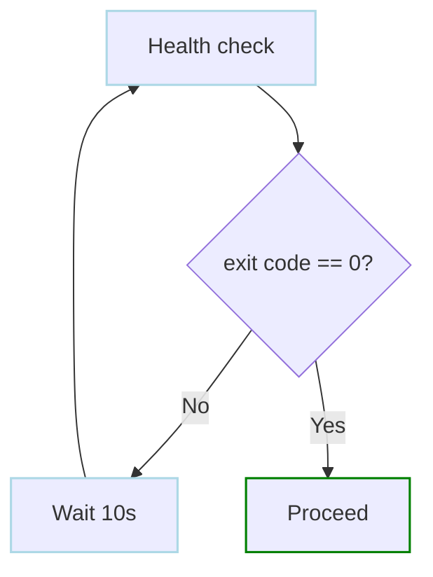

<a href="/writing-workflows/control-flow#repeat" class="learn-more">Learn more →</a>

</div>

<div class="example-card">

### Repeat Until Output Match

```yaml
 steps: 
  - command: echo "COMPLETED"  # Simulates job status check
    output: JOB_STATUS
    repeatPolicy:
      repeat: until        # Repeat UNTIL job completes
      condition: "${JOB_STATUS}"
      expected: "COMPLETED"
      intervalSec: 30
      limit: 120           # Maximum 1 hour (120 attempts)
```

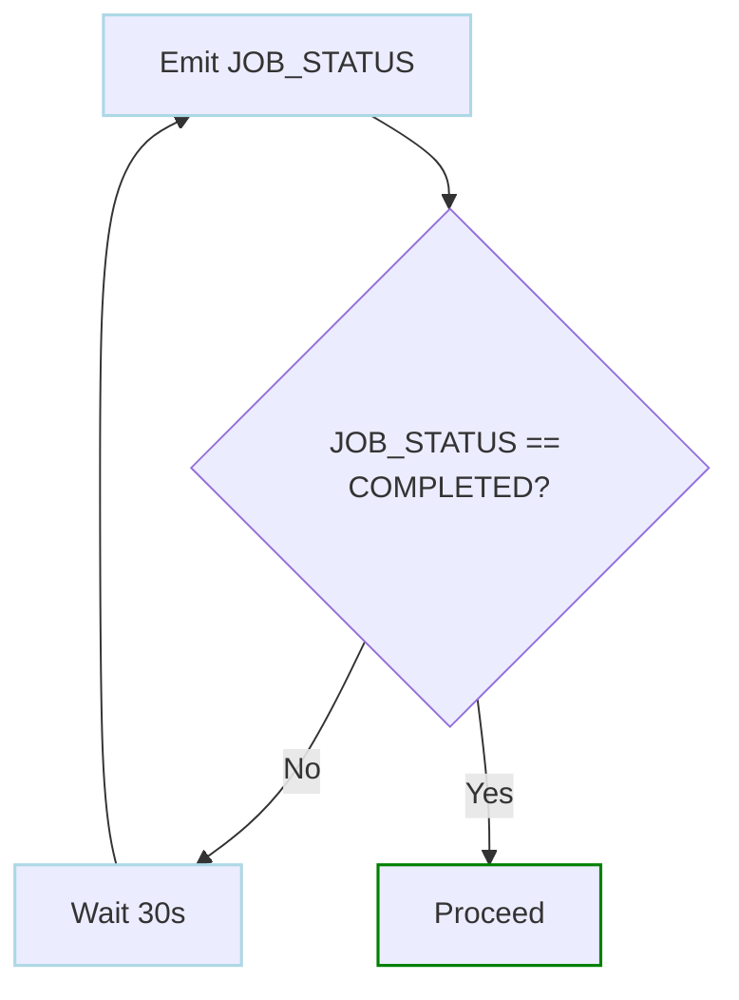

<a href="/writing-workflows/control-flow#repeat" class="learn-more">Learn more →</a>

</div>

<div class="example-card">

### Repeat Steps

```yaml
steps:
  - command: echo "heartbeat"  # Sends heartbeat signal
    repeatPolicy:
      repeat: while            # Repeat indefinitely while successful
      intervalSec: 60
```

<a href="/writing-workflows/control-flow#repeat-basic" class="learn-more">Learn more →</a>

</div>

<div class="example-card">

### Repeat Steps Until Success

```yaml
steps:
  - command: echo "Checking status"
    repeatPolicy:
      repeat: until        # Repeat until exit code 0
      exitCode: [0]
      intervalSec: 30
      limit: 20            # Maximum 10 minutes
```

<a href="/writing-workflows/control-flow#repeat-basic" class="learn-more">Learn more →</a>

</div>

<div class="example-card">

### DAG-Level Preconditions

```yaml
preconditions:
  - condition: "`date +%u`"
    expected: "re:[1-5]"  # Weekdays only

steps:
  - echo "Run on business days"
```

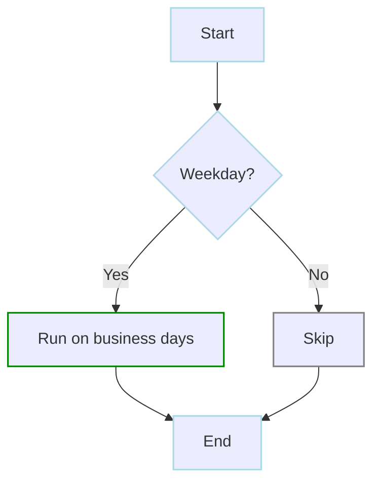

<a href="/writing-workflows/control-flow#dag-level-conditions" class="learn-more">Learn more →</a>

</div>

<div class="example-card">

### Continue On: Exit Codes and Output

```yaml
steps:
  - command: exit 3  # This will exit with code 3
    continueOn:
      exitCode: [0, 3]        # Treat 0 and 3 as non-fatal
      output:
        - "WARNING"
        - "re:^INFO:.*"       # Regex match
      markSuccess: true       # Mark as success when matched
  - echo "Continue regardless"
```

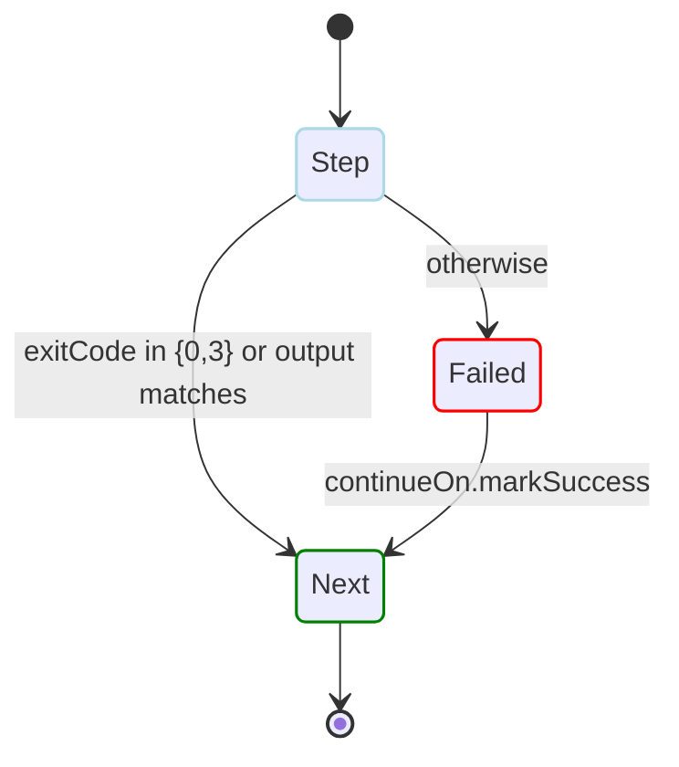

<a href="/reference/continue-on" class="learn-more">Learn more →</a>

</div>

<div class="example-card">

### Nested Workflows

```yaml
steps:
  - call: etl.yaml
    params: "ENV=prod DATE=today"
  - call: analyze.yaml
```

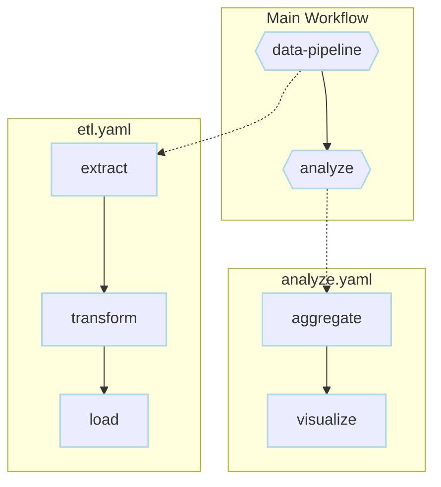

<a href="/features/executors/dag" class="learn-more">Learn more →</a>

</div>

<div class="example-card">

### Multiple DAGs in One File

```yaml
steps:
  - call: data-processor
    params: "TYPE=daily"

---

name: data-processor
params:
  - TYPE: "batch"
steps:
  - echo "Extracting ${TYPE} data"
  - echo "Transforming data"
```

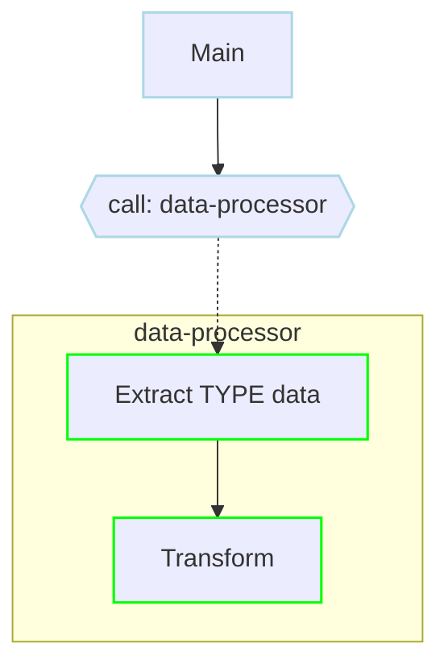

<a href="/writing-workflows/control-flow#multiple-dags-in-one-file" class="learn-more">Learn more →</a>

</div>

<div class="example-card">

### Dispatch to Specific Workers

```yaml
steps:
  - python prepare_dataset.py
  - call: train-model
  - call: evaluate-model

---
name: train-model
workerSelector:
  gpu: "true"
  cuda: "11.8"
  memory: "64G"
steps:
  - python train.py --gpu

---
name: evaluate-model
workerSelector:
  gpu: "true"
steps:
  - python evaluate.py
```

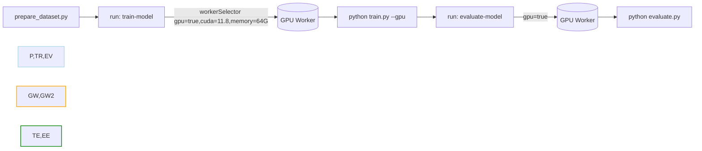

<a href="/features/distributed-execution" class="learn-more">Learn more →</a>

</div>

<div class="example-card">

### Mixed Local and Worker Steps

```yaml
steps:
  # Runs on any available worker (local or remote)
  - wget https://data.example.com/dataset.tar.gz
    
  # Must run on specific worker type
  - call: process-on-gpu
    
  # Runs locally (no selector)
  - echo "Processing complete"

---
name: process-on-gpu
workerSelector:
  gpu: "true"
  gpu-model: "nvidia-a100"
steps:
  - python gpu_process.py
```

<a href="/features/distributed-execution#task-routing" class="learn-more">Learn more →</a>

</div>

<div class="example-card">

### Parallel Distributed Tasks

```yaml
steps:
  - command: python split_data.py --chunks=10
    output: CHUNKS
  - call: chunk-processor
    parallel:
      items: ${CHUNKS}
      maxConcurrent: 5
    params: "CHUNK=${ITEM}"
  - python merge_results.py

---
name: chunk-processor
workerSelector:
  memory: "16G"
  cpu-cores: "8"
params:
  - CHUNK: ""
steps:
  - python process_chunk.py ${CHUNK}
```

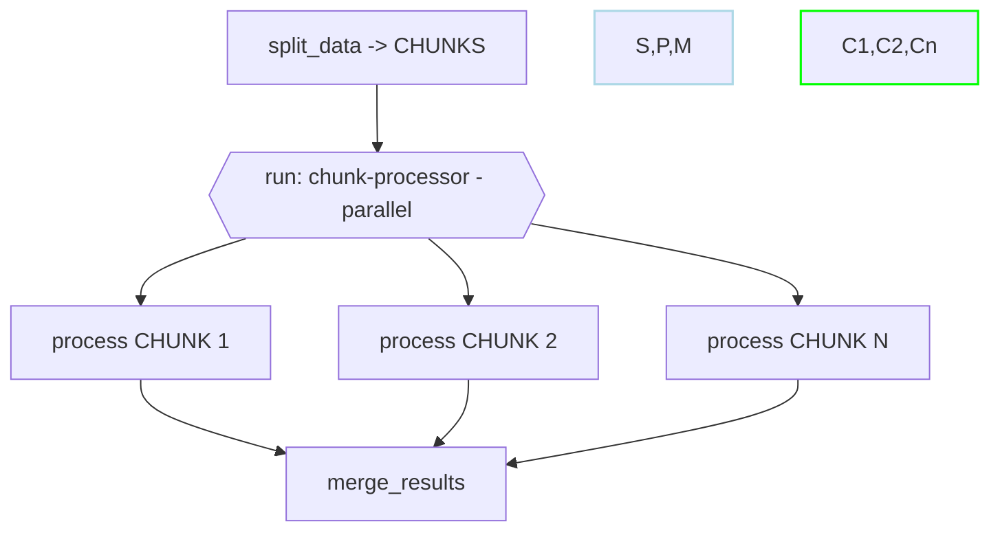

<a href="/features/execution-control#parallel" class="learn-more">Learn more →</a>

</div>

</div>

## Error Handling & Reliability

<div class="examples-grid">

<div class="example-card">

### Continue on Failure

```yaml
steps:
  # Optional task that may fail
  - command: exit 1  # This will fail
    continueOn:
      failure: true
  # This step always runs
  - echo "This must succeed"
```

<a href="/writing-workflows/error-handling#continue" class="learn-more">Learn more →</a>

</div>

<div class="example-card">

### Continue on Skipped

```yaml
steps:
  # Optional step that may be skipped
  - command: echo "Enabling feature"
    preconditions:
      - condition: "${FEATURE_FLAG}"
        expected: "enabled"
    continueOn:
      skipped: true
  # This step always runs
  - echo "Processing main task"
```

<a href="/writing-workflows/control-flow#continue-on-skipped" class="learn-more">Learn more →</a>

</div>

<div class="example-card">

### Retry on Failure

```yaml
steps:
  - command: curl https://api.example.com
    retryPolicy:
      limit: 3
      intervalSec: 30
```

<a href="/writing-workflows/error-handling#retry" class="learn-more">Learn more →</a>

</div>

<div class="example-card">

### Smart Retry Policies

```yaml
steps:
  - command: curl -f https://api.example.com/data
    retryPolicy:
      limit: 5
      intervalSec: 30
      exitCodes: [429, 503, 504]  # Rate limit, service unavailable
```

<a href="/writing-workflows/error-handling#retry" class="learn-more">Learn more →</a>

</div>

<div class="example-card">

### Retry with Exponential Backoff

```yaml
steps:
  - command: curl https://api.example.com/data
    retryPolicy:
      limit: 5
      intervalSec: 2
      backoff: true        # 2x multiplier
      maxIntervalSec: 60   # Cap at 60s
      # Intervals: 2s, 4s, 8s, 16s, 32s → 60s
```

<a href="/writing-workflows/error-handling#exponential-backoff" class="learn-more">Learn more →</a>

</div>

<div class="example-card">

### Repeat with Backoff

```yaml
steps:
  - command: nc -z localhost 8080
    repeatPolicy:
      repeat: while
      exitCode: [1]        # While connection fails
      intervalSec: 1
      backoff: 2.0
      maxIntervalSec: 30
      limit: 20
      # Check intervals: 1s, 2s, 4s, 8s, 16s, 30s...
```

<a href="/writing-workflows/control-flow#exponential-backoff-for-repeats" class="learn-more">Learn more →</a>

</div>

<div class="example-card">

### Lifecycle Handlers

```yaml
steps:
  - echo "Processing main task"
handlerOn:
  success:
    echo "SUCCESS - Workflow completed"
  failure:
    echo "FAILURE - Cleaning up failed workflow"
  exit:
    echo "EXIT - Always cleanup"
```

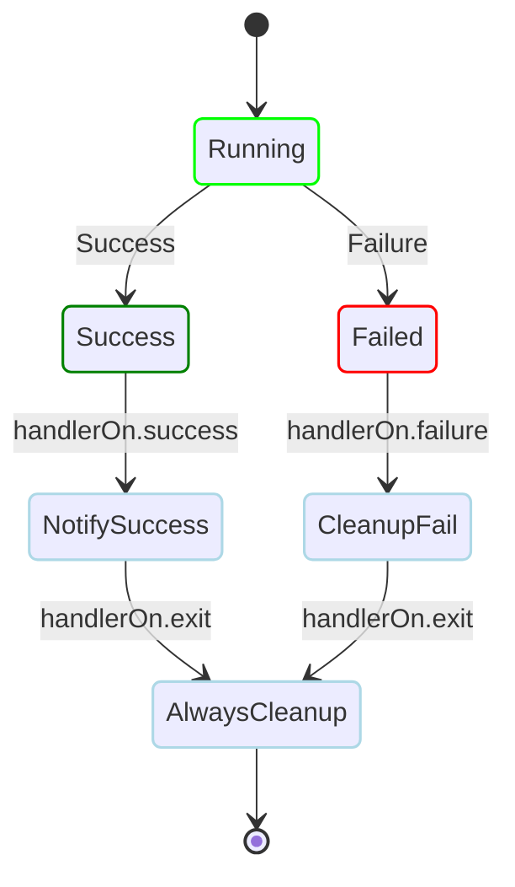

<a href="/writing-workflows/lifecycle-handlers" class="learn-more">Learn more →</a>

</div>

</div>

## Data & Variables

<div class="examples-grid">

<div class="example-card">

### Environment Variables

```yaml
env:
  - SOME_DIR: ${HOME}/batch
  - SOME_FILE: ${SOME_DIR}/some_file
  - LOG_LEVEL: debug
  - API_KEY: ${SECRET_API_KEY}
steps:
  - workingDir: ${SOME_DIR}
    command: python main.py ${SOME_FILE}
```

<a href="/writing-workflows/data-variables#env" class="learn-more">Learn more →</a>

</div>

<div class="example-card">

### Dotenv Files

```yaml
# Specify single dotenv file
dotenv: .env

# Or specify multiple candidate files (only the first found is used)
dotenv:
  - .env
  - .env.local
  - configs/.env.prod

steps:
  - echo "Database: ${DATABASE_URL}"
```

<a href="/writing-workflows/data-variables#dotenv" class="learn-more">Learn more →</a>

</div>

<div class="example-card">

### Secrets from Providers

```yaml
secrets:
  - name: API_TOKEN
    provider: env
    key: PROD_API_TOKEN
  - name: DB_PASSWORD
    provider: file
    key: secrets/db-password

steps:
  - command: ./sync.sh
    env:
      - AUTH_HEADER: "Bearer ${API_TOKEN}"
      - STRICT_MODE: "1"
```

<a href="/writing-workflows/secrets" class="learn-more">Learn more →</a>

</div>

<div class="example-card">

### Positional Parameters

```yaml
params: param1 param2  # Default values for $1 and $2
steps:
  - python main.py $1 $2
```

<a href="/writing-workflows/data-variables#params" class="learn-more">Learn more →</a>

</div>

<div class="example-card">

### Named Parameters

```yaml
params:
  - FOO: 1           # Default value for ${FOO}
  - BAR: "`echo 2`"  # Command substitution in defaults
  - ENVIRONMENT: dev
steps:
  - python main.py ${FOO} ${BAR} --env=${ENVIRONMENT}
```

<a href="/writing-workflows/data-variables#named-params" class="learn-more">Learn more →</a>

</div>

<div class="example-card">

### Output Variables

```yaml
steps:
  - command: echo `date +%Y%m%d`
    output: TODAY
  - echo "Today's date is ${TODAY}"
```

<a href="/writing-workflows/data-variables#output" class="learn-more">Learn more →</a>

</div>

<div class="example-card">

### Parallel Outputs Aggregation

```yaml
steps:
  - call: worker
    parallel:
      items: [east, west, eu]
    params: "REGION=${ITEM}"
    output: RESULTS

  - |
      echo "Total: ${RESULTS.summary.total}"
      echo "First region: ${RESULTS.results[0].params}"
      echo "First output: ${RESULTS.outputs[0].value}"

---
name: worker
params:
  - REGION: ""
steps:
  - command: echo ${REGION}
    output: value
```

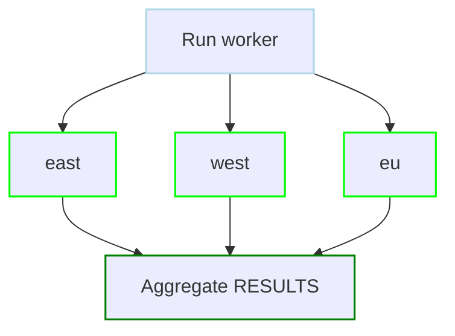

<a href="/features/execution-control#parallel" class="learn-more">Learn more →</a>

</div>

<div class="example-card">

### Special Variables

```yaml
steps:
  - |
      echo "DAG: ${DAG_NAME}"
      echo "Run: ${DAG_RUN_ID}"
      echo "Step: ${DAG_RUN_STEP_NAME}"
      echo "Log: ${DAG_RUN_LOG_FILE}"
```

<a href="/reference/variables#special-environment-variables" class="learn-more">Learn more →</a>

</div>

<div class="example-card">

### Output Size Limits

```yaml
# Set maximum output size to 5MB for all steps
maxOutputSize: 5242880  # 5MB in bytes

steps:
  - command: "cat large-file.txt"
    output: CONTENT  # Will fail if file exceeds 5MB
```

Control output size limits to prevent memory issues.

<a href="/writing-workflows/data-variables#output-limits" class="learn-more">Learn more →</a>

</div>

<div class="example-card">

### Redirect Output to Files

```yaml
steps:
  - command: "echo hello"
    stdout: "/tmp/hello"
  
  - command: "echo error message >&2"
    stderr: "/tmp/error.txt"
```

<a href="/writing-workflows/data-variables#redirect" class="learn-more">Learn more →</a>

</div>

<div class="example-card">

### JSON Path References

```yaml
steps:
  - call: sub_workflow
    output: SUB_RESULT
  - echo "Result: ${SUB_RESULT.outputs.finalValue}"
```

<a href="/writing-workflows/data-variables#json-paths" class="learn-more">Learn more →</a>

</div>

<div class="example-card">

### Step ID References

```yaml
steps:
  - id: extract
    command: python extract.py
    output: DATA
  - command: |
      echo "Exit code: ${extract.exitCode}"
      echo "Stdout path: ${extract.stdout}"
    depends: extract
```

<a href="/writing-workflows/data-variables#step-references" class="learn-more">Learn more →</a>

</div>

<div class="example-card">

### Command Substitution

```yaml
env:
  TODAY: "`date '+%Y%m%d'`"
steps:
  - echo hello, today is ${TODAY}
```

<a href="/writing-workflows/data-variables#command-substitution" class="learn-more">Learn more →</a>

</div>

</div>

## Scripts & Code

<div class="examples-grid">

<div class="example-card">

### Shell Scripts

```yaml
steps:
  - script: |
      #!/bin/bash
      cd /tmp
      echo "hello world" > hello
      cat hello
      ls -la
```

Run shell script with default shell.

<a href="/writing-workflows/basics#scripts" class="learn-more">Learn more →</a>

</div>

<div class="example-card">

### Shebang Script

```yaml
steps:
  - script: |
      #!/usr/bin/env python3
      import platform
      print(platform.python_version())
```

Runs with the interpreter declared in the shebang.

<a href="/writing-workflows/basics#scripts" class="learn-more">Learn more →</a>

</div>

<div class="example-card">

### Python Scripts

```yaml
steps:
  - command: python
    script: |
      import os
      import datetime
      
      print(f"Current directory: {os.getcwd()}")
      print(f"Current time: {datetime.datetime.now()}")
```

Execute script with specific interpreter.

<a href="/writing-workflows/basics#scripts" class="learn-more">Learn more →</a>

</div>

<div class="example-card">

### Multi-Step Scripts

```yaml
steps:
  - script: |
      #!/bin/bash
      set -e
      
      echo "Starting process..."
      echo "Preparing environment"
      
      echo "Running main task..."
      echo "Running main process"
      
      echo "Cleaning up..."
      echo "Cleaning up"
```

<a href="/writing-workflows/basics#scripts" class="learn-more">Learn more →</a>

</div>

<div class="example-card">

### Working Directory

```yaml
workingDir: /tmp
steps:
  - pwd               # Outputs: /tmp
  - mkdir -p data
  - workingDir: /tmp/data
    command: pwd      # Outputs: /tmp/data
```

<a href="/writing-workflows/basics#working-directory" class="learn-more">Learn more →</a>

</div>

<div class="example-card">

### Shell Selection

```yaml
steps:
  - command: echo hello world | xargs echo
    shell: bash
```

<a href="/writing-workflows/basics#shell" class="learn-more">Learn more →</a>

</div>

<div class="example-card">

### Reproducible Env with Nix Shell

> **Note:** Requires nix-shell to be installed separately. Not included in Dagu binary or container.

```yaml
steps:
  - shell: nix-shell
    shellPackages: [python3, curl, jq]
    command: |
      python3 --version
      curl --version
      jq --version
```

<a href="/features/executors/shell#nix-shell" class="learn-more">Learn more →</a>

</div>

</div>

## Executors & Integrations

<div class="examples-grid">

<div class="example-card">

### Container Workflow

```yaml
# DAG-level container for all steps
container:
  image: python:3.11
  env:
    - PYTHONPATH=/app
  volumes:
    - ./src:/app

steps:
  - pip install -r requirements.txt
  - pytest tests/
  - python setup.py build
```

<a href="/reference/yaml#container-configuration" class="learn-more">Learn more →</a>

</div>

<div class="example-card">

### Keep Container Running

```yaml
# Use keepContainer at DAG level
container:
  image: postgres:16
  keepContainer: true
  env:
    - POSTGRES_PASSWORD=secret
  ports:
    - "5432:5432"

steps:
  - postgres -D /var/lib/postgresql/data
  - command: pg_isready -U postgres -h localhost
    retryPolicy:
      limit: 10
      intervalSec: 2
```

<a href="/reference/yaml#container-configuration" class="learn-more">Learn more →</a>

</div>

<div class="example-card">

### Per-Step Docker Executor

```yaml
steps:
  - executor:
      type: docker
      config:
        image: node:18
    command: npm run build
```

<a href="/features/executors/docker" class="learn-more">Learn more →</a>

</div>

<div class="example-card">

### GitHub Actions (Experimental)

```yaml
secrets:
  - name: GITHUB_TOKEN
    provider: env
    key: GITHUB_TOKEN

workingDir: /tmp/workspace
steps:
  - command: actions/checkout@v4
    executor:
      type: gha
    params:
      repository: dagu-org/dagu
      ref: main
      token: "${GITHUB_TOKEN}"
```

<a href="/features/executors/github-actions" class="learn-more">Learn more →</a>

</div>

<div class="example-card">

### Remote Commands via SSH

```yaml
# Configure SSH once for all steps
ssh:
  user: deploy
  host: production.example.com
  key: ~/.ssh/deploy_key

steps:
  - curl -f localhost:8080/health
  - systemctl restart myapp
```

<a href="/features/executors/ssh" class="learn-more">Learn more →</a>

</div>

<div class="example-card">

### Container Volumes: Relative Paths

```yaml
workingDir: /app/project
container:
  image: python:3.11
  volumes:
    - ./data:/data        # Resolves to /app/project/data:/data
    - .:/workspace        # Resolves to /app/project:/workspace
steps:
  - python process.py
```

<a href="/reference/yaml#working-directory-and-volume-resolution" class="learn-more">Learn more →</a>

</div>

<div class="example-card">

### HTTP Requests

```yaml
steps:
  - command: POST https://api.example.com/webhook
    executor:
      type: http
      config:
        headers:
          Content-Type: application/json
        body: '{"status": "started"}'
    
```

<a href="/features/executors/http" class="learn-more">Learn more →</a>

</div>

<div class="example-card">

### JSON Processing

```yaml
steps:
  # Fetch sample users from a public mock API
  - command: GET https://reqres.in/api/users
    executor:
      type: http
      config:
        silent: true
    
    output: API_RESPONSE
   
  # Extract user emails from the JSON response
  - command: '.data[] | .email'
    executor: jq
    script: ${API_RESPONSE}
```

<a href="/features/executors/jq" class="learn-more">Learn more →</a>

</div>

<div class="example-card">

### Container Startup & Readiness

```yaml
container:
  image: alpine:latest
  startup: command           # keepalive | entrypoint | command
  command: ["sh", "-c", "my-daemon"]
  waitFor: healthy           # running | healthy
  logPattern: "Ready"        # Optional regex to wait for
  restartPolicy: unless-stopped

steps:
  - echo "Service is ready"
```

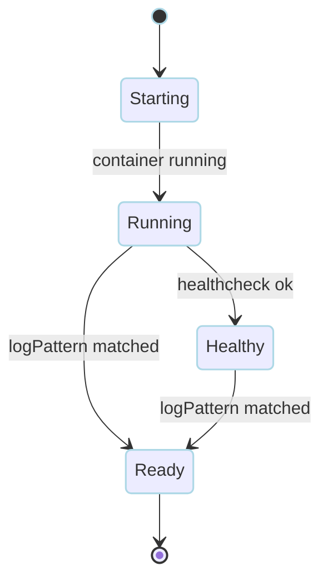

<a href="/writing-workflows/container#startup-modes" class="learn-more">Learn more →</a>

</div>

<div class="example-card">

### Private Registry Auth

```yaml
registryAuths:
  ghcr.io:
    username: ${GITHUB_USER}
    password: ${GITHUB_TOKEN}

container:
  image: ghcr.io/myorg/private-app:latest

steps:
  - ./app
```

<a href="/features/executors/docker#registry-authentication" class="learn-more">Learn more →</a>

</div>

<div class="example-card">

### Exec in Existing Container

```yaml
steps:
  - executor:
      type: docker
      config:
        containerName: my-running-container
        exec:
          user: root
          workingDir: /work
    command: echo "inside existing container"
```

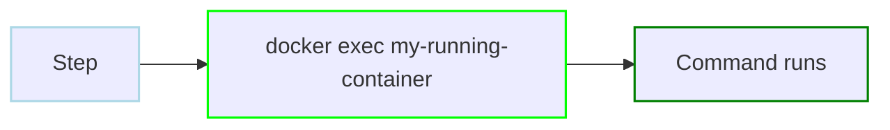

<a href="/reference/executors#execute-in-existing-container" class="learn-more">Learn more →</a>

</div>

<div class="example-card">

### SSH: Advanced Options

```yaml
ssh:
  user: deploy
  host: app.example.com
  port: 2222
  key: ~/.ssh/deploy_key
  strictHostKey: true
  knownHostFile: ~/.ssh/known_hosts

steps:
  - systemctl status myapp
```

<a href="/reference/yaml#ssh-configuration" class="learn-more">Learn more →</a>

</div>

<div class="example-card">

### Mail Executor

```yaml
smtp:
  host: smtp.gmail.com
  port: "587"
  username: "${SMTP_USER}"
  password: "${SMTP_PASS}"

steps:
  - executor:
      type: mail
      config:
        to: team@example.com
        from: noreply@example.com
        subject: "Weekly Report"
        message: "Attached."
        attachments:
          - report.txt
```

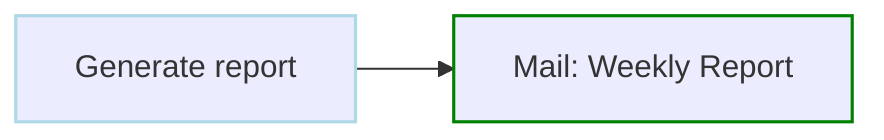

<a href="/features/executors/mail" class="learn-more">Learn more →</a>

</div>

</div>

## Scheduling & Automation

<div class="examples-grid">

<div class="example-card">

### Basic Scheduling

```yaml
schedule: "5 4 * * *"  # Run at 04:05 daily
steps:
  - echo "Running scheduled job"
```

<a href="/features/scheduling" class="learn-more">Learn more →</a>

</div>

<div class="example-card">

### Skip Redundant Runs

```yaml
schedule: "0 */4 * * *"    # Every 4 hours
skipIfSuccessful: true     # Skip if already succeeded
steps:
  - echo "Extracting data"
  - echo "Transforming data"
  - echo "Loading data"
```

<a href="/features/scheduling#skip-redundant" class="learn-more">Learn more →</a>

</div>

<div class="example-card">

### Queue Management

```yaml
queue: "batch"        # Assign to named queue
maxActiveRuns: 2      # Max concurrent runs
steps:
  - echo "Processing data"
```

<a href="/features/queues" class="learn-more">Learn more →</a>

</div>

<div class="example-card">

### Multiple Schedules

```yaml
schedule:
  - "0 9 * * MON-FRI"   # Weekdays 9 AM
  - "0 14 * * SAT,SUN"  # Weekends 2 PM
steps:
  - echo "Run on multiple times"
```

<a href="/features/scheduling#multiple-schedules" class="learn-more">Learn more →</a>

</div>

<div class="example-card">

### Timezone

```yaml
schedule: "CRON_TZ=America/New_York 0 9 * * *"
steps:
  - echo "9AM New York"
```

<a href="/features/scheduling#timezone-support" class="learn-more">Learn more →</a>

</div>

<div class="example-card">

### Start/Stop/Restart Windows

```yaml
schedule:
  start: "0 8 * * *"     # Start 8 AM
  restart: "0 12 * * *"  # Restart noon
  stop: "0 18 * * *"     # Stop 6 PM
restartWaitSec: 60
steps:
  - echo "Long-running service"
```

<a href="/features/scheduling#restart-schedule" class="learn-more">Learn more →</a>

</div>

<div class="example-card">

### Global Queue Configuration

```yaml
# Global queue config in ~/.config/dagu/config.yaml
queues:
  enabled: true
  config:
    - name: "critical"
      maxConcurrency: 5
    - name: "batch"
      maxConcurrency: 1

# DAG file
queue: "critical"
maxActiveRuns: 3
steps:
  - echo "Processing critical task"
```

Configure queues globally and per-DAG.

<a href="/features/queues#advanced" class="learn-more">Learn more →</a>

</div>

<div class="example-card">

### Email Notifications

```yaml
mailOn:
  failure: true
  success: true
smtp:
  host: smtp.gmail.com
  port: "587"
  username: "${SMTP_USER}"
  password: "${SMTP_PASS}"
steps:
  - command: echo "Running critical job"
    mailOnError: true
```

<a href="/features/notifications#email" class="learn-more">Learn more →</a>

</div>

</div>

## Operations & Production

<div class="examples-grid">

<div class="example-card">

### History Retention

```yaml
histRetentionDays: 30    # Keep 30 days of history
schedule: "0 0 * * *"     # Daily at midnight
steps:
  - echo "Archiving old data"
  - rm -rf /tmp/archive/*
```

Control how long execution history is retained.

<a href="/reference/yaml#data-fields" class="learn-more">Learn more →</a>

</div>

<div class="example-card">

### Output Size Management

```yaml
maxOutputSize: 10485760   # 10MB max output per step
steps:
  - command: echo "Analyzing logs"
    stdout: /logs/analysis.out
  - tail -n 1000 /logs/analysis.out
```

<a href="/reference/yaml#data-fields" class="learn-more">Learn more →</a>

</div>

<div class="example-card">

### Custom Log Directory

```yaml
logDir: /data/etl/logs/${DAG_NAME}
histRetentionDays: 90
steps:
  - command: echo "Extracting data"
    stdout: extract.log
    stderr: extract.err
  - command: echo "Transforming data"
    stdout: transform.log
```

Organize logs in custom directories with retention.

<a href="/reference/yaml#data-fields" class="learn-more">Learn more →</a>

</div>

<div class="example-card">

### Timeout & Cleanup

```yaml
timeoutSec: 7200          # 2 hour timeout
maxCleanUpTimeSec: 600    # 10 min cleanup window
steps:
  - command: sleep 5 && echo "Processing data"
    signalOnStop: SIGTERM
handlerOn:
  exit:
    command: echo "Cleaning up resources"
```

<a href="/reference/yaml#execution-control-fields" class="learn-more">Learn more →</a>

</div>

<div class="example-card">

### Production Monitoring

```yaml
histRetentionDays: 365    # Keep 1 year for compliance
maxOutputSize: 5242880    # 5MB output limit
maxActiveRuns: 1          # No overlapping runs
mailOn:
  failure: true
errorMail:
  from: alerts@company.com
  to: oncall@company.com
  prefix: "[CRITICAL]"
  attachLogs: true
infoMail:
  from: notifications@company.com
  to: team@company.com
  prefix: "[SUCCESS]"
handlerOn:
  failure:
    command: |
      curl -X POST https://metrics.company.com/alerts \
        -H "Content-Type: application/json" \
        -d '{"service": "critical-service", "status": "failed"}'
steps:
  - command: echo "Checking health"
    retryPolicy:
      limit: 3
      intervalSec: 30
```

<a href="/reference/yaml" class="learn-more">Learn more →</a>

</div>

<div class="example-card">

### Distributed Tracing

```yaml
otel:
  enabled: true
  endpoint: "otel-collector:4317"
  resource:
    service.name: "dagu-${DAG_NAME}"
    deployment.environment: "${ENV}"
steps:
  - echo "Fetching data"
  - python process.py
  - call: pipelines/transform
```

Enable OpenTelemetry tracing for observability.

<a href="/features/opentelemetry" class="learn-more">Learn more →</a>

</div>

<div class="example-card">

### Execution Control

```yaml
maxActiveSteps: 5         # Max 5 parallel steps
maxActiveRuns: 2          # Max 2 concurrent DAG runs
delaySec: 10              # 10 second initial delay
skipIfSuccessful: true    # Skip if already succeeded
steps:
  - name: validate
    command: echo "Validating configuration"
  - name: process-batch-1
    command: echo "Processing batch 1"
    depends: validate
  - name: process-batch-2
    command: echo "Processing batch 2"
    depends: validate
  - name: process-batch-3
    command: echo "Processing batch 3"
    depends: validate
```

<a href="/reference/yaml#execution-control-fields" class="learn-more">Learn more →</a>

</div>

<div class="example-card">

### Queuing

```yaml
queue: compute-queue      # Assign to specific queue
steps:
  - echo "Preparing data"
  - echo "Running intensive computation"
  - echo "Storing results"
```

<a href="/features/queues" class="learn-more">Learn more →</a>

</div>

<div class="example-card">

### Limit History Retention

```yaml
histRetentionDays: 60     # Keep 60 days history
steps:
  - echo "Running periodic maintenance"
```

<a href="/features/queues" class="learn-more">Learn more →</a>

</div>

<div class="example-card">

### Lock Down Run Inputs

```yaml
runConfig:
  disableParamEdit: true   # Prevent editing params at start
  disableRunIdEdit: true   # Prevent custom run IDs

params:
  - ENVIRONMENT: production
  - VERSION: 1.0.0
```

<a href="/reference/yaml#runconfig" class="learn-more">Learn more →</a>

</div>

<div class="example-card">

### Complete DAG Configuration

```yaml
description: Daily ETL pipeline for analytics
schedule: "0 2 * * *"
skipIfSuccessful: true
group: DataPipelines
tags: daily,critical
queue: etl-queue
maxActiveRuns: 1
maxOutputSize: 5242880  # 5MB
histRetentionDays: 90   # Keep history for 90 days
env:
  - LOG_LEVEL: info
  - DATA_DIR: /data/analytics
params:
  - DATE: "`date '+%Y-%m-%d'`"
  - ENVIRONMENT: production
mailOn:
  failure: true
smtp:
  host: smtp.company.com
  port: "587"
handlerOn:
  success:
    command: echo "ETL completed successfully"
  failure:
    command: echo "Cleaning up after failure"
  exit:
    command: echo "Final cleanup"
steps:
  - name: validate-environment
    command: echo "Validating environment: ${ENVIRONMENT}"
```

<a href="/reference/yaml" class="learn-more">Learn more →</a>

</div>

</div>
