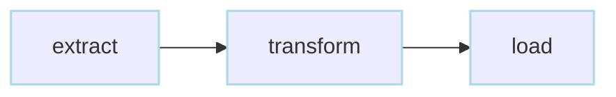
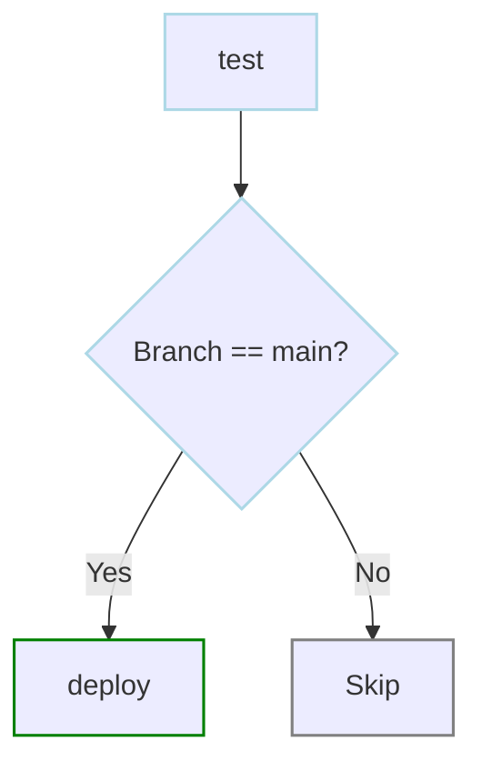
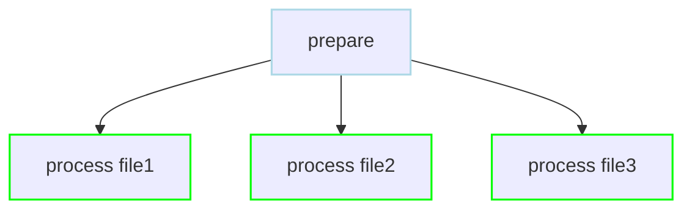

# Writing Workflows

## Workflow Structure

Every DAG is defined in a YAML file with this basic structure:

```yaml
# my-workflow.yaml
name: my-workflow          # Optional: defaults to filename
description: "What this workflow does"

# Workflow-level configurations
schedule: "0 * * * *"      # Optional: cron schedule
maxActiveRuns: 1           # Optional: concurrency limit

# Parameters passed at runtime
params:
  - KEY: default_value

# Environment variables
env:
  - VAR_NAME: value

# The actual workflow steps
steps:
  - name: step-name
    command: echo "Hello"
```

## Base DAG Configuration

Dagu supports a powerful feature called **base DAG configuration** that allows you to share common settings across all your DAGs. This helps maintain consistency and reduces duplication.

### How It Works

You can create a base configuration file that all DAGs inherit from:

```yaml
# ~/.config/dagu/base.yaml (or specified in your config)
env:
  - LOG_LEVEL: info
  - ENVIRONMENT: production
  - SLACK_WEBHOOK: ${SLACK_WEBHOOK_URL}

smtp:
  host: smtp.company.com
  port: "587"
  username: ${SMTP_USER}
  password: ${SMTP_PASS}

errorMail:
  from: alerts@company.com
  to: oncall@company.com
  prefix: "[ALERT]"
  attachLogs: true

histRetentionDays: 30
logDir: /var/log/dagu
maxActiveRuns: 5
```

### Using Base Configuration

Any DAG automatically inherits settings from the base configuration:

```yaml
# my-workflow.yaml
name: data-pipeline
description: Daily data processing

# This DAG automatically inherits:
# - All env variables from base
# - SMTP configuration
# - Error mail settings
# - histRetentionDays, logDir, maxActiveRuns

# You can override base settings
env:
  - LOG_LEVEL: debug  # Overrides the base value
  - CUSTOM_VAR: value # Adds to base env

maxActiveRuns: 1  # Overrides base value of 5

steps:
  - name: process
    command: ./process.sh
```

### Configuration Precedence

Settings are applied in this order (later overrides earlier):

1. **System defaults** - Built-in Dagu defaults
2. **Base configuration** - From base.yaml
3. **DAG configuration** - From your workflow file
4. **Runtime parameters** - Command line arguments

### Common Use Cases

1. **Shared Environment Variables**
   ```yaml
   # base.yaml
   env:
     - AWS_REGION: us-east-1
     - DATA_BUCKET: s3://company-data
     - API_ENDPOINT: https://api.company.com
   ```

2. **Standard Error Handling**
   ```yaml
   # base.yaml
   mailOn:
     failure: true
   
   errorMail:
     from: dagu@company.com
     to: alerts@company.com
     attachLogs: true
   ```

3. **Consistent Logging**
   ```yaml
   # base.yaml
   logDir: /var/log/dagu
   histRetentionDays: 30
   maxOutputSize: 5242880  # 5MB
   ```

4. **Default Executors**
   ```yaml
   # base.yaml
   env:
     - DOCKER_REGISTRY: registry.company.com
   ```

## Your Journey

This guide is organized to take you from basics to advanced patterns:

### 1. [Basics](/writing-workflows/basics)
Start here to understand:
- Creating and organizing steps
- Running commands and scripts
- Setting up dependencies
- Basic workflow structure

### 2. [Control Flow](/writing-workflows/control-flow)
Control how your workflow executes:
- Serial vs parallel execution
- Conditional execution with preconditions
- Loops and repeat patterns
- Skipping and continuing

### 3. [Data & Variables](/writing-workflows/data-variables)
Work with data in your workflows:
- Parameters and runtime values
- Environment variables
- Passing data between steps
- Output variables and references

### 4. [Error Handling](/writing-workflows/error-handling)
Build resilient workflows:
- Retry strategies
- Failure handling
- Lifecycle handlers
- Notifications and alerts

### 5. [Advanced Patterns](/writing-workflows/advanced)
Master complex workflows:
- Hierarchical composition
- Dynamic workflows
- Performance optimization
- Best practices

## Quick Example

Here's a complete workflow that demonstrates key concepts:

```yaml
name: data-processor
description: Process daily data files

# Run daily at 2 AM
schedule: "0 2 * * *"

# Parameters with defaults
params:
  - DATE: "`date +%Y-%m-%d`"
  - ENV: dev

# Environment setup
env:
  - DATA_DIR: /tmp/data/${DATE}
  - LOG_LEVEL: info

steps:
  # Download data
  - name: download
    command: |
      mkdir -p ${DATA_DIR}
      aws s3 cp s3://bucket/data/${DATE}.csv ${DATA_DIR}/
    retryPolicy:
      limit: 3
      intervalSec: 60

  # Validate before processing
  - name: validate
    command: python validate.py ${DATA_DIR}/${DATE}.csv
    depends: download
    continueOn:
      failure: false  # Stop if validation fails

  # Process in parallel
  - name: process
    parallel: [users, orders, products]
    command: python process.py --type=$ITEM --date=${DATE}
    depends: validate
    output: PROCESSED_${ITEM}

  # Generate report
  - name: report
    command: python generate_report.py --date=${DATE}
    depends: process
    env:
      - REPORT_FORMAT: pdf

# Handle success/failure
handlerOn:
  success:
    command: echo "Pipeline completed for ${DATE}"
  failure:
    command: ./notify_failure.sh "${DATE}"
```

## Common Patterns

### ETL Pipeline
```yaml
steps:
  - name: extract
    command: ./extract.sh
  - name: transform
    command: ./transform.sh
    depends: extract
  - name: load
    command: ./load.sh
    depends: transform
```



### Conditional Deployment
```yaml
steps:
  - name: test
    command: npm test
  - name: deploy
    command: ./deploy.sh
    depends: test
    preconditions:
      - condition: "${BRANCH}"
        expected: "main"
```



### Parallel Processing
```yaml
steps:
  - name: prepare
    command: ./prepare.sh
  - name: process
    parallel: [file1, file2, file3]
    command: ./process.sh $ITEM
    depends: prepare
```



## See Also

Ready to start building? Head to the [Basics](/writing-workflows/basics) section to begin your journey.

Or jump to a specific topic:
- [Control Flow](/writing-workflows/control-flow) - Manage execution flow
- [Data & Variables](/writing-workflows/data-variables) - Work with data
- [Error Handling](/writing-workflows/error-handling) - Build resilient workflows
- [Advanced Patterns](/writing-workflows/advanced) - Master complex scenarios
