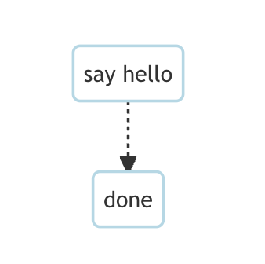
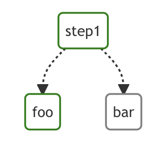
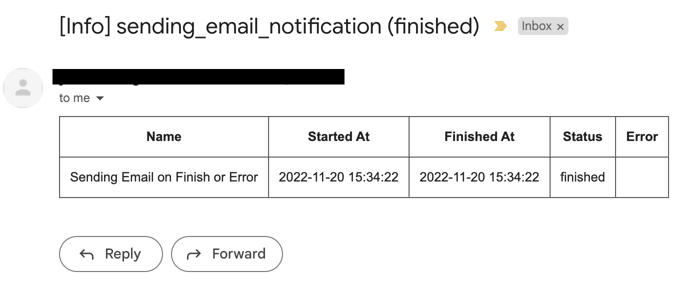

# Examples

- [Examples](#examples)
  - [Print Hello World](#print-hello-world)
  - [Execute Conditional Steps](#execute-conditional-steps)
  - [Write to a File](#write-to-a-file)
  - [Pass output to the next step](#pass-output-to-the-next-step)
  - [Run a Docker Container](#run-a-docker-container)
    - [Configure Container Volumes, Envs, etc](#configure-container-volumes-envs-etc)
    - [Run Containers on Host's Docker Environment](#run-containers-on-hosts-docker-environment)
  - [Execute Commands over SSH](#execute-commands-over-ssh)
  - [Send HTTP Requests](#send-http-requests)
  - [Execute jq Commands to Query JSON](#execute-jq-commands-to-query-json)
  - [Execute jq Commands to Format JSON](#execute-jq-commands-to-format-json)
  - [Execute jq Command and Output Raw Value](#execute-jq-command-and-output-raw-value)
  - [Send E-mail Notification](#send-e-mail-notification)
  - [Send E-mail](#send-e-mail)
  - [Customize Signal on Stop](#customize-signal-on-stop)

## Print Hello World



```yaml
name: hello world
steps:
  - name: "hello"
    command: echo hello world
  - name: "done"
    command: echo done!
    depends:
      - "1"
```

## Execute Conditional Steps



```yaml
params: foo
steps:
  - name: "step1"
    command: echo start
  - name: "foo"
    command: echo foo
    depends:
      - "step1"
    preconditions:
      - condition: "$1"
        expected: foo
  - name: "bar"
    command: echo bar
    depends:
      - "step1"
    preconditions:
      - condition: "$1"
        expected: bar
```

## Write to a File

```yaml
steps:
  - name: write hello to '/tmp/hello.txt'
    command: echo hello
    stdout: /tmp/hello.txt
```

## Pass output to the next step


```yaml
steps:
  - name: pass 'hello'
    command: echo hello
    output: OUT1
  - name: output 'hello world'
    command: bash
    script: |
      echo $OUT1 world
    depends:
      - pass 'hello'
```

## Run a Docker Container

```yaml
steps:
  - name: deno_hello_world
    executor: 
      type: docker
      config:
        image: "denoland/deno:1.10.3"
        host:
          autoRemove: true
    command: run https://examples.deno.land/hello-world.ts
```

Example Log output


You can configure the Docker host with the environment variable `DOCKER_HOST`.

For example:
```yaml
env:
  - DOCKER_HOST : "tcp://XXX.XXX.XXX.XXX:2375"
steps:
  - name: deno_hello_world
    executor: 
      type: docker
      config:
        image: "denoland/deno:1.10.3"
        autoRemove: true
    command: run https://examples.deno.land/hello-world.ts
```

### Configure Container Volumes, Envs, etc

You can config the Docker container (e.g., `volumes`, `env`, etc) by passing more detailed options.

For example:
```yaml
steps:
  - name: deno_hello_world
    executor: 
      type: docker
      config:
        image: "denoland/deno:1.10.3"
        container:
          volumes:
            /app:/app:
          env:
            - FOO=BAR
        host:
          autoRemove: true
    command: run https://examples.deno.land/hello-world.ts
```

See the Docker's API documentation for all available options.

- For `container`, see [ContainerConfig](https://pkg.go.dev/github.com/docker/docker/api/types/container#Config).
- For `host`, see [HostConfig](https://pkg.go.dev/github.com/docker/docker/api/types/container#HostConfig).

### Run Containers on Host's Docker Environment

If you are running `dagu` using a container, you need the setup below.

1. Run a `socat` conainer with the command below.

```sh
docker run -v /var/run/docker.sock:/var/run/docker.sock -p 2376:2375 bobrik/socat TCP4-LISTEN:2375,fork,reuseaddr UNIX-CONNECT:/var/run/docker.sock
```

2. Then you can set the `DOCKER_HOST` environment as follows.

```yaml
env:
  - DOCKER_HOST : "tcp://host.docker.internal:2376"
steps:
  - name: deno_hello_world
    executor: 
      type: docker
      config:
        image: "denoland/deno:1.10.3"
        autoRemove: true
    command: run https://examples.deno.land/hello-world.ts
```

For more details, see [this page](https://forums.docker.com/t/remote-api-with-docker-for-mac-beta/15639/2).

## Execute Commands over SSH

```yaml
steps:
  - name: print ec2 instance id
    executor: 
      type: ssh
      config:
        user: ec2-user
        ip: "XXX.XXX.XXX.XXX"
        key: /Users/XXXXX/.ssh/prod-ec2instance-keypair.pem
        StrictHostKeyChecking: false
    command: ec2-metadata -i

```

## Send HTTP Requests

```yaml
steps:
  - name: get fake json data
    executor: http
    command: GET https://jsonplaceholder.typicode.com/comments
    script: |
      {
        "timeout": 10,
        "headers": {},
        "query": {
          "postId": "1"
        },
        "body": ""
      }      
```

## Execute jq Commands to Query JSON
```yaml
steps:
  - name: run query
    executor: jq
    command: '{(.id): .["10"].b}'
    script: |
      {"id": "sample", "10": {"b": 42}}
```

log output:
```json
{
    "sample": 42
}
```

## Execute jq Commands to Format JSON
```yaml
steps:
  - name: format json
    executor: jq
    script: |
      {"id": "sample", "10": {"b": 42}}
```

log output:
```json
{
    "10": {
        "b": 42
    },
    "id": "sample"
}
```

## Execute jq Command and Output Raw Value
```yaml
steps:
  - name: output raw value
    executor:
      type: jq
      config:
        raw: true
    command: '.id'
    script: |
      {"id": "sample", "10": {"b": 42}}
```

log output:
```json
sample
```

## Send E-mail Notification



```yaml
steps:
  - name: Sending Email on Finish or Error
    command: echo "hello world"

mailOn:
  failure: true
  success: true

smtp:
  host: "smtp.foo.bar"
  port: "587"
  username: "<username>"
  password: "<password>"
errorMail:
  from: "foo@bar.com"
  to: "foo@bar.com"
  prefix: "[Error]"
infoMail:
  from: "foo@bar.com"
  to: "foo@bar.com"
  prefix: "[Info]"
```

## Send E-mail

```yaml
smtp:
  host: "smtp.foo.bar"
  port: "587"
  username: "<username>"
  password: "<password>"

steps:
  - name: step1
    executor:
      type: mail
      config:
        to: <to address>
        from: <from address>
        subject: "Urgent Request: Help Me Find My Sanity"
        message: |
          I'm in a bit of a pickle.
          I seem to have lost my sanity somewhere between my third cup of coffee and my fourth Zoom meeting of the day.
          
          If you see it lying around, please let me know.
          Thanks for your help!

          Best,
```

## Customize Signal on Stop

```yaml
steps:
  - name: step1
    command: bash
    script: |
      for s in {1..64}; do trap "echo trap $s" $s; done
      sleep 60
    signalOnStop: "SIGINT"
```
