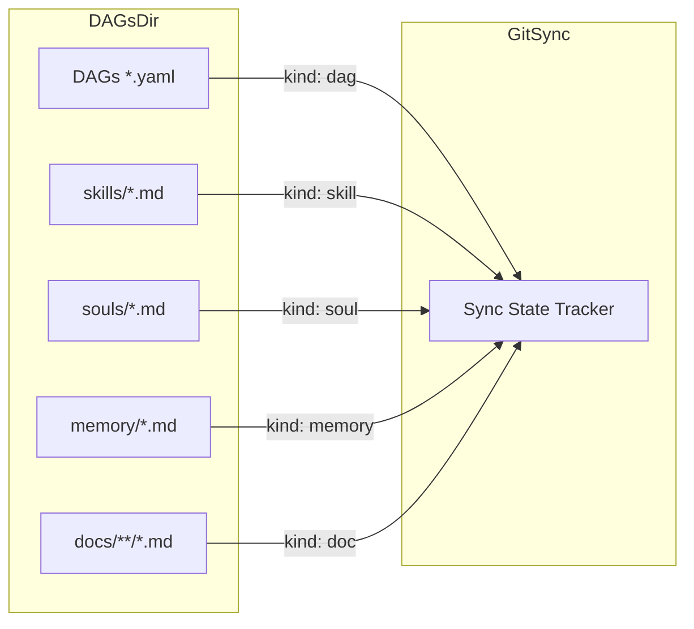
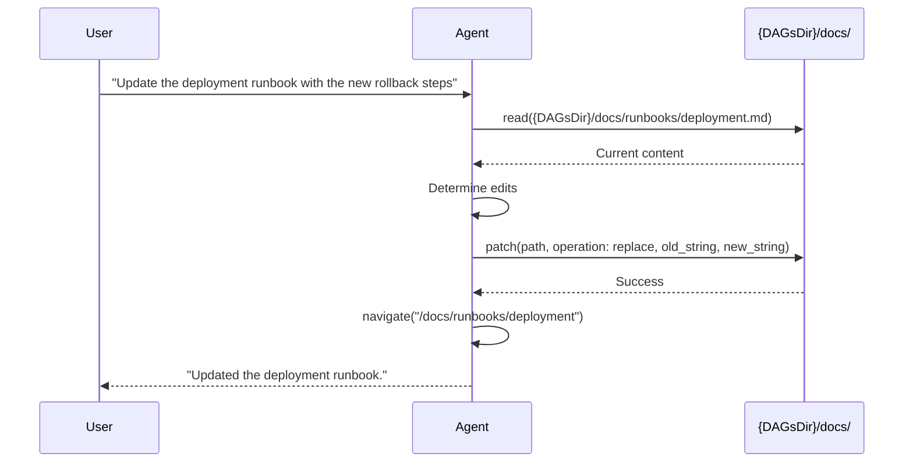
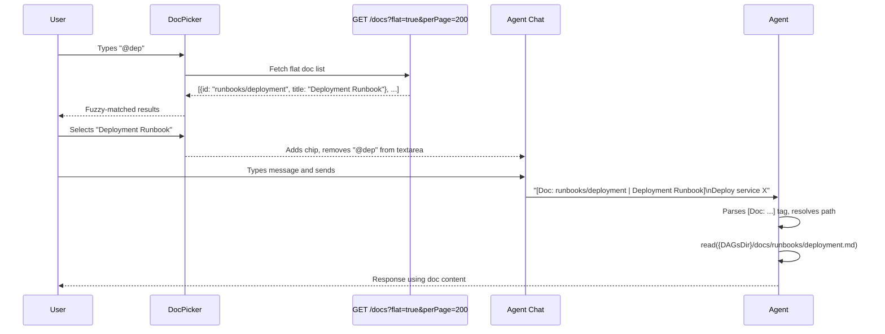
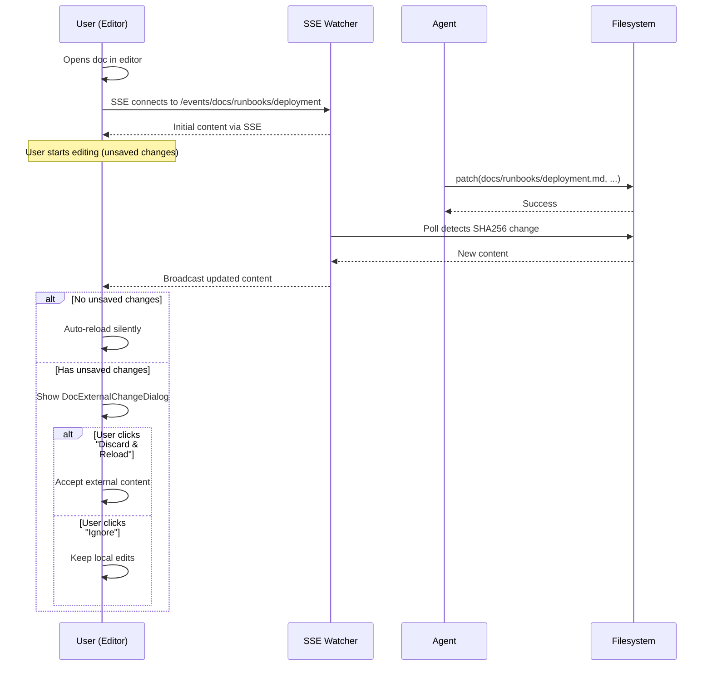
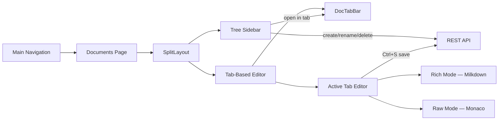

# RFC 024: Markdown Document Management

## Goal

Add a built-in documentation layer to Dagu — markdown files stored in `{DAGsDir}/docs/`, browsable and editable in the web UI with WYSIWYG rendering, git-synced alongside DAGs, and accessible to the AI agent as readable/writable context.

---

## Scope

| In Scope | Out of Scope |
|----------|--------------|
| Markdown file storage under `{DAGsDir}/docs/` with nested directories | Rich media embedding (images, videos) |
| CRUD API for documents with directory tree browsing and pagination | Document versioning beyond git sync |
| Git sync integration as a new `doc` kind | Access control per document |
| Agent system prompt awareness of docs directory | Document templates or scaffolding |
| Full-text content search via `GET /docs/search?q={query}` | Collaborative real-time editing |
| Tab-based multi-document editor with WYSIWYG and raw modes | Server-side parsing or injection of `[Doc: ...]` content |
| Server-side atomic rename via `POST /docs/doc/rename?path={docPath}` | Custom doc-specific reconciliation logic (handled by RFC 026's generic system) |
| Paginated document listing with `page`/`perPage` query params | |
| `@`-trigger doc mention in agent chat with fuzzy-search picker | |
| Flat-list query parameter on `GET /docs` for picker consumption | |
| Integration with RFC 026 reconciliation, forget, delete, cleanup, and sync mv operations | |
| SSE-based real-time document updates with conflict detection | |
| Agent navigation to document pages via `navigate` tool | |

---

## Motivation

Dagu workflows often require supporting documentation — runbooks, architecture decisions, troubleshooting guides, onboarding instructions. Today this knowledge lives outside Dagu in wikis, READMEs, or team chat, disconnected from the workflows it supports. This creates three problems:

1. **Context gap** — The AI agent cannot access operational knowledge when assisting with workflows. Users must paste documentation into chat manually.
2. **Scattered knowledge** — Runbooks and workflow definitions live in different systems, making it hard to keep them in sync.
3. **No single pane** — Operators switch between the Dagu UI and external documentation tools during incident response.

Embedding documentation alongside DAGs unifies the operational context: workflows, their documentation, and the AI agent all share the same source of truth.

---

## Solution

### Directory Structure

```
{DAGsDir}/docs/
├── runbooks/
│   ├── deployment.md
│   └── rollback.md
├── architecture/
│   └── overview.md
└── onboarding.md
```

Documents support nested directories (unlike flat souls/skills). The document ID is the path relative to `docs/` without the `.md` extension (e.g., `runbooks/deployment`). ID validation enforces `^[a-zA-Z0-9][a-zA-Z0-9_. -]*(/[a-zA-Z0-9][a-zA-Z0-9_. -]*)*$` pattern — mixed-case alphanumeric segments with underscores, dots, spaces, and hyphens, separated by forward slashes for directory nesting, max 256 characters. Each segment must start with an alphanumeric character. IDs preserve original filesystem casing — no normalization is applied on creation. This allows natural filenames like `README.md`, `AWS-Setup.md`, and `My Notes.md`. The pattern is safe across Windows, macOS, and Linux (no `:`, `*`, `?`, `"`, `<`, `>`, `|`, or `\` characters). Unlike the flat `validateSlugID` used by skills/souls (`^[a-z0-9]+(-[a-z0-9]+)*$`, max 128), the doc ID validator allows mixed case, underscores, dots, spaces, and forward slashes to support nested paths with natural filenames. A new `ValidateDocID` function in `internal/agent/` implements this alongside the existing `ValidateSkillID`/`ValidateSoulID`.

**Non-conforming files** — Files under `docs/` that do not match the ID validation pattern (e.g., names starting with `.`, containing special characters) are silently skipped from directory listings and search results. A debug-level log entry is emitted for each skipped file to aid troubleshooting. Non-conforming files are never deleted, renamed, or modified by the system.

### API Endpoints

| Method | Path | Description |
|--------|------|-------------|
| GET | `/docs` | List documents (tree structure, paginated) |
| POST | `/docs` | Create document |
| GET | `/docs/search` | Search document content |
| GET | `/docs/doc?path={docPath}` | Get document content and metadata |
| PATCH | `/docs/doc?path={docPath}` | Update document |
| DELETE | `/docs/doc?path={docPath}` | Delete document (auto-removes empty parent directories) |
| POST | `/docs/doc/rename?path={docPath}` | Rename/move document (server-side atomic `os.Rename`) |

Individual document endpoints use `/docs/doc` with a `path` query parameter rather than embedding the document path in the URL. This avoids routing complexity from slash-containing doc paths (e.g., `runbooks/deployment`).

`GET /docs/doc`, `PATCH /docs/doc`, `DELETE /docs/doc`, and `POST /docs/doc/rename` all return **404 Not Found** if the resolved path is a directory rather than a `.md` file. The `path` query parameter must resolve to an individual document.

Mutation endpoints (`POST /docs`, `PATCH /docs/doc`, `DELETE /docs/doc`, `POST /docs/doc/rename`) require write permission via `requireDAGWrite()` — the same guard used for DAG mutations. This enforces both the server-level `write_dags` permission flag and the user's RBAC role (`admin`, `manager`, or `developer`). Read endpoints (`GET /docs`, `GET /docs/doc`, `GET /docs/search`) are available to all authenticated users.

The `GET /docs` endpoint accepts the following query parameters:

| Parameter | Type | Default | Description |
|-----------|------|---------|-------------|
| `flat` | boolean | `false` | Returns flat array of `{id, title}` instead of nested tree |
| `page` | integer | `1` | Page number (1-indexed) |
| `perPage` | integer | `50` | Items per page (max 200) |

When `flat=true`, the response is a paginated lightweight list for picker consumption. Items are sorted alphabetically by `id`:

```json
{
  "items": [
    { "id": "architecture/overview", "title": "Architecture Overview" },
    { "id": "onboarding", "title": "Onboarding Guide" },
    { "id": "runbooks/deployment", "title": "Deployment Runbook" },
    { "id": "runbooks/rollback", "title": "Rollback Procedure" }
  ],
  "pagination": {
    "totalRecords": 4,
    "currentPage": 1,
    "totalPages": 1,
    "nextPage": 1,
    "prevPage": 1
  }
}
```

When `flat` is omitted or `false`, the endpoint returns a paginated tree representation:

```json
{
  "tree": [
    {
      "id": "onboarding",
      "name": "onboarding.md",
      "title": "Onboarding Guide",
      "type": "file"
    },
    {
      "id": "runbooks",
      "name": "runbooks",
      "type": "directory",
      "children": [
        { "id": "runbooks/deployment", "name": "deployment.md", "title": "Deployment Runbook", "type": "file" },
        { "id": "runbooks/rollback", "name": "rollback.md", "title": "Rollback Procedure", "type": "file" }
      ]
    }
  ],
  "pagination": {
    "totalRecords": 4,
    "currentPage": 1,
    "totalPages": 1,
    "nextPage": 1,
    "prevPage": 1
  }
}
```

The `pagination` object uses the existing `Pagination` schema from the OpenAPI spec (`api/v1/api.yaml`). The paginator implementation reuses `exec.Paginator` and `exec.NewPaginatedResult` from `internal/core/exec/paginator.go`. Both tree and flat modes are paginated. In tree mode, pagination applies to top-level items (files and directories); nested children within an expanded directory are always returned in full. In flat mode, pagination applies to the alphabetically sorted list of all documents. The `DocPicker` fetches with `perPage=200` to accommodate most documentation sets in a single request.

Individual document response:

```json
{
  "id": "runbooks/deployment",
  "title": "Deployment Runbook",
  "content": "---\ntitle: \"Deployment Runbook\"\n---\n# Deployment Runbook\n\n## Prerequisites\n...",
  "createdAt": "2026-01-15T10:00:00Z",
  "updatedAt": "2026-02-20T14:30:00Z"
}
```

The `title` field is extracted from the YAML front matter `title` key. If absent, the filename (without extension) is used as a fallback. The `content` field contains the full file content including front matter. Both editor modes (Rich and Raw) display the front matter as-is — it is never hidden or stripped from the editing surface.

Document file format uses YAML front matter, following the skill and soul patterns (`parseSkillFile` in `internal/persis/fileagentskill/store.go`, `parseSoulFile` in `internal/persis/fileagentsoul/store.go`):

```markdown
---
title: "Deployment Runbook"
---
# Deployment Runbook

## Prerequisites
...
```

The front matter parser follows the same `---\n...\n---\n` delimiter pattern used by skills and souls. A `parseDocFile` function extracts the `title` field from front matter. The `docFrontmatter` struct contains only `title`:

```go
type docFrontmatter struct {
    Title string `yaml:"title,omitempty"`
}
```

#### Rename Endpoint

`POST /docs/doc/rename?path={docPath}` performs an atomic server-side rename:

Request body:
```json
{
  "newPath": "runbooks/deployment-v2"
}
```

Response (200):
```json
{
  "message": "Document renamed to runbooks/deployment-v2"
}
```

The server implementation uses `os.Rename` for atomicity. If the new path includes directories that do not exist, they are created first (`os.MkdirAll`). After the rename, empty parent directories of the old path are cleaned up. If `newPath` already exists, the endpoint returns 409 Conflict. The `newPath` must pass `ValidateDocID` validation.

#### Search Endpoint

`GET /docs/search?q={query}` performs a full-text content search across all documents, following the DAG search pattern (`GET /dags/search?q={query}`, implemented in `internal/persis/filedag/grep/grep.go`).

| Parameter | Type | Required | Description |
|-----------|------|----------|-------------|
| `q` | string | yes | Search query (case-insensitive regex) |

Response:
```json
{
  "results": [
    {
      "id": "runbooks/deployment",
      "title": "Deployment Runbook",
      "matches": [
        {
          "line": "## Prerequisites\n\nEnsure kubectl is configured\n\n## Steps",
          "lineNumber": 8,
          "startLine": 6
        }
      ]
    }
  ]
}
```

Implementation mirrors `Storage.Grep` in `internal/persis/filedag/store.go`: recursively scan `{DAGsDir}/docs/` for `.md` files, apply case-insensitive regex via `grep.Grep` from `internal/persis/filedag/grep/grep.go` with `DefaultGrepOptions` (2 lines before, 2 lines after context). No indexing or caching is needed.

### Git Sync Integration

Documents participate in git sync as a new `doc` kind alongside `dag`, `memory`, `skill`, and `soul`:



Key sync behaviors:
- Files scanned recursively from `{DAGsDir}/docs/` (unlike flat scanning for souls/skills)
- File extension: `.md`
- Conflict detection, publish, and discard follow the existing per-item sync protocol
- Item ID in sync state uses the relative path (e.g., `docs/runbooks/deployment`)
- New `isDocFile()` helper alongside existing `isMemoryFile()`, `isSkillFile()`, and `isSoulFile()` identifies doc files by `docs/` prefix and `.md` extension; `KindForDAGID()` updated to return `DAGKindDoc` for paths with a `docs/` prefix
- Reconciliation (RFC 026) handles `missing` status detection, file reappearance, and auto-forget — no doc-specific reconciliation function needed
- `forget`, `cleanup`, `delete`, `sync mv` operations (RFC 026) apply to docs identically to other kinds
- Stat-before-hash optimization (RFC 026) applies to docs — `scanDocFiles()` and `refreshLocalHashes()` populate stat cache fields (`LastStatModTime`, `LastStatSize`)
- Docs use recursive `filepath.WalkDir()` scanning (like memory), not flat `os.ReadDir()` (like souls/skills), to support nested directories

#### Reconciliation (RFC 026 Integration)

Documents participate in the existing reconciliation system introduced by RFC 026 — no doc-specific reconciliation logic is needed. The generic `reconcile()` function already handles all item kinds uniformly:

- Tracked docs (`synced`, `modified`, `conflict`) whose file disappears → transition to `missing` with `PreviousStatus` and `MissingAt` preserved
- `untracked` docs whose file disappears → entry removed automatically
- `missing` docs whose file reappears → transition to `synced` (if content hash matches) or `modified` (if content differs)
- During pull, docs absent from both remote and local → auto-forgotten

All RFC 026 operations — `forget`, `cleanup`, `delete`, `delete --all-missing`, `sync mv` — work with docs out of the box once the `doc` kind is registered.

### Agent Access

No new agent tools are needed. The agent's existing `read` and `patch` tools are unrestricted — they can read and write any file on disk, and `patch` auto-creates parent directories. The only change is to the system prompt template:

- List `{DAGsDir}/docs/` as a known directory alongside DAGs, memory, skills, and souls
- Describe it as the shared documentation directory for runbooks, guides, and operational knowledge

The agent uses `read` to view documents and `patch` (with `create` or `replace` operations) to create or edit them.

#### System Prompt Updates

The agent system prompt template is updated with the following additions:

**`<environment>` block** — Add the docs directory path:
```
Docs Directory: {{.DAGsDir}}/docs/
```

**`<tools>` block** — Update the `navigate` tool description to include doc paths:
```
navigate: Navigate the user to a specific page in the Dagu UI. Available paths include
'/docs' for the documents page, '/docs/<doc-id>' for a specific document, ...
```

**`<ui_flow>` rule** — Add a rule for post-edit navigation:
```
After creating or modifying documents, navigate to `/docs/<doc-id>` so the user can review the changes.
```

**`<workflows>` section** — Add a "Working with Documents" workflow:
```
<workflow name="Working with Documents">
1. Check if the document exists: read({DAGsDir}/docs/<id>.md)
2. Create or update: patch(path, operation: create|replace, ...)
3. Navigate the user to the document: navigate("/docs/<doc-id>")
</workflow>
```

#### Agent Navigation to Documents

The `navigate` tool is extended to support doc paths. No permission gating is needed — all authenticated users can browse docs.

**Updated paths** in `navigateDescription` constant (`internal/agent/navigate.go`):

```go
const navigateDescription = "Navigate the user to a specific page in the Dagu UI. " +
    "Only use this when the user explicitly asks to navigate or view a page. " +
    "Available paths: '/dags' for DAG list, '/dags/<dag-name>' for DAG details, " +
    "'/dags/<dag-name>/<tab>' for specific tab (spec, history), '/dag-runs' for all DAG runs, " +
    "'/dag-runs/<dag-name>/<run-id>' for specific run details, '/queues' for queues, " +
    "'/docs' for the documents page, '/docs/<doc-id>' for a specific document, " +
    "'/system-status', '/webhooks', and '/audit-logs'. " +
    "Admin-only pages: '/users', '/api-keys', '/terminal', '/git-sync', '/agent-settings'."
```

The `/docs` and `/docs/{docPath}` paths are **not** added to `adminOnlyNavigatePaths` — all authenticated users can view documents.

#### Sequence Diagram



### @ Doc Mention in Agent Chat

The `@` doc-mention lets users attach documents as context in the agent chat, mirroring the existing `/` skill pattern. No new agent tools are needed — the agent interprets `[Doc: ...]` tags via system prompt instructions and uses `read`/`patch` to access content.

#### Trigger & Picker

Typing `@` at the start of input or after whitespace opens a `DocPicker` component. The picker fetches `GET /docs?flat=true&perPage=200` on open to get a paginated flat list of documents. Users fuzzy-search on doc ID (path) and title. Selected docs render as chips below the input. The `@query` text is removed from the textarea on selection.

**Chip styling** — Doc chips use `bg-blue-500/15 text-blue-600 dark:text-blue-400` with a `FileText` icon (h-3 w-3), visually distinct from skill chips which use `bg-primary/15 text-primary` with a `Sparkles` icon. Both chip types share the same layout (`inline-flex items-center gap-1 px-2 py-0.5 rounded text-xs`) and X-to-remove button.

**DocPicker component** — Follows `SkillPicker`'s `forwardRef` + `useImperativeHandle` pattern with identical dropdown dimensions (`w-72 max-h-64`), positioning (`absolute bottom-full left-0 mb-1`), and keyboard navigation (ArrowUp/Down to highlight, Enter to select, Escape to close). The `@` trigger detection in `ChatInput` mirrors the existing `/` detection for skills.

#### Message Format

On send, selected docs are prepended as `[Doc: id | title]` tags before any skill tags:

```
[Doc: runbooks/deployment | Deployment Runbook] [Skill: sql-optimizer]
User's actual message
```

Tags carry metadata only — no document content is embedded. The agent reconstructs the full path as `{DAGsDir}/docs/<id>.md` using its system prompt knowledge of the docs directory.

#### System Prompt Addition

A `<docs>` block is added to the agent system prompt when `[Doc: ...]` tags are present:

```
<docs>
When a user message begins with [Doc: id | title] tags, these reference markdown
documents stored under {DAGsDir}/docs/. To access a referenced document:
1. Reconstruct the file path: {DAGsDir}/docs/<id>.md
2. Use `read` to load the content
3. Use `patch` to modify the content if needed

The id is the relative path without the .md extension (e.g., "runbooks/deployment"
maps to {DAGsDir}/docs/runbooks/deployment.md).
</docs>
```

#### Sequence Diagram



#### Dynamic Detection

The doc store scans the filesystem on every call (following the DAG store pattern, not the cached-index skill/soul pattern). Documents created by the agent via `patch`, added by a user on the CLI, pulled in via git sync, or renamed/moved by any actor are immediately reflected in the next API response. Deleted files disappear from listings without cache invalidation. The `DocPicker` fetches a fresh list from `GET /docs?flat=true&perPage=200` each time it opens, so newly created, renamed, or moved documents appear and deleted documents disappear without any special detection mechanism.

### Real-Time Updates (SSE)

When the agent edits a document via `patch` while a user has the same document open in the editor, the change should be reflected immediately without requiring a manual refresh. This is achieved through Server-Sent Events (SSE), following the same pattern used for DAG spec changes.

#### Backend

**New topic type** — A new `TopicTypeDoc TopicType = "doc"` is added to `sse/types.go` alongside the existing 9 topic types:

```go
const (
    TopicTypeDAGRun     TopicType = "dagrun"
    TopicTypeDAG        TopicType = "dag"
    // ... existing types ...
    TopicTypeDoc        TopicType = "doc"
)
```

Topic identifier format: `doc:runbooks/deployment` (using the doc ID as the topic identifier).

**FetchFunc** — `GetDocContentData` reads the document from disk via the doc store's `Get(id)` method and returns the same structure as `GET /docs/doc?path={docPath}` (id, title, content, createdAt, updatedAt). Registered in `registerSSEFetchers()`:

```go
srv.sseHub.RegisterFetcher(sse.TopicTypeDoc, srv.apiV1.GetDocContentData)
```

**SSE endpoint** — `GET /events/docs/{docPath}` where `{docPath}` is a Chi wildcard (`events/docs/*`) since doc paths contain slashes (e.g., `events/docs/runbooks/deployment`). Route registration:

```go
r.Get(path.Join(apiV1BasePath, "events/docs/*"), handler.HandleDocEvents)
```

**Handler** — `HandleDocEvents` extracts the path after `events/docs/` and calls `handleSSE`:

```go
func (h *Handler) HandleDocEvents(w http.ResponseWriter, r *http.Request) {
    docPath := chi.URLParam(r, "*")
    h.handleSSE(w, r, buildTopic(TopicTypeDoc, docPath))
}
```

**Watcher** — The SSE hub's existing polling watcher detects changes by comparing the document's content hash (SHA256). The watcher polls at 1–10s adaptive intervals (same adaptive logic as other topic types). A hash change triggers a broadcast to all clients subscribed to that document's topic.

#### Frontend

**`useDocSSE` hook** — Wraps the generic `useSSE` hook, following the `useDAGSSE` pattern (`ui/src/hooks/useDAGSSE.ts`):

```typescript
interface DocSSEResponse {
  id: string;
  title: string;
  content: string;
  createdAt: string;
  updatedAt: string;
}

export function useDocSSE(
  docPath: string,
  enabled: boolean = true
): SSEState<DocSSEResponse> {
  const endpoint = `/events/docs/${docPath}`;
  return useSSE<DocSSEResponse>(endpoint, enabled);
}
```

**`useDocContentWithConflictDetection` hook** — Follows the `useDAGSpecWithConflictDetection` pattern exactly (`ui/src/hooks/useDAGSpecWithConflictDetection.ts`):

- Tracks `lastServerContentRef`, `hasUserEditedRef`, `pendingSaveContentRef`
- On first SSE data received: initializes both `currentValue` state and `lastServerContentRef`
- On subsequent SSE updates:
  - If `pendingSaveContentRef.current === incomingContent` → own save echo, silently update refs
  - If user has not edited (`!hasUserEditedRef.current`) → auto-reload silently (update `currentValue` and `lastServerContentRef`)
  - If user has unsaved edits and server content changed → set `conflict.hasConflict = true` with `externalContent`, show dialog
- `resolveConflict('discard')` — accepts external version, resets `currentValue` to `externalContent`
- `resolveConflict('ignore')` — keeps local edits, updates `lastServerContentRef` to avoid repeated alerts
- `markAsSaved(content)` — stores content in `pendingSaveContentRef` to prevent treating own save as external change
- SSE failure → `shouldUseFallback = true`, graceful degradation to REST polling

**`DocExternalChangeDialog` component** — Follows `ExternalChangeDialog.tsx` (`ui/src/features/dags/components/dag-editor/ExternalChangeDialog.tsx`):

- Title: "External Changes Detected" with `AlertTriangle` icon
- Description: "This document has been modified externally (possibly by the AI agent or another user)."
- Two buttons: "Ignore" (ghost/secondary) and "Discard & Reload" (primary/3d-primary)
- Keyboard: `Enter` triggers discard by default; `Escape` triggers ignore
- `onOpenChange` closing the dialog calls `onIgnore`

#### Integration with DocEditor

The `DocEditor` component uses `useDocContentWithConflictDetection` instead of a plain REST fetch:

1. **On mount** — SSE connects, receives initial content, populates the editor
2. **Agent patches file** — SSE watcher detects SHA256 hash change → broadcasts new content → editor auto-reloads (no unsaved edits) or shows `DocExternalChangeDialog` (has unsaved edits)
3. **On save** — `markAsSaved(content)` is called before the `PATCH` request, preventing the echo from being treated as an external change
4. **SSE failure** — Falls back to REST fetch on mount only; editor remains functional without real-time updates

#### Sequence Diagram



### Web UI



#### Navigation & Routing

A `Documents` nav item is added to the **"Workflows"** section of the sidebar (after "Definitions", before "Search"). Icon: `FileText` from `lucide-react` at 18px. Route: `/docs`.

The nav item is **not admin-gated** — all authenticated users can browse documents. The `canWrite` permission gates mutation controls (create, edit, delete buttons) on the page itself.

Routes registered in `App.tsx`:

| Route | Component | Purpose |
|-------|-----------|---------|
| `/docs` | `DocsPage` | Tree sidebar shown, editor empty state |
| `/docs/*` | `DocsPage` | Wildcard captures nested doc path; e.g., `/docs/runbooks/deployment` selects document `runbooks/deployment` |

A single `DocsPage` component handles both tree and editor. The active document ID is derived from the URL path (`location.pathname.replace(/^\/docs\/?/, '')`). Clicking a tree node calls `navigate(`/docs/${docId}`)`.

#### Permissions

Document access follows the same RBAC model as DAGs, using the existing role hierarchy from `internal/auth/role.go`:

| Role | View Documents | Write Documents (create, edit, rename, delete) |
|------|---------------|------------------------------------------------|
| admin | Yes | Yes |
| manager | Yes | Yes |
| developer | Yes | Yes |
| operator | Yes | No |
| viewer | Yes | No |

**Backend enforcement** — All mutation endpoints (`POST /docs`, `PATCH /docs/doc`, `DELETE /docs/doc`, `POST /docs/doc/rename`) call `requireDAGWrite()` (`internal/service/frontend/api/v1/api.go`), which checks two conditions:
1. The server-level `config.permissions.write_dags` flag must be `true`
2. The user's role must satisfy `CanWrite()` — i.e., `admin`, `manager`, or `developer`

Read endpoints (`GET /docs`, `GET /docs/doc`, `GET /docs/search`) are available to all authenticated users regardless of role.

**Frontend enforcement** — The `canWrite` flag (from `useCanWrite()` in `ui/src/contexts/AuthContext.tsx` or `config.permissions.writeDags`) controls UI visibility of mutation controls. When `canWrite` is `false`:
- Create, rename, and delete buttons are hidden
- The editor is set to `readOnly` mode
- The save button and `Ctrl+S` shortcut are disabled

This matches the existing DAG editor permission pattern.

#### Page Layout

The page uses a **split-panel layout** via the existing `SplitLayout` component:

| Panel | Component | Default Width | Min/Max |
|-------|-----------|---------------|---------|
| Left | `DocTreeSidebar` | 25% | 15–40% |
| Right | `DocTabEditorPanel` | 75% | — |

Panel width is persisted in `localStorage` under key `docTreeWidth`. When no tabs are open, the right panel shows an empty state: centered `FileText` icon with "Select a document to start editing."

The page sets `appBarContext.setTitle('Documents')` on mount.

#### Tree Sidebar

The tree sidebar fetches data from `GET /docs` (tree mode) via `useQuery`. It renders a recursive tree of directories and files.

**Header bar** — Compact top bar with section label and action buttons:
- "Documents" label (`text-xs font-medium uppercase tracking-wide`)
- `FilePlus` button (new document), gated by `canWrite`

**Tree nodes** — Recursive rendering with depth-based indentation (`pl-3` per level):

| Type | Icon (collapsed/expanded) | Click action |
|------|---------------------------|--------------|
| Directory | `ChevronRight`/`ChevronDown` + `Folder`/`FolderOpen` | Toggle expand/collapse |
| File | `FileText` | Open doc in tab (or switch to existing tab) |

Active file is highlighted with `bg-accent text-accent-foreground`. Expand state is stored in local `Set<string>` — directories containing the active document auto-expand on initial load.

**Context menu** — A `DropdownMenu` triggered by a `MoreHorizontal` icon button that appears on hover:

| Node type | Menu items |
|-----------|------------|
| File | Rename, Delete |
| Directory | New Document, Delete (only if empty) |

**Empty state** — When tree is empty: centered `FileText` icon + "No documents yet." + Create Document button (gated by `canWrite`).

**Loading** — `Loader2` spinner centered in the tree panel on initial load only. After first load, stale data is shown during refetches (no blocking loaders).

#### Tab-Based Editor Panel

The editor panel follows the DAG definition page's tab pattern (`ui/src/contexts/TabContext.tsx`, `ui/src/components/TabBar.tsx`).

**Tab Context** — A `DocTabProvider` wraps the docs page, managing tab state persisted in `localStorage` under key `dagu_doc_tabs`. Tab structure:

```typescript
interface DocTab {
  id: string;       // unique tab ID (generated)
  docPath: string;  // document ID (e.g., "runbooks/deployment")
  title: string;    // display title from front matter or filename
}
```

The `DocTabContext` provides:
- `tabs: DocTab[]`
- `activeTabId: string | null`
- `openDoc(docPath: string, title: string): void` — opens doc in new tab or switches to existing tab for that path
- `closeTab(tabId: string): void` — close with unsaved-changes guard
- `setActiveTab(tabId: string): void`
- `getActiveDocPath(): string | null`

**Tab Bar** — Renders above the editor area using the same visual pattern as `TabBar.tsx`:
- Horizontal scrollable tab strip with close (X) buttons
- Keyboard navigation: ArrowLeft/Right to switch tabs, Delete/Backspace to close
- Active tab indicated with `border-primary`
- Unsaved changes shown with amber dot on the tab label
- No "+" button (tabs are opened by clicking tree nodes or creating documents)

**Opening a document:**
- Clicking a tree node calls `openDoc(docPath, title)`
- If a tab for that `docPath` already exists, it becomes active
- Otherwise a new tab is created and becomes active
- The URL updates to `/docs/${docPath}` to reflect the active tab

**Editor per tab** — Each active tab loads document content from `GET /docs/doc?path={docPath}`.

**Header bar** — Compact bar with:
- `FileText` icon + document title (truncated, from front matter `title` or `docPath`)
- Unsaved-changes indicator: amber dot (`h-2 w-2 rounded-full bg-amber-500`), visible when content differs from last saved
- Editor mode toggle: pill-style segmented control with "Rich" and "Raw" buttons, persisted in `localStorage` under key `doc-editor-mode`
- Save button (`Save` icon, `h-7`, gated by `canWrite`), disabled when no unsaved changes

**Rich mode** — Milkdown WYSIWYG editor wrapped in a `DocWysiwygEditor` component:
- GFM plugin for tables, task lists, strikethrough
- Headings, lists, code blocks, blockquotes, links
- Front matter `---` block is rendered as-is (raw text block at the top of the document), not hidden or stripped
- Dark/light theme sync via `MutationObserver` on `document.documentElement.classList` (same pattern as `MarkdownEditor`)
- Outputs raw markdown — no HTML-only state

**Raw mode** — The existing `MarkdownEditor` (Monaco) component from `components/editors/MarkdownEditor.tsx`:
- Markdown language, JetBrains Mono font, 13px, no minimap, word wrap on
- Same dark/light theme sync

Both modes read and write the same `content` state string. Switching mode transfers content without loss. The `readOnly` prop is controlled by `canWrite`.

#### Explicit Save

There is no auto-save. Saving is explicit only:
- **Save button** in the editor header (disabled when no unsaved changes)
- **`Ctrl+S` / `Cmd+S`** keyboard shortcut triggers immediate save

On save, a `PATCH /docs/doc?path={docPath}` request fires with `{ content }`. Uses the `saveHandlerRef` pattern from the skill editor to avoid stale closures.

The unsaved-changes guard integrates with `UnsavedChangesContext` (from `ui/src/contexts/UnsavedChangesContext.tsx`) to:
- Show amber dot on tabs with pending edits
- Prompt confirmation when closing a tab with unsaved changes
- Warn when navigating away from the page with any tab having unsaved changes

**Closing a tab with unsaved changes** shows a confirmation dialog: "You have unsaved changes in {title}. Discard changes?" with "Discard" and "Cancel" buttons.

#### Create Document Modal

A `Dialog` component with:
- Path input (`font-mono`, placeholder: `runbooks/deployment`)
- Help text: "Relative path without .md extension. Use / for directories."
- Pre-fills `${parentDir}/` when triggered from a directory context menu
- Calls `POST /docs` on submit
- On success: refreshes tree (`mutate()`), opens the new document in a tab via `openDoc(newPath, title)`

#### Delete Confirmation

Uses the existing `ConfirmModal` component. Shows doc path in `font-mono`, calls `DELETE /docs/doc?path={docPath}`. If the deleted doc has an open tab, the tab is closed. Empty parent directories are auto-cleaned by the server after deletion.

#### Rename

A dialog showing the current path (read-only) and new path (editable, validated against the doc ID pattern). On submit, calls `POST /docs/doc/rename?path={docPath}` with `{ newPath }`. On success: refreshes tree, updates the tab's `docPath` and `title` if the renamed doc has an open tab, and updates the URL to `/docs/${newPath}`.

#### Responsive Behavior

On mobile (< 768px), tree and editor are displayed one at a time:
- When no document is selected, the tree sidebar shows at full width
- Clicking a file shows the editor at full width with a back button (`ArrowLeft` icon) that navigates to `/docs`
- The draggable divider is hidden on mobile (`hidden md:flex`)

#### Frontend File Structure

```
ui/src/pages/docs/
  index.tsx                     -- DocsPage (split layout, tab provider, URL routing)
  components/
    DocTreeSidebar.tsx          -- Tree sidebar with expand/collapse, context menus
    DocTreeNode.tsx             -- Recursive tree node component
    DocTabEditorPanel.tsx       -- Tab bar + active tab editor container
    DocTabBar.tsx               -- Tab strip (following TabBar.tsx pattern)
    DocEditor.tsx               -- Editor with header, mode toggle, save
    DocWysiwygEditor.tsx        -- Milkdown WYSIWYG wrapper
    CreateDocModal.tsx          -- New document dialog
    RenameDocModal.tsx          -- Rename document dialog
    DocExternalChangeDialog.tsx -- External change conflict dialog (follows ExternalChangeDialog pattern)
  contexts/
    DocTabContext.tsx            -- Tab state management (following TabContext.tsx pattern)
ui/src/hooks/
    useDocSSE.ts                    -- SSE hook for doc content (follows useDAGSSE pattern)
    useDocContentWithConflictDetection.ts -- Conflict detection for SSE-driven doc editing
ui/src/features/agent/components/
    DocPicker.tsx               -- @ trigger doc picker for agent chat
```

---

## Data Model

### Document Entity

| Field | Type | Default | Description |
|-------|------|---------|-------------|
| `ID` | string | — | Relative path without extension (e.g., `runbooks/deployment`); slug format, max 256 chars |
| `Title` | string | — | Extracted from YAML front matter `title` field; falls back to filename (without extension) if absent |
| `Content` | string | `""` | Full markdown body |
| `CreatedAt` | time | — | File creation timestamp (birth time). On Linux filesystems without birth time support (e.g., ext4 on older kernels), falls back to `ctime` (inode change time), which may differ from actual creation time |
| `UpdatedAt` | time | — | File last-modified timestamp |

### Sync State

| Field | Type | Default | Description |
|-------|------|---------|-------------|
| `Kind` | DAGKind | `"doc"` | New kind value for document items |

Uses the same `DAGState` fields as other sync kinds (status, base commit, hashes, remote conflict info).

### Store Interface

A doc store interface provides:

| Operation | Description |
|-----------|-------------|
| `List(page, perPage)` | Return documents as a paginated tree structure |
| `ListFlat(page, perPage)` | Return documents as a paginated, alphabetically sorted flat `{id, title}` list (lightweight scan, no content or timestamps) |
| `Get(id)` | Return a single document by ID |
| `Create(id, content)` | Create a new document (and parent directories) |
| `Update(id, content)` | Update an existing document |
| `Delete(id)` | Delete a document (and clean up empty parent directories) |
| `Rename(oldID, newID)` | Atomically rename a document via `os.Rename` (create target parent dirs, clean up empty source dirs) |
| `Search(pattern)` | Full-text search across all documents, returns matches with context lines |

File-based implementation under `persis/`. The doc store follows the **DAG store pattern** (`internal/persis/filedag/store.go`) — scanning the filesystem on every `List()`, `ListFlat()`, and `Get()` call. It does **not** use the cached-index pattern found in skill/soul stores (which call `rebuildIndex()` at init and serve reads from memory). Documents change through three independent channels — agent `patch`, user CLI, and git sync — so a cached index would go stale between API calls. The tradeoff is additional filesystem I/O per request, but this is negligible at the expected scale of tens to low hundreds of documents.

---

## Edge Cases & Tradeoffs

| Chosen | Considered | Why |
|--------|------------|-----|
| Nested directory support | Flat file layout (like souls/skills) | Documentation naturally organizes hierarchically (runbooks, architecture, guides); flat layout would not scale |
| Reuse existing `read` / `patch` tools | Dedicated `read_doc` / `update_doc` tools | Agent tools are already unrestricted (not scoped to DAGsDir); dedicated tools add no capability and increase maintenance surface |
| YAML front matter for title | Title extracted from first `# Heading` | Consistent with skill/soul file formats (`parseSkillFile`, `parseSoulFile`); structured metadata is explicit and unambiguous; front matter is widely understood (Jekyll, Hugo, etc.) |
| Tab-based multi-document editor | Single editor panel with auto-save | Follows established DAG definition page pattern (`TabContext.tsx`, `TabBar.tsx`); users can work on multiple docs simultaneously; eliminates data loss risk from accidental navigation |
| Explicit save (Ctrl+S / button) | Auto-save with 1500ms debounce | Matches the DAG editor save pattern; gives users explicit control; avoids surprise saves of partial edits |
| Pagination on `GET /docs` (both tree and flat modes) | Unpaginated list | Uses existing `exec.Paginator` and `Pagination` schema; scales to large doc collections; flat mode paginated with `perPage=200` default for picker; alphabetically sorted by `id` for consistent ordering |
| Full-text search endpoint | No search / client-side search | Mirrors `GET /dags/search?q=` pattern; reuses `grep.Grep` library; essential for discoverability in large doc trees |
| Server-side atomic rename | Client-side create + delete | `os.Rename` is atomic on POSIX filesystems; avoids partial failure states; single API call instead of two |
| Auto-create/delete directories | Explicit directory create/delete endpoints | Reduces API surface; no orphan empty directories; user never needs to manage directory lifecycle separately |
| Milkdown WYSIWYG with raw (Monaco) toggle | Raw-only editing (Monaco) | Milkdown adds ~150KB gzipped but provides true rich editing for non-technical runbook authors; raw toggle preserves power-user workflow; wrapping in `DocWysiwygEditor` isolates the dependency for future swap |
| Recursive directory scanning for sync | Flat scanning (like souls/skills) | Nested directories require recursive traversal; sync item IDs include the relative path to preserve hierarchy |
| `[Doc: id \| title]` text tags in message | Dedicated `docContexts` API field | Follows established skill pattern; no API schema changes needed |
| Metadata only (id + title) in tags | Pre-load doc content into message | Docs can be large; metadata-only lets agent decide what to read |
| `@` as trigger character | `#`, `/docs`, button-only | `@` is conventional mention char; `/` taken by skills; `#` conflicts with markdown headings |
| Fetch on picker open | Cache doc list in frontend | Docs change during session (agent creates via `patch`); fresh fetch ensures new docs appear |
| Filesystem scanning (DAG store pattern) | Cached in-memory index (skill/soul pattern) | Docs change via agent, user CLI, and git sync — cached index goes stale between API calls |
| Docs use RFC 026 generic reconciliation | Custom `reconcileDocState()` | RFC 026 provides `missing` status, auto-forget, duplicate prevention, and explicit operations (`forget`, `delete`, `sync mv`) for all item kinds — doc-specific logic would duplicate existing infrastructure |
| API rename + reconciliation for git sync renames | Custom doc rename tracking | API provides atomic `os.Rename`; reconciliation auto-detects git-side renames (missing + new untracked); `sync mv` provides explicit atomic remote rename; content-hash duplicate prevention during pull prevents ghost entries |
| No document size limits | Max document size validation | Responsibility is on the user; avoids arbitrary restrictions; consistent with how DAG files and skill/soul files are handled. Note: documents >500KB may degrade Milkdown (Rich mode) rendering performance; Monaco (Raw mode) handles large files better |
| Renaming breaks `[Doc: id \| title]` references | Track and update cross-references on rename | `[Doc: ...]` tags in agent chat history are immutable message text; updating past messages introduces complexity and data integrity concerns. Known limitation — out of scope for initial implementation |

---

## Filesystem Resilience

Documents are mutated through three independent channels — the REST API, agent `patch` tool calls, and direct filesystem edits (user CLI or git sync). The doc subsystem is designed around the principle that the **filesystem is always authoritative**, and any in-process state must be reconciled against it on every operation.

### Filesystem as Source of Truth (Doc Store)

The doc store scans the filesystem on every `List()`, `ListFlat()`, and `Get()` call. There is no in-memory index, cache, or init-time snapshot. If a file is created, renamed, or deleted by any actor (API, agent, user CLI, git pull), the next store call reflects the change. This mirrors the DAG store pattern (`internal/persis/filedag/store.go`) and explicitly avoids the skill/soul cached-index pattern.

### Reconcile-on-Scan (Git Sync)

The git sync state tracker reconciles state against the filesystem via RFC 026's `reconcile()` function, which runs during every `GetStatus()` and before every `Pull()`. For docs:

- Files removed from disk → entry transitions to `missing` (not removed — preserving `PreviousStatus` for recovery)
- Files added to disk → discovered as `StatusUntracked` by `scanDocFiles()`
- `missing` entries whose file reappears → automatically restored to `synced` or `modified`
- Users can explicitly clean up via `sync forget`, `sync cleanup`, `sync delete`, or `sync mv`

This replaces the originally proposed `reconcileDocState()` with the generic reconciliation system.

### Rename Semantics

A document's ID is derived from its filesystem path, so renaming a file changes its identity. Two rename paths are supported:

1. **API rename** — `POST /docs/doc/rename?path={docPath}` performs `os.Rename` on the server, updating the file path atomically. The doc store's `Rename` method creates target parent directories and cleans up empty source directories.

2. **Git sync rename** — The reconciliation system handles this automatically: the old entry transitions to `missing`, and `scanDocFiles()` discovers the new file as `untracked`. During pull, content-hash-based duplicate prevention (RFC 026) ensures the `missing` entry for the old name is auto-forgotten when the same content appears under the new name — preventing ghost entries. For explicit atomic renames across local and remote, `sync mv` (RFC 026) is available.

---

## Definition of Done

- Documents can be created, read, updated, and deleted via the REST API under `/docs`.
- The `GET /docs` endpoint returns a paginated nested tree structure reflecting the directory hierarchy, using `page`/`perPage` query parameters and the existing `Pagination` schema.
- Documents use YAML front matter for the `title` field, following skill/soul file format (`parseSkillFile`, `parseSoulFile`).
- Documents stored under `{DAGsDir}/docs/` are detected and tracked by git sync with kind `doc`.
- The agent system prompt includes the docs directory path, enabling doc access via existing `read` and `patch` tools.
- Documents page is accessible from the "Workflows" sidebar section with a `FileText` icon at route `/docs`.
- Split-panel layout: resizable tree sidebar (left, 25% default) and tab-based editor panel (right) using `SplitLayout`.
- Route `/docs/{docPath}` selects and loads the document in the editor via URL-driven state.
- Tab-based editor displays multiple open documents with tab strip, following the DAG definition page pattern (`TabContext.tsx`, `TabBar.tsx`).
- Tab state (open tabs, active tab) persisted in `localStorage` under key `dagu_doc_tabs`.
- Clicking a tree node opens a tab for that document (or switches to existing tab).
- Closing a tab with unsaved changes shows a confirmation dialog.
- Explicit save only: Save button and `Ctrl+S`/`Cmd+S` keyboard shortcut. No auto-save.
- Unsaved-changes indicator (amber dot) shown on tab label and editor header; navigation-away guard via `UnsavedChangesContext`.
- Tree sidebar renders the nested directory structure from `GET /docs` with expand/collapse and depth indentation.
- Context menu on tree nodes exposes Rename and Delete for files; New Document and Delete for directories.
- Rich mode uses Milkdown WYSIWYG editor with GFM support (tables, task lists, strikethrough).
- Raw mode uses the existing Monaco `MarkdownEditor`; editor mode preference persisted in `localStorage`.
- Create Document and Rename modals use existing `Dialog` components; Delete uses `ConfirmModal`.
- `POST /docs/doc/rename?path={docPath}` performs atomic server-side rename via `os.Rename`.
- `GET /docs/search?q={query}` performs full-text content search using the grep library, with 2 lines of context before and after.
- On mobile (< 768px), tree and editor display one at a time with back-button navigation.
- `canWrite` permission gates all mutation controls (create, edit, rename, delete buttons).
- Creating a document with a nested path (e.g., `runbooks/deployment`) auto-creates parent directories.
- Deleting a document auto-removes empty parent directories.
- Typing `@` opens a DocPicker with fuzzy search on doc ID and title.
- Selected docs render as blue `FileText` chips (`bg-blue-500/15`), visually distinct from green `Sparkles` skill chips (`bg-primary/15`).
- On send, `[Doc: id | title]` tags are prepended to the message before skill tags.
- `GET /docs?flat=true` returns a paginated, alphabetically sorted `{id, title}` response for picker consumption.
- Agent system prompt includes instructions for interpreting `[Doc: ...]` tags and resolving doc paths.
- Docs created by the agent via `patch` appear in the picker on next `@` trigger without manual refresh.
- Doc store uses filesystem scanning (DAG store pattern) — changes made outside the API (agent `patch`, user CLI, git sync) are reflected without restart.
- Docs participate in RFC 026 reconciliation: deleted files transition to `missing`, reappeared files restore to `synced`/`modified`, untracked orphans are auto-removed.
- `forget`, `cleanup`, `delete`, `delete --all-missing`, and `sync mv` operations work with doc items.
- Stat-before-hash optimization applies to docs — `scanDocFiles()` populates stat cache.
- Renamed docs are handled via API rename (`os.Rename`) and via reconciliation for git-side renames (old → `missing`, new → `untracked`); `sync mv` available for explicit atomic remote rename.
- During pull, content-hash duplicate prevention prevents ghost entries when docs are renamed.
- SSE topic `doc` registered with `GetDocContentData` FetchFunc.
- SSE endpoint `GET /events/docs/{docPath}` streams document content changes.
- `useDocSSE` and `useDocContentWithConflictDetection` hooks implemented following existing DAG SSE patterns.
- Agent `patch` changes reflected in the editor within the SSE polling interval (1–10s adaptive).
- `DocExternalChangeDialog` shown when external changes are detected during editing with unsaved changes.
- SSE failure triggers graceful fallback to REST fetch.
- Agent `navigate` tool supports `/docs` and `/docs/{docPath}` paths.
- Agent system prompt includes docs directory in `<environment>`, navigate paths in `<tools>`, and document workflows in `<workflows>`.
- `GET /docs?flat=true` returns a paginated, alphabetically sorted response.
- `GET /docs/doc?path={docPath}` returns 404 for directory paths.
- Non-conforming filenames under `docs/` are silently skipped from listings with debug-level logging.
- Write operations require `developer` role or above (same as DAG writes via `requireDAGWrite()`); `operator` and `viewer` roles have read-only access.
