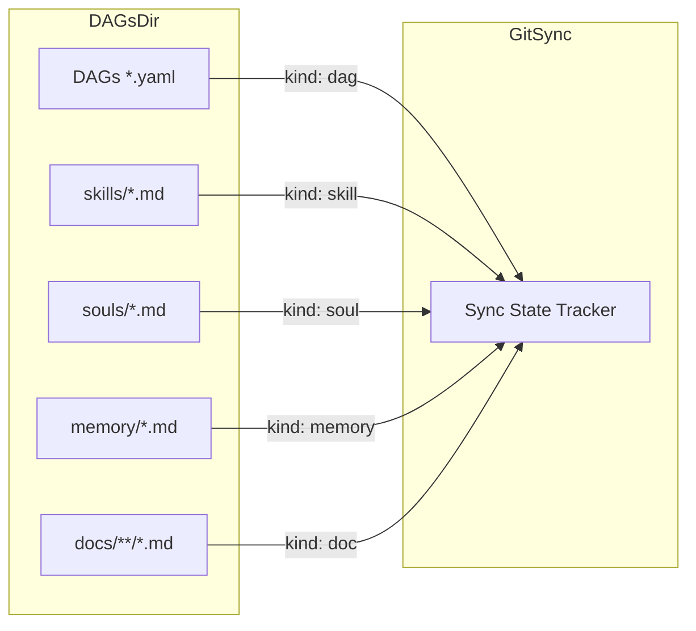
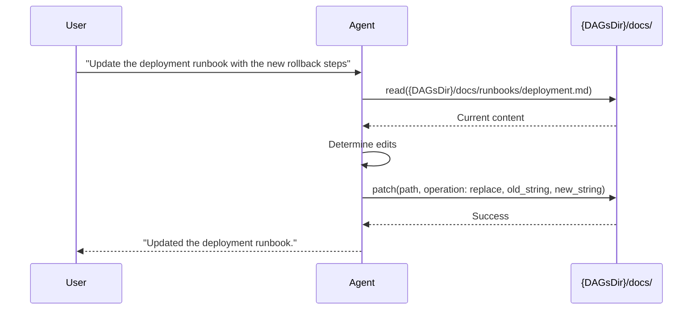
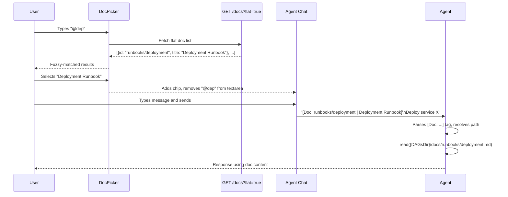
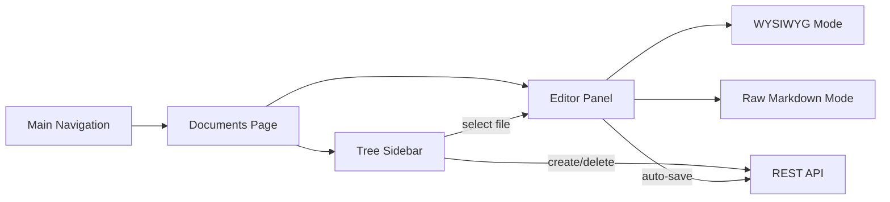

# RFC 024: Markdown Document Management

## Goal

Add a built-in documentation layer to Dagu — markdown files stored in `{DAGsDir}/docs/`, browsable and editable in the web UI with WYSIWYG rendering, git-synced alongside DAGs, and accessible to the AI agent as readable/writable context.

---

## Scope

| In Scope | Out of Scope |
|----------|--------------|
| Markdown file storage under `{DAGsDir}/docs/` with nested directories | Rich media embedding (images, videos) |
| CRUD API for documents with directory tree browsing | Document versioning beyond git sync |
| Git sync integration as a new `doc` kind | Access control per document |
| Agent system prompt awareness of docs directory | Full-text search indexing |
| DAG-level config to attach documents as additional agent context | Document templates or scaffolding |
| WYSIWYG markdown editor in the web UI | Collaborative real-time editing |
| `@`-trigger doc mention in agent chat with fuzzy-search picker | Server-side parsing or injection of `[Doc: ...]` content |
| Flat-list query parameter on `GET /docs` for picker consumption | |

---

## Motivation

Dagu workflows often require supporting documentation — runbooks, architecture decisions, troubleshooting guides, onboarding instructions. Today this knowledge lives outside Dagu in wikis, READMEs, or team chat, disconnected from the workflows it supports. This creates three problems:

1. **Context gap** — The AI agent cannot access operational knowledge when assisting with workflows. Users must paste documentation into chat manually.
2. **Scattered knowledge** — Runbooks and workflow definitions live in different systems, making it hard to keep them in sync.
3. **No single pane** — Operators switch between the Dagu UI and external documentation tools during incident response.

Embedding documentation alongside DAGs unifies the operational context: workflows, their documentation, and the AI agent all share the same source of truth.

---

## Solution

### Directory Structure

```
{DAGsDir}/docs/
├── runbooks/
│   ├── deployment.md
│   └── rollback.md
├── architecture/
│   └── overview.md
└── onboarding.md
```

Documents support nested directories (unlike flat souls/skills). The document ID is the path relative to `docs/` without the `.md` extension (e.g., `runbooks/deployment`). ID validation enforces `[a-z0-9]+([/-][a-z0-9]+)*` pattern — lowercase alphanumeric segments separated by hyphens or forward slashes, max 256 characters.

### API Endpoints

| Method | Path | Description |
|--------|------|-------------|
| GET | `/docs` | List documents (tree structure, paginated, searchable) |
| POST | `/docs` | Create document |
| GET | `/docs/{docPath}` | Get document content and metadata |
| PATCH | `/docs/{docPath}` | Update document |
| DELETE | `/docs/{docPath}` | Delete document |
| POST | `/docs/directory` | Create directory |
| DELETE | `/docs/directory/{dirPath}` | Delete empty directory |

The `GET /docs` endpoint accepts the following query parameters:

| Parameter | Type | Default | Description |
|-----------|------|---------|-------------|
| `flat` | boolean | `false` | Returns flat array of `{id, title}` instead of nested tree |

When `flat=true`, the response is a lightweight list for picker consumption:

```json
[
  { "id": "onboarding", "title": "Onboarding Guide" },
  { "id": "runbooks/deployment", "title": "Deployment Runbook" },
  { "id": "runbooks/rollback", "title": "Rollback Procedure" },
  { "id": "architecture/overview", "title": "Architecture Overview" }
]
```

When `flat` is omitted or `false`, the endpoint returns a tree representation:

```json
{
  "tree": [
    {
      "id": "onboarding",
      "name": "onboarding.md",
      "type": "file"
    },
    {
      "id": "runbooks",
      "name": "runbooks",
      "type": "directory",
      "children": [
        { "id": "runbooks/deployment", "name": "deployment.md", "type": "file" },
        { "id": "runbooks/rollback", "name": "rollback.md", "type": "file" }
      ]
    }
  ],
  "totalFiles": 4
}
```

Individual document response:

```json
{
  "id": "runbooks/deployment",
  "title": "Deployment Runbook",
  "content": "# Deployment Runbook\n\n## Prerequisites\n...",
  "createdAt": "2026-01-15T10:00:00Z",
  "updatedAt": "2026-02-20T14:30:00Z"
}
```

The `title` field is extracted from the first `# Heading` in the markdown content. If absent, the filename (without extension) is used.

### Git Sync Integration

Documents participate in git sync as a new `doc` kind alongside `dag`, `memory`, `skill`, and `soul`:



Key sync behaviors:
- Files scanned recursively from `{DAGsDir}/docs/` (unlike flat scanning for souls/skills)
- File extension: `.md`
- Conflict detection, publish, and discard follow the existing per-item sync protocol
- Item ID in sync state uses the relative path (e.g., `docs/runbooks/deployment`)
- New `isDocFile()` helper alongside existing `isMemoryFile()`, `isSkillFile()`, and `isSoulFile()` identifies doc files by `docs/` prefix and `.md` extension; `KindForDAGID()` updated to return `DAGKindDoc` for paths with a `docs/` prefix

#### Stale Entry Reconciliation

Git sync's `refreshLocalHashes` currently only adds entries and never removes stale ones — deleted or moved files linger in `state.json` indefinitely (the code says `// File might be deleted, skip for now` and moves on). For docs, where agents and users freely create, move, rename, and delete files, stale entries cause phantom items in sync status.

A `reconcileDocState()` step runs during `GetStatus()` and `Pull()`:

1. Walk `{DAGsDir}/docs/` to build the set of files currently on disk
2. Iterate `state.DAGs` entries where `Kind == "doc"`
3. **Remove** entries whose files no longer exist, if their status is `StatusUntracked` or `StatusSynced`
4. **Preserve** entries with `StatusModified` or `StatusConflict` (file missing but has unsaved changes or unresolved conflict) and log a warning
5. **Add** new on-disk files not present in state as `StatusUntracked`

This reconciliation is scoped to `doc` kind only — no behavior change for existing `dag`, `skill`, `soul`, or `memory` kinds. As a follow-up, `refreshLocalHashes` should also clean up doc entries for missing files instead of silently skipping them.

### Agent Access

No new agent tools are needed. The agent's existing `read` and `patch` tools are unrestricted — they can read and write any file on disk, and `patch` auto-creates parent directories. The only change is to the system prompt template:

- List `{DAGsDir}/docs/` as a known directory alongside DAGs, memory, skills, and souls
- Describe it as the shared documentation directory for runbooks, guides, and operational knowledge

The agent uses `read` to view documents and `patch` (with `create` or `replace` operations) to create or edit them.



### @ Doc Mention in Agent Chat

The `@` doc-mention lets users attach documents as context in the agent chat, mirroring the existing `/` skill pattern. No new agent tools are needed — the agent interprets `[Doc: ...]` tags via system prompt instructions and uses `read`/`patch` to access content.

#### Trigger & Picker

Typing `@` at the start of input or after whitespace opens a `DocPicker` component. The picker fetches `GET /docs?flat=true` on open to get a flat list of all documents. Users fuzzy-search on doc ID (path) and title. Selected docs render as chips below the input — styled with a `FileText` icon and blue tint, visually distinct from the green skill chips. The `@query` text is removed from the textarea on selection.

#### Message Format

On send, selected docs are prepended as `[Doc: id | title]` tags before any skill tags:

```
[Doc: runbooks/deployment | Deployment Runbook] [Skill: sql-optimizer]
User's actual message
```

Tags carry metadata only — no document content is embedded. The agent reconstructs the full path as `{DAGsDir}/docs/<id>.md` using its system prompt knowledge of the docs directory.

#### System Prompt Addition

A `<docs>` block is added to the agent system prompt when `[Doc: ...]` tags are present:

```
<docs>
When a user message begins with [Doc: id | title] tags, these reference markdown
documents stored under {DAGsDir}/docs/. To access a referenced document:
1. Reconstruct the file path: {DAGsDir}/docs/<id>.md
2. Use `read` to load the content
3. Use `patch` to modify the content if needed

The id is the relative path without the .md extension (e.g., "runbooks/deployment"
maps to {DAGsDir}/docs/runbooks/deployment.md).
</docs>
```

#### Sequence Diagram



#### Dynamic Detection

The doc store scans the filesystem on every call (following the DAG store pattern, not the cached-index skill/soul pattern). Documents created by the agent via `patch`, added by a user on the CLI, pulled in via git sync, or renamed/moved by any actor are immediately reflected in the next API response. Deleted files disappear from listings without cache invalidation. The `DocPicker` fetches a fresh list from `GET /docs?flat=true` each time it opens, so newly created, renamed, or moved documents appear and deleted documents disappear without any special detection mechanism.

### Document Context in DAG Steps

A new `docs` field on agent-type steps allows attaching documents as additional context. The referenced documents are prepended to the agent's system prompt at execution time.

```yaml
steps:
  - name: deploy
    type: agent
    llm:
      model: claude-sonnet-4-20250514
    prompt: "Execute the deployment procedure for service X"
    docs:
      - runbooks/deployment
      - architecture/overview
```

The runtime resolves each document ID to its content and injects it as a labeled section in the system prompt:

```
## Referenced Documentation

### runbooks/deployment
<content of deployment runbook>

### architecture/overview
<content of architecture overview>
```

Missing documents produce a warning in the step log but do not fail execution.

### Web UI

The documents section is accessible from the main navigation. It provides:

1. **Tree sidebar** — File tree with expand/collapse for nested directories. Supports create, rename, delete, and drag-to-move operations.
2. **WYSIWYG editor** — Rich markdown editing with live preview. Supports headings, lists, tables, code blocks, and links. Built on a markdown editor component (e.g., Milkdown or similar React-based WYSIWYG library).
3. **Raw mode toggle** — Switch between WYSIWYG and raw markdown editing (Monaco editor, consistent with the existing DAG YAML editor).
4. **Auto-save** — Debounced save on edit (PATCH to API), with unsaved-changes indicator.



---

## Data Model

### Document Entity

| Field | Type | Default | Description |
|-------|------|---------|-------------|
| `ID` | string | — | Relative path without extension (e.g., `runbooks/deployment`); slug format, max 256 chars |
| `Title` | string | — | Extracted from first `# Heading` or derived from filename |
| `Content` | string | `""` | Full markdown body |
| `CreatedAt` | time | — | File creation timestamp |
| `UpdatedAt` | time | — | File last-modified timestamp |

### Sync State

| Field | Type | Default | Description |
|-------|------|---------|-------------|
| `Kind` | DAGKind | `"doc"` | New kind value for document items |

Uses the same `DAGState` fields as other sync kinds (status, base commit, hashes, remote conflict info).

### DAG Step Configuration

| Field | Type | Default | Description |
|-------|------|---------|-------------|
| `docs` | list of string | `[]` | Document IDs to inject as additional context for agent-type steps |

### Store Interface

A doc store interface provides:

| Operation | Description |
|-----------|-------------|
| `List()` | Return all documents as a tree structure |
| `ListFlat()` | Return all documents as a flat `{id, title}` list (lightweight scan, no content or timestamps) |
| `Get(id)` | Return a single document by ID |
| `Create(id, content)` | Create a new document (and parent directories) |
| `Update(id, content)` | Update an existing document |
| `Delete(id)` | Delete a document |
| `CreateDir(path)` | Create an empty directory |
| `DeleteDir(path)` | Delete an empty directory |

File-based implementation under `persis/`. The doc store follows the **DAG store pattern** (`internal/persis/filedag/store.go`) — scanning the filesystem on every `List()`, `ListFlat()`, and `Get()` call. It does **not** use the cached-index pattern found in skill/soul stores (which call `rebuildIndex()` at init and serve reads from memory). Documents change through three independent channels — agent `patch`, user CLI, and git sync — so a cached index would go stale between API calls. The tradeoff is additional filesystem I/O per request, but this is negligible at the expected scale of tens to low hundreds of documents.

---

## Edge Cases & Tradeoffs

| Chosen | Considered | Why |
|--------|------------|-----|
| Nested directory support | Flat file layout (like souls/skills) | Documentation naturally organizes hierarchically (runbooks, architecture, guides); flat layout would not scale |
| Reuse existing `read` / `patch` tools | Dedicated `read_doc` / `update_doc` tools | Agent tools are already unrestricted (not scoped to DAGsDir); dedicated tools add no capability and increase maintenance surface |
| Title extracted from `# Heading` | YAML frontmatter metadata | Avoids a second file format; markdown files remain plain markdown compatible with any renderer |
| `docs` field on agent steps | Global agent context config | Per-step context is more precise; avoids loading irrelevant documents into every agent invocation |
| WYSIWYG editor with raw toggle | Raw-only editing (Monaco) | Lower barrier for non-technical users writing runbooks; raw toggle preserves power-user workflow |
| Missing doc references warn, not fail | Fail on missing reference | Docs may be added incrementally; hard failure on a missing doc blocks workflow execution unnecessarily |
| Recursive directory scanning for sync | Flat scanning (like souls/skills) | Nested directories require recursive traversal; sync item IDs include the relative path to preserve hierarchy |
| `[Doc: id \| title]` text tags in message | Dedicated `docContexts` API field | Follows established skill pattern; no API schema changes needed |
| Metadata only (id + title) in tags | Pre-load doc content into message | Docs can be large; metadata-only lets agent decide what to read |
| `@` as trigger character | `#`, `/docs`, button-only | `@` is conventional mention char; `/` taken by skills; `#` conflicts with markdown headings |
| Fetch on picker open | Cache doc list in frontend | Docs change during session (agent creates via `patch`); fresh fetch ensures new docs appear |
| Filesystem scanning (DAG store pattern) | Cached in-memory index (skill/soul pattern) | Docs change via agent, user CLI, and git sync — cached index goes stale between API calls |
| Stale state reconciliation for doc entries | No cleanup (current behavior) | Agents and users freely move/rename/delete; stale entries cause phantom items in sync status |
| Renames appear as delete + create in sync state | Rename detection via content hashing | Consistent with git's own model; ID is path-derived so rename inherently changes ID |

---

## Filesystem Resilience

Documents are mutated through three independent channels — the REST API, agent `patch` tool calls, and direct filesystem edits (user CLI or git sync). The doc subsystem is designed around the principle that the **filesystem is always authoritative**, and any in-process state must be reconciled against it on every operation.

### Filesystem as Source of Truth (Doc Store)

The doc store scans the filesystem on every `List()`, `ListFlat()`, and `Get()` call. There is no in-memory index, cache, or init-time snapshot. If a file is created, renamed, or deleted by any actor (API, agent, user CLI, git pull), the next store call reflects the change. This mirrors the DAG store pattern (`internal/persis/filedag/store.go`) and explicitly avoids the skill/soul cached-index pattern.

### Reconcile-on-Scan (Git Sync)

The git sync state tracker maintains a `state.json` mapping file paths to sync statuses. For doc entries, state is reconciled against the filesystem during `GetStatus()` and `Pull()` via `reconcileDocState()`:

- Files removed from disk → corresponding `StatusUntracked`/`StatusSynced` entries are deleted from state
- Files added to disk → new `StatusUntracked` entries are created
- Files missing but with `StatusModified`/`StatusConflict` → entries are preserved with a warning log

This prevents stale entries from accumulating when agents or users move, rename, or delete doc files outside of the sync protocol.

### Rename Semantics

Because a document's ID is derived from its filesystem path, renaming a file inherently changes its identity. A rename appears in sync state as the old entry being reconciled away (file gone → entry removed) and a new untracked entry appearing for the new path. This is consistent with git's own rename model and avoids the complexity of content-hash-based rename detection.

---

## Definition of Done

- Documents can be created, read, updated, and deleted via the REST API under `/docs`.
- The `GET /docs` endpoint returns a nested tree structure reflecting the directory hierarchy.
- Documents stored under `{DAGsDir}/docs/` are detected and tracked by git sync with kind `doc`.
- The agent system prompt includes the docs directory path, enabling doc access via existing `read` and `patch` tools.
- Agent-type DAG steps with a `docs` field receive the referenced document content in their system prompt.
- The web UI renders a document tree sidebar and a WYSIWYG markdown editor with raw-mode toggle.
- Creating a document with a nested path (e.g., `runbooks/deployment`) auto-creates parent directories.
- Typing `@` opens a DocPicker with fuzzy search on doc ID and title.
- Selected docs render as visually distinct chips (FileText icon, blue tint — different from skill chips).
- On send, `[Doc: id | title]` tags are prepended to the message before skill tags.
- `GET /docs?flat=true` returns a flat `{id, title}` array for picker consumption.
- Agent system prompt includes instructions for interpreting `[Doc: ...]` tags and resolving doc paths.
- Docs created by the agent via `patch` appear in the picker on next `@` trigger without manual refresh.
- Doc store uses filesystem scanning (DAG store pattern) — changes made outside the API (agent `patch`, user CLI, git sync) are reflected without restart.
- Git sync stale doc entries are cleaned up during `GetStatus()` and `Pull()` via `reconcileDocState()`.
- Renamed docs appear as a new untracked file at the new path; the old state entry is reconciled away.
