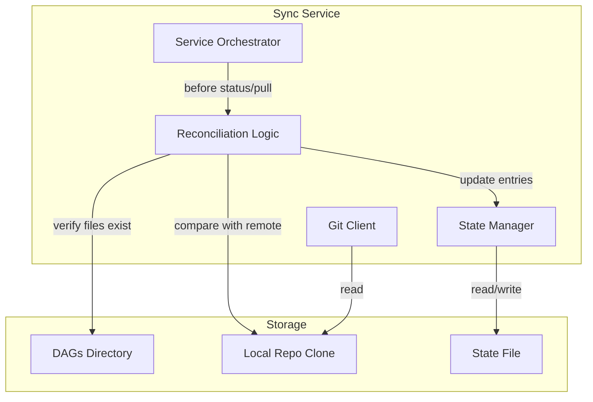
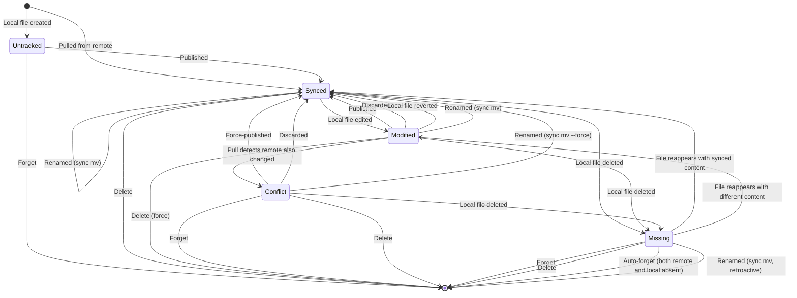
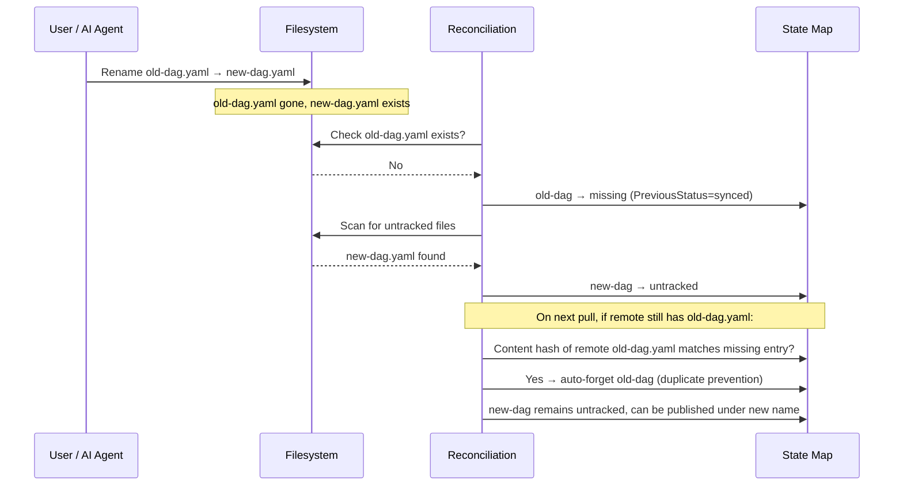

# RFC 026: Git Sync State Reconciliation

## Goal

Enable users and AI agents to freely move, rename, and delete tracked files — and have the sync system automatically reconcile state, preventing orphaned entries, duplicate files on pull, unbounded state growth, and ghost entries in the UI.

---

## Scope

| In Scope | Out of Scope |
|----------|--------------|
| Free file move, rename, and delete by users and AI agents without manual state cleanup | Filesystem watchers for real-time detection |
| New `missing` status for tracked items whose local file no longer exists | Automatic rename tracking across git history |
| Automatic reconciliation during status checks and before pulls | Multi-file atomic rename transactions |
| Content-hash-based rename detection to prevent duplicate files on pull | Garbage collection of the local repo clone |
| `forget` operation to explicitly remove state entries | UI-driven rename workflows |
| `delete` operation to remove items from remote repository, local disk, and local state | Migration tooling for pre-existing orphaned state files |
| `sync mv` command for atomic rename across local filesystem, remote repository, and state | Changes to the git client or authentication layer |
| Remote deletion detection during pull | |
| CLI commands: `sync forget`, `sync cleanup`, `sync delete`, `sync delete --all-missing`, `sync mv` | |
| API endpoints for forget, cleanup, delete, batch delete-missing, and move | |
| All four item kinds: dag, memory, skill, soul | |

---

## Solution

### Architecture

Reconciliation adds a new logical layer within the service orchestrator. No new components are introduced — the existing three-component architecture (service orchestrator, git client, state manager) is preserved.

Reconciliation is a synchronous function called within the existing mutex-serialized operation model at two points: during every `GetStatus` call and at the beginning of every `Pull` operation (after fetch, before file sync).

### Extended State Machine

The `missing` status represents a tracked item whose local file cannot be found on disk. It preserves all prior metadata (base commit, last-synced hash, kind) so the item can be recovered or explicitly forgotten.

Key transitions:

- **Any tracked status → Missing**: When reconciliation detects the local file no longer exists. The prior status is preserved in a `PreviousStatus` field so recovery can restore context.
- **Missing → Synced/Modified**: When a subsequent reconciliation finds the file has reappeared. If the content hash matches `LastSyncedHash`, it transitions to `synced`; otherwise to `modified`.
- **Missing → removed**: The `forget` operation deletes the state entry entirely.
- **Any tracked status (except untracked) → removed**: The `delete` operation removes the file from remote (git rm + commit + push), deletes the local file if present, and removes the state entry. Requires push enabled. Unlike `forget` (local state only), `delete` pushes the removal to the remote repository so the file does not reappear on the next pull.
- **Synced/Modified → removed + new Synced entry created**: `sync mv` removes the old entry and creates a new `synced` entry under the new ID. For `modified` sources, the local content is published to remote under the new name. For `conflict` sources (with `--force`), the local version overrides remote. In retroactive mode, the `missing` source entry is removed and the destination (already present on disk) is synced to remote.
- **Auto-forget**: During pull, when an item is absent from both remote and local, its entry is automatically removed — the only case where reconciliation removes state without explicit user action.

### File Move & Rename Workflow

Users and AI agents can move, rename, or delete any tracked file directly — no special sync command is required. Reconciliation handles all cases automatically:

This workflow applies identically to all four item kinds. The key principle: **no operation requires the user to inform sync about the move.** The system infers what happened from filesystem state and content hashes.

### Reconciliation Logic

Reconciliation runs as a single pass over the state map. For each tracked item (status is `synced`, `modified`, or `conflict`):

1. Resolve the item ID to a local file path.
2. Check if the file exists on disk.
3. If the file is missing and the current status is not already `missing`: transition to `missing`, record `MissingAt` timestamp, preserve current status in `PreviousStatus`.

For items already in `missing` status:

1. Check if the file has reappeared on disk.
2. If present: compute content hash. If it matches `LastSyncedHash`, transition to `synced`. Otherwise, transition to `modified`. Clear `MissingAt` and `PreviousStatus`.

Items in `untracked` status are not checked for missing files. If an untracked item's file is deleted, the scan-for-untracked pass simply will not re-add it — the entry naturally falls out of the next status report since it no longer matches any file on disk.

**Untracked cleanup**: During reconciliation, untracked items whose local file no longer exists are automatically removed from state. Since untracked items have no remote counterpart and no synced history, there is no value in preserving an orphaned entry.

### Remote Deletion Detection

During pull, after syncing files from the repo to the local directory, an additional pass compares tracked items against the repo file list:

| In Remote | In Local | Action |
|-----------|----------|--------|
| Yes | Yes | Normal sync (existing logic) |
| Yes | No | Copy from remote (existing logic) |
| No | No | Auto-forget: remove state entry silently |
| No | Yes | No action; item remains in current status |

Auto-forget only applies when both the remote and local file are absent. This is the only case where reconciliation automatically removes a state entry without user action.

### Duplicate Prevention During Pull

Before creating a new local file from a remote file during pull, the system checks whether any `missing` item in the state map has a `LastSyncedHash` matching the remote file's content hash. If a match is found:

1. The remote file is still copied to its expected local path (the canonical name in the repo).
2. The matching `missing` entry is auto-forgotten since it represents the same content under a different name.
3. A log message records the likely rename for auditability.

This does not attempt to track renames or preserve local file names. It prevents the state from accumulating both a `missing` entry for the old name and a `synced` entry for the new name.

### Forget Operation

`Forget` explicitly removes one or more state entries from the state map.

**Allowed statuses**: `missing`, `untracked`, and `conflict`. Items in `synced` or `modified` status cannot be forgotten — forgetting a synced file would cause it to reappear as untracked on the next scan, creating a confusing cycle. Users who want to stop tracking a synced or modified file should delete the local file first (transitions to `missing`), then forget.

**Batch forget**: Accepts a list of item IDs for bulk cleanup.

### Delete Operation

`Delete` removes an item from the remote repository, the local filesystem, and the local state — a permanent removal that prevents the file from reappearing on the next pull. This is the key difference from `forget`, which only removes the local state entry and leaves the remote file intact.

**Allowed statuses**: `synced`, `modified` (requires `force` flag), `conflict`, `missing`. Items in `untracked` status cannot be deleted because they have no remote counterpart — use `forget` instead.

**Requires push enabled**: Delete modifies the remote repository. If push is disabled, the operation returns an error directing the user to `forget` for local-only removal.

**Operation sequence**:

1. Validate push is enabled and item status is eligible.
2. Open the local repo clone.
3. Delete the local file from disk if it still exists.
4. Stage the removal in the repo working tree (`wt.Remove()`).
5. Commit with a descriptive message (user-provided or auto-generated).
6. Push to remote.
7. Remove the state entry.
8. Save state.

**Error recovery**: If the push fails after the local file has already been deleted, the state entry is preserved so the user can retry. Reconciliation will mark the item as `missing` on the next status check, and the user can re-attempt the delete or fall back to `forget`.

**Batch delete (`DeleteAllMissing`)**: Stages all `missing` items' removals into a single commit with a single push. This mirrors the `PublishAll` pattern — one commit per batch, not one commit per item.

### Move Operation

`sync mv <old-id> <new-id>` atomically renames an item across the local filesystem, remote repository, and sync state in a single commit and push. It complements reconciliation-based rename detection: reconciliation handles implicit renames automatically (detects `missing` + discovers `untracked`), while `sync mv` provides an explicit single-step path when the user wants an atomic rename. Both coexist — `sync mv` for explicit intent, reconciliation as a fallback.

Without `sync mv`, an explicit rename requires two separate operations: `sync publish <new-name>` + `sync delete <old-name>` — two commits, two pushes, two state updates.

**Two modes**:

- **Preemptive**: The file has not yet been moved on disk. `sync mv` moves the local file, syncs the rename to the remote repository, and updates state — all in one step.
- **Retroactive**: The file has already been moved on disk (source is `missing`, destination exists as a local file). `sync mv` syncs the rename to remote and updates state. This is the primary use case — users typically move files via filesystem tools, then run `sync mv` to push the rename.

**Allowed source statuses**: `synced`, `modified`, `conflict` (requires `--force`), `missing` (retroactive mode only). Items in `untracked` status cannot be moved because they have no remote counterpart — there is nothing to rename in the remote repository.

**Destination validation**:

- Must be a valid normalized item ID.
- Must be the same kind as the source (`KindForDAGID()` must match). Cross-kind moves (e.g., DAG → memory) are disallowed because changing the file extension changes the item's semantics.
- Must not already exist in the state map, unless the existing entry is `untracked` and the mode is retroactive (the destination file already exists on disk as an untracked item — `sync mv` adopts it).
- In preemptive mode, the destination file must not already exist on disk.

**Requires push enabled**: Move modifies the remote repository. If push is disabled, the operation returns an error.

**Operation sequence (preemptive)**:

1. Validate push is enabled, source status is eligible, destination is valid (same kind, not tracked, file does not exist on disk).
2. Open the local repo clone.
3. Read the source file content from disk.
4. Delete the source file from disk.
5. Write the destination file to disk.
6. Stage the removal in the repo working tree (`wt.Remove(oldRepoPath)`) and write + add the new repo file (`wt.Add(newRepoPath)`).
7. Commit with a descriptive message (user-provided or auto-generated).
8. Push to remote.
9. Update state: delete the old key, add a new key as `synced` with the current content hash.
10. Save state.

**Operation sequence (retroactive)**:

1. Validate push is enabled, source status is `missing`, destination is valid (same kind, file exists on disk).
2. Open the local repo clone.
3. Read content from the new local file path.
4. If the old repo file exists, stage its removal (`wt.Remove(oldRepoPath)`). If already absent, skip gracefully.
5. Write the new repo file and stage it (`wt.Add(newRepoPath)`).
6. Commit with a descriptive message.
7. Push to remote.
8. Update state: delete the old key, add a new key as `synced`.
9. Save state.

**Skill directory handling**: For skill items, the move operates on the entire skill directory (not just `SKILL.md`), since skill directories may contain auxiliary files. Locally, the entire directory is renamed. In the repo, `SKILL.md` is removed from the old path and added at the new path.

**Error recovery**: If the push fails after the local file has already been moved (preemptive mode), the state entry for the old ID is preserved. Reconciliation will mark the old entry as `missing` and discover the new file as `untracked` on the next status check. The user can retry with `sync mv` in retroactive mode or manually `sync publish` + `sync delete`.

### Cleanup Operation

`Cleanup` is a convenience that forgets all items currently in `missing` status. Useful after bulk file reorganizations or directory renames. Note: `cleanup` only removes local state entries. To also remove the files from the remote repository, use `sync delete --all-missing` instead.

**Ordering with `sync mv`**: If you intend to use `sync mv` for retroactive renames of files already moved on disk, run `sync mv` before `sync cleanup` — cleanup removes the `missing` entries that `sync mv` needs to identify the source.

### API Endpoints

| Method | Path | Description |
|--------|------|-------------|
| POST | `/sync/items/{itemId}/forget` | Forget a single item; removes its state entry. Returns 400 if item is synced or modified. |
| POST | `/sync/cleanup` | Forget all items in `missing` status; returns the list of forgotten item IDs. |
| POST | `/sync/items/{itemId}/delete` | Delete item from remote and state. Accepts `message` and `force` in request body. Returns 400 if item is untracked or push is disabled. |
| POST | `/sync/delete-missing` | Delete all `missing` items from remote in one commit. Returns list of deleted item IDs. Returns 400 if push is disabled. |
| POST | `/sync/items/{itemId}/move` | Move/rename item to new ID. Accepts `newItemId`, `message`, `force` in body. Returns 400 if cross-kind, untracked, push disabled, or destination exists. |

The existing `GET /sync/status` response is extended with `missing` in the `SyncStatus` enum, a `missing` count in `SyncStatusCounts`, and a `missing` value in `SyncSummary`.

All forget, cleanup, delete, and move operations require write permissions and are audit-logged.

### CLI Commands

| Command | Description |
|---------|-------------|
| `sync forget <item-id> [item-id...]` | Remove state entries for specified items. Supports `-y` to skip confirmation. |
| `sync cleanup` | Remove all `missing` state entries. Supports `-y` to skip confirmation and `--dry-run` to preview. |
| `sync delete <item-id>` | Delete item from remote repository and state. Supports `-y` to skip confirmation, `-m` for custom commit message, `--force` to allow deletion of modified items. |
| `sync delete --all-missing` | Delete all `missing` items from remote in one commit. Supports `-y` to skip confirmation, `-m` for custom commit message, `--dry-run` to preview. |
| `sync mv <old-id> <new-id>` | Rename item atomically across local, remote, and state. Supports `-y` (skip confirmation), `-m` (commit message), `--force` (allow conflict status), `--dry-run` (preview). |

The existing `sync status` command displays missing items in the pending-changes table.

### Summary Status Logic

The `SyncSummary` badge priority:

| Priority | Condition | Summary |
|----------|-----------|---------|
| 1 (highest) | `lastError` is set | `error` |
| 2 | Any items in `conflict` | `conflict` |
| 3 | Any items in `missing` | `missing` |
| 4 | Any items in `modified` or `untracked` | `pending` |
| 5 (lowest) | All items synced | `synced` |

### Auto-Sync Interaction

Auto-sync calls `Pull`, which runs reconciliation before syncing files. On every auto-sync interval, missing files are detected and remotely-deleted items are auto-forgotten. No separate reconciliation timer is needed. Between intervals, `GetStatus` calls also run reconciliation, keeping the UI current.

### Stat-Before-Hash Optimization

`refreshLocalHashes()` reads and SHA256-hashes every tracked file on every `GetStatus()` call and every `Pull()`. The UI polls `GetStatus` frequently, making this needlessly expensive when files haven't changed. Git solves this by checking file metadata (mtime + size) from its index before reading content. We apply the same technique.

Each `DAGState` entry caches the file's last-known modification time (`LastStatModTime`) and size (`LastStatSize`). When `refreshLocalHashes()` runs, it `os.Stat()`s each tracked file before reading it. If both mtime and size match the cached values, the expensive read+hash is skipped entirely. When the stat differs (or the cache is empty), the file is read, hashed, and the stat cache is updated.

The stat cache is populated at every site that computes a content hash:

| Site | When |
|------|------|
| `refreshLocalHashes()` | After reading and hashing a file whose stat changed |
| `syncFilesToDAGsDir()` | After writing a remote file to the DAGs directory |
| `scanLocalDAGs()` | When creating an entry for a new untracked DAG file |
| `scanMemoryFiles()` | When creating an entry for a new untracked memory file |
| `scanSkillFiles()` | When creating an entry for a new untracked skill file |
| `scanSoulFiles()` | When creating an entry for a new untracked soul file |
| `Publish()` | After successful publish |
| `PublishAll()` | After each item is published |
| `Discard()` | After restoring content from remote |

This is a standalone optimization — it does not depend on or conflict with the other RFC 026 features (missing status, forget, delete, sync mv). When those features are implemented, they should populate the stat cache fields at their hash computation sites.

**Backward compatibility**: The stat cache fields are zero-valued by default (`omitempty` in JSON). Old state files load without migration — the first `refreshLocalHashes()` call simply reads and hashes every file (same as current behavior) and populates the cache for subsequent calls.

---

## Data Model

### Per-Item State (new fields)

| Field | Type | Default | Description |
|-------|------|---------|-------------|
| Status | string | — | Extended enum: `synced`, `modified`, `untracked`, `conflict`, `missing` |
| PreviousStatus | string | `""` | Status before transitioning to `missing`. Used to restore context if the file reappears. Only set when status is `missing`. |
| MissingAt | timestamp | `null` | When the file was first detected as missing. Only set when status is `missing`. |
| LastStatModTime | timestamp | `null` | Cached file modification time from the last hash computation. Used for stat-before-hash optimization. |
| LastStatSize | int64 | `null` | Cached file size from the last hash computation. Used for stat-before-hash optimization. |

All existing fields are unchanged. New fields are additive with zero-value defaults.

### Status Counts (new field)

| Field | Type | Default | Description |
|-------|------|---------|-------------|
| Missing | int | `0` | Count of items in `missing` status |

### Sync Summary Enum (new value)

| Value | Description |
|-------|-------------|
| `missing` | Items are missing but no conflicts or errors exist |

### State File Version

The version field remains `1`. New fields are additive and zero-valued by default — no migration required. Older software versions will silently ignore unknown fields.

---

## Edge Cases & Tradeoffs

| Chosen | Considered | Why |
|--------|------------|-----|
| Explicit `missing` status with user-driven `forget` | Automatic removal after a timeout | Conservative: avoids deleting state for temporarily moved files; user retains full control |
| `forget` restricted to `missing`, `untracked`, and `conflict` | Allow forget on any status | Forgetting synced/modified would cause reappearance as untracked on next scan — confusing cycle |
| Content-hash duplicate detection during pull | Git-history rename tracking | Shallow clones (depth 1) have no rename history; content hash is independent of git internals |
| Auto-forget only when both remote and local absent | Require explicit forget for all cases | When neither side has the file, the entry is unambiguously orphaned; user action adds friction with no safety benefit |
| Reconciliation on every `GetStatus` and before every `Pull` | Periodic background reconciliation goroutine | Reuses existing scan-on-every-call pattern; no additional goroutines; consistent with RFC 025 design |
| `PreviousStatus` field for transparent recovery | Separate re-pull recovery operation | Preserving previous status enables automatic recovery when files reappear without re-fetching |
| Separate `missing` summary badge | Fold into `pending` | Missing items need different user action (forget/re-pull) than modified items (publish/discard); distinct badge guides the user |
| No grace period for missing detection | Configurable delay before marking missing | Grace periods add complexity; `missing` status is non-destructive — the entry is preserved, not deleted |
| Batch `cleanup` command | Individual forget only | Bulk operations are essential after directory reorganizations; requiring individual forget for 50+ orphans is impractical |
| State file version remains 1 | Bump to version 2 | New fields are additive with zero-value defaults; bumping would require migration logic with no benefit |
| Auto-remove orphaned untracked entries | Keep untracked entries for deleted files | Untracked items have no remote counterpart and no sync history; preserving orphaned entries adds noise with no recovery value |
| `sync mv` for explicit atomic renames, reconciliation for implicit | Reconciliation-only (no dedicated move command) | Reconciliation handles implicit renames automatically (detects missing + discovers untracked). `sync mv` provides a single-step atomic path (one commit, one push) when the user wants explicit rename. Both coexist: `sync mv` for explicit intent, reconciliation as fallback. |
| Cross-kind moves disallowed by `sync mv` | Allow cross-kind moves | Changing DAG → memory changes the file extension and semantics; explicit create-new + delete-old is clearer for cross-kind transitions |
| `sync mv` on `modified` does not require `--force` | Require force for modified | Content is preserved (renamed, not lost); rename carries local content to the new name — effectively rename + publish |
| `sync mv` on `conflict` requires `--force` | Allow unconditional move of conflicted items | Overrides remote changes; matches the force-publish pattern for conflicts |
| Skill move operates on entire skill directory | Move only `SKILL.md` | Skill directories may contain auxiliary files; moving only `SKILL.md` would orphan them |
| Retroactive mode supported by `sync mv` | Require preemptive mode only | Primary use case: users move files via filesystem then sync; complexity cost is low since retroactive reuses most of the preemptive logic |
| `sync mv` gracefully handles old file already absent from remote | Error if old file not in remote | Skip `wt.Remove` if file gone; commit only contains the addition — more robust for edge cases |
| `delete` requires push enabled | Allow local-only delete | Local-only removal is already covered by `forget`; `delete` exists specifically to push the removal to remote, so requiring push is definitional |
| `delete` on `modified` requires force flag | Allow unconditional delete | Modified items have unsaved local changes; requiring force prevents accidental data loss and matches the force-publish pattern for conflicts |
| `delete` on `untracked` disallowed | Allow delete on untracked | Untracked items have no remote file to remove; `forget` already handles this case — adding delete would be misleading |
| Single commit for batch delete (`DeleteAllMissing`) | One commit per item | Matches the `PublishAll` pattern; avoids push storms and keeps git history clean |
| POST method for delete endpoints | DELETE method | Consistent with publish/discard endpoints; POST supports a request body for `message` and `force` parameters |
| Delete local file when deleting synced/modified items | Leave local file in place | Leaving the local file would cause it to reappear as untracked on the next scan, defeating the purpose of delete |
| On push failure, preserve state entry | Remove state entry optimistically | Preserving the entry allows retry; reconciliation marks the item as `missing` in the interim, providing a clear path to resolution |

---

## Definition of Done

- Users and AI agents can move, rename, or delete any tracked file directly; reconciliation detects the change and updates state automatically without manual intervention.
- Items in `synced`, `modified`, or `conflict` status whose local file is deleted transition to `missing` on the next status check.
- Untracked items whose local file is deleted are automatically removed from state.
- Items in `missing` status whose local file reappears with the last-synced content hash transition back to `synced`.
- Items in `missing` status whose local file reappears with different content transition to `modified`.
- The `forget` operation removes a state entry for items in `missing`, `untracked`, or `conflict` status.
- The `forget` operation returns an error for items in `synced` or `modified` status.
- The `cleanup` operation removes all state entries currently in `missing` status and returns the list of forgotten item IDs.
- During pull, items absent from both remote and local are automatically removed from state.
- During pull, when a remote file's content hash matches a `missing` item's last-synced hash, the missing entry is removed to prevent duplicates.
- The `SyncStatusCounts` includes a `missing` count.
- The `SyncSummary` returns `missing` when items are in missing status and no conflicts or errors exist.
- The `sync status` CLI command displays missing items in the pending-changes table.
- The `sync forget` CLI command removes specified items from state with confirmation prompt.
- The `sync cleanup` CLI command removes all missing items with `--dry-run` support.
- The `POST /sync/items/{itemId}/forget` endpoint removes the specified item's state entry.
- The `POST /sync/cleanup` endpoint removes all missing items and returns the forgotten list.
- Reconciliation runs for all four item kinds: dag, memory, skill, soul.
- State entries for missing items preserve `PreviousStatus` and `MissingAt` metadata.
- Auto-sync periodic pulls detect missing files and auto-forget remotely-deleted items.
- All forget and cleanup operations are audit-logged.
- The `delete` operation removes the file from remote via git rm + commit + push, then removes the state entry.
- The `delete` operation removes the local file from disk if it still exists.
- The `delete` operation returns an error when push is disabled or the item is in `untracked` status.
- The `delete` operation on `modified` items requires the `force` flag.
- The `DeleteAllMissing` batch operation removes all `missing` items from remote in a single commit + push.
- The `sync delete` CLI command supports confirmation prompt, `-y`, `-m`, `--force`, `--all-missing`, and `--dry-run` flags.
- The `POST /sync/items/{itemId}/delete` endpoint deletes a single item from remote and state.
- The `POST /sync/delete-missing` endpoint deletes all missing items from remote in one commit.
- All delete operations are audit-logged.
- On push failure during delete, the state entry is preserved for retry; reconciliation marks the item as `missing`.
- `sync mv` atomically renames an item across local filesystem, remote repository, and sync state.
- `sync mv` works in preemptive mode (file not yet moved) and retroactive mode (file already moved, source is `missing`).
- `sync mv` accepts `synced`, `modified`, `conflict` (with `--force`), and `missing` (retroactive) sources.
- `sync mv` rejects cross-kind moves, `untracked` sources, and moves when push is disabled.
- `sync mv` rejects destinations that already exist in state (except `untracked` in retroactive mode).
- For skill items, `sync mv` moves the entire skill directory.
- On push failure during move, state is preserved for retry; reconciliation handles interim state.
- CLI `sync mv` supports `-y`, `-m`, `--force`, `--dry-run`.
- `POST /sync/items/{itemId}/move` endpoint renames the item and returns new state.
- All move operations are audit-logged.
- `refreshLocalHashes()` skips file read+hash when the file's mtime and size match the cached stat values.
- The stat cache is populated at all hash computation sites (refresh, sync, scan, publish, discard).
- Old state files without stat cache fields load and operate correctly (first call hashes all files, subsequent calls use the cache).
