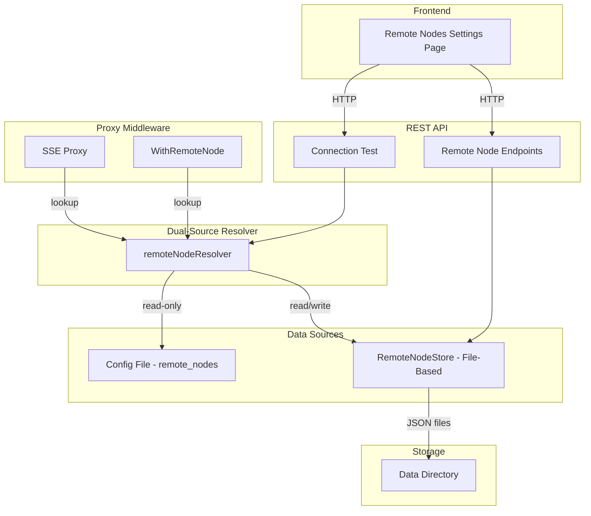

# RFC 027: Remote Node Store

## Goal

Add a file-based `RemoteNodeStore` behind a store interface to enable runtime CRUD operations on remote nodes from the UI and API, while preserving the existing config-file–based remote nodes. Both sources are merged at read time with no migration.

---

## Scope

| In Scope | Out of Scope |
|----------|--------------|
| `RemoteNodeStore` interface with file-based implementation | Database-backed implementations (SQL, Redis) |
| Dual-source resolution (config file + store merged at read time) | Migration or deprecation of the `remote_nodes` config key |
| REST API endpoints for CRUD operations on store-managed nodes | Automated remote node discovery |
| UI page for managing remote nodes (add, edit, delete, test) | Remote node health monitoring or uptime tracking |
| Connection testing endpoint | mTLS or certificate-based authentication |
| Credential encryption at rest | Multi-user per-node access control |
| Audit logging for remote node changes | Remote node grouping or tagging |

---

## Solution

### Architecture



Remote nodes come from two sources, merged at read time by a resolver:

1. **Config file** (`remote_nodes` in YAML) — static, read-only, loaded at startup. These continue to work exactly as before.
2. **RemoteNodeStore** (file-based) — dynamic, supports CRUD via API and UI. One JSON file per node in `<data_dir>/remote-nodes/`.

On name conflicts, store nodes take precedence over config nodes. Config-sourced nodes cannot be edited or deleted via the API — they are managed by editing the config file.

### Store Interface

```
RemoteNodeStore
├── Create(ctx, RemoteNode) → error
├── GetByID(ctx, id) → (RemoteNode, error)
├── GetByName(ctx, name) → (RemoteNode, error)
├── List(ctx) → ([]RemoteNode, error)
├── Update(ctx, RemoteNode) → error
└── Delete(ctx, id) → error
```

The interface lives in `internal/core/exec/` alongside the other store interfaces. Error types follow existing conventions: `ErrRemoteNodeNotFound`, `ErrRemoteNodeAlreadyExists`.

### File Storage Layout

Each remote node is stored as an individual JSON file in `<data_dir>/remote-nodes/`:

```
<data_dir>/
  remote-nodes/
    <uuid>.json
    <uuid>.json
```

File names use the node's UUID. Writes use atomic temp-file-then-rename to prevent corruption. Sensitive fields (passwords, tokens) are encrypted at rest.

### Dual-Source Resolver

A `remoteNodeResolver` merges both sources:

- **`Get(ctx, name)`** — checks the store first (precedence), then falls back to config nodes.
- **`List(ctx)`** — returns all nodes from both sources, with store overriding config on name conflicts. Each node is tagged with its source (`config` or `store`).

The resolver converts store `RemoteNode` types to the existing `config.RemoteNode` type, mapping the `AuthType` enum back to the `IsBasicAuth`/`IsAuthToken` boolean flags for full backward compatibility with the proxy code.

### Proxy Middleware Integration

The `WithRemoteNode` middleware changes from accepting a static `map[string]config.RemoteNode` to accepting the resolver. On each request with a `remoteNode` query parameter, the middleware calls `resolver.Get(ctx, name)`. The short-circuit for empty or `"local"` remains unchanged.

The SSE handler uses the same resolver via a lookup callback.

### API Endpoints

| Method | Path | Description |
|--------|------|-------------|
| GET | `/api/v1/remote-nodes` | List all remote nodes from both sources (credentials redacted) |
| POST | `/api/v1/remote-nodes` | Create a new store-managed remote node |
| GET | `/api/v1/remote-nodes/{nodeId}` | Get a single remote node (credentials redacted) |
| PATCH | `/api/v1/remote-nodes/{nodeId}` | Update a store-managed remote node |
| DELETE | `/api/v1/remote-nodes/{nodeId}` | Delete a store-managed remote node |
| POST | `/api/v1/remote-nodes/{nodeId}/test` | Test connectivity to a remote node |

All endpoints require admin role. Credentials are never returned in GET responses — they are write-only fields. Config-sourced nodes appear in list/get responses with `source: "config"` but cannot be updated or deleted via the API (returns 403).

### UI

A new "Remote Nodes" section in the settings area:

- **List view** — Table showing name, description, API URL, auth type, source badge (config/store), and action buttons (edit, delete, test).
- **Add/Edit form** — Fields: name, description, API base URL, auth method (none / basic / token), credentials, skip TLS verify toggle. Config-sourced nodes have edit/delete disabled.
- **Test connection** — Button that calls the test endpoint and shows success/failure inline.
- **Delete** — Confirmation dialog before removal.

### Example: Adding a Remote Node via API

```
POST /api/v1/remote-nodes
{
  "name": "production",
  "description": "Production Dagu instance",
  "apiBaseUrl": "https://dagu-prod.internal:8080/api/v1",
  "authType": "basic",
  "basicAuthUsername": "admin",
  "basicAuthPassword": "secret",
  "skipTlsVerify": false
}
```

Response: `201 Created`

### Example: Listing Remote Nodes

```
GET /api/v1/remote-nodes

{
  "remoteNodes": [
    {
      "id": "cfg:production",
      "name": "production",
      "description": "Production Dagu instance",
      "apiBaseUrl": "https://dagu-prod.internal:8080/api/v1",
      "authType": "basic",
      "hasCredentials": true,
      "skipTlsVerify": false,
      "source": "config"
    },
    {
      "id": "a1b2c3d4-...",
      "name": "staging",
      "description": "Staging environment",
      "apiBaseUrl": "https://dagu-staging.internal:8080/api/v1",
      "authType": "token",
      "hasCredentials": true,
      "skipTlsVerify": true,
      "source": "store",
      "createdAt": "2026-02-27T10:00:00Z",
      "updatedAt": "2026-02-27T10:00:00Z"
    }
  ]
}
```

Note: Credential values are never included in responses. Only `hasCredentials` indicates whether credentials are configured.

---

## Data Model

### Remote Node Record

| Field | Type | Default | Description |
|-------|------|---------|-------------|
| ID | string | uuid | Unique identifier (UUID for store nodes, `cfg:<name>` for config nodes) |
| Name | string | — | Unique display name for the node |
| Description | string | `""` | Human-readable description of the node |
| APIBaseURL | string | — | Base URL of the remote Dagu API |
| AuthType | string | `"none"` | Authentication method: `none`, `basic`, or `token` |
| BasicAuthUsername | string | `""` | Username for basic auth |
| BasicAuthPassword | string | `""` | Password for basic auth (encrypted at rest) |
| AuthToken | string | `""` | Bearer token (encrypted at rest) |
| SkipTLSVerify | bool | `false` | Skip TLS certificate verification |
| CreatedAt | timestamp | now | When the node was created (store nodes only) |
| UpdatedAt | timestamp | now | When the node was last modified (store nodes only) |

The `AuthType` field replaces the current `IsBasicAuth` / `IsAuthToken` boolean pair with a single enum-style string for clarity and extensibility.

---

## Edge Cases & Tradeoffs

| Chosen | Considered | Why |
|--------|------------|-----|
| Dual-source merge (config + store) | Migrate config entries to store | No migration avoids data loss risk, preserves existing workflows, and allows operators to keep using config-file–based nodes without change |
| Store nodes take precedence on name conflict | Config nodes take precedence | Store represents intentional user action via UI/API; if an operator creates a store node with the same name, they likely intend to override the config entry |
| One JSON file per node | Single JSON file for all nodes | Per-file avoids read-modify-write races on concurrent updates; consistent with how other stores work |
| Store lookup per proxied request | In-memory cache with invalidation | Keeps the system simple; the store uses an in-memory index so lookups are fast without disk I/O; avoids cache coherence complexity |
| Auth type as single string enum | Boolean flags (`IsBasicAuth`, `IsAuthToken`) | Mutually exclusive options are clearer as an enum; avoids invalid states where both flags are true; easier to extend with new auth types |
| Write-only credentials in API | Full credential retrieval | Prevents credential leakage through API; edit forms send new credentials only when changed (empty means "keep existing") |
| Config-sourced nodes are read-only in API | Allow editing config-sourced nodes via API | Config file is the source of truth for config nodes; editing them via API would create a confusing split-brain situation |
| Atomic file writes (temp + rename) | Direct file writes | Prevents corruption from crashes during writes; consistent with other file stores in the codebase |

---

## Definition of Done

- Remote nodes can be created, read, updated, and deleted via the REST API.
- Remote nodes can be managed from the UI settings page (add, edit, delete, test connection).
- The proxy middleware resolves remote nodes from the dual-source resolver instead of a static config map.
- Newly created remote nodes are available for proxying immediately without server restart.
- Config-file `remote_nodes` entries continue to work unchanged and appear in the API with `source: "config"`.
- Config-sourced nodes cannot be edited or deleted via the API (returns 403).
- Store nodes override config nodes on name conflict.
- Credentials are never returned in API GET responses.
- Credentials are encrypted at rest in the file store.
- The test connection endpoint verifies reachability and authentication against a remote node.
- All remote node mutations are audit-logged.
