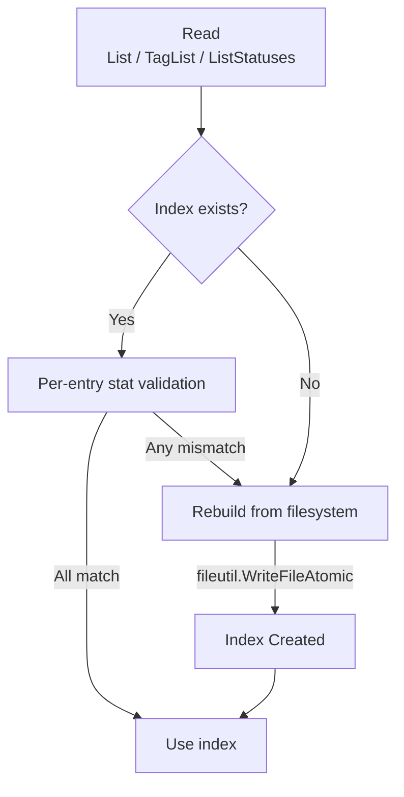
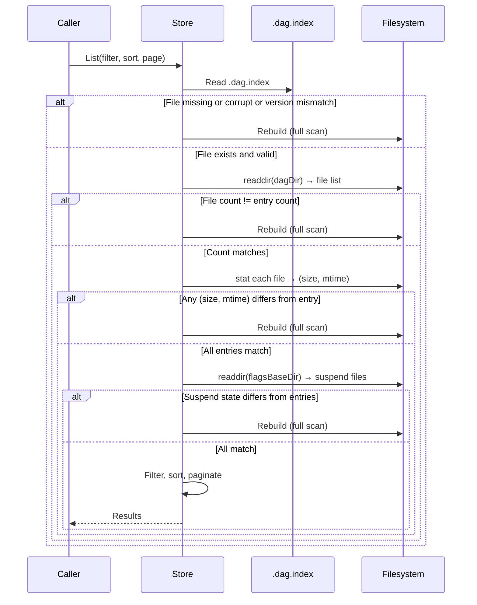

# RFC: File Index for DAG and DAG Run Stores

## Goal

Introduce lightweight, persistent index files for DAG definitions and DAG runs to eliminate full file reads on list/search/tag operations. Each index is scoped to the directory it accelerates — one index for all DAG definitions, one index per DAG per day for runs. The filesystem remains the source of truth. Indexes are disposable — deleting them triggers a rebuild on the next access.

The design is entirely **lock-free** and uses **per-entry stat validation** inspired by git's index. On every read, each index entry is validated against the filesystem via `stat` — if the file's size or mtime differs from what the index recorded, the index is rebuilt. Mutations do not need to touch the index — the stat validation on the next read detects any change automatically.

## Scope

| In Scope | Out of Scope |
|----------|-------------|
| Persistent index for DAG definition store | Full-text search / `Grep` (continues to read files) |
| Persistent per-day-per-DAG index for DAG run store | Migrating to a database-backed store |
| Lock-free, self-healing index via per-entry stat validation | Real-time filesystem watching (fsnotify) |
| Multi-process safety via atomic file operations | Changes to the DAG spec or run status format |
| Crash-safe via atomic rename | Sub-DAG run indexing (see Sub-DAG Runs section) |
| Protobuf serialization for efficient read/write | |

## Problem

### DAG Definitions

Every `List` and `TagList` call reads and parses every `.yaml` file in the DAG directory, even with `OnlyMetadata()`. A workspace with 500 DAGs pays ~500 file reads per list call.

### DAG Runs

`ListStatuses` walks the `{dagPrefix}/dag-runs/{year}/{month}/{day}/` hierarchy, globs for `dag-run_*` directories in each day, then reads `status.jsonl` from each attempt. For a query spanning 30 days across 100 DAGs, this touches thousands of directories and files.

`RecentAttempts` and `LatestAttempt` also walk the hierarchy in reverse chronological order, globbing each day directory. These are called on every DAG detail page load and SSE status update.

The existing `fileutil.Cache` (LRU + TTL) helps for repeated reads of the same file but does not help with listing operations.

## Solution

### Core Mechanism: Per-Entry Stat Validation on Read

All indexes follow the same lock-free, self-healing pattern inspired by git's index:



**On read**: Read the index file, then validate it against the filesystem using per-entry stat comparison (size + mtime for each file). If all entries match, use the index. If any entry has changed, or files were added/removed, rebuild. If the index is missing, corrupt, or has an incompatible version, rebuild. Writes use `fileutil.WriteFileAtomic` (temp file + `os.Rename`, already used throughout the codebase) with protobuf-serialized bytes.

**No explicit invalidation on mutation**: Mutations (Create, Update, Delete, etc.) do not need to touch the index file. The per-entry stat validation on the next read detects any filesystem change and triggers a rebuild. The index is self-healing.

**How validation works** (git-inspired): Git stores `(ctime, mtime, dev, ino, mode, uid, gid, size)` per index entry. On `git status`, it `lstat()`s each tracked file and compares against cached stat fields. We adapt this model: each DAG definition index entry stores `(file_size, mod_time)`. On read, we `readdir` + `stat` each file and compare against the index. This catches additions, deletions, and in-place edits — no aggregate hash needed, fails fast on first mismatch.

**Why this is safe**:

- `os.Rename` is atomic on POSIX — readers see either the complete old file or the complete new file, never a partial write.
- Concurrent rebuilds are safe — multiple processes may rebuild simultaneously. If filesystem state is stable, all produce identical results; last `os.Rename` wins.
- Crash during temp file write — temp file is orphaned, index file is either present (old) or absent (triggers rebuild). No corruption possible. Temp files are created by `fileutil.WriteFileAtomic`, which uses `os.CreateTemp(dir, "{basename}.tmp.*")` with a random suffix (e.g., `.dag.index.tmp.123456`). Orphaned temp files are cleaned up on store initialization by deleting any `.dag.index.tmp.*` or `.dagrun.index.tmp.*` files whose mtime is older than 5 minutes. Cleanup runs in any process that initializes the store (both the HTTP server and the scheduler). Multiple processes performing cleanup simultaneously is safe — `os.Remove` of an already-deleted file returns an error that is silently ignored. The age-based threshold (rather than PID-based matching) is safe for multi-server deployments on shared volumes, since any active index write completes in milliseconds.
- No locks — no process ever blocks on another, no stale locks on crash, no NFS lock compatibility issues.
- If the index file is corrupt or unreadable (e.g., partial write due to crash, disk error), the fallback is a full filesystem scan — the same behavior as today without any index. Nothing breaks.

---

### Part 1: DAG Definition Index

#### Index Location

```
{dagDir}/.dag.index
```

#### Index File Format

Protobuf-serialized binary file. The proto definition lives at `proto/index/v1/index.proto` and is compiled via `make protoc` (existing infrastructure).

```protobuf
syntax = "proto3";
package dagu.index.v1;

message DAGIndex {
  uint32 version = 1;
  int64 built_at_unix = 2;
  repeated DAGIndexEntry entries = 3;
}

message DAGIndexEntry {
  string file_path = 1;
  int64 file_size = 2;
  int64 mod_time = 3;
  string name = 4;
  repeated string tags = 5;
  string group = 6;
  string schedule = 7;
  bool suspended = 8;
  string description = 9;
}
```

#### DAG Definition Index Entry

| Field | Type | Description |
|-------|------|-------------|
| `file_path` | `string` | Relative path to the `.yaml` file |
| `file_size` | `int64` | Size in bytes from `os.Stat` (used for validation) |
| `mod_time` | `int64` | Unix nanosecond modification time (used for validation) |
| `name` | `string` | DAG display name |
| `tags` | `[]string` | Tags extracted from DAG metadata |
| `group` | `string` | Group name |
| `schedule` | `string` | Cron schedule expression(s) |
| `suspended` | `bool` | Whether the DAG is suspended |
| `description` | `string` | Short description |

The `file_size` and `mod_time` fields serve a dual purpose: they are part of the DAG metadata AND they are the stat cache used for per-read validation (same as git's per-entry stat data). The `mod_time` uses nanosecond granularity (`os.Stat().ModTime().UnixNano()`), which on modern filesystems (ext4, XFS, APFS, Btrfs) distinguishes two edits within the same second.

#### Read: Validate or Rebuild

On every read, the index is validated against the filesystem using per-entry stat comparison:



**Validation steps** (in order, failing fast):

1. Read and parse `.dag.index`. If missing, corrupt, or version mismatch → rebuild.
2. `readdir(dagDir)` → count YAML files. If count != number of index entries → rebuild.
3. For each YAML file, `stat` → `(size, mtime)`. Find matching entry in index by `file_path`. If no match, or `(file_size, mod_time)` differs → rebuild.
4. `readdir(flagsBaseDir)` → list `.suspend` files. Compare against `suspended` field on each index entry. If any mismatch → rebuild.
5. All match → use the index. Filter, sort, paginate from index entries.

**Validation cost**: `readdir` + N `stat` calls for YAML files + `readdir` for flag files. For 500 DAGs on a local filesystem, this completes in ~0.5ms — orders of magnitude cheaper than parsing 500 YAML files (~50-100ms). On NFS with cold attribute cache, 5-50ms (see Network Filesystem Compatibility).

**Rebuild process**: For each YAML file in `dagDir`, load metadata via `spec.Load(OnlyMetadata)` (leveraging `fileutil.Cache` for cached objects with matching mtime + size). Additionally, scan `flagsBaseDir` for `.suspend` files and set the `suspended` field on matching entries by normalized DAG name. Write via `fileutil.WriteFileAtomic` with protobuf serialization.

**Rebuild cost**: Parsing 500 YAML files with `OnlyMetadata` is ~50-100ms — the same cost as one current list call. Since mutations are rare (operator creates/edits a DAG), this cost is paid infrequently. The common path (list with no recent mutations) validates and uses the index in ~0.5ms.

The existing `fileutil.Cache` (LRU) further reduces rebuild cost: cached DAG objects with matching `mtime + size` are reused without re-parsing. After the first rebuild, subsequent rebuilds mostly hit the cache and are significantly faster.

---

### Part 2: DAG Run Index

#### Key Insight: Index at the Leaf Level

The existing directory structure already partitions runs by DAG and date:

```
{baseDir}/
  {dagPrefix}/
    dag-runs/
      {year}/{month}/{day}/          <- one index here (past days only)
        dag-run_{ts}_{runID}/
          attempt_{ts}_{attemptID}/
            status.jsonl
          children/
            child_{subDAGRunID}/     <- NOT indexed (see Sub-DAG Runs)
```

Each day directory gets its own small index — but only if it has 10 or more runs. Directories with fewer than 10 runs are read from the filesystem directly, since the overhead of creating and validating an index exceeds the cost of reading a few directories.

#### Index Location

```
{dagPrefix}/dag-runs/{year}/{month}/{day}/.dagrun.index
```

One index per DAG per day (created only when the day has ≥10 runs).

#### Why Per-Day-Per-DAG

- **No contention**: Different DAGs and different days are fully independent.
- **Query-aligned**: Date-range queries already walk day directories. Reading one small file per day replaces globbing + reading N status files.
- **Threshold-based**: Only created for days with ≥10 runs. Most days have 1-5 runs — no index file created, no overhead.

#### DAG Run Index File Format

Protobuf-serialized binary file using the same proto definition:

```protobuf
message DAGRunIndex {
  uint32 version = 1;
  int64 built_at_unix = 2;
  repeated DAGRunIndexEntry entries = 3;
}

message DAGRunIndexEntry {
  string dag_run_dir = 1;
  string dag_run_id = 2;
  int32 status = 3;
  int64 started_at = 4;
  int64 finished_at = 5;
  repeated string tags = 6;
}
```

#### DAG Run Index Entry

| Field | Type | Description |
|-------|------|-------------|
| `dag_run_dir` | `string` | Name of the dag-run directory |
| `dag_run_id` | `string` | Run identifier |
| `status` | `int32` | Final status code |
| `started_at` | `int64` | Unix timestamp of run start |
| `finished_at` | `int64` | Unix timestamp of run end |
| `tags` | `[]string` | Raw tags from the DAG at time of run (supports `ParseTagFilter` matching) |

#### Read: Validate or Rebuild

When a read operation accesses a day directory:

1. Glob `dag-run_*` in the day dir to get the current run list and count.
2. If fewer than 10 runs: read from the filesystem directly. No index is used or written.
3. If 10 or more runs: try to read `{day}/.dagrun.index`. If present, valid, and version matches: validate via per-entry stat check — compare count and verify each referenced directory still exists (`os.Stat`). If any mismatch → rebuild. If index is missing, corrupt, or version mismatch → rebuild.

**Rebuild**: For each matched directory, verify it still exists (`os.Stat`) before including it — this prevents ghost entries from a concurrent `RemoveDAGRun`. For each verified run, find the latest attempt and read its status. Write index via `fileutil.WriteFileAtomic` with protobuf serialization.

#### What the Index Accelerates

The index eliminates **directory walking, globbing, and attempt discovery** for past days. For operations requiring full `DAGRunStatus` (including `Nodes`, `Log`, `Params`), the index filters and paginates first, then `status.jsonl` is read only for the N entries on the current page (**filter-then-fetch**).

| Operation | Current Behavior | With Index |
|-----------|-----------------|------------|
| `ListStatuses(dateRange)` | Walk days, glob each, read N status files | Days with ≥10 runs: read 1 index per day. Otherwise: read from filesystem. Fetch full status for page only. |
| `RecentAttempts(name, limit)` | Walk days in reverse, glob each until limit | Walk days in reverse, use index when available, otherwise filesystem. |
| `LatestAttempt(name)` | Walk days in reverse, glob, find latest | Use index when available, otherwise filesystem. |

#### Sub-DAG Runs

The per-day index covers **top-level DAG runs only**. Sub-DAG runs under `children/` are **not indexed**.

Operations unaffected by the index:
- `CreateSubAttempt` — creates under `{dag-run}/children/`, does not touch day index.
- `FindSubAttempt` — navigates from parent run into `children/`, reads from filesystem.
- `newChildRecord` — creates child records under a parent, does not touch day index.

Sub-DAG runs are discovered by navigating from their parent run, not by day-level listing.

#### ListStatuses: Before and After

**Before (current):**
```
ListStatuses(from, to) ->
  for each dagPrefix (parallel workers):
    for each day in range:
      glob dag-run_* dirs               <- ELIMINATED (≥10 runs)
      for each run:
        find latest attempt dir          <- ELIMINATED (≥10 runs)
        read status.jsonl                <- only for page results
  filter, sort, paginate
```

**After (with per-day index):**
```
ListStatuses(from, to) ->
  for each dagPrefix (parallel workers):
    for each day in range:
      glob dag-run_* dirs → count
      if count < 10:
        read from filesystem directly
      else:
        read {day}/.dagrun.index (validate or rebuild)
      collect matching entries
  sort, paginate
  for each entry on current page:
    read status.jsonl for full DAGRunStatus
```

For 30 days, 10 runs/day, page size 20: **300 file reads → 29 index reads + 1 day filesystem + 20 status reads**.

**Defensive reads**: When performing filter-then-fetch, readers MUST handle missing `status.jsonl` gracefully (skip the entry, log WARN). A run directory may be deleted by a concurrent `RemoveDAGRun` between the index read and the full status fetch. This is not an error — the entry is simply stale.

---

### Shared Design Decisions

#### Why No Locks

| Lock-based approach | Problem |
|---------------------|---------|
| `dirlock` (mkdir-based) | Crashed process leaves stale lock for 30s. Other servers on shared volume hang. Unreliable on NFSv3. |
| `flock(2)` advisory locks | Does not work on NFS. |
| Per-day lock + DataRoot lock | Two lock scopes create ordering complexity and deadlock risk. |

The self-healing index approach eliminates all locking:

| Concern | How it's handled |
|---------|-----------------|
| Concurrent rebuilds | Multiple readers may rebuild simultaneously. Results are identical if filesystem state is stable. Last `os.Rename` wins. |
| Mutation during read | A mutation changes a file while a reader is validating. The reader may write a stale index (built before the mutation). The next read's per-entry stat validation detects the staleness and triggers a fresh rebuild. |
| Crash during temp write | Temp file orphaned, index file unchanged or absent. No corruption. |
| Crash during rename | `os.Rename` is atomic on POSIX. Either completes or doesn't. |

#### Rebuild Strategy

Both indexes rebuild from scratch when the index file is missing, unparsable, has an incompatible version, or fails per-entry validation. Rebuild means: scan the directory, extract metadata, write a fresh index via `fileutil.WriteFileAtomic` with protobuf serialization. To force a rebuild, delete the index file (`rm .dag.index` or `rm .dagrun.index`).

#### Error Handling

- **Index read fails** (corrupt, parse error): Treat as missing, rebuild from filesystem.
- **Index write fails** (disk full, permission error): Fall back to current behavior — full filesystem scan without caching. Log WARN.
- **Rebuild fails** (disk full): Fall back to current behavior — full filesystem scan without caching. Log WARN.

The index is never in the critical path of any operation's success. If it's broken, the system behaves exactly as it does today without an index.

#### Observability

- Structured log lines (INFO) on rebuild: entry count, duration, trigger reason (missing, corrupt, count mismatch, stat mismatch, suspend mismatch).
- WARN on rebuild failure and fallback to filesystem scan.

#### Network Filesystem Compatibility

This design has **no NFS correctness concerns**, though there are performance implications to be aware of:

- No lock mechanism (`mkdir`-based or `flock`-based) — nothing to fail on NFS.
- `os.Rename` is a standard POSIX operation supported on all filesystems.
- `os.Rename` atomicity: guaranteed on local filesystems. On NFSv4 with close-to-open consistency, a reader may briefly see the old file after a rename, which is harmless (the next read re-validates via stat). On NFSv3, `rename` is atomic within a single directory.
- **NFS attribute caching**: NFSv3/v4 clients cache file attributes (including existence) for up to 30-60 seconds by default (`actimeo`). After an `os.Rename` writes a new index, other NFS clients may not see the updated file for up to one cache interval. During this window, those clients rebuild. This is expected behavior — each rebuild produces a correct result. For latency-sensitive NFS deployments, reducing `actimeo` on the mount is recommended.
- **Per-read stat cost on NFS**: The per-entry stat validation (`readdir` + N `stat` calls) may take 5-50ms on NFS with cold attribute cache due to network round trips. On local filesystems, this is ~0.5ms for 500 files. This is the floor cost per read operation when using NFS.
- **Mtime granularity on NFS**: NFSv3 typically provides second-granularity mtime; NFSv4 supports nanosecond. On NFS mounts with second-granularity, rapid edits that preserve file size within the same second may not be detected by stat validation. This is a known limitation of legacy timestamp granularity, not of the index design.

## Edge Cases & Tradeoffs

| Decision | Chosen | Considered | Why |
|----------|--------|-----------|-----|
| Concurrency model | Lock-free, self-healing via stat validation | dirlock, flock, optimistic locking | Zero contention, zero chance of hanging. No mutation-side coordination needed. Concurrent rebuilds are idempotent. |
| Read-path validation | Per-entry stat comparison (git-inspired) | Trust-on-read, per-read fingerprint hash, per-read TTL | Per-entry stat catches all changes (adds, deletes, in-place edits) at ~0.5ms cost. Trust-on-read misses external edits. Aggregate hash is more complex with no benefit over per-entry comparison. TTL forces unnecessary periodic rebuilds. |
| Mutation-side invalidation | None (self-healing) | Explicit `os.Remove` on mutation | Per-entry stat validation detects all changes on the next read. Explicit invalidation is redundant. Removing it simplifies the mutation path — mutations don't touch the index at all. |
| Index format | Protobuf (binary) | JSON, JSONL, SQLite | Protobuf: faster marshal/unmarshal, ~40-50% smaller files, type-safe generated code. Project already has protobuf infrastructure (`make protoc`). JSON human-readability not needed — if the index is broken, fallback is filesystem scan. SQLite adds dependency weight. |
| DAG def index granularity | Single file for all definitions | Per-directory | Definitions are flat (~500 files). Single index is small and simple. |
| DAG run index granularity | Per-day-per-DAG | Global, per-DAG, sidecar per-run | Global grows without bound. Per-DAG still large for long histories. Per-run sidecar requires N reads per day. Per-day-per-DAG is bounded, rarely changed for past days, matches query patterns. |
| Run index threshold | Not indexed if <10 runs in a day directory | Always index | Reading a handful of directories is faster than writing, reading, and validating an index file. This naturally covers today (which typically has few runs) and low-volume past days. |
| Run index validation | Per-entry stat validation (uniform with DAG defs) | Trust on read (assume immutable) | `RemoveDAGRun` and `RemoveOldDAGRuns` can delete runs. Trusting without validation causes ghost entries that break pagination. Stat cost is negligible. Uniform design — no special cases. |
| Mtime granularity | Nanosecond `mod_time` (from `os.Stat().ModTime().UnixNano()`) | Second-granularity mtime, git-style racily-clean smudging | Modern filesystems (ext4, XFS, APFS, Btrfs) provide nanosecond mtime — two edits within the same second produce different `mod_time` values, so stat validation catches them. On legacy filesystems with second-granularity timestamps (ext3, HFS+, some NFS mounts), rapid edits that preserve file size may go undetected until another file change triggers a rebuild or the user runs `rm .dag.index`. Git's racily-clean smudging is unnecessary here — nanosecond granularity eliminates the common case, and the legacy filesystem edge case is acceptable for listing metadata. |
| Sub-DAG runs | Not indexed | Include in day index | Sub-runs live under parent run dir, not day dir. Discovered via parent, not day listing. |
| Full status fetch | Filter-then-fetch | Index serves full response | Index stores summary only. Full `DAGRunStatus` needs `status.jsonl`. Filter-then-fetch minimizes reads to page size. |
| Forced reindex | `rm` the index file | CLI command | Index is disposable by design. `rm` already does this. |
| Reconciliation | Full rebuild (not incremental) | Per-entry diff | Rebuild is fast at these sizes. Simpler code, no edge cases. |
| Ghost entries from concurrent delete | Stat-check during rebuild + graceful missing-file handling | Trust glob results | Glob results can be stale by the time they're used. `os.Stat` before include narrows the window. Graceful skip on fetch eliminates impact of any remaining race. |

## Migration & Rollback

**Forward compatibility**: `.dag.index` and `.dagrun.index` files are new artifacts. Older Dagu versions do not look for or read these files — they are silently ignored. No migration step is needed.

**Rollback**: On downgrade to a version without index support, the index files persist harmlessly on disk. They consume negligible space and have no effect on behavior. On re-upgrade, existing indexes are validated (version check, per-entry stat) and rebuilt if stale.

**Manual cleanup**: Users can safely delete any index file at any time. The next read operation rebuilds it automatically.

**Mixed-version deployments**: During a rolling upgrade, a newer Dagu binary may write an index with a newer `version` field. An older binary reading it will detect a version mismatch and rebuild with its own version. If both versions are running concurrently, this creates a rebuild cycle (ping-pong) where each version overwrites the other's index. This is functionally correct but wastes I/O. Mixed-version deployments should be kept short-lived during rolling upgrades. The rebuild cost is negligible (50-100ms for DAG definitions, microseconds for per-day run indexes).

## Index Size Estimates

| Metric | Estimate |
|--------|----------|
| DAG definition index entry size | ~120 bytes (protobuf) |
| 500 DAGs, single `.dag.index` file | ~60 KB |
| DAG run index entry size | ~80 bytes (protobuf) |
| 10 runs/day, single `.dagrun.index` file | ~800 bytes |
| 500 DAGs, 5 runs/day, 1 year of history | ~60 KB (DAG defs) + ~150 MB (run indexes across ~182,500 files) |

Protobuf encoding is ~40-50% smaller than equivalent JSON. The DAG definition index is a single small file. The DAG run indexes accumulate as one file per DAG per day. For 500 DAGs with 5 runs/day over one year, this produces ~182,500 index files totaling ~150 MB. The file count is comparable to the existing directory structure (these day directories and run directories already exist), so the index adds one small file per existing day directory — not a new scaling dimension.

## Definition of Done

### DAG Definition Index
- [ ] `DAGStore.List()` serves results from `.dag.index` without reading `.yaml` files.
- [ ] `DAGStore.TagList()` returns tags from the index.
- [ ] Index format: protobuf (`DAGIndex` message) with `version`, `built_at_unix`, `entries`.
- [ ] Proto definition at `proto/index/v1/index.proto`, compiled via `make protoc`.
- [ ] On every read, per-entry stat validation: `readdir` + `stat` each file, compare `(file_size, mod_time)` against index entries. Mismatch → rebuild.
- [ ] On every read, suspension validation: `readdir(flagsBaseDir)` → compare `.suspend` files against index `suspended` fields. Mismatch → rebuild.
- [ ] Missing/corrupt/version-mismatched index triggers rebuild via `fileutil.WriteFileAtomic`.
- [ ] Rebuild scans `flagsBaseDir` for `.suspend` files to populate the `suspended` field on matching entries.
- [ ] Rebuild leverages `fileutil.Cache` for cached DAG objects to minimize re-parsing.
- [ ] No explicit invalidation on mutation — stat validation is self-healing.

### DAG Run Index
- [ ] `ListStatuses` reads per-day `.dagrun.index` files for past days instead of globbing + reading `status.jsonl` per run.
- [ ] `RecentAttempts` and `LatestAttempt` use per-day indexes for past days instead of globbing.
- [ ] Day directories with fewer than 10 runs are read from filesystem directly (no index created).
- [ ] Index format: protobuf (`DAGRunIndex` message).
- [ ] Index lives at `{dagPrefix}/dag-runs/{year}/{month}/{day}/.dagrun.index`.
- [ ] Index covers top-level DAG runs only. Sub-DAG runs are not indexed.
- [ ] Run indexes use per-entry stat validation (same as DAG definition index).
- [ ] For full `DAGRunStatus` responses, `status.jsonl` is read only for entries on the current page.

### Shared
- [ ] No locks used. All concurrency handled via atomic `os.Rename`.
- [ ] Mutations do not touch the index — self-healing via stat validation on next read.
- [ ] Index writes use `fileutil.WriteFileAtomic` with protobuf serialization.
- [ ] DAG run rebuild verifies each directory exists (`os.Stat`) before including, preventing ghost entries.
- [ ] Filter-then-fetch handles missing `status.jsonl` gracefully (skip entry, log WARN).
- [ ] Orphaned temp files (`.dag.index.tmp.*`, `.dagrun.index.tmp.*`) cleaned up on store initialization using age-based threshold (>5 minutes), safe for multi-server shared volumes. Cleanup runs in any process that initializes the store; concurrent cleanup is safe.
- [ ] Index read/write failure does not fail any operation — falls back to filesystem scan.
- [ ] Multiple processes on shared volume operate safely without coordination.
- [ ] Crash at any point leaves the system in a recoverable state (no corruption).
- [ ] Deleting any index file triggers rebuild on next access.
- [ ] Benchmark: >10x improvement in `DAGStore.List()` latency for 500+ DAGs.
- [ ] Benchmark: >5x improvement in `ListStatuses` latency for 30-day range across 100 DAGs.
- [ ] Structured log lines on rebuild (with trigger reason) and fallback.
