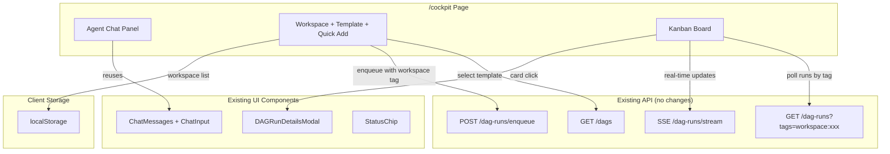
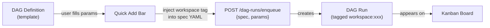

# RFC 029: Cockpit

## Goal

Add a `/cockpit` page that lets users queue parameterized DAG runs into workspaces and monitor them on a kanban board, with the built-in agent chat embedded for natural language task creation. A "task" is a parameterized run of an existing DAG definition — no new backend entities, endpoints, or stores.

---

## Scope

| In Scope | Out of Scope |
|----------|--------------|
| `/cockpit` page with two-panel layout | Drag-and-drop card reordering |
| Kanban view of DAG runs grouped by status | Backend workspace entity or store |
| Workspace tagging via `workspace:{name}` convention | Custom task entity or task store |
| Quick Add bar for parameterized DAG runs | New API endpoints |
| Embedded agent chat panel (reusing existing components) | New SSE streams |
| `dag_codegen` agent tool for programmatic DAG creation | Mobile-optimized layout (v1) |
| DAG definitions as reusable templates | Multi-user workspace sharing |

---

## Solution

### Architecture



### Task Model

A "task" is a parameterized run of an existing DAG definition. There is no separate task entity.



The user creates a DAG definition once as a reusable template:

```yaml
# coding-task.yaml
name: coding-task
params:
  - PROMPT
  - AGENT: "claude --print --verbose"
steps:
  - name: code
    command: $AGENT
    args: ["$PROMPT"]
    dir: /path/to/repo
  - name: test
    command: claude
    args: ["--print", "Write tests for the changes just made"]
    depends: [code]
```

Each "task" is a run of this template with different `PROMPT` values. The cockpit reads the template's spec, injects `tags: [workspace:{name}]`, and submits via `POST /dag-runs/enqueue` with the user's params.

### Workspace Concept

A workspace is a tag string with the `workspace:` prefix. It is a purely frontend concept — no backend entity.

- Workspace list stored in localStorage
- Create: user types a name → added to localStorage list
- Select: dropdown filters kanban by `workspace:{name}` tag
- Delete: remove from localStorage list (runs are retained, just no longer filtered)

### Page Layout

```
+----------+------------------------------+
|  Agent   | [workspace v] [template v]   |
|  Chat    | PROMPT: [__________] [Add]   |
|          +------------------------------+
| messages | Queued | Running | Done |Fail|
| messages | +---+  | +---+   | +---+|   |
| messages | |   |  | |   |   | |   ||   |
|          | +---+  | +---+   | +---+|   |
| [input]  |        |         |      |   |
+----------+------------------------------+
```

- **Left panel**: Embedded agent chat (resizable). Reuses `ChatMessages`, `ChatInput`, and `SessionSidebar` from the agent feature, rendered in a flex panel instead of a floating modal. Uses the same `AgentChatContext` (already provided at app level).
- **Right panel**: Toolbar (workspace selector, template selector, Quick Add bar) + kanban board.
- **Resizable divider**: Between panels, persisted to localStorage.
- **AgentChatModal suppression**: When on `/cockpit`, the floating agent modal does not render (the cockpit has its own embedded panel).

### Kanban Board

Four columns grouping DAG runs by status:

| Column | DAG Run Statuses |
|--------|-----------------|
| Queued | `queued`, `not_started` |
| Running | `running` |
| Done | `success`, `partial_success` |
| Failed | `failed`, `aborted`, `rejected` |

Each card represents one DAG run (not a step). The board is scoped to the **last 7 days** by default to keep it clean — old completed runs drop off naturally.

Real-time updates use the existing `useDAGRunsListSSE` + `useSSECacheSync` pattern (same as the DAG runs page).

### Kanban Card

```
+---------------------------+
| coding-task            [*]|
| # RUNNING                 |
| > 3m 24s                  |
| PROMPT="Refactor auth..." |
+---------------------------+
```

Each card shows: DAG name, status chip, elapsed time, truncated params (first 60 chars). Click opens `DAGRunDetailsModal` (existing component — slides from right, 75% width, shows step details, logs, timeline, outputs).

### Quick Add Bar

1. **Template selector**: Dropdown listing DAG definitions via `GET /dags`
2. **Param inputs**: Dynamically generated from the selected DAG's `defaultParams` using `parseParams()`
3. **Add button**: Reads the template's spec YAML, injects `tags: [workspace:{current}]`, calls `POST /dag-runs/enqueue` with `{ spec, params }`

### Embedded Agent Chat

The cockpit's left panel renders the same chat components used in the floating `AgentChatModal`:
- `ChatMessages` — message display with tool call badges, delegate indicators
- `ChatInput` — textarea with DAG/doc/skill pickers, model selector
- `SessionSidebar` — session history (collapsible)
- `useAgentChat()` — hook for all chat state management

The agent can also create tasks via the `dag_codegen` tool (see below).

### dag_codegen Agent Tool

A new agent tool registered via `init()` + `RegisterTool()`:

- **Input**: name, steps (with command/args/depends), tags
- **Behavior**: Validates step graph, writes DAG YAML to `{DAGsDir}/.generated/{name}.yaml`, triggers one-off run
- **Output**: `{ dag_name, dag_run_id }` so the agent can reference the run in chat

This lets the agent create tasks via natural language: *"Run Claude Code on these 5 files in parallel"* → agent generates a DAG with 5 parallel steps, tagged with the current workspace.

### Component Reuse

| Reused Component | Source | Used In |
|-----------------|--------|---------|
| `ChatMessages` + `ChatInput` | `features/agent/components/` | Cockpit agent panel |
| `SessionSidebar` | `features/agent/components/` | Cockpit agent panel |
| `useAgentChat()` | `features/agent/hooks/` | Cockpit agent panel |
| `DAGRunDetailsModal` | `features/dag-runs/components/` | Kanban card click |
| `StatusChip` | `ui/StatusChip` | Kanban card |
| `parseParams()` | `lib/parseParams.ts` | Quick Add bar |
| `useDAGRunsListSSE` | `hooks/useDAGRunsListSSE` | Kanban real-time |
| `useSSECacheSync` | `hooks/useSSECacheSync` | Kanban real-time |

### Example: Adding a Task via Quick Add

1. User selects workspace `auth-refactor` and template `coding-task`
2. Quick Add shows input: `PROMPT: [___]`
3. User types `"Refactor auth module to use JWT"`, clicks Add
4. Frontend reads `coding-task` spec, injects `tags: [workspace:auth-refactor]`
5. Calls `POST /dag-runs/enqueue { spec: "...", params: "PROMPT=\"Refactor auth module to use JWT\"" }`
6. Card appears in "Queued" column, moves to "Running" via SSE, then "Done"

### Example: Adding Tasks via Agent Chat

1. User types in chat panel: *"Create 3 parallel tasks: refactor auth, fix login page, update API docs"*
2. Agent calls `dag_codegen` tool → generates DAG with 3 parallel steps, tagged `workspace:auth-refactor`
3. Three cards appear on the kanban board

---

## Data Model

### Workspace State (localStorage only)

| Field | Type | Default | Description |
|-------|------|---------|-------------|
| workspaces | string[] | `[]` | List of workspace names the user has created |
| selectedWorkspace | string | `""` | Currently active workspace name |
| selectedTemplate | string | `""` | Currently selected DAG template file name |

No backend data model changes. Workspaces are a frontend convention over existing DAG run tags.

### dag_codegen Tool Input

| Field | Type | Default | Description |
|-------|------|---------|-------------|
| name | string | — | DAG name (used for file naming) |
| steps | DAGStepInput[] | — | Step definitions with name, command, args, depends, dir |
| tags | string[] | `[]` | Tags to apply to the generated DAG (includes workspace tag) |

---

## Edge Cases & Tradeoffs

| Chosen | Considered | Why |
|--------|------------|-----|
| Workspace as tag convention (frontend-only) | Backend workspace store with CRUD | No new store, no new API, no persistence complexity. Workspaces are just a filtering lens over existing runs. |
| Per-run inline spec via `/dag-runs/enqueue` | Mutate DAG definition to add workspace tag | Avoids modifying the shared template. Each run gets its own spec with the right tags. Uses an existing API endpoint. |
| Kanban of DAG runs (not steps) | Kanban of individual steps within a run | Each "task" maps to one run of a template. Steps are internal to the pipeline and visible in the detail modal. |
| 7-day default scope | Show all runs forever | Keeps the board clean. Completed runs naturally drop off. User can change the time window. |
| Display-only kanban (v1) | Drag-and-drop between columns | Simpler first version. Drag-and-drop adds complexity (library dependency, status mutation semantics). Can be added later. |
| Embedded agent panel reusing existing components | Separate chat implementation for cockpit | Maximum reuse. Same `AgentChatContext`, same hooks, same components — just different layout container. |
| Suppress AgentChatModal on `/cockpit` | Run two chat instances simultaneously | Avoids confusing dual-chat UX. The cockpit panel IS the agent chat for that page. |

---

## Definition of Done

- `/cockpit` route renders a two-panel page with agent chat on the left and kanban board on the right.
- User can create and select workspaces from a dropdown (persisted in localStorage).
- User can select a DAG definition as a template and see its parameters in the Quick Add bar.
- Filling params and clicking Add enqueues a DAG run tagged with the current workspace.
- The kanban board shows DAG runs filtered by the selected workspace tag, grouped into Queued/Running/Done/Failed columns.
- Kanban updates in real-time as runs change status (via existing SSE).
- Clicking a kanban card opens `DAGRunDetailsModal` with full step details, logs, and outputs.
- The embedded agent chat panel works identically to the floating modal (send messages, view responses, manage sessions).
- The floating `AgentChatModal` does not appear when on the `/cockpit` route.
- The `dag_codegen` agent tool can create DAG YAML and trigger runs tagged with the current workspace.
- The kanban board defaults to showing runs from the last 7 days.
