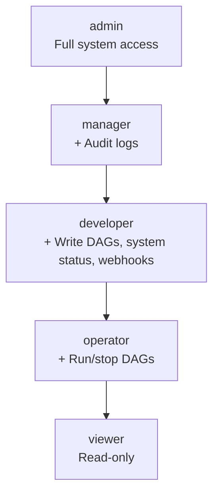
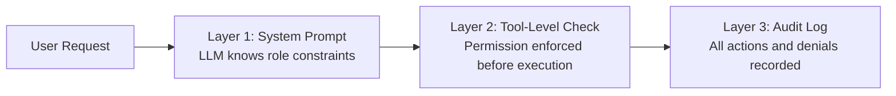

# RFC 001: Agent Authorization

## Goal

Add role-based authorization to the AI agent feature so that each authenticated user's agent session is constrained to their role's permissions, closing the gap where any authenticated user could use all agent capabilities.

## Scope

| In Scope | Out of Scope |
|----------|--------------|
| New "developer" role between operator and manager | Fine-grained per-DAG permissions |
| Permission checks on every agent tool invocation | Custom role definitions |
| Role-aware system prompt injection for the LLM | OAuth scope mapping |
| Audit logging of agent tool executions and denials | Rate limiting per role |

## Solution

### Role Hierarchy

Five roles form a strict hierarchy where each level inherits the capabilities of lower levels:

| Role | Description |
|------|-------------|
| **admin** | Full system access including user management |
| **manager** | Write DAGs, access audit logs, system status, webhooks |
| **developer** | Write DAGs, access system status, webhooks (no audit logs) |
| **operator** | Run and stop DAGs only |
| **viewer** | Read-only access |

The key distinction between manager and developer is audit log access. Developer was introduced to serve users who need DAG authoring capabilities without visibility into security-sensitive audit data.

### Permission Matrix

| Capability | viewer | operator | developer | manager | admin |
|------------|--------|----------|-----------|---------|-------|
| View DAGs | yes | yes | yes | yes | yes |
| Run/Stop DAGs | no | yes | yes | yes | yes |
| Create/Edit/Delete DAGs | no | no | yes | yes | yes |
| System Status | no | no | yes | yes | yes |
| Webhooks | no | no | yes | yes | yes |
| Audit Logs | no | no | no | yes | yes |
| Users Management | no | no | no | no | yes |
| API Keys Management | no | no | no | no | yes |
| Terminal Access | no | no | no | no | yes |
| Agent Settings | no | no | no | no | yes |

### Agent Tool Authorization

Each agent tool is gated by a permission level. The permission check occurs before tool execution, regardless of what the LLM requests.

| Tool | Required Permission | Allowed Roles |
|------|---------------------|---------------|
| bash | execute | operator, developer, manager, admin |
| patch (create/edit/delete) | write | developer, manager, admin |
| read | none | all authenticated users |
| navigate (admin pages) | admin | admin |
| navigate (other pages) | none | all authenticated users |
| think | none | all authenticated users |
| read_schema | none | all authenticated users |

### Defense in Depth

Authorization is enforced through three independent layers so that a bypass in any single layer does not compromise security:

1. **System prompt injection** -- The LLM is informed of the user's role and available capabilities at session start. This allows the agent to explain limitations proactively and avoid attempting forbidden actions.

2. **Tool-level enforcement** -- Each tool checks permissions before execution. Even if the LLM attempts a forbidden action (for example, via prompt injection), the tool rejects it with a clear error message.

3. **Audit logging** -- All agent tool executions and permission denials are recorded in the audit log for security monitoring and forensics.

### Fail-Safe Behavior

When the user object is absent (authentication disabled), all tools permit all actions for backward compatibility. This preserves the existing behavior for single-user or local deployments.

## Data Model

### Role Definition

| Field | Type | Default | Description |
|-------|------|---------|-------------|
| `role` | `string` | `viewer` | One of: `admin`, `manager`, `developer`, `operator`, `viewer` |

### Permission Mapping

| Permission | Description | Minimum Role |
|------------|-------------|--------------|
| `execute` | Run or stop DAGs and execute agent bash tool | operator |
| `write` | Create, edit, or delete DAGs | developer |
| `audit` | View audit logs | manager |
| `admin` | User management, API keys, terminal, agent settings | admin |

No new stored state is introduced. The role field already exists on the user record; this RFC adds the developer value and defines the permission-to-role mapping that the agent enforces at runtime.

## Edge Cases & Tradeoffs

| Decision | Alternative Considered | Rationale |
|----------|----------------------|-----------|
| Defense in depth (three layers) | Single tool-level enforcement only | LLM prompt injection is a real attack vector; prompt-level awareness reduces unnecessary tool calls; audit logging provides forensic trail |
| Five fixed roles | Arbitrary permission sets per user | Fixed roles are simpler to reason about, audit, and document; covers the observed access patterns without combinatorial complexity |
| Developer role without audit access | Single "editor" role with audit access | Audit logs contain security-sensitive data; separating write access from audit access follows least-privilege principle |
| Fail-open when auth is disabled | Fail-closed (require auth always) | Backward compatibility with existing single-user and local deployments; forcing auth would be a breaking change |
| Role hierarchy (inherit lower permissions) | Independent capability flags per role | Hierarchy is easier to understand and prevents accidental gaps where a "higher" role lacks a basic permission |
