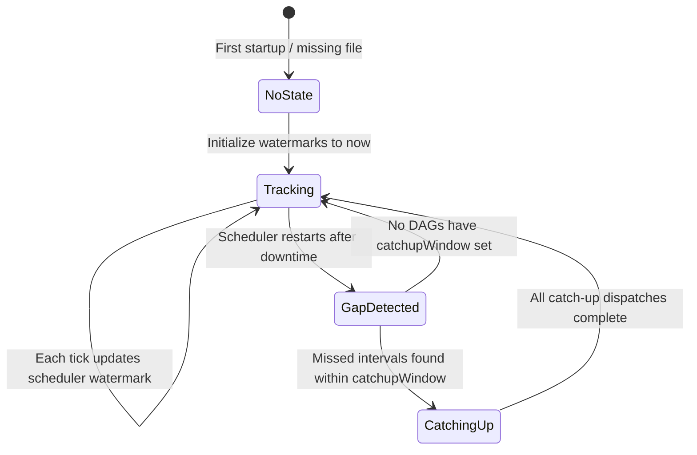
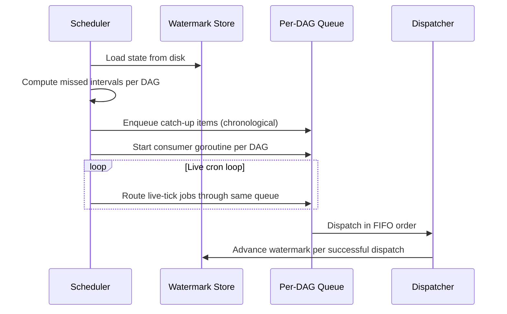

# RFC 004: Schedule Catch-up and Backfill

## Goal

Add configurable catch-up and backfill for scheduled DAGs so that missed schedules during scheduler downtime are automatically detected and executed based on user-defined policies, eliminating silent data gaps in pipelines and reports.

When the scheduler is offline, scheduled cron jobs are permanently lost with no recovery mechanism. This is unacceptable for data pipelines, report generation, and any workflow where users expect scheduled jobs to eventually run.

## Scope

| In Scope | Out of Scope |
|----------|--------------|
| Two new DAG-level fields: `catchupWindow` and `overlapPolicy` | Per-schedule-entry configuration (fields apply DAG-wide) |
| Watermark-based tracking of last dispatched time | Retry of failed executions (separate concern from catch-up) |
| Per-DAG in-memory queues for ordered catch-up dispatch | UI-based manual backfill trigger |
| New `catchup` trigger type for run identification | CLI backfill command with arbitrary date ranges |
| Catch-up observability: logs, UI badge, API filtering, CLI dry-run | Partition-based backfill (Dagster-style) |
| Catch-up for start schedules only | Catch-up for stop or restart schedules |

## Solution

### Configuration

Two optional top-level fields on the DAG spec. No changes to the `schedule` field format.

```yaml
name: hourly-etl
schedule: "0 * * * *"
catchupWindow: "6h"
overlapPolicy: all
```

| Field | Type | Default | Description |
|-------|------|---------|-------------|
| `catchupWindow` | duration | *(omitted)* | Lookback horizon for missed intervals. Enables catch-up when set. Omitting preserves current behavior (no catch-up). |
| `overlapPolicy` | `skip` \| `all` \| `latest` | `skip` | How to handle multiple catch-up runs. `skip`: only first missed interval runs, others skipped while it executes. `all`: every missed interval runs sequentially. `latest`: discard all but the newest missed interval. |

Both fields apply DAG-wide to all start schedules.

#### Duration Format

The `catchupWindow` field accepts a duration grammar supporting `m` (minutes), `h` (hours), and `d` (days, equal to 24h). Tokens are summed with no separators: `2d12h` = 60h, `1d30m` = 24h30m. Values must be positive integers followed by a unit. Zero, empty strings, missing units, and negative values are invalid.

#### Backward Compatibility

Existing DAGs are unaffected. Both fields are optional and default to no-catchup behavior. No changes to any existing schedule format (string, array, or map forms all continue to work).

### Watermark State Machine

The scheduler persists two watermarks that together determine what needs replaying on restart:



1. **Scheduler watermark** (`lastTick`) -- The last tick time the scheduler processed. On restart, the gap between this timestamp and the current time is the recovery window. A missing or corrupt state file is treated as empty (no catch-up, safe default).

2. **Per-DAG watermark** (`lastScheduledTime`) -- The most recent dispatched scheduled time for each DAG. New DAGs receive `lastScheduledTime = now` when first observed via the filesystem watcher, preventing replay of schedules that predate the DAG's existence. Deleted DAGs are pruned from state on startup.

State is mutated in memory on every dispatch (zero disk I/O per dispatch). A background goroutine flushes to disk every 5 seconds if dirty, with a final flush on shutdown. This bounds disk writes to approximately 12 per minute regardless of DAG count. Writes are atomic via temp file and rename.

### Replay Boundary Calculation

When catch-up is triggered, the earliest timestamp worth replaying is the maximum of three values: the current time minus `catchupWindow` (the user-configured lookback horizon), the scheduler watermark (last tick dispatched), and the per-DAG watermark (last scheduled time from the state store). This ensures:

- Intervals older than the configured window are never replayed.
- New DAGs never replay history predating their existence.
- Manually backfilled DAGs inherit the timestamp of their latest dispatch, avoiding duplicate work.

### Catch-up Sequence



Catch-up uses per-DAG in-memory queues that unify catch-up and live-tick runs into a single dispatch mechanism:

1. Load scheduler state from disk (missing or corrupt state means empty, no catch-up).
2. For each DAG with `catchupWindow` set, compute missed intervals and populate a buffered queue.
3. Start a consumer goroutine per DAG.
4. Enter the live cron loop. Live-tick jobs for DAGs with queues are routed through the same queue; DAGs without `catchupWindow` dispatch directly (backward-compatible).
5. Consumer goroutines process items in FIFO order, enforcing `overlapPolicy` per DAG.

This ensures catch-up runs execute in chronological order per DAG, multiple DAGs catch up concurrently, live ticks merge naturally after catch-up items, and overlap policy is enforced at the queue level.

### Catch-up Trigger Points

Catch-up is triggered on **scheduler restart** when the scheduler watermark lags behind the current time. No catch-up work happens while the scheduler is healthy and processing ticks in real time. A manual backfill while the scheduler is down advances the per-DAG watermark, so the subsequent restart only replays the remaining gap.

### Watermark Semantics

The watermark tracks **dispatch**, not execution completion, matching the existing fire-and-forget pattern. A catch-up run that fails at execution time is not retried on next restart because the watermark has already advanced past it. Retrying failed runs is a separate concern (step-level retries, alerting) and conflating it with catch-up would risk infinite retry loops.

If a catch-up run fails to **dispatch** (for example, the persistence layer is unavailable), the watermark does not advance and catch-up stops. On next restart the same interval is retried, providing at-least-once dispatch semantics. A dispatch is considered successful when the DAG run is persisted to the queue store.

When `overlapPolicy` is `skip`, catch-up dispatches that find a previous run still executing skip the interval and advance the watermark past it. When `overlapPolicy` is `all`, all missed intervals queue sequentially and execute one after another.

### Cron Changes During Downtime

Catch-up uses the **current** schedule expression. If a cron expression changed while the scheduler was down, missed intervals are computed against the new expression, not historical ones. This is a deliberate choice to keep the scheduler stateless with respect to past cron definitions.

### Run Identification

A new `catchup` trigger type is added to the existing trigger type enum (alongside `scheduler`, `manual`, `webhook`, `subdag`, `retry`). Catch-up dispatches use this trigger type, making them filterable in the UI, API, and CLI without inspecting metadata.

### Multiple Schedules

When a DAG has multiple start schedules, `catchupWindow` and `overlapPolicy` apply uniformly to all of them. Each schedule entry is evaluated independently during catch-up detection, and results are merged in chronological order before dispatch.

```yaml
name: multi-schedule
schedule:
  - "0 * * * *"
  - "30 9 * * *"
catchupWindow: "6h"
overlapPolicy: all
```

### Scope Restriction

Catch-up applies only to **start** schedules. Stop and restart schedules are excluded:

- A missed stop is a no-op if the DAG is not currently running.
- A missed restart combines stop and start; the stop portion has the same issue, and the start portion is covered by catch-up.

### Distributed Scheduler / Failover

The scheduler watermark is tied to the directory lock. Only the lock holder reads and writes it. When a new instance acquires the lock after a crash, it inherits the previous holder's watermark. If the previous instance crashed without updating, the new instance detects the gap and runs catch-up.

### Behavior Matrix

| Scenario | No `catchupWindow` (default) | `overlapPolicy: skip` | `overlapPolicy: all` | `overlapPolicy: latest` |
|----------|-------------------------------|------------------------|----------------------|------------------------|
| First deploy (no prior runs) | Run from now only | Run from now only (new DAG watermark = now) | Run from now only | Run from now only |
| Scheduler restart after 3h downtime | Jobs resume from now | Run first missed interval; skip others while it runs | Run all missed intervals sequentially | Discard all but latest missed interval |
| DAG disabled then re-enabled | Run from now only | Run first missed interval within window | Backfill all missed runs within window | Run only latest missed interval within window |

### Safety Mechanisms

1. **Duplicate prevention** -- Check if a DAG run already exists before dispatching.
2. **Time boundaries** -- `catchupWindow` truncates the replay horizon.
3. **Graceful degradation** -- Missing watermark file means no catch-up (safe default).
4. **Dispatch atomicity** -- Watermark advances per successful dispatch; failures leave it at the last successful time.
5. **Scope restriction** -- Only start schedules participate in catch-up.

### Observability

Catch-up emits structured log messages at each phase: a summary on restart (DAG count, total candidates, window boundaries), per-DAG planning (overlap policy, candidate count), per-dispatch confirmation (DAG name, scheduled time, run ID), per-skip notification (reason: duplicate prevention or overlap policy), and a completion summary (dispatched count, skipped count, duration). No catch-up log messages are emitted when no intervals were missed.

The Web UI displays a "Catch-up" trigger badge in the run list, visually distinct from "Scheduled", "Manual", and other trigger types. The API supports filtering by `triggerType=catchup`. The CLI provides `dagu catchup --dry-run <dag>` to preview what catch-up would dispatch without executing.

### Examples

**Daily report with skip policy:**

```yaml
name: daily-report
schedule: "0 9 * * *"
catchupWindow: "12h"
overlapPolicy: skip
steps:
  - name: generate
    command: python report.py
```

If the scheduler was down from 09:00 to 15:00, only the 09:00 run fires.

**Hourly ETL with full backfill:**

```yaml
name: hourly-etl
schedule: "0 * * * *"
catchupWindow: "3d"
overlapPolicy: all
steps:
  - name: etl
    command: python etl.py
```

All missed hourly intervals within 3 days are queued and executed sequentially in chronological order.

## Data Model

### Watermark State

| Field | Type | Default | Description |
|-------|------|---------|-------------|
| `version` | integer | `1` | Schema version for forward compatibility |
| `lastTick` | RFC 3339 timestamp | *(empty)* | Last tick time the scheduler processed; gap between this and now determines recovery window |
| `dags` | map of DAG name to DAG watermark | *(empty)* | Per-DAG scheduling watermarks |
| `dags[name].lastScheduledTime` | RFC 3339 timestamp | now (on first observation) | Most recent dispatched scheduled time for this DAG |

### DAG Configuration Fields

| Field | Type | Default | Description |
|-------|------|---------|-------------|
| `catchupWindow` | duration string | *(omitted)* | Lookback horizon for missed intervals; enables catch-up when set |
| `overlapPolicy` | enum: `skip`, `all`, `latest` | `skip` | How to handle multiple catch-up runs |

### Trigger Type Extension

| Value | Description |
|-------|-------------|
| `catchup` | New enum value added alongside existing `scheduler`, `manual`, `webhook`, `subdag`, `retry` |

## Edge Cases & Tradeoffs

| Decision | Alternative Considered | Rationale |
|----------|----------------------|-----------|
| Watermark tracks dispatch, not completion | Track completion to enable retry | Retry-on-failure is a separate concern; conflating with catch-up risks infinite retry loops; step-level retries handle execution failures |
| Use current cron expression for catch-up | Store historical cron expressions and replay against them | Keeps scheduler stateless with respect to past cron definitions; historical expressions add storage and complexity for minimal benefit |
| Per-DAG in-memory queues | Global priority queue across all DAGs | Per-DAG queues allow concurrent catch-up across DAGs while maintaining chronological order within each DAG; simpler overlap policy enforcement |
| New DAGs get watermark = now | Backfill from DAG creation time | Prevents accidental replay of ancient schedules; users who want historical backfill can use CLI tooling |
| Missing state file = no catch-up | Attempt to infer from run history | Safe default avoids thundering herd on first deploy; inferring from run history is complex and error-prone |
| `catchupWindow` as relative duration | Absolute start date (Airflow-style `start_date`) | Relative windows are simpler, timezone-agnostic, and do not require updating config as time passes |
| `overlapPolicy` with three options | Quartz-style six granular misfire policies | Three options cover observed use cases without overwhelming configuration; `skip`, `all`, and `latest` map to the most common patterns |
| Catch-up for start schedules only | Include stop and restart schedules | A missed stop is a no-op if the DAG already completed; retroactively stopping would be incorrect |
| Flush watermark every 5 seconds | Write on every dispatch | Bounds disk I/O to ~12 writes/minute regardless of DAG count; final flush on shutdown prevents data loss |
