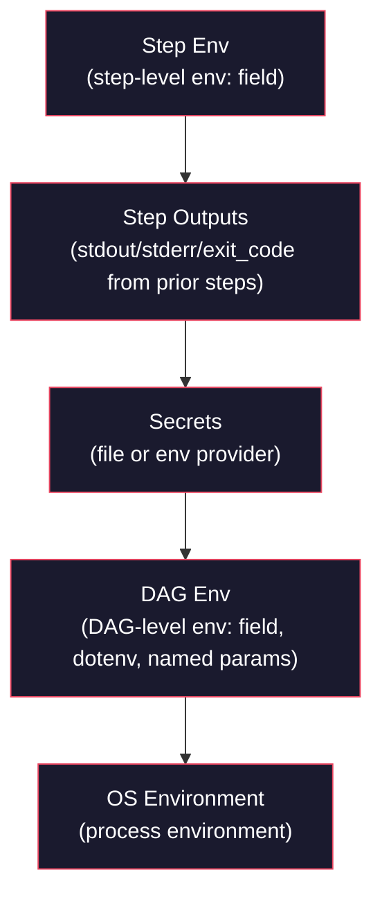

# RFC 006: Variable Expansion Syntax v1

> **Note:** This RFC documents the v1 variable expansion system. Its behavior is
> amended by RFC 007 (OS environment expansion rules) and RFC 008 (dollar-sign escaping).

## Goal

Define the v1 variable expansion system for Dagu, providing a unified `${VAR}` syntax that resolves parameters, environment variables, secrets, step outputs, command substitutions, and JSON path extraction across DAG definitions. This documents the existing expansion engine's design and behavior.

## Scope

| In Scope | Out of Scope |
|----------|--------------|
| Variable reference syntax (`${VAR}`, `$VAR`, `$N`) | New syntax designs (covered by RFC 005) |
| Scope hierarchy and precedence rules | Default value syntax for undefined variables |
| Parameter formats (string, list, map, schema-validated) | Per-field expansion customization |
| Step output references (stdout, stderr, exit_code) | Cross-DAG variable references |
| JSON path extraction from variable values | Arbitrary expression evaluation |
| String slicing | Regex-based extraction |
| Command substitution (backticks) | Nested command substitution |
| Secret provider integration (file, env) | Custom secret providers |
| Single-quote escaping and backtick escaping | Dollar-sign escaping (covered by RFC 008) |
| OS environment expansion rules per executor type | OS environment changes (covered by RFC 007) |

## Solution

### Variable Reference Patterns

| Syntax | Example | Description |
|--------|---------|-------------|
| `${VAR}` | `${OUTPUT_DIR}` | Braced variable reference |
| `$VAR` | `$HOME` | Unbraced variable reference |
| `$1`, `$2`, `$N` | `$1` | Positional parameters (1-indexed) |
| `${step.stdout}` | `${download.stdout}` | Step stdout output |
| `${step.stderr}` | `${fetch.stderr}` | Step stderr output |
| `${step.exit_code}` | `${check.exit_code}` | Step exit code |
| `${VAR:start:len}` | `${uid:0:8}` | String slicing (zero-based offset, optional length) |
| `${VAR.path}` | `${response.data.id}` | JSON path extraction (jq-compatible, must start with dot) |
| `` `cmd` `` | `` `date +%Y` `` | Command substitution (executed at DAG load time) |
| `'${VAR}'` | `'${LITERAL}'` | Single-quoted (preserved literally, not expanded) |

### Scope Hierarchy

Variables are resolved with the following precedence (highest to lowest):



A reference is resolved by checking each scope in order. The first scope containing a matching name wins.

### Evaluation Timing

Expansion occurs in two phases:

**Build time (DAG load):**
- DAG-level `env:` field values, including OS environment expansion
- Parameter values and cross-references between parameters
- Secret resolution (but the `key` field is not expanded)
- Command substitution (backticks) in the `env:` field

**Runtime (step execution):**
- Step output references
- Step-level `env:` field values
- JSON path extraction from step outputs
- OS environment variables in shell commands (handled by the shell, not Dagu)

### Parameter Formats

Parameters support four input formats, all producing the same result: named or positional values available via `${name}` or `$N` references.

**Format 1 -- String (space-separated):**
```yaml
params: "batch_size=100 environment=prod"
```

**Format 2 -- List of key-value pairs:**
```yaml
params:
  - batch_size: 100
  - environment: prod
```

**Format 3 -- Map:**
```yaml
params:
  batch_size: 100
  environment: prod
```

**Format 4 -- With JSON Schema validation:**
```yaml
params:
  schema: ./params-schema.json
  values:
    batch_size: 100
    environment: prod
```

Parameters are evaluated sequentially, allowing later parameters to reference earlier ones:

```yaml
params:
  - base_dir: /data
  - output_dir: "${base_dir}/output"
```

Named parameters are exported as environment variables and become part of DAG Env.

### OS Environment Expansion Rules

OS environment variables are expanded **only in the DAG-level `env:` field** at DAG load time. All other fields pass OS variables through unchanged to be handled at runtime.

| Field | OS Env Expanded? | Reason |
|-------|------------------|--------|
| `env:` (DAG-level) | Yes | Capture OS values at load time for configuration |
| `command:` | No | Shell handles expansion at runtime |
| Step `env:` | No | Evaluated at step execution time |
| `params:` | No | Passed through as-is |
| `secrets:` | No | Key field is not expanded |

For non-shell executor types (docker, http, ssh, mail, jq), **all variables including OS environment are expanded by Dagu** before passing to the executor, because these executors have no built-in variable expansion mechanism.

| Executor Type | OS Env Expanded by Dagu? | Reason |
|---------------|--------------------------|--------|
| `command` (shell) | No | Shell handles at runtime |
| `docker` | Yes | No shell in container config |
| `http` | Yes | No shell in HTTP request |
| `ssh` | Yes | No shell in SSH config |
| `mail` | Yes | No shell in mail config |
| `jq` | Yes | No shell in query execution |

### Secrets

Secrets are defined with a provider and referenced using the same `${VAR}` syntax as other variables. Two providers are supported:

| Provider | Description |
|----------|-------------|
| `file` | Load secret from file contents |
| `env` | Load from environment variable |

```yaml
secrets:
  - name: API_TOKEN
    provider: file
    key: /path/to/secret.txt
  - name: DB_PASSWORD
    provider: env
    key: DB_PASSWORD_ENV_VAR
```

All secret values are automatically masked in logs and UI output.

### JSON Path Extraction

When a variable contains a JSON string, fields are accessed using jq-compatible dot-path syntax. The path must start with a dot; direct array indexing without a leading field name is not supported.

| Syntax | Supported |
|--------|-----------|
| `${VAR.field}` | Yes |
| `${VAR.a.b.c}` | Yes |
| `${VAR.field[0]}` | Yes |
| `${VAR.field[0].nested}` | Yes |
| `${VAR[0]}` | No (must start with dot) |
| `${VAR[0].field}` | No (must start with dot) |

If the JSON is invalid or the path does not exist, the reference is left unchanged (no error).

### Command Substitution

Backtick-enclosed commands are executed at DAG load time using the shell with the current environment. Trailing whitespace is trimmed from output. Backticks can be escaped with `\`` to produce a literal backtick.

```yaml
env:
  TODAY: "`date +%Y-%m-%d`"
  COMMIT: "`git rev-parse HEAD`"
```

### Escape Mechanisms

Single-quoted variables are preserved literally and not expanded. This allows passing `${VAR}` syntax through to the shell or other consumers without Dagu interpreting it.

### Complete Example

```yaml
name: example-dag
description: Demonstrates v1 variable expansion

env:
  OUTPUT_DIR: "${HOME}/output"
  TODAY: "`date +%Y-%m-%d`"
  API_URL: https://api.example.com

params:
  - batch_size: 100
  - output_file: "${OUTPUT_DIR}/results_${TODAY}.json"

secrets:
  - name: API_TOKEN
    provider: env
    key: MY_API_TOKEN

steps:
  - name: fetch
    command: |
      curl -s -H "Authorization: Bearer ${API_TOKEN}" \
        "${API_URL}/data?limit=${batch_size}" \
        -o /tmp/data.json

  - name: process
    command: |
      jq '.items[]' /tmp/data.json > ${output_file}
      echo "Processed ${fetch.stdout:0:50}..."
    depends: fetch

  - name: deploy
    command: deploy.sh $1 $2 ${output_file}
    depends: process
```

## Data Model

No new stored state is introduced. This RFC documents the expansion engine's behavior applied to existing configuration fields.

| Field | Type | Default | Description |
|-------|------|---------|-------------|
| `env` (DAG-level) | map of string to string | *(empty)* | DAG-level environment variables; OS env and command substitutions are expanded at load time |
| `env` (step-level) | map of string to string | *(empty)* | Step-level environment variables; evaluated at step execution time; overrides DAG-level values |
| `params` | string, list, map, or schema-validated map | *(empty)* | DAG parameters in one of four formats; named params exported as environment variables |
| `secrets` | list of secret definitions | *(empty)* | Each entry has `name` (string), `provider` (`file` or `env`), and `key` (string); values masked in output |

## Edge Cases & Tradeoffs

| Decision | Alternative Considered | Rationale |
|----------|----------------------|-----------|
| Unified `${VAR}` syntax for all variable types | Distinct syntax per type (e.g., `%{param}`, `#{secret}`) | Simplicity and familiarity with shell conventions; one syntax to learn. Downside: ambiguity between Dagu and shell expansion (motivates RFC 005). |
| Undefined variables preserved as-is | Error on undefined variable | Preserving avoids breaking DAGs with optional variables; shell commands that rely on runtime expansion would fail if Dagu errored. Downside: silent failures when a variable name is misspelled. |
| OS env expanded only in DAG-level `env:` | Expand OS env everywhere | DAG-level capture gives explicit control; shell commands use live OS env at runtime; prevents double-expansion issues. |
| Non-shell executors get full Dagu expansion | Require users to pre-set variables in env | Non-shell executors have no built-in expansion; requiring manual env setup would be error-prone and verbose. |
| JSON path requires leading dot | Allow direct array indexing like `${VAR[0]}` | Dot-first rule avoids ambiguity with potential future array syntax and simplifies the parser; jq-compatible path syntax is well understood. |
| Sequential parameter evaluation | Parallel (independent) evaluation | Sequential allows later params to reference earlier ones, enabling composition without separate env entries. |
| Command substitution at load time only | Allow runtime command substitution | Load-time execution is predictable and does not create per-step shell overhead; runtime needs are covered by shell commands themselves. |
| No default value syntax | Support `${VAR:-default}` | Kept v1 simple; users can achieve defaults via sequential env entries. Recognized as a limitation for future versions. |
