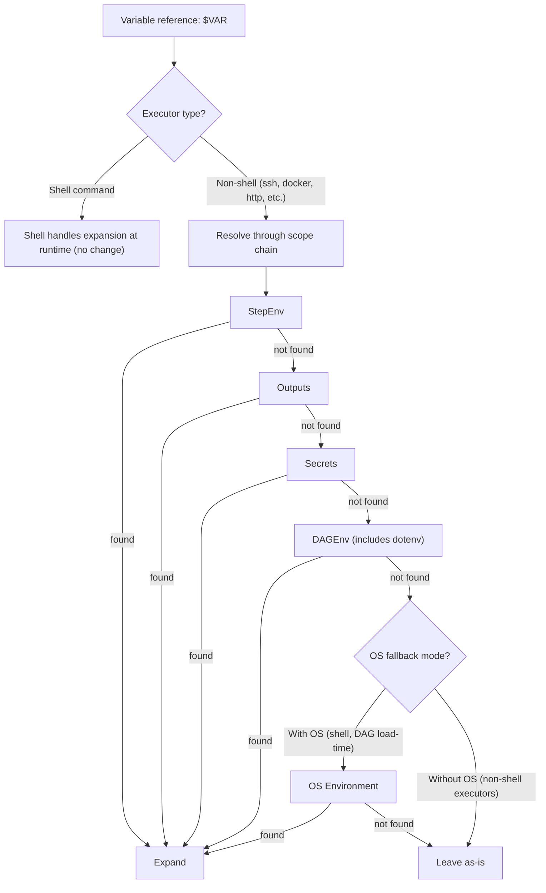

# RFC 007: OS Environment Variable Expansion Rules

**Amends:** [RFC 006 — Variable Expansion Syntax v1](./006-variable-expansion-v1.md)

## Goal

Change the OS environment variable expansion rules for non-shell executors so that OS variables are only expanded when explicitly imported into the DAG's scope. Variables not defined in the DAG are left as-is and passed through to the target execution environment, fixing a class of bugs where Dagu silently replaces variables the user intended for a remote or container environment.

## Scope

| In scope | Out of scope |
|----------|-------------|
| OS env fallback removal for non-shell executors | Shell command expansion behavior (unchanged) |
| Explicit import via DAG-level `env:` | New variable syntax (see RFC 005) |
| Scope resolution chain mode flag | Secret resolution (separate code path, unaffected) |
| Dotenv variable handling (unchanged, already DAG-scoped) | Command-without-shell edge case (unchanged, keeps OS expansion) |

## Motivation

RFC 006 documents that for non-shell executors (docker, http, ssh, mail, jq), all variables including OS environment are expanded by Dagu before passing to the executor. This breaks user intent when the variable is meant for the target environment, not the local machine.

**SSH example (broken):**

```yaml
steps:
  - name: remote-backup
    type: ssh
    config:
      host: myserver.com
      user: deploy
      command: "tar czf $HOME/backup.tar.gz /data"
```

The user intends `$HOME` to resolve on the remote machine (e.g., `/home/deploy`). Instead, Dagu expands it locally (e.g., `/Users/alice`) before sending the command over SSH.

**Docker example (broken):**

```yaml
steps:
  - name: container-task
    type: docker
    config:
      image: python:3.12
      env:
        - "WORKDIR=$HOME/app"
```

The user wants the container's `$HOME` (e.g., `/root`), but Dagu substitutes the host machine's `$HOME` before creating the container.

The root cause is that the scope resolution chain resolves variables through layers: StepEnv > Outputs > Secrets > DAGEnv > OS. The OS layer is the fallback at the bottom. When a variable like `$HOME` is not defined anywhere in the DAG, the scope falls through to the OS environment and expands it. Shell commands avoid this by delegating expansion to the shell at runtime, but non-shell executors have no equivalent protection.

| Executor | Impact | Common broken patterns |
|----------|--------|----------------------|
| **ssh** | High | `$HOME`, `$USER`, `$PATH` on remote host |
| **docker** | High | Container env vars like `$HOME`, `$HOSTNAME` |
| **http** | Low | Rarely uses OS-like variable names in URLs/headers |
| **mail** | Low | Variable references in email templates |
| **jq** | Low | Variables in jq query strings |

---

## Solution

### New Rule: Expand Only What Is Defined

Dagu expands only variables that exist within its own scope:

- **DAG-level `env:`** fields
- **Step-level `env:`** fields
- **Params** (named and positional)
- **Secrets**
- **Step outputs** (`stdout`, `stderr`, `exit_code`)
- **Dagu built-in variables** (`DAG_NAME`, `DAG_RUN_ID`, etc.)

If a variable reference (`$VAR` or `${VAR}`) does not match any of these, it is left as-is rather than falling through to the OS environment.

### Explicit OS Import

Users who need an OS environment variable must explicitly import it via the DAG-level `env:` field:

```yaml
env:
  # Explicitly import OS vars into DAG scope
  HOME: "${HOME}"
  REGISTRY: "${REGISTRY}"

steps:
  - name: remote-backup
    type: ssh
    config:
      host: myserver.com
      command: "tar czf $HOME/backup.tar.gz /data"
      # $HOME is NOT expanded - remote shell resolves it

  - name: docker-build
    type: docker
    config:
      image: "${REGISTRY}/app:latest"
      # ${REGISTRY} IS expanded - defined in DAG env
```

### Scope Resolution Chain

The scope resolution chain gains a mode that excludes OS environment fallback. Non-shell executors use this restricted scope; shell executors are unchanged.



### Behavior Comparison

| Variable | Defined in DAG? | Current behavior | New behavior |
|----------|----------------|-----------------|-------------------|
| `${OUTPUT_DIR}` | Yes (in `env:`) | Expanded | Expanded (no change) |
| `${HOME}` | No | Expanded from OS | **Left as-is** |
| `${HOME}` | Yes (imported in `env:`) | Expanded | Expanded (no change) |
| `${step.stdout}` | Yes (step output) | Expanded | Expanded (no change) |
| `${API_KEY}` | Yes (in `secrets:`) | Expanded | Expanded (no change) |
| `${batch_size}` | Yes (in `params:`) | Expanded | Expanded (no change) |
| `${UNKNOWN}` | No | Expanded (empty string or OS value) | **Left as-is** |

### What "Left As-Is" Means

When a variable is not found in the DAG scope, the literal text is preserved:

- `$HOME` stays as `$HOME`
- `${PATH}` stays as `${PATH}`

For SSH and Docker, the target environment's shell or runtime resolves the variable. For HTTP and other executors, the literal text appears in the request.

### Unaffected Subsystems

**Secrets** use a separate resolution path. Secret providers (`env`, `file`) read values directly from the OS or filesystem during early DAG initialization, before step execution begins. Once resolved, secrets enter the scope as explicitly defined entries, so they expand normally under the new rules.

**Dotenv files** are loaded and appended directly to DAG-level `env:` during initialization. From the expansion engine's perspective, dotenv variables are part of the DAG's explicit scope and always expand.

**Shell commands** already delegate expansion to the shell at runtime. No change needed.

**Command-without-shell** (when no system shell is available) explicitly opts into OS expansion so Dagu resolves variables on behalf of the missing shell. This is unchanged.

### Updated Executor Expansion Table

| Executor Type | DAG-scoped vars expanded? | OS env expanded? |
|---------------|--------------------------|------------------|
| `command` (shell) | No (shell handles) | No (shell handles) |
| `command` (no shell) | Yes | **Yes** (no change) |
| `docker` | Yes | **No** (was: Yes) |
| `http` | Yes | **No** (was: Yes) |
| `ssh` | Yes | **No** (was: Yes) |
| `mail` | Yes | **No** (was: Yes) |
| `jq` | Yes | **No** (was: Yes) |

### Examples

**Before — SSH command with unintended local expansion:**

```yaml
steps:
  - name: remote-deploy
    type: ssh
    config:
      host: prod-server
      user: deploy
      command: |
        cd $HOME/app
        git pull
        ./restart.sh
```

Result: `$HOME` is expanded to the local machine's home directory (e.g., `/Users/alice`), causing the remote command to fail.

**After — SSH command with pass-through:**

The same YAML now leaves `$HOME` as-is. The remote shell resolves it to the deploy user's home directory on `prod-server`.

**Mixed — Some Dagu vars, some remote vars:**

```yaml
env:
  DEPLOY_BRANCH: main
  REMOTE_HOST: prod-server

steps:
  - name: remote-deploy
    type: ssh
    config:
      host: "${REMOTE_HOST}"      # Expanded: defined in DAG env
      user: deploy
      command: |
        cd $HOME/app              # NOT expanded: left for remote shell
        git checkout ${DEPLOY_BRANCH}  # Expanded: defined in DAG env
        ./restart.sh
```

**Docker — Container vs host variables:**

```yaml
env:
  REGISTRY: myregistry.com
  APP_VERSION: "2.1.0"

steps:
  - name: run-app
    type: docker
    config:
      image: "${REGISTRY}/app:${APP_VERSION}"  # Expanded: both defined in DAG env
      env:
        - "CONFIG_DIR=$HOME/.config"           # NOT expanded: $HOME is the container's
      command: ["./start.sh"]
```

---

## Data Model

No new stored fields. This changes runtime variable resolution behavior only. The scope resolution chain gains an internal mode flag, but no persistent or user-visible data structures are added.

---

## Edge Cases & Tradeoffs

| Chosen | Considered | Why |
|--------|-----------|-----|
| Exclude OS fallback for non-shell executors | Keep current behavior (expand all) | Current behavior breaks SSH/Docker variables — `$HOME` on remote host gets local value |
| Explicit import via `env:` block | Auto-detect target environment | Explicit import is simpler, predictable, and requires no executor-specific logic |
| Leave undefined variables as literal text | Replace with empty string | Literal pass-through lets target environments resolve their own variables |
| Preserve OS fallback for DAG-level `env:` evaluation | Remove OS access entirely | DAG-level `env:` is where users explicitly import OS values; removing it would break the import mechanism |
| Preserve OS expansion for command-without-shell | Apply same restriction | Without a shell, there is no target environment to resolve variables; Dagu must expand them |
| Direct behavioral change (potentially with deprecation warning) | Feature flag opt-in only | The current behavior is almost always wrong for affected use cases; a flag delays the fix for no benefit |

---

## Relationship to Other RFCs

**RFC 006** — This RFC amends the "Non-Shell Executor Types" section of RFC 006, which states that all variables including OS environment are expanded. After this RFC, only DAG-scoped variables are expanded; OS-only variables pass through unchanged. All other RFC 006 behavior is preserved.

**RFC 005** — Proposes `${{ context.VAR }}` syntax that eliminates `$VAR`/`${VAR}` ambiguity at the syntax level. This RFC (007) solves the immediate problem with existing v1 syntax. The two are complementary: RFC 007 ships as a behavioral fix, RFC 005 makes the problem impossible by design long-term.
