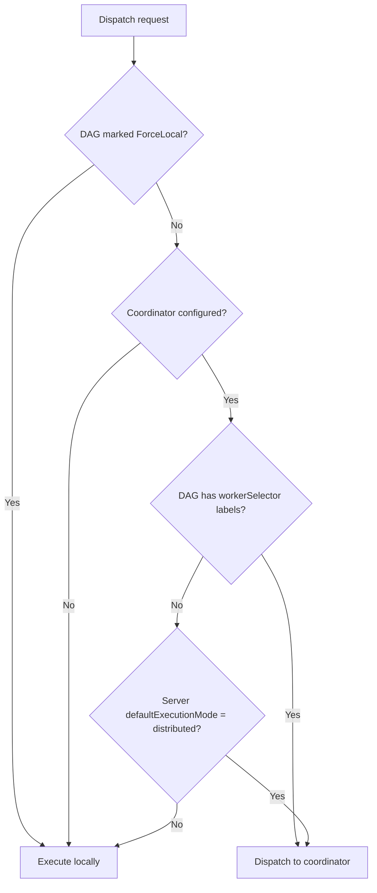

# RFC 010: Unified Execution Dispatch

## Goal

Introduce a unified dispatch model that fixes a bug where UI/API immediate execution ignores `workerSelector`, adds a server-level `defaultExecutionMode` so all DAGs can be dispatched to workers without per-DAG labels, and provides a `workerSelector: local` escape hatch to pin specific DAGs to the coordinator node.

## Motivation

### Bug: UI ignores workerSelector

When a DAG defines `workerSelector` labels it expects to run on a matching worker. This works for scheduled runs, CLI starts, and retries, but the API functions for immediate execution and enqueue unconditionally spawn a local subprocess, bypassing the coordinator entirely.

### Missing capability: distribute all DAGs

Users who deploy a coordinator and workers want all DAGs dispatched to workers — not just those with explicit `workerSelector` labels. There is no server-level knob to opt into this behaviour; every DAG must carry a `workerSelector` block.

### Missing escape hatch

Once the server default is `distributed`, users need a way to pin specific DAGs to the coordinator/scheduler node itself (e.g., lightweight admin scripts). There is no mechanism for this.

## Scope

| In-scope | Out-of-scope |
|---|---|
| Fix UI/API dispatch to respect `workerSelector` | Worker selection algorithm changes |
| Server-level `defaultExecutionMode` configuration | Coordinator gRPC protocol changes |
| Per-DAG `workerSelector: local` escape hatch | Step-level dispatch overrides |
| Unified dispatch decision function for all code paths | Load balancing or affinity policies |
| JSON schema update for `workerSelector` | New API endpoints |

## Solution

### Server-level configuration: `defaultExecutionMode`

A new server-level configuration field controls the default execution mode. When set to `distributed`, all DAGs are dispatched to workers via the coordinator unless overridden at the DAG level. The default is `local`, ensuring existing deployments are unaffected.

```yaml
# server config
defaultExecutionMode: distributed   # dispatch all DAGs to workers
coordinator:
  host: 0.0.0.0
  port: 5890
```

The field is also available as an environment variable: `DAGU_DEFAULT_EXECUTION_MODE`.

### DAG-level: `workerSelector` extension

The `workerSelector` field accepts either a label map (existing behaviour) or the string `local`. When set to `local`, the DAG always runs on the coordinator/scheduler node, even when the server default is `distributed`.

```yaml
# Dispatch to a worker with matching labels
workerSelector:
  gpu: "true"
  region: us-east-1
```

```yaml
# Force local execution (even when server default is distributed)
workerSelector: local
```

The spec field accepts both forms. During DAG building, the string `"local"` is parsed into a boolean flag on the runtime DAG object, while label maps are stored as before.

### Unified dispatch decision

A single dispatch decision function is used by all code paths — API handlers, scheduler, CLI, and sub-DAG executor. This eliminates the inconsistency where different entry points made independent dispatch decisions.

The decision logic follows this priority:



### Decision matrix

| ForceLocal | Coordinator | defaultExecutionMode | WorkerSelector labels | Result |
|---|---|---|---|---|
| true | any | any | any | **local** |
| false | absent | any | any | **local** |
| false | present | any | present | **coordinator** |
| false | present | distributed | absent | **coordinator** |
| false | present | local | absent | **local** |

### Code path consistency

After this change, every execution path uses the shared dispatch decision:

| Code Path | Uses shared logic | Respects ForceLocal | Respects defaultMode |
|---|---|---|---|
| Scheduler | Yes | Yes | Yes |
| CLI | Yes | Yes | Yes |
| API — RetryDAGRun | Yes | Yes | Yes |
| API — startDAGRunWithOptions | Yes | Yes | Yes |
| API — enqueueDAGRun | Yes | Yes | Yes |
| Sub-DAG executor | Yes | Yes | Yes |

### Propagation of defaultExecutionMode

The server configuration value must be available at every dispatch site. It is passed through constructor injection for the API handler and scheduler, read from the CLI context configuration, and carried on the runtime execution context for sub-DAG executors.

### Schema update

The JSON schema for `workerSelector` (at both DAG and step levels) is updated to accept either a string-to-string map or the literal string `"local"`.

### Error behaviour

If the dispatch decision indicates coordinator dispatch but no coordinator client is configured, the system returns an error (HTTP 503) rather than silently falling back to local execution. Silent fallback would mask misconfiguration.

### Tasks without labels

When `defaultExecutionMode: distributed` dispatches a DAG that has no `workerSelector` labels, the task is created without a label filter. The coordinator assigns it to any available worker.

## Data Model

### Server configuration

| Field | Type | Default | Description |
|---|---|---|---|
| `defaultExecutionMode` | string enum: `"local"`, `"distributed"` | `"local"` | Controls whether DAGs without explicit `workerSelector` labels are dispatched to workers or run locally |

### DAG spec

| Field | Type | Default | Description |
|---|---|---|---|
| `workerSelector` | `map[string]string` or `"local"` | none | Label requirements for worker matching, or the string `"local"` to force local execution |

### DAG runtime

| Field | Type | Default | Description |
|---|---|---|---|
| `ForceLocal` | bool | `false` | Set to `true` when DAG specifies `workerSelector: local`; causes dispatch to always choose local execution |

## Edge Cases & Tradeoffs

| Chosen | Considered | Why |
|---|---|---|
| Single dispatch decision function shared by all paths | Each code path makes its own dispatch decision | Eliminates inconsistencies; one place to audit and test |
| `defaultExecutionMode` defaults to `local` | Default to `distributed` when coordinator is configured | Existing deployments must not change behaviour without explicit opt-in |
| Reuse `workerSelector` field for the `"local"` escape hatch | Add a new top-level `forceLocal` YAML field | Keeps related configuration in one field; `"local"` is unambiguous and cannot collide with label maps |
| Parse `workerSelector: local` into a separate boolean at build time | Carry the polymorphic value through the runtime | Runtime struct stays clean with a typed boolean; parsing happens once |
| Return HTTP 503 when coordinator is needed but not configured | Silently fall back to local execution | Silent fallback masks misconfiguration; explicit errors are easier to diagnose |
| Tasks without labels get no label filter | Require labels for distributed dispatch | Allows `defaultExecutionMode: distributed` to work without modifying every DAG |

