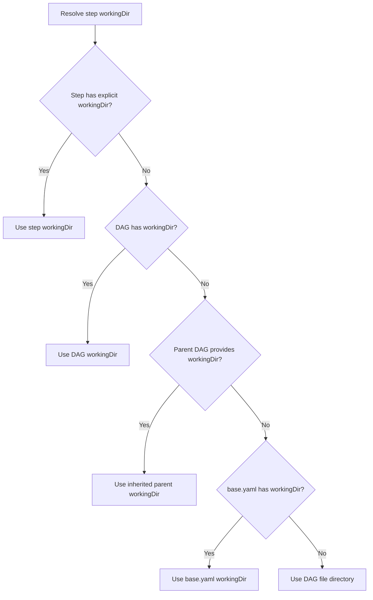

# RFC 011: Working Directory Behavior

## Goal

Define the resolution hierarchy for `workingDir` across all execution contexts (local commands, sub-DAGs, SSH, Docker, scripts) to ensure consistent and predictable behavior. Without a clear specification, users cannot reason about where their commands will execute, especially when composing DAGs across different execution types.

## Scope

| In-scope | Out-of-scope |
|---|---|
| `workingDir` resolution for local command steps | Remote path validation on SSH hosts |
| `workingDir` resolution for script steps | Container volume management |
| `workingDir` inheritance for sub-DAGs | Custom executor working directories |
| `workingDir` behavior for SSH steps | Windows path handling |
| `workingDir` behavior for Docker steps | Symlink resolution policies |
| Path format support (absolute, relative, `~`, env vars) | |
| Automatic directory creation | |
| Dotenv and schema file resolution relative to `workingDir` | |

## Solution

### Where `workingDir` can be set

| Level | YAML Field | Description |
|-------|------------|-------------|
| DAG | `workingDir` | Working directory for the entire DAG |
| Step | `workingDir` | Per-step override |
| Container | `workingDir` (inside `container:`) | Working directory inside a Docker container |

### Resolution hierarchy

The working directory is resolved through a fallback chain, with the first match winning. The following diagram shows the resolution flow for a step:

#### DAG-level resolution

The DAG's `workingDir` is determined by the first match:

1. Explicit `workingDir` in the DAG YAML
2. Value inherited from a parent DAG (for sub-DAGs)
3. Value from `base.yaml` (if set)
4. The directory containing the DAG file
5. Current working directory, or the user's home directory

#### Step-level resolution

Each step's working directory is determined by the first match:

1. The step's own `workingDir` (if set)
2. The DAG's `workingDir`
3. Current working directory, or the user's home directory

### Path formats

All `workingDir` values support:

- **Absolute paths** (`/foo/bar`) — used as-is
- **Home-relative paths** (`~/foo`) — expanded to the user's home directory
- **Environment variables** (`$MY_DIR`, `${MY_DIR}`) — expanded before use
- **Relative paths** (`./scripts`, `../other`) — resolved against the DAG file's directory at the DAG level, or against the DAG's `workingDir` at the step level

### Directory creation

Working directories are created automatically if they do not exist. This applies to all execution types except SSH (where directory creation is the responsibility of the remote host) and Docker (where the container image defines available paths).

### Execution-specific behavior

#### Local commands and scripts

Commands run in the resolved working directory. Each step is isolated — one step's directory does not affect another.

For steps with a `script` field, the temporary script file is written to the step's working directory (or the system temp directory if empty). The file is cleaned up after execution.

#### Sub-DAGs

- Sub-DAG **with** explicit `workingDir` — uses its own value
- Sub-DAG **without** `workingDir` — inherits the parent step's working directory

This allows parent DAGs to establish a shared workspace that child DAGs operate within, while still permitting child DAGs to override when they need an independent location.

#### SSH

Only uses step-level `workingDir`. DAG-level `workingDir` is ignored because it refers to a local path that likely does not exist on the remote host. If the step's `workingDir` is set, the remote command is prefixed with `cd <dir>`. If not set, the command runs in the SSH user's home directory.

#### Docker

Docker containers have two separate working directories:

1. **Host-side** — the step's resolved `workingDir`, used only for resolving relative volume mount paths
2. **Container-side** — the `workingDir` inside the `container:` config block, which sets the `WORKDIR` inside the container

These are independent. Setting the step's `workingDir` does not change where commands run inside the container.

### Base config inheritance

When `workingDir` is set in `base.yaml`, it acts as the default for all DAGs. Any DAG with an explicit `workingDir` overrides the base value. DAGs without one inherit it.

### Dotenv file resolution

Dotenv files are searched for in order:

1. Relative to the DAG's `workingDir`
2. Relative to the DAG file's directory (if different)

A `.env` file in the working directory is always loaded, even if not listed in the `dotenv` field.

### Schema file resolution

JSON schema files referenced in DAG parameters are searched for in order:

1. As-is (absolute path or environment variable)
2. Relative to the DAG's `workingDir`
3. Relative to the DAG file's directory

### Quick reference

| Execution Type | Working Directory Source | Notes |
|---------------|------------------------|-------|
| Local command | Step or DAG `workingDir` | Subprocess isolation |
| Script | Step or DAG `workingDir` | Temp file written to working dir |
| Sub-DAG | Inherited from parent | Unless child has explicit `workingDir` |
| SSH | Step `workingDir` only | DAG-level ignored |
| Docker | Container `workingDir` | Host-side used only for volume paths |

## Data Model

No new stored state. This RFC documents the resolution behavior of the existing `workingDir` field.

| Field | Level | Type | Default | Description |
|---|---|---|---|---|
| `workingDir` | DAG | string | DAG file's directory | Base working directory for all steps in the DAG |
| `workingDir` | Step | string | DAG's `workingDir` | Per-step override; takes precedence over DAG-level value |
| `workingDir` | Container | string | Image default | Working directory inside the Docker container; independent of host-side resolution |

## Edge Cases & Tradeoffs

| Chosen | Considered | Why |
|---|---|---|
| SSH ignores DAG-level `workingDir` | Inherit DAG `workingDir` for SSH | Local paths do not exist on remote hosts; inheriting them would cause confusing failures |
| Auto-create directories for local execution | Error on missing directories | Reduces friction for common use cases; most workflows expect their directories to exist on first run |
| Relative paths resolve against DAG file directory | Resolve against the process's current working directory | DAGs should be portable regardless of where the scheduler or CLI is invoked from |
| Sub-DAGs inherit parent step's `workingDir` by default | Sub-DAGs always use their own DAG file directory | Enables shared workspace patterns; child DAGs can still override explicitly |
| Docker host-side and container-side `workingDir` are independent | Unify them into a single field | They serve different purposes — host-side affects volume mount resolution, container-side affects command execution inside the container |
| `.env` in `workingDir` is always loaded | Only load explicitly listed dotenv files | Matches common convention; reduces boilerplate for the most frequent use case |
