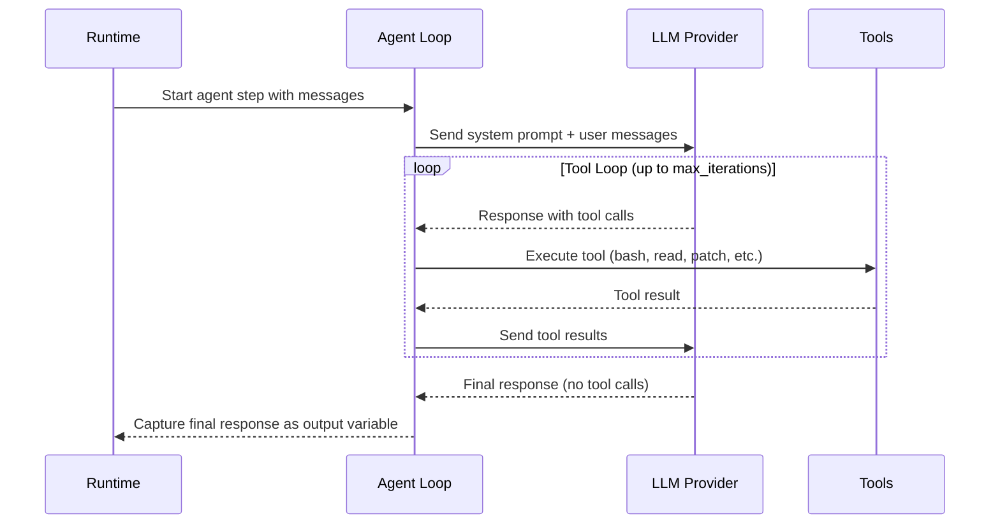
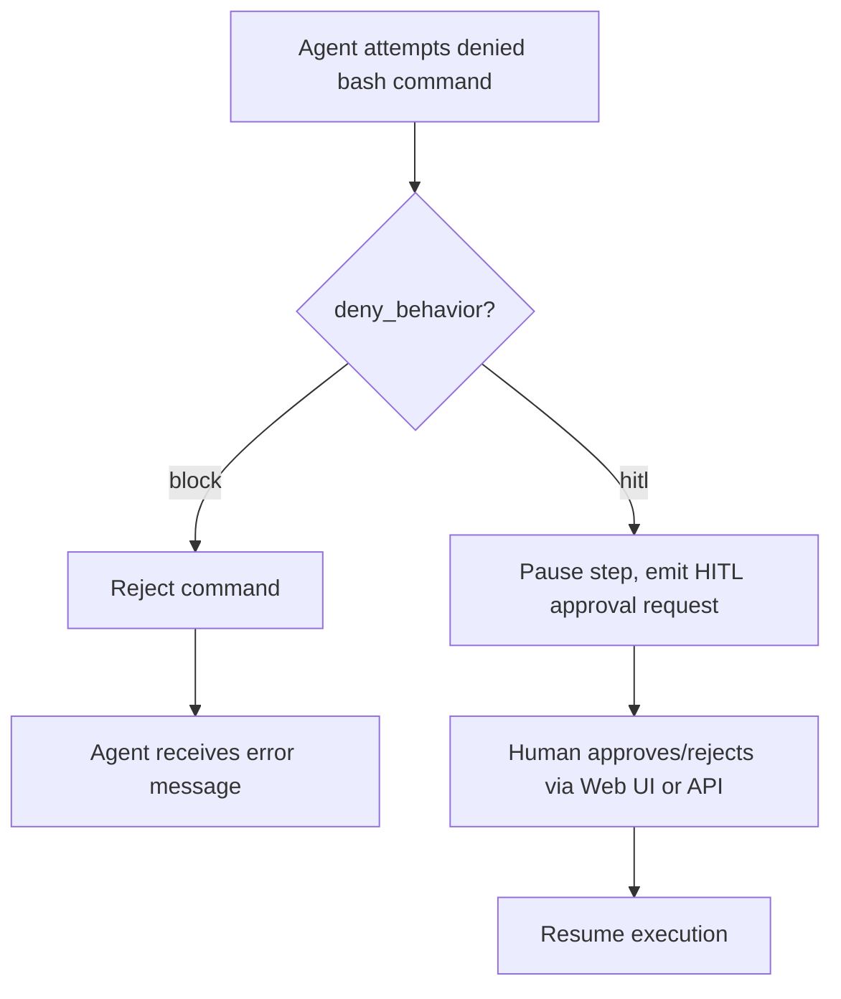

# RFC 014: Agent Step Type

## Goal

Introduce a new `type: agent` step that runs the AI agent within a DAG workflow. This enables agentic LLM execution — multi-turn tool calling with built-in tools (bash, file I/O, web search, reasoning) — as a first-class workflow step, bringing the same capabilities currently available only through the Web UI into automated pipelines. The existing `type: chat` step remains unchanged for simple, single-purpose LLM calls with DAG-based tools.

---

## Scope

| In Scope | Out of Scope |
|----------|-------------|
| New `type: agent` step definition and YAML schema | Inbox/notification integration (see RFC 012) |
| Built-in tool selection and bash policy enforcement | Model fallback (multiple models with retry) |
| Memory integration (global + per-DAG) | Streaming output to the DAG run UI in real time |
| HITL integration for command approval in step context | Agent-to-agent communication between steps |
| Observability: step logs, token usage, audit entries | Custom tool definitions (use `type: chat` with DAG-based tools) |
| Output capture of the agent's final response | |

---

## Solution

### Agent Step Execution Lifecycle



### Minimal Example

```yaml
steps:
  - name: analyze-logs
    type: agent
    messages:
      - role: user
        content: |
          Analyze the error logs at /var/log/app/errors.log from the last hour.
          Summarize the root causes and suggest fixes.
    output: ANALYSIS_RESULT
```

The agent uses the globally configured default model (set in Agent Settings via the Web UI). No per-step model configuration is needed.

### Full Example

```yaml
steps:
  - name: fix-config
    type: agent
    agent:
      model: claude-sonnet
      tools:
        enabled:
          - bash
          - read
          - patch
          - think
          - web_search
        bash_policy:
          default_behavior: allow
          deny_behavior: hitl
          rules:
            - name: allow-read-commands
              pattern: "^(cat|head|tail|grep|find|ls)\\b"
              action: allow
            - name: deny-destructive
              pattern: "^(rm|chmod|chown|mkfs)\\b"
              action: deny
      memory:
        enabled: true
      prompt: |
        Focus only on the config files in /etc/app/.
        Do not modify any files outside that directory.
      max_iterations: 30
      safe_mode: true
    messages:
      - role: user
        content: |
          The config at /etc/app/config.yaml has an invalid database_url.
          Read the file, fix the URL to point to ${DB_HOST}, and validate.
    output: FIX_RESULT
    timeout_sec: 600
```

### Agent Configuration

The `agent` block is optional. When omitted entirely, the step uses all defaults (global default model, all tools enabled, no memory, safe mode on).

| Field | Type | Default | Description |
|-------|------|---------|-------------|
| `model` | string | global default | Model ID from the globally configured agent models. Overrides the default model for this step only. |
| `tools` | object | all enabled | Tool selection and bash policy configuration. |
| `memory` | object | `{ enabled: false }` | Memory configuration. When enabled, loads global and per-DAG memory into context. |
| `prompt` | string | — | Additional instructions appended to the built-in system prompt. |
| `max_iterations` | int | 50 | Maximum tool call rounds before the agent stops. |
| `safe_mode` | bool | true | Enable command approval via HITL integration. |

### Model Resolution

1. If `model` is specified, look up that model from the global model store.
2. If `model` is omitted, use the global default model.
3. If no default model is configured, the step fails with a clear error.

This ensures a single source of truth for model configuration (provider, API key, pricing) and avoids duplicating credentials across DAG files.

### Messages

Uses the same schema as `type: chat` messages. Content supports variable substitution (`${VAR}`, `$1`, etc.).

```yaml
messages:
  - role: user
    content: "Analyze ${INPUT_FILE} and write results to ${OUTPUT_DIR}"
```

Messages from prior chat steps are passed as context, enabling multi-step agent chains.

### Output

The agent's final assistant response (the last message with no tool calls) is written to the output variable via standard step output capture.

### Available Tools

| Tool | Default | Description |
|------|---------|-------------|
| `bash` | enabled | Execute shell commands with timeout enforcement |
| `read` | enabled | Read file contents |
| `patch` | enabled | Create/edit files via unified diff |
| `think` | enabled | Internal reasoning (no side effects) |
| `read_schema` | enabled | DAG YAML schema reference |
| `web_search` | enabled | Search the web |

### Excluded Tools

| Tool | Reason | Alternative |
|------|--------|-------------|
| `navigate` | Requires Web UI — emits UIAction events with no consumer | N/A (no UI in step context) |
| `ask_user` | Requires Web UI for interactive prompts | Use HITL integration for approvals |

Users can restrict which tools are available by specifying `tools.enabled` as an explicit list. When `tools.enabled` is omitted, all available tools (excluding `navigate` and `ask_user`) are enabled by default.

### Bash Policy

The bash policy controls command approval. Rules are evaluated in order; the first matching rule determines the action. If no rule matches, `default_behavior` applies.

```yaml
agent:
  tools:
    bash_policy:
      default_behavior: allow       # allow | deny
      deny_behavior: hitl           # hitl | block
      rules:
        - name: rule-name
          pattern: "regex"
          action: allow | deny
```

| `deny_behavior` | Effect when a command is denied |
|------------------|-------------------------------|
| `block` | Command is rejected; agent receives an error and can try alternatives |
| `hitl` | Step pauses and waits for human approval via the HITL mechanism |

### Permission and HITL Integration

In the Web UI, safe mode presents an approval dialog. Since there is no UI in step context, the agent step integrates with the existing HITL mechanism:



When `safe_mode: false`, no approval is required and the agent runs autonomously with full trust.

### Memory

When memory is enabled, the agent step loads persistent memory into its system prompt context:

- **Global memory**: Loaded from the global memory directory.
- **Per-DAG memory**: Loaded from a DAG-specific memory directory.

The agent can read and write memory files via the `read` and `patch` tools during execution. Changes persist across runs. When `memory.enabled` is false (default), the agent operates statelessly.

### Observability

All agent activity is written to the step's stdout/stderr log files:

| Log Entry | Content |
|-----------|---------|
| LLM request | Model, message count, tool count |
| Assistant response | Response content (or summary if large) |
| Tool call | Tool name, arguments (with secrets masked) |
| Tool result | Output (truncated if large), success/error status |
| Policy decision | Command, matched rule, action taken |
| Iteration count | Current iteration / max iterations |

Token usage is tracked per LLM request and accumulated across the step, including prompt tokens, completion tokens, and estimated cost based on model pricing configuration.

When the audit system is enabled, agent tool executions generate audit entries consistent with the Web UI agent's audit trail, recording the action type, DAG name, run ID, step name, and tool-specific details.

### Relationship to `type: chat`

The two step types serve different purposes and coexist:

| Aspect | `type: chat` | `type: agent` |
|--------|:---:|:---:|
| Purpose | Simple LLM calls | Agentic multi-tool workflows |
| Tools | DAG-based (other DAGs as tools) | Built-in (bash, read, patch, etc.) |
| Memory | None | Global + per-DAG |
| System prompt | Simple `system:` field | Built-in system prompt (with optional `prompt` append) |
| Policy enforcement | None | Bash rules, tool restrictions |
| User interaction | None | HITL integration |
| Message passing | Yes | Yes |
| Model fallback | Yes (multiple models) | Future consideration |

Users who need simple "ask an LLM a question" functionality should continue using `type: chat`. Users who need the agent to take autonomous actions (run commands, edit files, search the web) should use `type: agent`.

---

## Data Model

### Agent Step Configuration Fields

| Field | Type | Default | Description |
|-------|------|---------|-------------|
| `agent.model` | string | global default | Model ID from the global model store |
| `agent.tools.enabled` | list of strings | all available | Explicit list of tools to enable |
| `agent.tools.bash_policy.default_behavior` | string (`allow` / `deny`) | `allow` | Default action when no rule matches |
| `agent.tools.bash_policy.deny_behavior` | string (`block` / `hitl`) | `hitl` | What to do when a command is denied |
| `agent.tools.bash_policy.rules` | list of objects | `[]` | Ordered list of rules: name (string), pattern (regex string), action (`allow` / `deny`) |
| `agent.memory.enabled` | bool | `false` | Whether to load persistent memory into context |
| `agent.prompt` | string | — | Additional instructions appended to the built-in system prompt |
| `agent.max_iterations` | int | `50` | Maximum tool call rounds |
| `agent.safe_mode` | bool | `true` | Enable command approval via HITL |

### Messages Schema

| Field | Type | Default | Description |
|-------|------|---------|-------------|
| `messages[].role` | string | — | Message role: `user` or `system` |
| `messages[].content` | string | — | Message content, supports `${VAR}` substitution |

### Step Output

| Field | Type | Default | Description |
|-------|------|---------|-------------|
| `output` | string | — | Variable name to capture the agent's final assistant response (the last message with no tool calls) |

---

## Edge Cases & Tradeoffs

| Chosen | Considered | Why |
|--------|-----------|-----|
| Reuse global model store for model resolution | Per-step model/API-key configuration in YAML | Single source of truth; avoids credential duplication in DAG files |
| Safe mode on by default with HITL for denied commands | No approval mechanism (block-only) | Aligns with Web UI behavior; provides human oversight for automated pipelines |
| Max iterations limit (default 50) + step timeout | No iteration limit, rely on timeout alone | Prevents runaway LLM costs even when timeout is generous |
| Exclude `navigate` and `ask_user` tools | Include all Web UI tools | These tools require a browser UI; they have no consumer in step context |
| No memory by default | Memory always on | Stateless by default is safer; memory opt-in avoids unintended cross-run state |
| Secret masking on all LLM-bound messages | Trust the user to avoid secrets | Defense in depth; prevents accidental leakage regardless of prompt content |
| No streaming to DAG run UI (initial version) | Real-time SSE streaming of agent output | Simpler initial implementation; standard log output is sufficient for automation |
