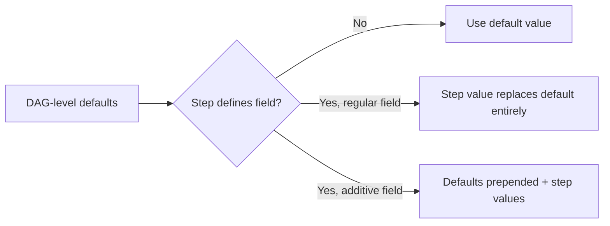

# RFC 016: Step Defaults

## Goal

Add a `defaults` field at the DAG level that lets users define default values for common step configuration fields such as retry policy, continue-on behavior, timeout, preconditions, and environment variables. Steps inherit these defaults automatically and can override them individually, eliminating repetitive configuration across steps.

---

## Scope

| In Scope | Out of Scope |
|----------|-------------|
| DAG-level `defaults` field for step configuration | Deep merge of compound fields (e.g., partial retry_policy override) |
| Override semantics: full replacement for most fields | Per-step-type defaults (e.g., separate defaults for docker vs command) |
| Additive semantics for `env` and `preconditions` | Conditional defaults (vary by condition or tag) |
| Application to `steps` and `handler_on` steps | Opt-out syntax (e.g., `retry_policy: null` to unset a default) |
| Interaction with base config `defaults` | |

---

## Solution

### Default Resolution Flow



### New DAG-Level Field

`defaults` is a top-level field in the DAG YAML spec. It accepts a subset of step configuration fields. These values are applied to every step that does not explicitly set its own value for that field.

```yaml
defaults:
  <field>: <value>
  ...
```

### Supported Fields

| Field | Type | Description |
|-------|------|-------------|
| `retry_policy` | object | Default retry policy for all steps |
| `continue_on` | string or object | Default continue-on behavior |
| `repeat_policy` | object | Default repeat policy for all steps |
| `timeout_sec` | int | Default timeout in seconds |
| `mail_on_error` | bool | Default mail-on-error flag |
| `signal_on_stop` | string | Default signal to send on stop |
| `env` | list | Default environment variables (additive) |
| `preconditions` | list | Default preconditions (additive) |

### Excluded Fields

These step fields are intentionally **not** supported in `defaults`:

| Field | Reason |
|-------|--------|
| `name`, `id`, `description` | Identity — unique per step |
| `command`, `script` | Defines what the step does — unique per step |
| `depends` | Defines graph structure — unique per step |
| `output`, `output_key`, `output_omit` | Step-specific output capture |
| `call`, `params` | Sub-DAG invocation — step-specific |
| `parallel` | Step-specific parallelism configuration |
| `type`, `config` | Executor-specific — not meaningfully shared |
| `container` | Step-specific container override |
| `llm`, `messages` | Chat-step specific |
| `value`, `routes` | Router-step specific |
| `stdout`, `stderr` | Step-specific file redirects |
| `shell`, `shell_args`, `working_dir`, `log_output` | Already inherited from DAG-level fields via existing mechanisms |
| `shell_packages` | Tightly coupled to shell — rarely shared |
| `worker_selector` | DAG-level `worker_selector` already exists |

### Override Semantics

**Full Override (Default Behavior):** For most fields, if a step explicitly sets a value, it completely replaces the default. There is no deep merge within compound fields.

```yaml
defaults:
  retry_policy:
    limit: 3
    interval_sec: 5
    backoff: 2.0

steps:
  - name: step1
    command: echo "inherits full retry_policy from defaults"

  - name: step2
    command: echo "uses its own retry_policy entirely"
    retry_policy:
      limit: 10
      interval_sec: 30
      # backoff is NOT inherited from defaults — this is a full replacement
```

**Additive Fields:** `env` and `preconditions` use additive semantics — defaults are prepended to step-level values. Both the defaults and the step's own values apply.

```yaml
defaults:
  env:
    - LOG_LEVEL=info
  preconditions:
    - condition: test -f /tmp/ready

steps:
  - name: step1
    command: echo "has LOG_LEVEL=info and the precondition from defaults"

  - name: step2
    command: echo "has both default and step-level env/preconditions"
    env:
      - EXTRA_FLAG=true
    preconditions:
      - condition: test -d /data
```

In `step2`, the effective env is `[LOG_LEVEL=info, EXTRA_FLAG=true]` and preconditions include both the default check and the step's own check.

### Precedence Summary

| Field type | Step has value? | Result |
|------------|-----------------|--------|
| Regular (retry_policy, timeout_sec, etc.) | No | Use default |
| Regular | Yes | Step value wins (full replacement) |
| Additive (env, preconditions) | No | Use defaults only |
| Additive (env, preconditions) | Yes | Defaults prepended + step values |

### Scope of Application

**Steps:** Defaults apply to all steps in the `steps:` list, regardless of step type (command, docker, ssh, chat, dag, etc.).

**Handler Steps:** Defaults also apply to steps defined in `handler_on:` (init, failure, success, exit, wait). Handler steps follow the same override rules.

```yaml
defaults:
  timeout_sec: 300

handler_on:
  failure:
    command: notify.sh  # inherits 300s timeout from defaults
  exit:
    command: cleanup.sh
    timeout_sec: 60     # overrides default with 60s
```

**Base Config Interaction:** When a base config file also defines `defaults`, the DAG-level `defaults` overrides the base config's `defaults` on a field-by-field basis. This is consistent with how other DAG-level fields interact with base config.

### Relationship to Existing Features

| Feature | How `defaults` relates |
|---------|-----------------------------|
| **DAG-level `shell`** | Already a DAG-level field inherited by all steps. Not duplicated in `defaults`. |
| **DAG-level `working_dir`** | Same — already DAG-level. Not in `defaults`. |
| **DAG-level `log_output`** | Same — already has step > DAG > default priority chain. Not in `defaults`. |
| **DAG-level `llm`** | LLM config is already inherited by chat steps. Not in `defaults`. |
| **Base config** | Base config can define `defaults`. DAG overrides base config's `defaults`. |
| **DAG-level `env`** | DAG `env` sets process-level environment. `defaults.env` adds step-scoped env vars. Both can coexist. |

### Examples

#### Resilient Pipeline with Retries

```yaml
name: resilient-pipeline

defaults:
  retry_policy:
    limit: 3
    interval_sec: 10
    backoff: 2.0
  timeout_sec: 900
  continue_on: failed
  mail_on_error: true

steps:
  - name: fetch-data
    command: python fetch.py

  - name: process
    command: python process.py
    depends: [fetch-data]

  - name: upload
    command: python upload.py
    depends: [process]
    retry_policy:
      limit: 5
      interval_sec: 30
    # upload gets more retries; all other defaults still apply
```

#### Shared Preconditions

```yaml
name: production-workflow

defaults:
  preconditions:
    - condition: curl -sf http://api.internal/health
      expected: "ok"
  env:
    - ENVIRONMENT=production

steps:
  - name: deploy
    command: ./deploy.sh

  - name: migrate
    command: ./migrate.sh
    depends: [deploy]
    preconditions:
      - condition: test -f /data/migration-ready
    # Both the health check (from defaults) AND migration-ready check apply
```

#### Monitoring DAG with Repeat Policy

```yaml
name: service-monitor

defaults:
  repeat_policy:
    repeat: while
    interval_sec: 30
    condition: "true"
  timeout_sec: 86400

steps:
  - name: check-api
    command: curl -sf http://api.example.com/health

  - name: check-db
    command: pg_isready -h db.example.com

  - name: check-cache
    command: redis-cli -h cache.example.com ping
```

#### Graceful Shutdown with Signal Defaults

```yaml
name: long-running-services

defaults:
  signal_on_stop: SIGTERM
  timeout_sec: 3600

steps:
  - name: worker-1
    command: python worker.py --queue=high

  - name: worker-2
    command: python worker.py --queue=low

  - name: aggregator
    command: python aggregate.py
    signal_on_stop: SIGINT  # overrides default for this step
```

---

## Data Model

### DAG-Level `defaults` Field

| Field | Type | Default | Description |
|-------|------|---------|-------------|
| `defaults` | object | — | DAG-level default values for step configuration. Applied to all steps and handler steps. |
| `defaults.retry_policy` | object | — | Default retry policy: `limit` (int), `interval_sec` (int), `backoff` (float) |
| `defaults.continue_on` | string or object | — | Default continue-on behavior (e.g., `failed`, `skipped`, or an object with granular control) |
| `defaults.repeat_policy` | object | — | Default repeat policy: `repeat` (string), `interval_sec` (int), `condition` (string) |
| `defaults.timeout_sec` | int | — | Default timeout in seconds for all steps |
| `defaults.mail_on_error` | bool | — | Whether to send email on step error |
| `defaults.signal_on_stop` | string | — | Default OS signal to send when stopping a step |
| `defaults.env` | list of strings | — | Default environment variables (additive: prepended to step-level values) |
| `defaults.preconditions` | list of objects | — | Default preconditions (additive: prepended to step-level values) |

---

## Edge Cases & Tradeoffs

| Chosen | Considered | Why |
|--------|-----------|-----|
| Full replacement for compound fields (e.g., `retry_policy`) | Deep merge (inherit individual sub-fields) | Keeps behavior predictable; avoids subtle merge bugs where a step inherits unexpected sub-fields |
| Uniform defaults for all step types | Per-step-type defaults (e.g., separate defaults for docker vs command) | Simpler model; covers the vast majority of use cases without adding schema complexity |
| All defaults apply unconditionally | Conditional defaults (vary by tag or expression) | Straightforward to reason about; conditional logic belongs in step-level configuration |
| No opt-out syntax (cannot explicitly unset a default) | Allow `field: null` to unset | Avoids null-handling complexity; a step that needs different behavior simply overrides with its own value |
| Additive semantics for `env` and `preconditions` | Full replacement for all fields uniformly | These fields naturally accumulate (a step's env adds to defaults, not replaces); matches user expectation |
| Defaults apply to handler steps too | Defaults only for `steps:` list | Handlers benefit from the same DRY principle; keeps the mental model consistent |
