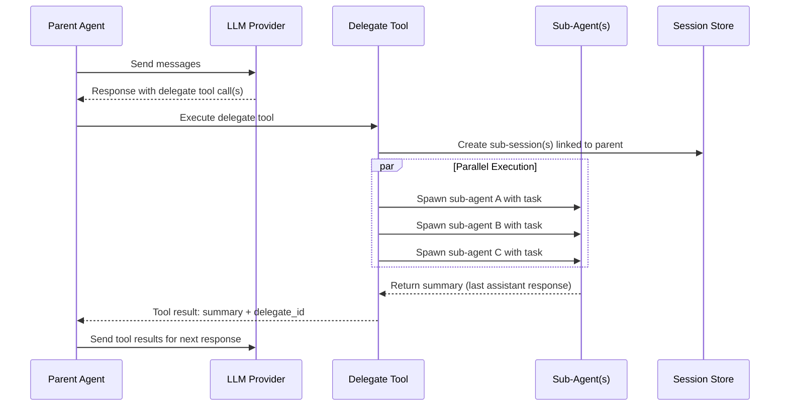

# RFC 017: Sub-Agent Architecture

## Goal

Add a `delegate` tool that lets the agent spawn focused child agents (sub-agents) for parallel sub-task execution. Each sub-agent runs in its own session, uses the same tools (minus `delegate`), and returns a summary to the parent. This is a prerequisite for skills, which will later define specialized sub-agent personas.

---

## Scope

| In Scope | Out of Scope |
|----------|-------------|
| `delegate` tool for spawning child agents | Recursive delegation (sub-agents spawning sub-agents) |
| Parallel execution of multiple sub-agents | Skill-based persona customization for sub-agents |
| Sub-session storage linked to parent session | Inter-sub-agent communication |
| Observability: expandable delegate blocks in UI | Sub-agent resource quotas beyond iteration limits |
| Max 10 concurrent sub-agents per batch | |

---

## Solution

### Delegate Tool Execution Flow



### Delegate Tool

A new tool named `delegate` is added to the agent's tool set.

**Input fields:**

| Field | Type | Required | Default | Description |
|-------|------|----------|---------|-------------|
| `tasks` | list of objects | yes | — | Array of sub-tasks to delegate |
| `tasks[].task` | string | yes | — | Description of the sub-task for the sub-agent |
| `tasks[].max_iterations` | int | no | 20 | Maximum tool-call rounds for this sub-agent |

**Behavior:**

1. Creates a new sub-session linked to the parent session.
2. Spawns a child agent loop with the same provider, model, and system prompt.
3. The child loop receives the `task` as a user message.
4. The child runs to completion (all tool-call rounds finish or max iterations reached).
5. Returns the last assistant response as a summary to the parent.

**Tool result:** The tool result contains the sub-agent's summary text and a `delegate_id` that references the sub-session for on-demand history loading.

### Context and Tools

- **System prompt**: Sub-agent receives the same system prompt as the parent (including memory, environment info, etc.).
- **Conversation history**: Sub-agent does NOT receive the parent's conversation history. It starts fresh with only the system prompt and the delegated task.
- **Tools**: Sub-agent receives the same tools as the parent, minus `delegate`. This prevents recursion — only the root agent can delegate.

### Parallel Execution

When the LLM returns multiple tasks in a single `delegate` tool call, they execute concurrently:

```text
Parent Loop
  ├─ LLM response: tool_calls: [
  │     delegate(tasks: [{task: "Analyze configs"}, {task: "Check resource limits"}, {task: "Review health checks"}])
  │  ]
  │
  ├─ Non-delegate tools execute sequentially (existing behavior)
  │
  ├─ Delegate tools execute in parallel:
  │   ┌──────────────┬──────────────┬──────────────┐
  │   │ Sub-agent A   │ Sub-agent B   │ Sub-agent C   │
  │   │ (sub-session) │ (sub-session) │ (sub-session) │
  │   └──────────────┴──────────────┴──────────────┘
  │   Parent waits for ALL to complete...
  │
  ├─ Returns 3 tool results (summaries) to LLM
  └─ Parent continues with combined results
```

**Limits:**
- Maximum 10 concurrent sub-agents per tool-call batch.
- Excess delegate calls beyond 10 receive an error result.
- Each sub-agent defaults to 20 max iterations (configurable per call).

### Sub-Session Storage

Each delegate invocation creates a separate session linked to the parent:

- Sub-session messages are persisted via the session store.
- Sub-sessions are excluded from the main session listing (filtered by non-empty parent session ID).
- Sub-session history is loadable on demand via the existing sessions API endpoint.

### Observability

**Parent session:**
- Tool call message shows `delegate` with the task description.
- Tool result message carries a `delegate_id` field referencing the sub-session.
- No real-time streaming of sub-agent messages — only status (running / finished).

**Frontend:**
- Delegate tool calls display as expandable blocks.
- Collapsed: shows task description and summary.
- Expanded: loads full sub-session history from API on demand.

### Lifecycle

1. Parent LLM returns delegate tool call(s).
2. For each delegate call: generate sub-session ID, create sub-session in the session store, build child agent loop (same config, filtered tools), queue task as user message, run child loop to completion, capture last assistant response as summary, return summary and sub-session ID.
3. Parent records all tool results.
4. Parent sends results to LLM for next response.

### Configuration

No new configuration is required. The delegate tool is automatically available in the interactive chat agent. It is **not** available in DAG agent steps (`type: agent`), which explicitly list their tool set.

The `max_iterations` parameter on each delegate call controls sub-agent runtime. The global default is 20 iterations per sub-agent.

### Relationship to Existing Features

| Feature | Relationship |
|---------|-------------|
| **Agent Loop** | Sub-agent reuses the same loop implementation |
| **Tools** | Sub-agent inherits parent's tools (minus delegate) |
| **Session Store** | Sub-sessions use the same storage mechanism |
| **Memory** | Sub-agent inherits memory via the shared system prompt |
| **DAG Agent Steps** | Delegate is NOT available in DAG agent steps |
| **Skills (future)** | Skills will customize sub-agent personas and tool sets |

### Future: Skills Integration

Once sub-agents are implemented, skills (RFC 013) can be activated by loading skill knowledge into the sub-agent's system prompt, filtering the sub-agent's tool set based on skill configuration, and accepting an optional `skill` parameter on the delegate tool. This is explicitly out of scope for this RFC.

---

## Data Model

### Sub-Session Fields

| Field | Type | Default | Description |
|-------|------|---------|-------------|
| `ID` | string (UUID) | generated | Unique identifier for the sub-session |
| `UserID` | string | parent's user ID | User context inherited from the parent session |
| `ParentSessionID` | string (UUID) | — | Links this sub-session to its parent session; non-empty value excludes it from the main session listing |
| `DelegateTask` | string | — | The task description that was delegated to this sub-agent |

### Delegate Tool Input

| Field | Type | Default | Description |
|-------|------|---------|-------------|
| `tasks` | list of objects | — | Array of sub-tasks to execute in parallel |
| `tasks[].task` | string | — | Description of the sub-task for the sub-agent |
| `tasks[].max_iterations` | int | 20 | Maximum tool-call rounds for this sub-agent |

### Delegate Tool Output

| Field | Type | Description |
|-------|------|-------------|
| `content` | string | The sub-agent's summary text (last assistant response) |
| `delegate_id` | string (UUID) | References the sub-session for on-demand history loading |

---

## Edge Cases & Tradeoffs

| Chosen | Considered | Why |
|--------|-----------|-----|
| No recursive delegation — only root agent can delegate | Allow sub-agents to spawn their own sub-agents | Prevents runaway cost and complexity; tree depth of 1 is sufficient for task decomposition |
| No parent context for sub-agents — fresh conversation | Share parent's conversation history with sub-agents | Fresh context prevents pollution and keeps sub-agents focused; the task description provides sufficient instruction |
| Max 10 concurrent sub-agents per batch | Unlimited concurrency | Bounds cost and resource usage; 10 parallel sub-agents already provides substantial parallelism |
| Sub-sessions excluded from main session listing | Show sub-sessions alongside regular sessions | Avoids cluttering the session list; sub-sessions are accessible on demand via the parent's delegate blocks |
| Summary-only return to parent (last assistant response) | Return full conversation history to parent | Keeps parent context window manageable; full history is available on demand via the sub-session API |
| Default 20 max iterations per sub-agent | Same default as parent (50) | Sub-agents handle focused sub-tasks; lower default prevents cost overruns while remaining configurable per call |
| Error in sub-agent returns error result to parent | Propagate exception and fail parent | Parent LLM can reason about the error and decide how to proceed; more resilient than hard failure |
