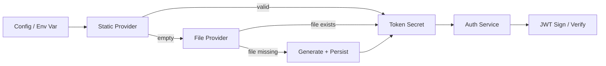

# RFC 018: Authentication by Default

## Goal

Enable authentication by default in Dagu v2, auto-generate JWT secrets, and provide a browser-based setup flow for creating the initial admin account. Also consolidate auth modes by removing standalone OIDC (in favor of OIDC as an addon to builtin auth), promoting basic auth from an overlay to a proper mode, and introducing a unified auth store interface.

---

## Scope

| In Scope | Out of Scope |
|----------|--------------|
| Default auth mode change from `none` to `builtin` | Database-backed auth store (interface only; v2 stays file-based) |
| Auto-generated JWT signing secret with type-safe resolution | Multi-factor authentication (MFA/2FA) |
| Browser-based initial admin setup flow | Password complexity rules beyond minimum length |
| Removal of standalone `auth.mode=oidc` | Account lockout after failed attempts |
| Promotion of basic auth to `auth.mode: basic` | Session revocation / token blocklist |
| Unified auth store interface for users, API keys, webhooks | Email-based password recovery |
| User store LRU+TTL caching | Self-service user registration |

---

## Motivation

### Security by Default

Running without authentication is a reasonable development convenience but a poor production default. Users who deploy Dagu and forget to enable auth expose their workflow engine — including DAG definitions, execution controls, environment variables, and terminal access — to anyone who can reach the server. Changing the default to `builtin` ensures security is opt-out rather than opt-in.

### First-Run Friction

Enabling builtin auth previously required manually setting the auth mode, providing a random JWT secret, and optionally pre-configuring admin credentials. If any step was missed the server either refused to start or started with credentials the user never saw. This friction discouraged authentication adoption.

### OIDC Mode Consolidation

Standalone OIDC had significant limitations: hardcoded admin role for all users, no user persistence, no API keys or webhooks, cookie-based auth only, and terminal disabled. Builtin+OIDC is a strict superset with proper user management, role mapping, and access control. Maintaining two OIDC code paths doubled the surface area for security issues.

### Basic Auth Inconsistencies

Basic auth was configured as an overlay (`auth.basic.enabled`) rather than a mode, causing inconsistencies: API and agent route handlers checked different fields to determine whether basic auth was enabled, warnings contradicted actual behavior, and empty credentials produced no validation error. Promoting basic auth to a proper mode eliminates these ambiguities.

### Scattered Auth Storage

Auth-related data was spread across three independent file-based stores (users, API keys, webhooks), each with its own initialization path and caching strategy. No unified interface existed, making it difficult to swap backends without touching every consumer.

---

## Solution

### 1. Default Auth Mode

The default value of `auth.mode` changes from `""` (treated as `none`) to `builtin`.

| Mode | Behavior |
|------|----------|
| `builtin` | **(default)** JWT-based auth with RBAC, user management, API keys, webhooks. Optional OIDC addon via `auth.oidc` config. |
| `basic` | HTTP Basic Auth with a single username/password. All users get admin role. Requires `auth.basic.username` and `auth.basic.password` (validation error if missing). |
| `none` | No authentication — explicit opt-out required. Logs a startup warning. |

The standalone `auth.mode=oidc` is removed. Users who previously used standalone OIDC must switch to `auth.mode=builtin` with OIDC configured. Setting `auth.basic` credentials under any mode other than `basic` is a validation error (not a warning).

### 2. Token Secret: Type-Safe Resolution

The JWT signing secret is promoted from a plain string to an opaque type that prevents accidental logging or serialization. The type redacts itself in `String()`, `GoString()`, `MarshalJSON()`, and `MarshalText()` methods, and exposes the raw key material only through a dedicated `SigningKey()` method.

A provider chain resolves the secret at startup:

| Provider | Source | Behavior |
|----------|--------|----------|
| Static provider | Config/env string | Wraps a known value. No I/O. |
| File provider | `{DataDir}/auth/token_secret` | Reads existing file. If missing, generates 32 bytes via `crypto/rand`, base64url-encodes (43 chars), writes with `0600` permissions in a `0700` directory. |
| Chain provider | Ordered list | Tries each provider in order. Invalid secret = skip to next. Other errors = fatal. |

The chain is: explicit config/env value first, then file-based auto-generation. Since the file provider always succeeds, the server can always start in `builtin` mode without manual secret configuration.

**Properties:** Auto-generated secrets survive restarts (persisted to file). Config/env values take precedence. Rotation is achieved by deleting the secret file and restarting — all existing JWTs invalidate, but user accounts are unaffected.



**Key type boundaries:**

- The config layer remains a plain string (required for Viper unmarshaling).
- A single conversion point at startup transforms the string into the opaque type.
- The auth service receives the opaque type — the compiler enforces this at every call site.
- The JWT library receives raw bytes only inside token sign/verify methods.

**Rotation:**

```bash
rm ~/.dagu/data/auth/token_secret
dagu restart
```

### 3. Initial Setup Flow

When the server starts in `builtin` mode and the user store is empty (zero users), it enters setup mode.

1. Server detects zero users at startup and sets a `setupRequired` flag, passed to the frontend via existing template config injection.
2. Frontend redirects all routes to `/setup` while `setupRequired` is true.
3. Setup page presents a "Create your admin account" form with username, password, and password confirmation.
4. `POST /api/v1/auth/setup` creates the admin user and returns a JWT. This endpoint is public (no auth required), one-time (returns 403 if any users exist), and atomic (checks count and creates user in a single service call).
5. Frontend stores the token and redirects to the dashboard.

The setup response mirrors the login response — the user is immediately authenticated.

### 4. Auth Store Interface

A unified auth store interface abstracts user, API key, and webhook persistence behind a single abstraction. The file-based implementation composes the three existing stores.

> **Note:** During implementation, the unified `AuthStore` interface was descoped. The three stores remain separate and are composed directly at initialization. This avoids unnecessary abstraction while keeping the same functional behavior.

The user store gains LRU+TTL caching, aligned with the API key and webhook stores. This avoids disk reads on every JWT validation. The cache uses the same staleness-detection pattern (file size and modification time checks) as the existing API key cache.

### Examples

#### Minimal Config (Auth Enabled by Default)

```yaml
# config.yaml — no auth section needed
port: 8080
```

Auth is enabled automatically. Secret auto-generated. Setup page on first visit.

#### Explicit No-Auth for Development

```yaml
auth:
  mode: none
```

#### Basic Auth

```yaml
auth:
  mode: basic
  basic:
    username: "admin"
    password: "s3cret"
```

#### Custom Token Secret (Multi-Instance Deployments)

```yaml
auth:
  builtin:
    token:
      secret: "my-shared-secret-across-instances"
      ttl: 12h
```

#### Builtin Auth with OIDC

```yaml
auth:
  mode: builtin
  oidc:
    client_id: "dagu-app"
    client_secret: "secret"
    client_url: "http://localhost:8080"
    issuer: "https://accounts.google.com"
    scopes: [openid, profile, email]
    auto_signup: true
    role_mapping:
      default_role: viewer
      groups_claim: groups
      group_mappings:
        platform-admins: admin
        developers: developer
```

---

## Data Model

### Auth Mode Configuration

| Field | Type | Default | Description |
|-------|------|---------|-------------|
| `auth.mode` | enum (`none`, `basic`, `builtin`) | `builtin` | Authentication mode |
| `auth.basic.username` | string | — | Required when mode is `basic` |
| `auth.basic.password` | string | — | Required when mode is `basic` |

### Token Secret

| Field | Type | Default | Description |
|-------|------|---------|-------------|
| `auth.builtin.token.secret` | string | (auto-generated) | JWT signing secret; resolved via provider chain |
| `auth.builtin.token.ttl` | duration | — | JWT token time-to-live |
| Token secret file | 43-char base64url string | — | Stored at `{DataDir}/auth/token_secret` with `0600` permissions |

### Setup Endpoint

**Request fields (`POST /api/v1/auth/setup`):**

| Field | Type | Required | Description |
|-------|------|----------|-------------|
| `username` | string | yes | Admin username (min 1 char) |
| `password` | string | yes | Admin password (min 8 chars) |

**Response fields:**

| Field | Type | Description |
|-------|------|-------------|
| `token` | string | JWT for immediate authentication |
| `expiresAt` | datetime | Token expiration timestamp |
| `user.id` | string | UUID of created admin |
| `user.username` | string | Admin username |
| `user.role` | string | Always `admin` |

---

## User Experience Flows

### First-Time Installation

1. Install Dagu, run `dagu start-all`
2. Server starts with auth mode defaulting to `builtin`
3. JWT secret auto-generated and persisted
4. Zero users detected — setup mode enabled
5. User opens browser to the server URL
6. Frontend redirects to `/setup`
7. User creates admin account
8. Token returned, redirected to dashboard

### Explicit No-Auth (Development)

1. Set `auth.mode: none` in config
2. Server starts with no auth initialization, no setup page
3. All endpoints accessible without credentials

---

## Relationship to Existing Features

| Feature | How this RFC relates |
|---------|---------------------|
| **Builtin auth** | Becomes the default mode; initialization simplified |
| **OIDC auth** | Standalone `auth.mode: oidc` removed; OIDC available exclusively as addon to builtin mode |
| **Basic auth** | Promoted from overlay to proper mode; `Enabled` flag removed |
| **API keys / Webhooks** | Move behind unified auth store interface; behavior unchanged |
| **Agent/Terminal** | Already requires builtin auth; now available by default |

---

## Risks

1. **Breaking change for existing users** — Users upgrading to v2 with no auth config will suddenly require authentication. Mitigated by: v2 is a major version bump with clear release notes.

2. **Setup page exposure window** — Between server start and admin account creation, the setup endpoint is publicly accessible. Mitigated by: one-time-use endpoint disabled after first user creation.

3. **Auto-generated secret on ephemeral filesystems** — Containers without persistent volumes will regenerate secrets on every restart, invalidating all JWTs. Mitigated by: documented requirement for persistent storage; alternatively set `DAGU_AUTH_TOKEN_SECRET` explicitly.

4. **User store cache coherence** — Caching introduces potential for stale reads. Mitigated by: same staleness-detection pattern already proven in API key and webhook stores.

---

## Edge Cases & Tradeoffs

| Chosen | Considered | Why |
|--------|------------|-----|
| Struct with unexported `[]byte` for secret | `type TokenSecret string` | Struct prevents accidental casting and string conversion; zero value is invalid, forcing explicit construction |
| `[]byte` internal storage | `string` | JWT library expects `[]byte`; avoids conversion per sign/verify |
| Typed `TokenSecretProvider` returning opaque type | Generic `SecretStore` with name-based lookup | Compile-time safety; no magic strings; single-purpose |
| No `SecretStore` in `AuthStore` | `SecretStore` sub-interface | YAGNI — only one secret exists; a typed provider is safer than a stringly-typed generic store |
| Config layer remains `string` | Change config to opaque type | Viper cannot unmarshal into opaque types; conversion at boundary is sufficient |
| Proper `auth.mode: basic` | Overlay with `Enabled` boolean | Mode-based eliminates inconsistent enable checks across code paths |
| Remove standalone `auth.mode: oidc` | Keep both OIDC paths | Builtin+OIDC is a strict superset; two code paths double the security surface area |
| Browser-based setup flow | Print random password to stdout | Auto-printed passwords are easily lost; setup page provides better UX |
