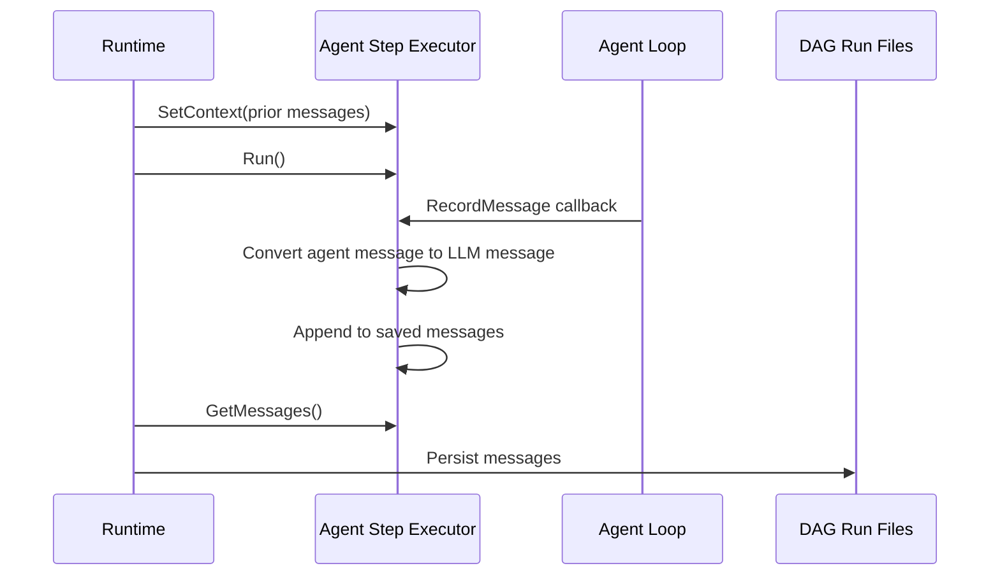

# RFC 022: Agent Step Cost Persistence

## Goal

Persist LLM cost and token usage data from agent step executor runs into DAG run files, and add a per-message USD cost field to message metadata. This enables both `chat` and `agentstep` executors to record fine-grained cost data, serving as a prerequisite for RFC 021 (LLM Cost Tracking).

---

## Scope

| In Scope | Out of Scope |
|----------|--------------|
| Add `Cost` field to LLM message metadata | Cost aggregation, dashboard, or API endpoint (RFC 021) |
| Agent step executor implements the chat message handler interface | Changes to agent loop or session manager cost calculation |
| Message type conversion from agent messages to standard LLM messages | Cost computation formula or model pricing tables |
| Cost persistence in both local and distributed (worker) modes | |

---

## Motivation

The agent step executor receives per-message cost and token usage via its message callback, but only logs them to stderr. This data is lost after execution. The chat executor already persists messages to DAG run files via the chat message handler interface, but records token counts without USD cost since the message metadata has no cost field.

RFC 021 (LLM Cost Tracking) needs per-message cost data from both executors to build the cost summary API. This RFC extracts the executor-level persistence changes as a standalone prerequisite.

---

## Solution

### Cost Field on Message Metadata

A `cost` field is added to the LLM message metadata to record per-message USD cost. This field is populated by both the agent step executor (from the agent's cost callback) and the chat executor (from usage data and model pricing).

### Agent Step Message Persistence

The agent step executor implements the chat message handler interface, which the runtime already uses to capture and persist messages from any executor that supports it. The executor:

1. Receives context messages (prior conversation history) before execution via the handler's set-context method.
2. Converts each agent message to the standard LLM message format during execution via the record-message callback.
3. Returns all saved messages after execution via the handler's get-messages method.

The runtime's existing capture logic calls set-context before execution and get-messages after, then persists the messages to DAG run files. No changes to the runtime are needed — implementing the interface is sufficient.

### Message Type Mapping

| Agent message field | LLM message field |
|---------------------|-------------------|
| `Type` = user | `Role` = user |
| `Type` = assistant | `Role` = assistant |
| `Content` | `Content` |
| `ToolCalls` | `ToolCalls` (converted from agent tool call format) |
| `Usage.PromptTokens` | `Metadata.PromptTokens` |
| `Usage.CompletionTokens` | `Metadata.CompletionTokens` |
| `Usage.TotalTokens` | `Metadata.TotalTokens` |
| `Cost` | `Metadata.Cost` (new field) |
| Model config | `Metadata.Provider`, `Metadata.Model` |

### Chat Executor Cost Population

The chat executor already builds message metadata with token counts. With the new cost field available, it populates USD cost from usage data and model pricing in its response metadata construction.

### Shared-Nothing Worker Compatibility

No changes needed for distributed mode. The DAG run status (which includes node chat messages) is already serialized and transmitted via gRPC in the worker protocol. The runtime's existing chat message handler capture works identically in both local and worker modes:

- **Local:** Messages are written directly to DAG run files.
- **Worker:** Messages are included in the status report sent to the coordinator via gRPC, which then persists them.

Any executor implementing the chat message handler interface gets persistence in both modes automatically.

---

## Data Model

### LLM Message Metadata

| Field | Type | Default | Description |
|-------|------|---------|-------------|
| `Cost` | float64 | `0` | USD cost for this API call |

All existing metadata fields (PromptTokens, CompletionTokens, TotalTokens, Provider, Model) remain unchanged.

### Agent Step Executor State

| Field | Type | Default | Description |
|-------|------|---------|-------------|
| `contextMessages` | list of LLMMessage | `[]` | Prior conversation history received before execution |
| `savedMessages` | list of LLMMessage | `[]` | Messages converted and accumulated during execution |

---

## Edge Cases & Tradeoffs

| Chosen | Considered | Why |
|--------|------------|-----|
| Per-message cost field | Per-step aggregate only | Enables fine-grained cost analysis in RFC 021; aggregation can be derived from per-message data |
| Reuse chat message handler interface | New persistence interface for agent step | Consistent with existing chat executor pattern; runtime already supports capture for any implementer |
| Cost as float64 | Integer cents | Matches upstream LLM API response format; avoids lossy conversion for sub-cent costs |
| Message conversion at callback time | Batch conversion after execution | Ensures messages are captured even if execution is interrupted; matches the streaming nature of agent execution |
