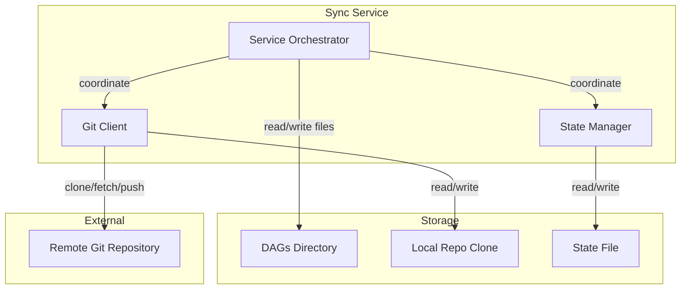
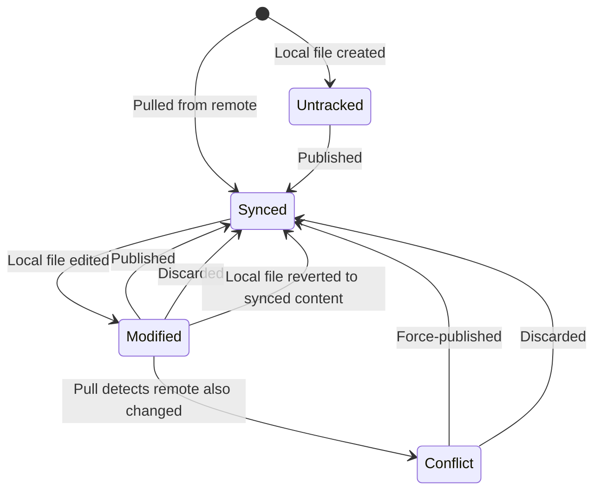

# RFC 025: Git Sync

## Goal

One-way and two-way synchronization between a local DAGs directory and a remote git repository, enabling teams to version-control DAG definitions, agent memory, skills, and souls through a single git-backed workflow — with pull, publish, conflict detection, and background auto-sync.

---

## Scope

| In Scope | Out of Scope |
|----------|--------------|
| Pull (remote → local) with per-item conflict detection | Multi-branch sync |
| Publish (local → remote) for single items and batch | Merge strategies beyond overwrite |
| Per-item sync status tracking with state persistence | Partial directory sync (cherry-pick files) |
| Background auto-sync with configurable interval | Collaborative editing or real-time conflict resolution |
| CLI commands for status, pull, publish, discard | Webhook-triggered sync |
| REST API for all sync operations | Git history browsing or blame |
| Token and SSH authentication | Multi-remote support |
| Configurable repository subdirectory (path prefix) | Bi-directional merge tooling |

---

## Solution

### Architecture

The sync system consists of three components coordinated by a central service:

- **Service Orchestrator** — Coordinates all operations. Translates between item IDs and file paths, runs conflict detection, manages the pull/publish/discard lifecycle. A mutex serializes all mutating operations.
- **Git Client** — Wraps a pure-Go git library. Handles clone, fetch, pull (with force reset), commit, and push. No system `git` binary required.
- **State Manager** — Reads and writes a JSON state file with atomic persistence (temp file + rename). Maintains an in-memory cache to avoid re-parsing on repeated reads within a request.

### Item Kinds

Four kinds of items are tracked, each with distinct directory and extension rules:

| Kind | Location | Extension | Scanning |
|------|----------|-----------|----------|
| `dag` | Root of DAGs directory | `.yaml` / `.yml` | Flat (root-level files only) |
| `memory` | `memory/` subdirectory | `.md` | Recursive |
| `skill` | `skills/{name}/` subdirectory | `SKILL.md` per subdirectory | One level deep |
| `soul` | `souls/` subdirectory | `.md` | Flat |

Item IDs are relative paths without extensions (e.g., `my-dag`, `memory/MEMORY`, `skills/sql-agent/SKILL`, `souls/default`). The kind is derived from the path prefix: `memory/` → memory, `skills/` → skill, `souls/` → soul, everything else → dag.

Root-level `.md` files in the DAGs directory (e.g., READMEs) are explicitly excluded from tracking.

### Sync State Machine

Each tracked item has an independent sync status that transitions based on local and remote changes:

**Revert detection**: On every status check, local file hashes are refreshed. If a modified file's hash matches its last-synced hash (user manually reverted the file), the status transitions back to synced automatically.

### Pull Operation

Pull synchronizes remote changes to the local DAGs directory:

1. **Ensure repository ready** — Clone (shallow, depth 1, single branch) if no local clone exists; otherwise open the existing clone.
2. **Fetch and advance** — Fetch from remote with depth 1 and force. Compare HEAD to remote ref — if equal, report already up-to-date. Otherwise, pull with force to advance the local branch to match the remote.
3. **Refresh local hashes** — For all tracked items, re-hash local file content. Detect modifications (hash differs from last-synced) and reverts (hash matches last-synced).
4. **Sync files to DAGs directory** — Walk the repo tree for files matching tracked extensions (respecting the configured path prefix):
   - **New remote file** (no local copy) → copy to DAGs directory, record as synced.
   - **Local unmodified, remote changed** → overwrite local, record as synced.
   - **Local modified, remote unchanged** → skip, preserve local changes.
   - **Local modified, remote also changed** → record as conflict with remote commit metadata (author, message, commit hash).
5. **Scan for untracked items** — Walk the local DAGs directory for files not yet in state; mark as untracked.
6. **Save state** — Persist atomically.

### Publish Operation

#### Single Item

1. Validate that push is enabled in configuration.
2. Reject if item is already synced (no changes to publish).
3. Reject if item is in conflict and force flag is not set.
4. Read local file content, write to the repo working tree at the correct path (with path prefix).
5. Stage and commit the single file with a commit message (default: "Update {itemID}") using the configured author identity.
6. Push to remote.
7. Update state to synced with new commit hash and content hash.

#### Batch Publish

1. Validate each item ID — decode URL escapes, reject absolute paths and path traversal, normalize to canonical form.
2. Accept only modified and untracked items; reject conflicts and already-synced items.
3. Deduplicate and sort alphabetically.
4. Copy all target files to the repo working tree.
5. Stage all files and create a single commit (default: "Update N DAG(s)").
6. Push to remote.
7. Update state for each successful item to synced.

### Discard Operation

Discard restores an item to its remote version:

1. Read the file content from the local repo working tree (reflects the last-pulled remote state).
2. Write that content to the local DAGs directory, overwriting the local copy.
3. Compute content hash and update state to synced.

### Conflict Detection

Conflicts use three-way hash comparison:

| Hash | Purpose |
|------|---------|
| Last-synced hash | Content hash recorded when item was last synced |
| Local hash | Current hash of the file in the DAGs directory |
| Remote hash | Hash of the file in the repo after pull |

A conflict is detected during pull when:
- The item is locally modified (local hash ≠ last-synced hash), **and**
- The remote has also changed (remote hash ≠ last-synced hash).

When a conflict is recorded, the remote commit hash, author name, and commit message are captured for display in the UI and API.

Conflict resolution is manual: the user either **force-publishes** (overwrites remote with local) or **discards** (overwrites local with remote). There is no automatic merge.

### Local Modification Detection

On every status check and before every pull, all tracked items have their local file hashes refreshed:

- If the local hash changed and the item was synced → transition to modified.
- If the local hash matches the last-synced hash and the item was modified → transition back to synced (revert detection).
- Items in conflict status are not automatically transitioned.
- Missing files are silently skipped.

This scan-on-every-call approach ensures untracked files are detected immediately without maintaining a filesystem watcher or cached index.

### Auto-Sync

A background worker provides periodic synchronization:

- **On-startup pull** — Optionally runs a pull synchronously when the server starts, before the periodic loop begins.
- **Periodic pull** — A ticker goroutine calls pull at a configurable interval (default: 300 seconds). Errors are logged and stored in state but do not stop the loop.
- **Shutdown** — A stop signal cleanly terminates the background goroutine.

Auto-sync only performs pulls, never publishes. Publishing is always an explicit user action.

### Configuration

| Setting | Default | Description |
|---------|---------|-------------|
| Enabled | `false` | Master enable/disable for git sync |
| Repository | — | Remote repository URL (HTTPS or SSH) |
| Branch | `"main"` | Branch to sync with |
| Path | `""` (repo root) | Subdirectory within the repo to use as the sync root |
| Push Enabled | `true` | Whether publish operations are allowed |
| Auth Type | `"token"` | Authentication method: `token` or `ssh` |
| Auth Token | — | Personal access token (for token auth) |
| SSH Key Path | — | Path to SSH private key (for SSH auth) |
| SSH Passphrase | — | Passphrase for encrypted SSH key |
| Auto-Sync Enabled | `false` | Enable background periodic pull |
| Auto-Sync On Startup | `true` | Run a pull when the server starts |
| Auto-Sync Interval | `300` (seconds) | Time between periodic pulls |
| Commit Author Name | `"Dagu"` | Git author name for commits |
| Commit Author Email | `"dagu@localhost"` | Git author email for commits |

Configuration is set via YAML config file or environment variables (prefixed `DAGU_GITSYNC_`). Validation enforces: repository and branch must be non-empty when enabled. Auth credentials (token value, SSH key path) are validated at runtime when operations are attempted.

Short-form repository URLs (e.g., `github.com/org/repo`) are automatically expanded to full HTTPS URLs.

Runtime config updates via the API modify the in-memory configuration only — the config file remains the authoritative source on restart.

### API Endpoints

| Method | Path | Description |
|--------|------|-------------|
| GET | `/sync/status` | Per-item sync states with summary counts (synced, modified, untracked, conflict) |
| POST | `/sync/pull` | Pull from remote; returns sync result with counts |
| POST | `/sync/publish-all` | Batch publish; optional item ID filter and commit message |
| POST | `/sync/test-connection` | Test authentication and connectivity to remote |
| GET | `/sync/config` | Current configuration (secrets redacted) |
| PUT | `/sync/config` | Update configuration at runtime (admin only) |
| GET | `/sync/items/{itemId}/diff` | Local and remote content for a specific item |
| POST | `/sync/items/{itemId}/publish` | Publish single item; optional message and force flag; 409 on unforced conflict |
| POST | `/sync/items/{itemId}/discard` | Discard local changes, restore remote version |

All mutating operations require write permissions. Config updates require admin role. All operations are audit-logged.

### CLI Commands

| Command | Description |
|---------|-------------|
| `sync status` | Display repository, branch, summary counts, and table of non-synced items |
| `sync pull` | Pull from remote and display sync results |
| `sync publish <name>` | Publish a single item; supports `-m` for commit message and `-f` for force (conflict override) |
| `sync publish --all` | Publish all modified and untracked items; supports `-m` for commit message |
| `sync discard <name>` | Discard local changes with confirmation prompt; `-y` skips confirmation |

---

## Data Model

### Global Sync State

| Field | Type | Default | Description |
|-------|------|---------|-------------|
| Version | int | `1` | Schema version for future migration |
| Repository | string | — | Repository URL being synced |
| Branch | string | — | Branch name |
| LastSyncAt | timestamp | `null` | When the last successful sync occurred |
| LastSyncCommit | string | `""` | Commit hash of the last successful sync |
| LastSyncStatus | string | `""` | `"success"` or `"error"` |
| LastError | string | `null` | Error message from the last failed sync |
| DAGs | map | `{}` | Per-item state map, keyed by item ID |

### Per-Item State

| Field | Type | Default | Description |
|-------|------|---------|-------------|
| Status | string | — | `synced`, `modified`, `untracked`, or `conflict` |
| Kind | string | — | `dag`, `memory`, `skill`, or `soul` |
| BaseCommit | string | — | Commit hash when this item was last synced |
| LastSyncedHash | string | — | SHA-256 content hash at last sync (prefixed `sha256:`) |
| LastSyncedAt | timestamp | `null` | When this item was last synced |
| LocalHash | string | — | Current local file content hash |
| ModifiedAt | timestamp | `null` | When local modification was detected |
| RemoteCommit | string | `""` | Remote commit hash (conflict only) |
| RemoteAuthor | string | `""` | Remote commit author (conflict only) |
| RemoteMessage | string | `""` | Remote commit message (conflict only) |
| ConflictDetectedAt | timestamp | `null` | When the conflict was detected |

### Configuration

| Field | Type | Default | Description |
|-------|------|---------|-------------|
| Enabled | bool | `false` | Master switch |
| Repository | string | — | Remote URL |
| Branch | string | `"main"` | Target branch |
| Path | string | `""` | Subdirectory prefix in repo |
| PushEnabled | bool | `true` | Allow publish operations |
| Auth | object | — | Contains type, token, SSH key path, SSH passphrase |
| AutoSync | object | — | Contains enabled, on_startup, interval |
| Commit | object | — | Contains author_name, author_email |

State is persisted as a single JSON file, written atomically via temp-file-then-rename.

---

## Edge Cases & Tradeoffs

| Chosen | Considered | Why |
|--------|------------|-----|
| Shallow clone (depth 1) | Full history clone | Only current file content matters for sync; shallow clone minimizes storage and network usage |
| Force pull | Merge-based pull | The repo clone is a mirror, not an editable workspace; local edits live in the DAGs directory, not the clone |
| SHA-256 content hashing | Git tree object comparison | Independent of git internals; detects content changes at the file level without requiring git object database lookups; self-describing `sha256:` prefix |
| Per-item state tracking | Directory-level diffing | Enables granular status reporting, selective publish, and independent conflict tracking per file |
| Scan on every status call | Cached filesystem index | Untracked files are detected immediately without watchers; no stale cache risk from external edits |
| In-memory state cache with file-backed persistence | Pure file reads on every access | Avoids re-parsing JSON on repeated reads within a request while maintaining durability across restarts |
| Stale entries silently skipped | Automatic cleanup of missing files | Conservative approach — avoids accidentally removing state for temporarily moved files; entries for deleted files persist but do not affect operations |
| Force-publish for conflicts | Three-way merge tool | Keeps the system simple; merge tooling adds significant complexity for a workflow orchestration tool where files are typically small YAML or markdown |
| Best-effort state persistence on reads | Transactional writes for all state changes | Read operations (status check) detect changes but should not fail if state cannot be saved; write operations (pull, publish) always persist |
| Mutex serialization | Optimistic concurrency | Simple correctness guarantee; sync operations are infrequent and short-lived enough that contention is not a concern |
| Pure-Go git library | System `git` binary | No external dependency; single-binary deployment philosophy; works in containers without git installed |
| In-memory-only config updates via API | Persisted config updates | Config file remains the authoritative source; avoids write conflicts between API and manual file edits |
| Item ID as path without extension | UUID-based item identity | Natural mapping to filesystem; human-readable; deterministic |

---

## Definition of Done

- Pull copies new and changed remote files to the local DAGs directory.
- Pull preserves locally modified files and does not overwrite them when the remote is unchanged.
- Conflicts are detected when both local and remote content changed since the last sync.
- Conflict metadata (remote commit, author, message) is captured and available via API.
- Publish commits and pushes a single item to the remote repository.
- Batch publish commits multiple items in a single commit and pushes.
- Publish is rejected for synced items (no changes) and for unforced conflicts.
- Discard restores the remote version of a file and resets its status to synced.
- Auto-sync runs periodic pulls at the configured interval without operator intervention.
- On-startup pull executes before the periodic loop begins when configured.
- Status reports per-item counts grouped by status: synced, modified, untracked, conflict.
- Four item kinds are tracked: dag (`.yaml`/`.yml`), memory (`.md`), skill (`SKILL.md`), soul (`.md`).
- Revert detection transitions modified items back to synced when local content matches the last-synced hash.
- Configuration supports token and SSH key authentication.
- Short-form repository URLs are normalized to full HTTPS URLs.
- State is persisted atomically via temp-file-then-rename.
- Item IDs reject absolute paths and path traversal attempts.
- All sync operations are audit-logged.
