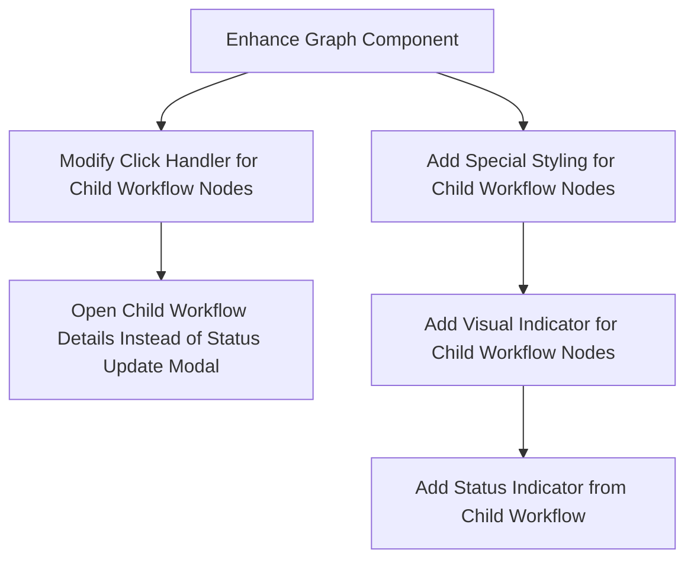
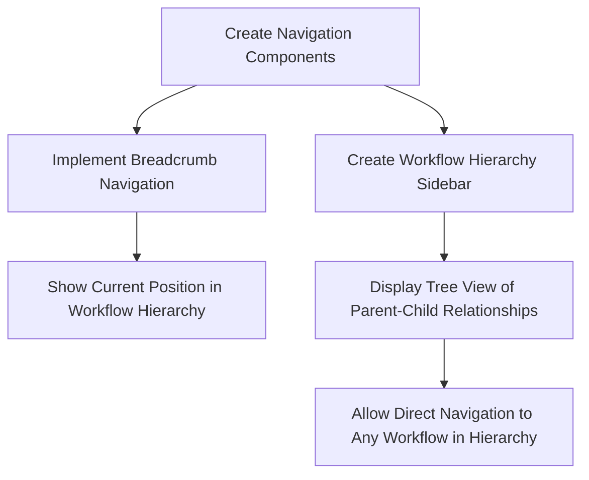
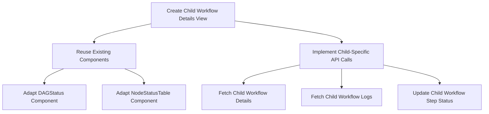
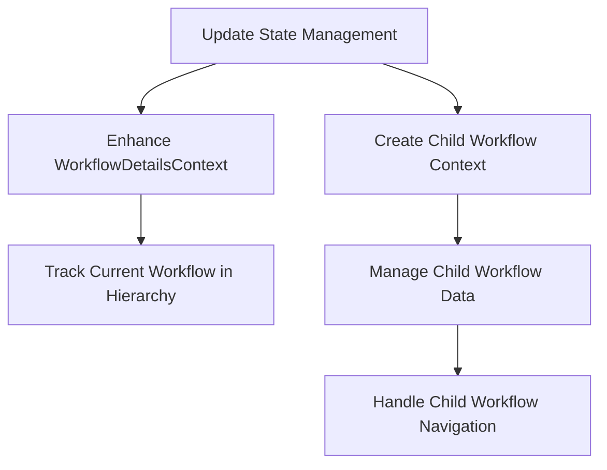
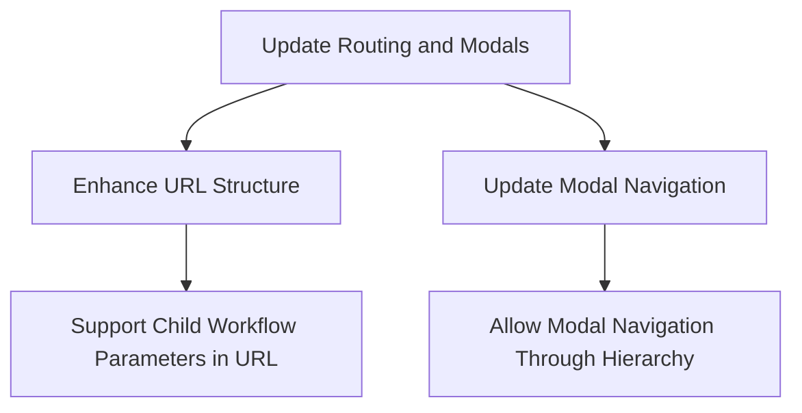

# Child Workflow Visualization Plan

## Overview

The goal is to enhance the Dagu UI to allow users to view and interact with child workflows at multiple levels, providing the same functionality as parent workflows except for certain actions like start, retry, and stop which are only available for root workflows.

## Current Implementation Analysis

Currently, the Dagu UI:

1. Shows workflow steps in a graph visualization using Mermaid.js
2. Displays step details in a table format
3. Allows users to view logs and update step statuses
4. Identifies steps that are sub-DAGs (with `step.run` property) but doesn't provide a way to navigate to their child workflows

The API provides endpoints for:

1. Getting child workflow details (`/workflows/{name}/{workflowId}/children/{childWorkflowId}`)
2. Getting child workflow logs (`/workflows/{name}/{workflowId}/children/{childWorkflowId}/log`)
3. Getting child workflow step logs (`/workflows/{name}/{workflowId}/children/{childWorkflowId}/steps/{stepName}/log`)
4. Updating child workflow step status (`/workflows/{name}/{workflowId}/children/{childWorkflowId}/steps/{stepName}/status`)

## Design Approach

We'll implement a hierarchical navigation system that allows users to:

1. Identify child workflow steps in the parent graph
2. Navigate to child workflow details by clicking on these steps
3. View child workflow details with the same level of information as parent workflows
4. Navigate back to parent workflows using breadcrumb navigation
5. See the overall hierarchy of workflows in a sidebar tree view

## Implementation Plan

### 1. Enhance Graph Visualization

- Modify the `Graph` component to identify and specially style nodes that represent child workflows
- Add a visual indicator (icon) to distinguish child workflow nodes
- Update the click handler to navigate to child workflow details instead of showing the status update modal for child workflow nodes
- Show the status of the child workflow on the parent graph node

### 2. Create Child Workflow Navigation Components

- Implement breadcrumb navigation to show the current position in the workflow hierarchy
- Create a collapsible sidebar that shows the tree structure of workflows
- Allow users to navigate directly to any workflow in the hierarchy by clicking on the tree nodes

### 3. Implement Child Workflow Details View

- Create a new component for displaying child workflow details, reusing existing components where possible
- Implement API calls specific to child workflows
- Adapt the `DAGStatus` component to work with child workflows
- Modify the `NodeStatusTable` component to handle child workflow steps
- Ensure log viewing and status updating functionality works for child workflow steps

### 4. Update Context and State Management

- Enhance the existing context providers to handle child workflow data
- Create a new context for managing the workflow hierarchy
- Track the current position in the workflow hierarchy
- Manage navigation between parent and child workflows

### 5. Implement Modal and Routing Updates

- Update the routing system to support child workflow parameters
- Enhance the modal navigation to allow moving through the workflow hierarchy
- Support deep linking to specific child workflows

## Detailed Component Changes

### 1. Graph Component Enhancements

We'll modify the `Graph` component to:

- Identify nodes that represent child workflows (steps with `run` property)
- Add a special visual indicator for child workflow nodes
- Update the node click handler to navigate to child workflow details for child workflow nodes
- Show the status of the child workflow on the parent graph node

### 2. Child Workflow Navigation Component

Create a new `WorkflowBreadcrumb` component that:

- Shows the current position in the workflow hierarchy
- Allows navigation back to parent workflows
- Displays the workflow ID for each level

Create a new `WorkflowHierarchySidebar` component that:

- Shows a tree view of the workflow hierarchy
- Allows direct navigation to any workflow in the hierarchy
- Indicates the current workflow in the hierarchy
- Shows status information for each workflow

### 3. Child Workflow Details Component

Create a new `ChildWorkflowDetails` component that:

- Reuses the existing `DAGStatus` component with modifications for child workflows
- Displays the same information as parent workflows
- Handles child-specific API calls
- Supports log viewing and status updating for child workflow steps

### 4. Context and State Management Updates

Enhance the `WorkflowDetailsContext` to:

- Track the current workflow in the hierarchy
- Store data for parent and child workflows
- Manage navigation between workflows

Create a new `WorkflowHierarchyContext` that:

- Stores the complete hierarchy of workflows
- Tracks the current position in the hierarchy
- Provides methods for navigating the hierarchy

### 5. API Service Updates

Create new API service methods for:

- Fetching child workflow details
- Fetching child workflow logs
- Updating child workflow step status
- Building the complete workflow hierarchy

## User Experience Flow

1. User views a parent workflow with child workflow steps
2. Child workflow steps are visually distinct in the graph with a special icon
3. User clicks on a child workflow step in the graph
4. System navigates to the child workflow details view
5. User sees breadcrumb navigation showing the hierarchy
6. User can view all details of the child workflow
7. User can navigate back to the parent workflow using breadcrumb navigation
8. User can see the complete hierarchy in the sidebar and navigate directly to any workflow

## Technical Considerations

### 1. Lazy Loading Implementation (Critical)

Lazy loading is a critical requirement for this implementation to ensure performance with complex workflow hierarchies:

- **On-demand Data Fetching**: Only fetch child workflow data when a user navigates to that specific workflow
- **Virtualized Tree View**: Implement virtualization for the workflow hierarchy sidebar to efficiently render large trees
- **Pagination for Child Workflows**: If a node has many child workflows, implement pagination to load them in batches
- **Caching Strategy**: Cache already loaded workflow data with a TTL (time-to-live) to reduce API calls
- **Progressive Loading**: Show a loading skeleton while fetching child workflow details
- **Background Loading**: Pre-fetch immediate child workflows in the background after loading the parent workflow
- **Partial Data Loading**: Initially load only summary data for child workflows, with full details loaded on demand
- **Optimized Graph Rendering**: Limit the initial graph complexity and provide zoom/expand functionality for detailed views

### 2. State Management

- We need to carefully manage the state of the workflow hierarchy to ensure consistent navigation and data display
- Implement a state management solution that can handle deep nesting without performance issues
- Consider using a normalized state structure to avoid duplication and simplify updates

### 3. API Integration

- We'll need to integrate with the child workflow API endpoints and handle error cases appropriately
- Implement retry logic for failed API calls
- Add proper error handling and user feedback for API failures

### 4. UI Consistency

- We'll maintain consistent UI patterns between parent and child workflows to ensure a seamless user experience
- Use the same component structure for both parent and child workflows where possible
- Ensure visual consistency in status indicators, actions, and information display

### 5. Accessibility

- We'll ensure that the navigation between workflows is accessible and provides clear context about the current position in the hierarchy
- Add proper ARIA attributes to navigation components
- Ensure keyboard navigation works throughout the hierarchy
- Provide clear visual and textual indicators of the current position in the hierarchy

## Implementation Phases

### Phase 1: Core Functionality

- Implement basic child workflow navigation
- Enhance graph visualization for child workflow nodes
- Create child workflow details view
- Implement lazy loading for child workflow data

### Phase 2: Enhanced Navigation

- Implement breadcrumb navigation
- Create workflow hierarchy sidebar with virtualization
- Support deep linking to child workflows
- Add caching for improved performance

### Phase 3: Refinements

- Add performance optimizations for large workflow hierarchies
- Enhance visual indicators
- Improve error handling
- Add user preference settings for hierarchy display
- Implement background loading for improved UX
